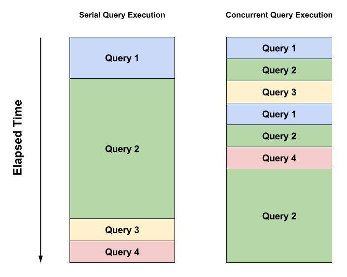
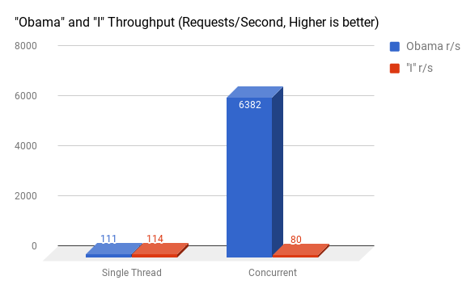
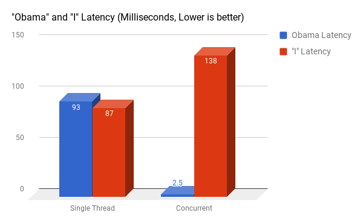

# Multi-Threading in RediSearch

*By Dvir Volk, July 2017*

## 1. One Thread To Rule Them All

Redis has been, from its inception, single threaded - and will remain so at least in 4.0. I'm not going to get into the reasons of why that is - but up until now it has been a reality that Redis apps, and more recently Redis Modules such as RediSearch - have to deal with. 

While keeping things single-threaded makes Redis simple and fast - the down-side is that long running commands block the entire server for the duration of the query's execution. Most Redis commands are fast so that is not a problem, but commands like [ZUNIONSTORE](https://Redis.io/commands/zunionstore), [LRANGE](https://Redis.io/commands/lrange), [SINTER](https://Redis.io/commands/sinter) and of course the infamous [KEYS](https://Redis.io/commands/keys), can block Redis for seconds or minutes, depending on the size of data they are handling. 

## 2. RediSearch and the Single Thread Issue

[RediSearch](https://Redisearch.io) is a new search engine module written at Redis Labs. It leverages Redis' powerful infrastructure with efficient data structures, to create a fast and feature rich, real-time search engine. 

While it is extremely fast and uses highly optimized data structures and algorithms, it was facing the same problem with regards to concurrency: Depending on the size of your data-set and the cardinality of search queries, they can take internally anywhere between a few microseconds, to hundreds of milliseconds to seconds in extreme cases. And when that happens - the entire Redis server that the engine is running on - is blocked. 

Think, for example, on the a full-text query intersecting the terms "hello" and "world", each with, let's say, a million entries, and half a million common intersection points. To do that in a millisecond, you would have to scan, intersect and rank each result in one nanosecond, [which is impossible with current hardware](https://gist.github.com/jboner/2841832). The same goes for indexing a 1000 word document. It blocks Redis entirely for that duration.

So taking into account that in the real world, search queries may not behave like your average Redis O(1) command, and block the entire server for long periods of time. Of course, you could and should split your search index into a cluster, and a cluster version of RediSearch will soon be available as part of Redis Labs Enterprise cluster - but even if we distribute the data across cluster nodes, some queries will be slow.

## 3. Enter the Redis GIL

Luckily, Redis BDFL [Salvatore Sanfilippo](https://twitter.com/antirez) has added a revolutionary change just near the finish line of Redis 4.0 and the release of the modules API - **Thread Safe Contexts** and the **Global Lock**.

The idea is simple - while Redis in itself still remains single threaded, a module can run many threads - and any one of them can acquire the **Global Lock** when it needs to access Redis data, operate on it, and release it. 

We still cannot really query Redis in parallel - only one thread can acquire the lock, including the Redis main thread - but we can make sure that a long running query will give other queries time to properly run by yielding this lock from time to time. Note that this limitation applies to our use case only - in other use cases such as training machine learning models, actual parallel processing the background is achievable and easy.

## 4. Making Search Concurrent

Up until now, the flow of a search query was simple - the query would arrive at a **Command Handler** callback in the Redis Module, and it would be the only thing running inside Redis right now. Then it would parse the query, execute it, taking as long as it takes - and return the result. 

To allow concurrency, we adapted the following design:

1. RediSearch has a thread pool for running concurrent search queries. 

2. When a search request arrives, it gets to the handler, gets parsed on the main thread, and a request object is passed to the thread pool via a queue.

3. The thread pool runs a query processing function in its own thread.

4. The function locks the Redis Global lock, and starts executing the query.

5. Since the search execution is basically an iterator running in a cycle, we simply sample the elapsed time every several iterations (sampling on each iteration would slow things down as it has a cost of its own).

6. If enough time has elapsed, the query processor releases the Global Lock, and immediately tries to acquire it again. When the lock is released, the kernel will schedule another thread to run - be it Redis' main thread, or another query thread.

7. When the lock is acquired again - we reopen all Redis resources we were holding before releasing the lock (keys might have been deleted while the thread has been "sleeping"), and continue work from the previous state. 

Thus the operating system's scheduler makes sure all query threads get CPU time to run. While one is running the rest wait idly, but since execution is yielded about 5,000 times a second, it creates the effect of concurrency. Fast queries will finish in one go without yielding execution, slow ones will take many iteration to finish, but will allow other queries to run concurrently. 

> ### Figure 1: Serial vs. Concurrent Search
> 
>
> **On the left-hand side, all queries are handled one after the other. On the right side, each query is given it time-slice to run. Notice that while the total time for all queries remain the same, queries 3 and 4 finish much faster.**

The same approach is applied to indexing. If a document is big and tokenizing and indexing it will block Redis for a long time - we break that into many smaller iterations and allow Redis to do other things instead of blocking for a very long time. In fact, in the case of indexing there is enough work to be done in parallel using multiple cores - namely tokenizing and normalizing the document. This is especially effective for very big documents.

As a side note - this could have been implemented with a single thread switching between all the query execution loops, but the code refactoring required for that was much larger, and the effect with reasonable load would have remained similar, so we opted to keep this for a future release.

## 5. The Effect of Concurrency

While this is not magic, and if all your queries are slow they will remain slow, and no real parallel processing is done here - this is revolutionary in Redis terms. Think about the old problem of running `KEYS *` in a busy Redis instance. In single threaded operation, this will cause the instance to hang for seconds if not minutes. No it is possible to implement a concurrent version of KEYS in a module, that will hardly affect performance. In fact, Salvatore has already implemented one!

There is, however, a negative effect as well: we sacrifice atomicity of reads and writes for concurrency to a degree. Consider the following situation: One thread is processing a query that should retrieve document A, then yields the execution context; At the same time, another thread deletes or changes document A. The result - the query run by the first thread will not be able to retrieve the document, as it has already been changed or deleted while the thread was "asleep". 

This is of course only relevant to high update/delete loads, and relatively slow and complex queries. In our view, for most use cases this is a sacrifice worth making, and usually query processing is fast enough that the probability of this happening is very low. However, this can be overcome easily: if strong atomicity of the operations is important, it is possible to have RediSearch operate in "safe mode", making all searches and updates atomic, thus making sure that each query refers to the sate of the index at the moment of its invocation. 

To enable safe mode and disable query concurrency, you can configure RediSearch at load time: `redis-server --loadmodule redisearch.so SAFEMODE` in command line, or by adding `loadmodule redisearch.so SAFEMODE` to your redis.conf - depending on how you load the module.

## 6. Some Numbers!

I've benchmarked both versions of the module - simple single threaded, and concurrent multi threaded, over the same set up.

!!! note "Benchmark Setup"
    * The data-set consists of about 1,000,000 Reddit comments.
    * Two clients using Redis-benchmark were running  - first separately, then in parallel:
      * One client doing a very intensive query - "i" which has 200,000 results with 5 concurrent connections.
      * One client is doing a very light query - "Obama", which has about 500 results - with 10 concurrent connections (we assume in a normal situation there will be more lightweight queries than heavy queries).
      * Both clients and the server running on my personal laptop - MacBook Pro with an Intel Quad Core i7 @ 2.2Ghz.

### The Results:

!!! note 
    While we can see that light queries are significantly slower when running in concurrent mode without contention, they are still very fast. But in contention, we see that lightweight queries run X40 faster in concurrent mode, since they are not blocked by the slow queries, as in single thread mode. In single thread mode we are only as fast as the slowest queries. 

## 7. Parting Words

This little Global Lock feature and Thread Safe Contexts, is perhaps the most powerful thing that the Modules API offers. We touched only the problem of concurrency here, but it also enables background tasks, real parallel processing of data that does not touch the Redis keyspace, and more.

For RediSearch, it makes the difference between being a nice engine for small-ish use cases, to being a real beast that can handle huge data-sets at high loads. Combined with the up-and-coming distributed version of RediSearch (that also leverages the threading API, but that's a story for another post), it will make RediSearch a very powerful search and indexing engine.