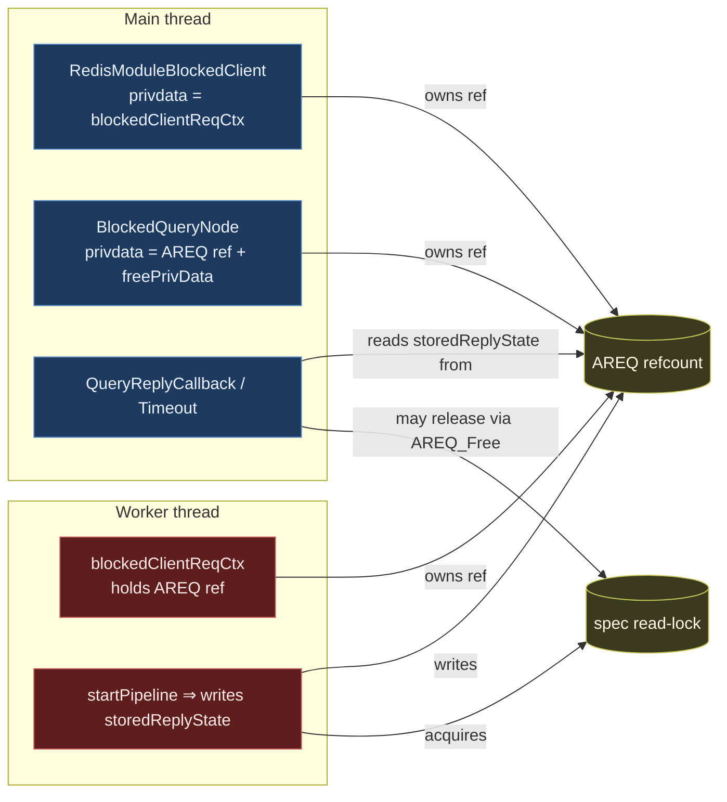
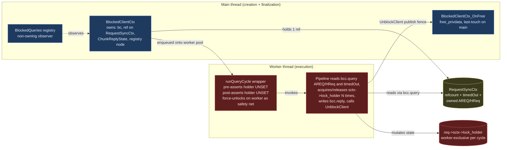
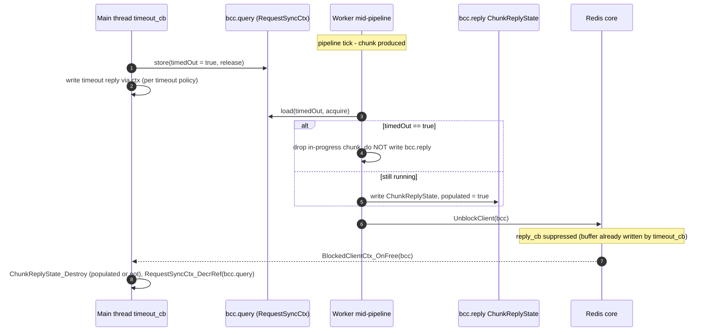

# Blocked-Client and Cross-Thread Ownership Refactor

> **Status:** Draft / RFC for team review.
> **Scope:** `RedisModule_BlockClient` callers, `BlockedQueries` registry, AREQ /
> HybridRequest cross-thread handoff, and spec-lock ownership across the
> main-thread / worker-thread boundary.
> **Non-scope:** the result-processor pipeline, the iterator tree, the spec
> rwlock semantics themselves (covered by [`sound_iterator_revalidation.md`][sir]).

[sir]: ./sound_iterator_revalidation.md

## TL;DR

Today, an `AREQ` (and its wrappers `MRCtx`, `blockedClientReqCtx`,
`BlockClientCtx`) is passed across the main / worker boundary with its
refcount split across three independent owners (blocked-client privdata,
`BlockedQueries` node, worker context). The spec read-lock can be acquired
on a worker and released on the main thread via `AREQ_Free`, which is
undefined behaviour for `pthread_rwlock_t`. This RFC replaces the implicit
ownership with two explicit roles plus one unified refcounted wrapper:

| Role | Owns | Lives on |
| --- | --- | --- |
| **`BlockedClientCtx`** | The `RedisModuleBlockedClient`, one ref on the `RequestSyncCtx` carrying the query, the `ChunkReplyState`, and the `BlockedQueries` registry node. Singly owned by Redis via `bc`'s privdata. | Created on main inside `RedisModule_BlockClient`, freed on main inside the `free_privdata` callback. |
| **`SpecLockHolder`** | The per-cycle spec-lock state (replaces today's `RSContextFlags flags` on `RedisSearchCtx`). Stateful, not RAII — supports multiple acquire/release per cycle, queryable mid-pipeline. | A field on the existing heap-allocated `RedisSearchCtx`, reached as `req->sctx->lock_holder`. Worker-thread-bound; the `runQueryCycle` wrapper enforces `state == UNSET` at cycle entry/exit. Same-thread access is debug-asserted via `owner_tid`. |

`RequestSyncCtx` is the existing per-request struct (today embedded inside
`AREQ` / `HybridRequest`, holding `refcount` and `timedOut`). Step 0
**inverts** that containment: the wrapper becomes the top-level refcounted
container that owns the `AREQ` / `HybridRequest`. Both the cursor (while
parked) and the `BlockedClientCtx` (while in flight) hold a ref to the
**same** `RequestSyncCtx`; the last ref dropped frees the underlying
query. This is the only refcount in the system, replacing the three
independent `AREQ` refcounts and the `Cursor.hybrid_ref` / `execState`
duality.

`BlockedQueries` becomes a pure non-owning observer, registered/unregistered
through the `BlockedClientCtx`. `useReplyCallback` and `storedReplyState`
move off `AREQ` onto the `BlockedClientCtx`, taking the existing
`ChunkReplyState` type with them.

The names align with existing conventions: `Blocked*` matches
`BlockedQueries` / `BlockedQueryNode`; `*Ctx` matches `MRCtx` /
`CoordRequestCtx` / `ConcurrentSearchBlockClientCtx`;
`SpecLockHolder` replaces today's `RSContextFlags flags` field on `sctx`
(same role, expanded with `owner_tid` and a stateful API surface); and
`ChunkReplyState` is the same struct as today, just relocated.
`RequestSyncCtx` keeps its existing name — only its containment direction
flips (see §3.2 and Step 0).

> **Name collision with the existing `BlockClientCtx`.** Today's
> `BlockClientCtx` (the init-parameter bag in `info_redis/block_client.h`,
> different prefix: `Block` vs. `Blocked`) is renamed to `BlockClientSpec`
> in step 2 to free the name, and deleted in step 7 once
> `BlockedClientCtx_New` takes its arguments directly.

---

## 1. Background

### 1.1 Current cross-thread structs (inventory)

The following structs are passed across the main/worker boundary today.

| Struct | Defined in | Carries | Owners (today) |
| --- | --- | --- | --- |
| `AREQ` | `aggregate/aggregate.h` | Query, pipeline, results, `useReplyCallback`, `storedReplyState`, `sctx` (with spec lock state), refcount. | Worker ctx (`blockedClientReqCtx.req`), `BlockedQueryNode.privdata`, sometimes the cursor. |
| `HybridRequest` | `hybrid/hybrid_request.h` | Multiple `AREQ`s + tail pipeline. | Same shape as `AREQ`. |
| `blockedClientReqCtx` | `aggregate/aggregate_exec.c` | `AREQ*`, `RedisModuleBlockedClient*`, `RedisModuleCtx*`. | Allocated on main, consumed on worker. |
| `BlockClientCtx` | `info/info_redis/block_client.h` | reply/timeout callback ptrs, free-privdata ptr, timeout, `ast` (for diagnostic dump). | Stack-built on main, consumed during `RedisModule_BlockClient`. |
| `BlockedQueryNode` / `BlockedCursorNode` | `info/info_redis/types/blocked_queries.h` | `privdata` (an `AREQ*` ref), `freePrivData`, `spec` (`StrongRef`), query string. | Linked into a TLS list on the main thread; "non-owning" by comment, owning by code. |
| `MRCtx` | `coord/rmr/rmr.c` | Coordinator fan-out state, `RedisModuleBlockedClient*`. | Created on main, consumed by `uv` IO thread. |
| `CoordRequestCtx` | `module.c` (FT.SEARCH coord) | Coordinator-side request bag. | Created on main, consumed by `uv` IO thread. |
| `BCHCtx` | `hybrid/hybrid_exec.c` | Hybrid blocked-client wrapper. | Same shape as `blockedClientReqCtx`. |
| `ChunkReplyState` (inside `AREQ`) | `aggregate/aggregate.h` | BG-produced results, error copy, `cv`, `limit`, `cursor`, `hasStoredResults`. | Written by BG, read by main; lives on AREQ. |

### 1.2 Today's ownership graph



The two failure modes that have bitten us are visible here:

1. **Three independent refcounts on `AREQ`** with no single source of truth.
   The "transfer the ref by NULL-ing the source" pattern is used at multiple
   call-sites, and any missed transfer or double-decrement leaks or double-frees
   the request.
2. **The spec read-lock crosses threads.** It is acquired by the worker (inside
   `startPipeline`) and may end up being released by the main thread when
   `AREQ_Free` runs — a `pthread_rwlock` UB.

### 1.3 Concrete footguns, in code

- `req->storedReplyState.useReplyCallback` is mutated by `RSCursorReadCommand`
  on a cursor whose AREQ was previously left in the opposite mode — a write to
  shared state from the main thread between BG cycles.
- `BlockedQueryNode.freePrivData = AREQ_DecrRefWrapper`. The struct comment
  says "non-owning"; the code makes it an owner. This is the second of the
  three refcounts.
- `blockedClientReqCtx_destroy` performs four steps in a strict order
  (`MeasureTimeEnd` → `GetPrivateData` → `UnblockClient` → free our struct).
  Any reordering, or any path that frees the wrapper before unblocking, is a
  bug — and there is no compile-time check that prevents it.
- Coordinator queries (`module.c:4412`, `rmr.c:359`) are **not** registered in
  `BlockedQueries`, so a hung coordinator query is invisible to `FT.INFO` and
  the crash report.

---

## 2. Goals and non-goals

### 2.1 Goals

- A single canonical refcount per query (`RequestSyncCtx`). Both the cursor
  (between cycles) and the `BlockedClientCtx` (during a cycle) hold a ref to
  the same wrapper; the last ref dropped frees the underlying AREQ /
  HybridRequest. No more "transfer the ref by NULL-ing the source" pattern.
- Spec-lock acquire and release on the **same** thread, enforced by a wrapper
  with a debug-only thread-id assertion. Cursor handoff is explicit, not implicit.
- One uniform path to `RedisModule_BlockClient` for query-shaped work, with
  `BlockedQueries` registration done through the same path so coordinator
  queries become visible to the watchdog.
- Reply-mode (inline vs. main-thread reply callback) is a per-cycle, immutable
  property of the `BlockedClientCtx` — never a mutable field on the request.
- The `free_privdata` callback registered with `RedisModule_BlockClient`
  becomes the deterministic last-touch on the main thread; no more manual
  `MeasureTimeEnd` + `UnblockClient` + free-our-wrapper dance at every
  call-site. Throughout this doc the implementation hook is called
  `BlockedClientCtx_OnFree`; "the `free_privdata` callback" and
  "`OnFree`" refer to the same thing.

### 2.2 Non-goals

- Changing the result-processor pipeline, iterator tree, or the spec rwlock
  semantics themselves.
- Changing how coordinator fan-out talks to shards (`rmr` IO threads stay).
- Eliminating the worker-pool (`workersThreadPool_*`) or moving away from
  `libuv` for coordinator-side blocking.
- Touching the operational `RedisModule_BlockClient` callers in `gc.c` and
  `debug_commands.c` beyond moving them to the standard "always wire a free
  callback" pattern.

---

## 3. Proposed model

### 3.1 The two roles



- **`BlockedClientCtx`** is the singly-owned context for one cross-thread
  unit of query work. Redis owns it via the blocked-client's privdata; it
  exists exactly between `RedisModule_BlockClient` and the
  `BlockedClientCtx_OnFree` (`free_privdata`) callback, both of which run on
  the main thread. It carries one ref on a `RequestSyncCtx` (which owns the
  underlying `AREQ` or `HybridRequest`), the `ChunkReplyState`, and the
  cached `BlockedQueries` registry node. Its reply mode is fixed at
  construction: `reply_cb == NULL` ⇒ inline reply, `reply_cb != NULL` ⇒
  deferred reply.
- **`SpecLockHolder`** is the per-cycle spec-lock state, a field on the
  existing heap-allocated `RedisSearchCtx` (owned by `AREQ` via
  `req->sctx`). It replaces today's `RSContextFlags flags` field, with the
  same shape (`UNSET` / `READ` / `WRITE`) plus a debug `owner_tid`. It is
  **stateful, not RAII**:
  the pipeline acquires and releases it multiple times per cycle (the
  existing `handleSpecLockAndRevalidate`, `UnlockSpec_and_ReturnRPResult`,
  and safe-loader unlock-and-relock patterns all keep working as today).
  Cross-thread safety comes not from RAII but from the **worker's
  `runQueryCycle` wrapper** (see §3.5): pre-asserts the holder is UNSET on
  cycle entry, runs the pipeline, post-asserts UNSET before
  `UnblockClient` (with a same-thread force-unlock safety net for release
  builds). Main thread never touches the holder; the `owner_tid` debug
  assertion makes that a checkable invariant.

#### 3.1.1 Cursors and the BCC share a `RequestSyncCtx` ref

`RequestSyncCtx` is the only refcounted handle on the underlying query.
Between cycles a cursor holds one ref (and is the sole owner). Each
`CURSOR READ` constructs a *fresh* `BlockedClientCtx` that takes its own
ref on the same wrapper:

- `BlockedClientCtx_New` calls `RequestSyncCtx_IncrRef` for the cursor case
  (or constructs a brand-new wrapper for an initial query / hybrid query,
  starting at refcount 1).
- During the cycle both owners hold a ref: cursor (parked) + bcc
  (in-flight) for cursor reads, or bcc only for non-cursor work. The worker
  reads the underlying AREQ/HReq through `bcc.query` without touching the
  refcount.
- The worker decides whether to re-park (`Cursor_Pause` keeps the cursor's
  ref alive) or to exhaust (`Cursor_Free` drops the cursor's ref). Either
  way that mutation happens before `UnblockClient`, on the worker side of
  the publish fence.
- `BlockedClientCtx_OnFree` calls `RequestSyncCtx_DecrRef` unconditionally.
  Whichever side dropped the last ref runs the AREQ/HReq destructor: for
  initial-query / hybrid cycles the bcc is the last owner and frees the
  query; for a cursor cycle that re-parked, the cursor outlives the bcc and
  keeps the query alive; for a cursor cycle that exhausted, `Cursor_Free`
  already ran on the worker so the bcc's `DecrRef` is the one that frees.

There is no `kind`-based branch in `OnFree`, no special "skip free for
cursor" code path, and no "transfer the ref by NULL-ing the source"
pattern. The refcount on the wrapper is the single source of truth.

### 3.1.2 Single-writer invariant

This is the safety property the rest of the design rests on. At any instant,
each cross-thread struct is touched by exactly one thread:

| Struct / field | Touched by main when… | Touched by worker when… |
| --- | --- | --- |
| `AREQ` / `HybridRequest` (owned by `RequestSyncCtx`) | Before dispatch (setup); and after `BlockedClientCtx_OnFree` returns iff the bcc dropped the last ref (the destructor runs from `RequestSyncCtx_DecrRef`). | Between dispatch and `UnblockClient`. Reached via `bcc.query->areq` / `->hreq`. |
| `bcc.query` (the `RequestSyncCtx*` pointer) | Read in `OnFree` to call `DecrRef`. | Read each pipeline tick to reach the AREQ/HReq and to load `timedOut`. Never written. |
| `RequestSyncCtx.refcount` | Atomic decrement in `OnFree` (always); atomic increment in `New` for the cursor-borrow case. Cursor-side `IncrRef` / `DecrRef` calls also happen on main. | Never. |
| `RequestSyncCtx.timedOut` | Atomic store in `timeout_cb` (see §4.2). | Atomic load each pipeline tick. |
| `bcc.reply` (embedded `ChunkReplyState`) | Read by `reply_cb`; freed in `OnFree`. | Written before `UnblockClient`. The `UnblockClient` call is the publish fence; main reads only after it. |
| `bcc.bc`, `bcc.registry_node`, `bcc.reply_cb` | Written only in `New`; read in `reply_cb` and `OnFree`. | Reads `bc` (for `UnblockClient`) and `reply_cb` (to decide whether to write `reply` inline or defer). Writes nothing. |
| `sctx->lock_holder` on `req->sctx` (`SpecLockHolder`) | **Never** (debug-asserted via `owner_tid`). Reads in `OnFree`/`AREQ_Free` are pure `state == UNSET` assertions. | Acquire / release / state queries N times per cycle. The `runQueryCycle` wrapper (§3.5) bookends the cycle with `state == UNSET` assertions; worker is the sole accessor between entry and exit. |

The single exception is the **timeout fence** between the timeout callback
(main) and the still-running worker. That window is described in §4.2 and is
the only place where shared access requires explicit synchronization
(`RequestSyncCtx.timedOut` atomic, `ChunkReplyState` discard rules).

### 3.2 Struct sketches

Illustrative; field names are finalized during the step that introduces each.

The reply-mode dichotomy used below (inline vs. deferred) is fully spelled
out in §4.1; the short version is *inline* ⇒ `reply_cb == NULL`, BG wrote
the reply via a thread-safe context before `UnblockClient`; *deferred* ⇒
`reply_cb != NULL`, BG populated `bcc.reply` and `reply_cb` will run on
main after `UnblockClient`.

```c
// --- RequestSyncCtx ---------------------------------------------------------
// Refcounted wrapper around an AREQ or a HybridRequest. Owns the underlying
// query: the destructor (RequestSyncCtx_DecrRef when refcount reaches 0) calls
// AREQ_Free / HybridRequest_Free on the contained query. Holders today are
// the cursor (between cycles) and the BlockedClientCtx (during a cycle); both
// touch the wrapper only via IncrRef / DecrRef and the query/timedOut
// accessors below.
//
// Step 0 promotes today's embedded `syncCtx` (inside AREQ / HybridRequest) to
// a heap-allocated wrapper that owns the query. Every existing field migrates
// verbatim; only the containment direction flips. The partial-timeout
// coordination (CAS + mutex/cond) and the abort-wake channel are
// implementation details of the wrapper and are below the §4.2 contract.
//
// The kind discriminator lives on the wrapper (not on the BCC) because it is
// a property of the query, not of the cycle. The union is accessed only
// through helpers (RequestSyncCtx_AsAREQ, RequestSyncCtx_ForEachAREQ); a
// future Rust port can replace it with an enum without touching call-sites.
typedef enum {
  REQUEST_KIND_AREQ,    // query.areq is set
  REQUEST_KIND_HYBRID,  // query.hreq is set
} RequestKind;

typedef struct RequestSyncCtx {
  // ---- Containment inversion (introduced in Step 0) ---------------------
  RequestKind  kind;            // const after construction
  union {
    AREQ          *areq;
    HybridRequest *hreq;
  } query;                      // owned; freed when refcount reaches 0

  // ---- Existing fields, migrate from the embedded struct as-is ----------
  RS_Atomic(bool)  timedOut;    // §4.2 cross-thread contract
  uint8_t          refcount;    // 1-3 in practice; accessed via __atomic_*

  // Partial-timeout coordination, gated by `requiresAggregateResultsSync`.
  // The CAS claim grants exclusive ownership of the result-production
  // phase; the BG-thread winner runs AggregateResults, the timeout-cb
  // winner replies empty. Internal to the wrapper; not part of the §4.2
  // contract beyond what §4.1's OnFree assertion permits (the timeout-cb
  // winner produces `populated == false`).
  bool                requiresAggregateResultsSync;
  RS_Atomic(bool)     aggregatingResults;
  bool                aggregateResultsDone;
  pthread_mutex_t     aggregateResultsLock;
  pthread_cond_t      aggregateResultsCond;

  // Abort-wake registration. BG reader (coord side) registers its blocking
  // MR channel; timeout_cb broadcasts on it after flipping `timedOut`.
  // Internal to the wrapper.
  struct MRChannel *abortWakeChannel;
  pthread_mutex_t   abortWakeLock;
} RequestSyncCtx;

RequestSyncCtx *RequestSyncCtx_NewAREQ(AREQ *areq);            // refcount = 1
RequestSyncCtx *RequestSyncCtx_NewHybrid(HybridRequest *hreq); // refcount = 1
RequestSyncCtx *RequestSyncCtx_IncrRef(RequestSyncCtx *rsc);
void            RequestSyncCtx_DecrRef(RequestSyncCtx *rsc);

// --- BlockedClientCtx -------------------------------------------------------
// Singly-owned context for one cross-thread unit of query work. Allocated
// on main inside BlockedClientCtx_New (which wraps RedisModule_BlockClient),
// handed to Redis as the blocked-client privdata, freed on main inside
// BlockedClientCtx_OnFree (the registered free_privdata callback).
typedef struct BlockedClientCtx {
  RedisModuleBlockedClient *bc;          // Redis-owned; valid until OnFree returns
  RequestSyncCtx           *query;       // owns one ref; DecrRef in OnFree
  const RedisModuleCmdFunc  reply_cb;    // NULL ⇒ inline mode; non-NULL ⇒ deferred
                                         // mode. See §4.1. Const after init.
  ChunkReplyState           reply;       // populated by worker in deferred mode;
                                         // moved off AREQ.storedReplyState
  BlockedNode              *registry_node; // unified node type (§5); NULL for
                                         // operational paths that skip
                                         // BlockedQueries registration
} BlockedClientCtx;
```

The worker pool takes a `BlockedClientCtx *` directly — there is no
separate task-wrapper struct. The worker only ever touches
`bcc->query` (to reach the underlying AREQ/HReq and to poll
`timedOut`), `bcc->reply` (to publish results in deferred mode),
`bcc->reply_cb` (to decide between inline and deferred), and `bcc->bc` (to
call `UnblockClient`). It does not read `registry_node`, does not call
`IncrRef` / `DecrRef`, and never touches `bcc` after `UnblockClient`.

```c
// --- SpecLockHolder ---------------------------------------------------------
// Per-cycle spec-lock state. Replaces today's `RSContextFlags flags` field
// inside RedisSearchCtx. RedisSearchCtx itself stays heap-allocated and
// owned by AREQ via `req->sctx` (unchanged); only the `flags` field is
// reshaped.
// Stateful, not RAII: the pipeline acquires and releases multiple times per
// cycle (handleSpecLockAndRevalidate, UnlockSpec_and_ReturnRPResult, the
// safe-loader unlock-and-relock pattern, etc.). Cross-thread safety is
// enforced by the runQueryCycle wrapper on the worker (§3.5), not by the
// holder type itself.
//
// owner_tid is set on the first transition from UNSET to a held state and
// cleared back to 0 when state returns to UNSET. All Acquire/Release/state
// queries assert (debug build) that the caller's tid matches owner_tid.
typedef enum {
  SPEC_LOCK_UNSET,
  SPEC_LOCK_READ,
  SPEC_LOCK_WRITE,
} SpecLockState;

typedef struct SpecLockHolder {
  SpecLockState state;
#ifdef RS_DEBUG
  pthread_t     owner_tid;   // set on UNSET→held; cleared on held→UNSET
#endif
} SpecLockHolder;

void SpecLockHolder_AcquireRead(SpecLockHolder *h, IndexSpec *spec);
int  SpecLockHolder_TryAcquireRead(SpecLockHolder *h, IndexSpec *spec);
void SpecLockHolder_AcquireWrite(SpecLockHolder *h, IndexSpec *spec);
void SpecLockHolder_Unlock(SpecLockHolder *h, IndexSpec *spec);   // no-op if UNSET
SpecLockState SpecLockHolder_State(const SpecLockHolder *h);
```

The existing lock-API call-sites (`RedisSearchCtx_LockSpecRead`,
`_UnlockSpec`, `_TryLockSpecRead`, `_LockSpecWrite`) keep their signatures
and become thin wrappers: each forwards to the corresponding
`SpecLockHolder_*` method on `&sctx->lock_holder` with `sctx->spec`. Code
that today reads `sctx->flags == RS_CTX_UNSET` reads
`SpecLockHolder_State(&sctx->lock_holder) == SPEC_LOCK_UNSET` instead. The
~89 callers of the lock APIs and the ~225 `->sctx` field accesses are not
churned beyond this rename.

### 3.3 Lifetime / ownership of one cycle (no cursor)

```mermaid
sequenceDiagram
  autonumber
  participant Main as Main thread
  participant Pool as Worker pool
  participant Worker as Worker thread
  participant Redis as Redis core

  Main->>Main: RequestSyncCtx_NewAREQ(areq)  [refcount = 1; rsc owns the AREQ]
  Main->>Main: BlockedClientCtx_New(rsc, ...)  [bcc.query = rsc; calls RM_BlockClient]
  Note right of Main: free_privdata wired to BlockedClientCtx_OnFree<br/>reply_cb may be NULL inline or set deferred
  Main->>Main: register in BlockedQueries  [observer, caches bcc.registry_node]
  Main->>Pool: enqueue bcc
  Pool->>Worker: dispatch
  Worker->>Worker: runQueryCycle entry: assert holder.state == UNSET
  Worker->>Worker: run pipeline on bcc.query->areq  [pipeline acquires/releases sctx->lock_holder N times internally]
  Worker->>Worker: write bcc.reply ChunkReplyState  [deferred mode only]
  Worker->>Worker: runQueryCycle exit: assert holder.state == UNSET (force-unlock-on-worker if violated)
  Worker->>Redis: RedisModule_UnblockClient(bcc.bc, bcc)
  Note right of Worker: BG drops its bcc pointer here.<br/>bcc still alive, owned by Redis.
  Redis-->>Main: reply_cb(bcc)  [iff reply_cb != NULL]
  Main->>Main: read bcc.reply, write reply
  Redis-->>Main: BlockedClientCtx_OnFree(bcc)  [free_privdata]
  Main->>Main: BlockedQueries_RemoveQuery(bcc.registry_node)
  Main->>Main: ChunkReplyState_Destroy(&bcc.reply)
  Main->>Main: RequestSyncCtx_DecrRef(bcc.query)  [refcount → 0; AREQ_Free runs]
  Main->>Main: free(bcc)
```

The two key invariants visible above:

- **All spec-lock acquire/release happens on the same worker thread.** The
  holder lives inline on AREQ; the worker mutates it freely during the
  pipeline. The `runQueryCycle` wrapper asserts `state == UNSET` on cycle
  entry and again on cycle exit before `UnblockClient`. If the post-assert
  catches a held lock, the safety net force-unlocks **on the worker**, so
  the cross-thread unlock UB is structurally impossible. Main never touches
  the holder (debug-asserted via `owner_tid`).
- **`BlockedClientCtx_OnFree` is the single, deterministic, last-touch on
  the main thread.** Everything that needs to be freed on main is freed
  there. The bcc always calls `RequestSyncCtx_DecrRef(bcc.query)`; the
  underlying `AREQ` / `HybridRequest` is freed iff the bcc held the last
  ref. For initial-query / hybrid cycles the bcc *is* the only owner so the
  ref count drops to 0 here; for cursor cycles the cursor may still hold a
  ref (see §3.4).

### 3.4 Lifetime / ownership of a cursor read

A cursor outlives many `CURSOR READ` cycles. Between cycles the cursor
holds **one ref** on the `RequestSyncCtx` wrapping the parked `AREQ`;
there is no `BlockedClientCtx`, no in-flight worker, and no spec lock.
Each `CURSOR READ` cycle constructs a fresh `BlockedClientCtx` that takes
its **own** ref on the same wrapper (refcount goes from 1 to 2 for the
duration of the cycle).

There is no separate "borrow" or "lend" — both holders are equal as far
as the wrapper is concerned. Whichever side drops the last ref runs the
AREQ destructor. `BlockedClientCtx_OnFree` always calls
`RequestSyncCtx_DecrRef(bcc.query)` unconditionally; no `kind`-based
branching, no "skip free for cursor" code path.

The spec read-lock is acquired and released **independently** in each
cycle, just like the no-cursor path in §3.3. This matches the current
behaviour described in [`sound_iterator_revalidation.md`][sir] §1.2 (the
lock is released between batches and the iterator tree revalidates on
re-acquire).

The cursor itself can disappear in three ways, and the design must handle
all of them:

1. The reading client issues `CURSOR DEL` (explicit free).
2. The cursor's idle timeout fires and the cursor GC frees it.
3. A `CURSOR READ` cycle determines that the iterator is exhausted and frees
   the cursor at the end of that cycle.

Crucially, the worker handling a `CURSOR READ` does **not** know in advance
whether its cycle is the last one; it discovers exhaustion only after running
the pipeline. So "the worker frees the cursor on the last read" is just one
of the three exit paths, not a special case.

```mermaid
sequenceDiagram
  autonumber
  participant Main as Main thread
  participant W1 as Worker cycle N initial query
  participant Curs as Cursor parked between cycles
  participant W2 as Worker cycle N+1 CURSOR READ
  participant GC as Cursor GC or DEL on main

  Note over Main: Initial query with WITHCURSOR
  Main->>Main: RequestSyncCtx_NewAREQ(areq)  [refcount = 1; bcc holds the only ref]
  Main->>W1: enqueue bcc
  W1->>W1: runQueryCycle: pre-assert holder UNSET, run pipeline (pipeline acquires/releases as needed), post-assert UNSET
  W1->>W1: Cursor_Pause(bcc.query)  [cursor IncrRefs the wrapper; refcount = 2]
  W1->>Main: UnblockClient(bcc)
  Main->>Main: reply_cb -> BlockedClientCtx_OnFree
  Main->>Main: RequestSyncCtx_DecrRef(bcc.query)  [refcount = 1; cursor still owns]
  Note over Curs: Wrapper held by cursor only.<br/>refcount = 1, no lock, no in-flight bcc.

  Note over Main: Subsequent CURSOR READ
  Main->>Main: BlockedClientCtx_New(IncrRef(cursor.query))  [refcount = 2]
  Main->>W2: enqueue bcc
  W2->>W2: runQueryCycle: pre-assert holder UNSET, run pipeline, post-assert UNSET
  alt iterator exhausted
    W2->>W2: Cursor_Free(cursor)  [DecrRef from cursor; refcount = 1, bcc still owns]
  else more chunks
    W2->>W2: Cursor_Pause(bcc.query)  [no-op on refcount; cursor already holds its ref]
  end
  W2->>Main: UnblockClient(bcc)
  Main->>Main: reply_cb -> BlockedClientCtx_OnFree
  Main->>Main: RequestSyncCtx_DecrRef(bcc.query)  [last ref iff exhausted; AREQ_Free runs]

  Note over GC: Independent: CURSOR DEL or idle GC
  GC->>Curs: Cursor_Free(cursor)  [main thread; DecrRefs the wrapper]
  Note right of GC: Only legal when the cursor is parked (no in-flight bcc).<br/>If a bcc is concurrently in flight its ref keeps the wrapper alive.
```

Mechanically, the worker mutates `bcc.query`'s **wrapper** at most once
during a cycle, and only via the cursor: `Cursor_Pause` calls
`RequestSyncCtx_IncrRef` to give the cursor its own ref before unparking,
and `Cursor_Free` calls `RequestSyncCtx_DecrRef` to drop it. The bcc's
own `bcc.query` pointer is never reassigned. Both happen *before*
`UnblockClient`, on the worker side of the publish fence.
`BlockedClientCtx_OnFree` then calls `RequestSyncCtx_DecrRef(bcc.query)`
unconditionally; the wrapper's refcount is the single rule that decides
when the underlying AREQ is freed.

Invariants:

- **The holder is always at `UNSET` between cycles.** Each cycle's
  `runQueryCycle` wrapper enforces this with pre/post assertions; the
  pipeline acquires and releases as needed inside the cycle. The holder
  never sits on the cursor across cycles.
- **At most one `BlockedClientCtx` per cursor is in flight at a time.** The
  cursor's parked/in-flight state is tracked by the existing cursor mutex;
  main only constructs a cursor-cycle BCC when the cursor is parked.
  `Cursor_Free` from GC/DEL is safe regardless: if a bcc happens to be in
  flight, its ref on the wrapper keeps the AREQ alive past the cursor's
  `DecrRef`, and the bcc's own `OnFree` runs the destructor.
- **`AREQ_Free` does not touch the spec lock.** The lock is always released
  by the worker that took it, before unblocking — enforced by the
  `runQueryCycle` post-assertion. `AREQ_Free` runs only inside
  `RequestSyncCtx_DecrRef` when the refcount reaches 0 — which always
  happens on main (either in `BlockedClientCtx_OnFree`, or in `Cursor_Free`
  invoked from GC/DEL when no bcc is in flight). It asserts
  `holder.state == UNSET` and otherwise never touches the holder. The
  silent "if locked, unlock" branch in today's `AREQ_Free` is deleted.

> **Future improvement (out of scope).** If profiling shows that the
> revalidate cost between consecutive cursor reads is significant, a separate
> change can introduce an opt-in "hold lock across reads" mode. That would
> require holder lifetime to span cycles (and a different ownership story)
> and is deliberately not part of this refactor; the goal here is
> correctness, not the optimization.

### 3.5 Worker cycle wrapper

`runQueryCycle` is the per-cycle "scope" on the worker — a function that
owns the lock-release responsibility instead of trying to encode it in the
type system (this is C; we can't). It is the only entry point through which
a worker dispatches a `BlockedClientCtx`:

```c
void runQueryCycle(BlockedClientCtx *bcc) {
  AREQ *areq = bcc->query->kind == REQUEST_KIND_AREQ
               ? bcc->query->query.areq
               : /* hybrid path: see HybridRequest_RunCycle */;
  RedisSearchCtx *sctx = areq->sctx;  // heap-allocated, owned by areq

  // Pre-condition. Always true in practice — for a fresh cycle the holder
  // was UNSET from AREQ_Init; for a cursor read, the previous cycle's
  // post-assertion guaranteed it; between cycles main never touches it.
  RS_ASSERT(SpecLockHolder_State(&sctx->lock_holder) == SPEC_LOCK_UNSET);

  runPipeline(areq);  // existing pipeline; acquires/releases sctx->lock_holder
                      // as needed via the existing lock APIs

  // Post-condition. Every pipeline exit path (EOF, error, timeout-bail,
  // safe-loader unwind) must leave the holder UNSET. Debug crashes if not;
  // release-build force-unlocks here as a safety net. Either way, the
  // unlock runs on the worker thread that took the lock — never on main.
  if (SpecLockHolder_State(&sctx->lock_holder) != SPEC_LOCK_UNSET) {
    RS_ASSERT(0 && "pipeline left spec lock held");
    SpecLockHolder_Unlock(&sctx->lock_holder, sctx->spec);
  }

  RedisModule_UnblockClient(bcc->bc, bcc);
}
```

What this enforces:

- **No cross-thread unlock UB.** The post-cycle force-unlock (replacing
  today's `AREQ_Free` "if locked, unlock" branch) runs on the same worker
  that called any `Acquire`. Main never calls `Unlock`.
- **Loud failure on convention violation.** Today's `AREQ_Free` safety net
  silently papers over leaked locks (and sometimes runs cross-thread,
  triggering the UB). The new safety net asserts in debug builds and logs
  in release.
- **Same-thread invariant is debug-checkable.** The holder's `owner_tid`
  field, set on UNSET→held and cleared on held→UNSET, makes "main never
  touches the holder" a `RS_ASSERT` failure rather than silent corruption.

What this does **not** require:

- Plumbing a guard or token through the pipeline. The pipeline still
  reaches the holder via `sctx->lock_holder` on the same heap-allocated
  `RedisSearchCtx` it uses today, identically to how it reaches
  `sctx->flags`. Iterators and result processors are unchanged (and PR
  #8947 already removed the `sctx`-stored-on-iterators dependency).
- Pairing every `Acquire` with a `Release` in lexical scope. The pipeline's
  existing patterns — `handleSpecLockAndRevalidate` (lock if upstream
  hasn't), `UnlockSpec_and_ReturnRPResult` (release on iterator EOF),
  safe-loader (unlock around blocking ops, relock after) — all keep
  working. Multiple acquire/release transitions per cycle are first-class.

Hybrid queries get an analogous `HybridRequest_RunCycle` wrapper around
their multi-sub-AREQ pipeline, with the same pre/post invariants on the
shared `sctx->lock_holder`. The hybrid sub-pipeline coordination is
internal to that wrapper (see §8 risk #1).

---

## 4. Reply-mode contract

### 4.1 Mode is fixed at construction

Two facts about `RedisModule_BlockClient` are load-bearing:

1. The free callback (if registered) is called on the main thread **after**
   the reply or timeout callback returns, and always after `UnblockClient`.
2. The reply callback fires **iff** the BG did not write to the reply buffer
   before `UnblockClient` (i.e. did not call any `RM_ReplyWith*` on a thread-
   safe context).

These translate directly into the `BlockedClientCtx`'s `reply_cb` field.
The mode is encoded as `reply_cb == NULL` (inline) vs. `reply_cb != NULL`
(deferred), is fixed at `BlockedClientCtx_New`, and is read-only
thereafter — there is no separate boolean flag to keep in sync.

| Mode | `reply_cb` | BG contract | Main contract |
| --- | --- | --- | --- |
| **Inline** | `NULL` | Must call `RM_ReplyWith*` via `GetThreadSafeContext(bc)` before `UnblockClient`. Must not write to `bcc.reply`. | Only `OnFree` runs; nothing to serialize. |
| **Deferred** | non-NULL | Must populate `bcc.reply` (a `ChunkReplyState`) and **not** touch any thread-safe reply context. | `reply_cb(bcc)` reads the reply state and serializes. Then `OnFree`. |

**Inline mode requires `timeout_ms == 0`.** Once the BG has begun writing to
the reply buffer there is no safe way to abort and emit a timeout reply
instead — Fact 2 says the timeout-reply path would be a no-op (the buffer is
already touched), and the BG cannot tell whether the client is still around.
`BlockedClientCtx_New` asserts that `reply_cb == NULL` implies
`timeout_ms == 0`. All current shard query paths use deferred mode; only
operational fire-and-forget paths use inline. None of the inline callers have
timeouts today, so this rule costs nothing.

Two debug-only enforcement hooks make Fact 2 violations crash loudly:

- `BlockedClientCtx_BeginInlineReply(bcc)` is the only way for BG code to
  obtain a thread-safe reply context. It increments a debug counter on the
  `BlockedClientCtx` (and asserts `bcc->reply_cb == NULL`).
- `BlockedClientCtx_OnFree` asserts:
  - if `bcc->reply_cb == NULL` then `bcc.reply.populated == false` and the
    inline-reply counter is `> 0`;
  - if `bcc->reply_cb != NULL` then `bcc.reply.populated == true` *or* the
    request bailed without producing results — i.e. a hard timeout fired
    (`bcc.query->timedOut == true`, see §4.2) *or* the partial-timeout
    coordination resolved with the timeout-cb winner replying empty (see
    §3.2's note on `requiresAggregateResultsSync`). The inline-reply counter
    must be `0`.

Today's `useReplyCallback` field on `AREQ` is **deleted**. Every place that
reads it switches to `(bcc->reply_cb == NULL)` (via the worker's pointer
to the `BlockedClientCtx` during execution; see step 4 of the migration
plan).

### 4.2 The timeout race window

The single legitimate window where main and BG threads are simultaneously
live around the same request is between **timeout_cb firing** and the BG
calling `UnblockClient`. This subsection enumerates exactly what each thread
may touch in that window, and what synchronizes them.



Cross-thread synchronization contract in this window. The wrapper may use
additional internal coordination (the partial-timeout CAS/condvar described
in §3.2) which is encapsulated inside `RequestSyncCtx` and not part of this
contract; the table below enumerates only the touches the design relies on:

| Field | Main may | Worker may | Synchronization |
| --- | --- | --- | --- |
| `bcc.query->timedOut` | Store `true` once. | Load each pipeline tick. | Atomic acquire/release. |
| `bcc.reply` (`ChunkReplyState`) | **Not touch.** Reads only happen in `OnFree` (after `UnblockClient` fence). | Write iff `timedOut == false` after acquire-load. | Publish-via-`UnblockClient`. |
| `bcc.bc` | Read by `OnFree` only. | Read for `UnblockClient`. | Redis API guarantees `bc` is valid until `OnFree` returns. |
| `AREQ` pipeline state (reached via `bcc.query->areq` / `->hreq`) | **Not touch.** `timeout_cb` must not read pipeline stats or iterator state — only metadata pre-stamped at `New` (snapshotted into the registry node, see §5). | Free use; this is the worker's exclusive territory. | Single-writer (only worker). |
| `req->sctx->lock_holder` | **Not touch.** Calling any `SpecLockHolder_*` operation from `timeout_cb` is forbidden and debug-asserted via `owner_tid`. | Acquire/release/state queries during the pipeline. Any bail-out triggered by `timedOut == true` must release the lock before returning to `runQueryCycle`. | Worker-exclusive. timeout_cb and the holder share no state — they coexist concurrently without coordination. |

Forbidden shared touches:

- `timeout_cb` **must not** read the AREQ's pipeline state. If it needs
  per-query metadata (index name, query string, partial counters), that
  metadata is snapshotted into the registry node at `New`. This is the same
  rule that makes §5's `BlockedQueries` keep its own copy of the index name
  and query string.
- `timeout_cb` **must not** call any `SpecLockHolder_*` operation. The
  holder is worker-exclusive; the `owner_tid` debug assertion catches a
  violation at the call. The timeout-cb's job is to set `timedOut`,
  optionally write the timeout reply, optionally drive the partial-timeout
  CAS (§3.2), and optionally broadcast on the abort-wake channel — none of
  which interact with the spec lock.
- The worker **must release the spec lock before bailing** on
  `timedOut == true`. The bail-out is a normal pipeline exit and goes
  through the existing release paths; the `runQueryCycle` post-assertion
  catches any path that forgets.
- The worker **must not** call any `RM_ReplyWith*` after observing
  `timedOut == true`, because the buffer already holds the timeout reply.
  (In deferred mode the worker never replies inline anyway, so this is just
  a comment for future maintainers.)
- The worker **must not** assume `timedOut == false` once it is observed
  false; the next load may flip. Each pipeline tick re-checks.

The `OnFree` assertion is loosened by this section: in deferred mode,
`OnFree` accepts `bcc.reply.populated == false` *if and only if*
`bcc.query->timedOut == true`. That is the documented "BG bailed because
of timeout" path.

---

## 5. `BlockedQueries` becomes a pure observer

Today `BlockedQueryNode.privdata` is an `AREQ*` reference and
`BlockedQueryNode.freePrivData = AREQ_DecrRefWrapper`. The struct comment
calls this "non-owning" but the code makes the registry the second of three
AREQ owners — the source of the lifetime entanglement. The fix is to make
the node hold only display-only snapshots, and let the `BlockedClientCtx`
own all live cross-references.

After the refactor, `BlockedQueryNode` and `BlockedCursorNode` collapse into
a single `BlockedNode` type with a `kind` discriminator. The two DLLISTs
(`queries` and `cursors`) on `BlockedQueries` stay so `FT.INFO` keeps its
two sections without scanning, but the node itself is unified:

```c
typedef enum {
  BLOCKED_NODE_QUERY,
  BLOCKED_NODE_CURSOR,
} BlockedNodeKind;

typedef struct BlockedNode {
  DLLIST_node      llnode;       // node in the queries-or-cursors list
  BlockedNodeKind  kind;         // which list head am I on
  time_t           start;        // when registered
  char            *index_name;   // owned snapshot
  char            *query;        // owned snapshot
  // Cursor-only; ignored when kind == BLOCKED_NODE_QUERY
  uint64_t  cursorId;
  size_t    count;
} BlockedNode;

// Unified API — the kind is set by the caller at registration time, which
// is the same callsite that already chose between query/cursor today.
BlockedNode *BlockedQueries_AddNode(BlockedQueries *list,
                                    BlockedNodeKind kind,
                                    const char *index_name,
                                    const QueryAST *ast,
                                    uint64_t cursorId, size_t count);
void BlockedQueries_RemoveNode(BlockedNode *node);
```

For initial-query / hybrid registrations, the caller passes
`kind=BLOCKED_NODE_QUERY` and `cursorId=0, count=0`. For cursor reads, the
caller passes `kind=BLOCKED_NODE_CURSOR` with the cursor's id and count.
`BlockedClientCtx_New` knows which case it is from the same condition that
selects between today's `BlockQueryClientWithTimeout` and
`BlockCursorClientWithTimeout`.

Lifetime consequences:

- The registry no longer pins the spec: with the index name snapshotted into
  the node, the watchdog (`FT.INFO`, crash report) walks the TLS list and
  reads `node->index_name` / `node->query` directly. An index can be dropped
  while a registered-but-stalled query is still in the list, matching the
  original intent that a pending BG task must not pin its spec.
- `BlockedQueries_RemoveNode` is called **only** from
  `BlockedClientCtx_OnFree`, on the main thread. There is no other
  unregister path. The `BlockedClientCtx.registry_node` field (§3.2) caches
  the node pointer so `OnFree` removes in O(1) without a list scan.
- Coordinator-side `BlockedClientCtx` instances register too (`MR_Fanout`,
  `DistSearchBlockClientWithTimeout`), so coordinator queries become visible
  to the watchdog. This is a functional gain, not a regression.

The `_FreeAREQ` / `FreeQueryNode` shim functions in `block_client.c` and
`aggregate_exec.c` are deleted — there is no privdata for them to free.

---

## 6. Per-callsite migration

The eight `RedisModule_BlockClient` call-sites in `src/` (excluding tests and
`rmutil`) split into three shapes:

| Callsite | Today | After refactor |
| --- | --- | --- |
| `info_redis/block_client.c::BlockQueryClientWithTimeout` | Wraps `BlockClient` + adds `BlockedQueryNode` w/ AREQ ref | `BlockedClientCtx_New(rsc, reply_cb, timeout_cb, timeout, register=true)` where `rsc = RequestSyncCtx_NewAREQ(areq)`. The bcc owns the only ref on the wrapper; no separate registry-side ref. |
| `info_redis/block_client.c::BlockCursorClientWithTimeout` | Same shape, cursor flavour | Same as above with `rsc = RequestSyncCtx_IncrRef(cursor->query)` (cursor and bcc each hold a ref) and cursor-flavoured registration. |
| `coord/rmr/rmr.c::MR_Fanout` (line 359) | `BlockClient(unblockHandler, timeoutHandler, freePrivDataCB, queryTimeout)`; `MRCtx` owns `bc` | `BlockedClientCtx_New` with `register=true` (gain: coord queries visible). The coord-side reader is itself an AREQ / HybridRequest with a `syncCtx` (used for `RequestSyncCtx_RegisterAbortWakeChannel`), so `bcc.query` points to the wrapping `RequestSyncCtx` exactly like the shard path. The `MRCtx` lives on a coord-private field of the BCC alongside `bcc.query`, freed from `OnFree` after `RequestSyncCtx_DecrRef`. `BlockedClientCtx` owns `bc`. |
| `module.c::DistSearchBlockClientWithTimeout` (line 4412) | `BlockClient(DistSearchUnblockClient, timeoutCallback, freePrivDataCallback, queryTimeout)` | Same as `MR_Fanout` — `bcc.query` wraps the coord-side AREQ, `CoordRequestCtx` lives on a coord-private BCC field. Privdata-smuggling hack removed; coord queries gain visibility. |
| `concurrent_ctx.c:122` (`ConcurrentCmdCtx`) | Generic-shaped block-client via `ConcurrentSearchBlockClientCtx`; no registry | Reuse the existing `ConcurrentSearchBlockClientCtx` machinery as the "operational" path. The only change here is to require a non-NULL `free_privdata` (no semantic shift). |
| `debug_commands.c:888,986`, `gc.c:107,187`, `rmr.c:539,569` | `BlockClient(NULL/cb, NULL, NULL/cb, 0)` | Migrate to `ConcurrentSearchBlockClientCtx`. The NULL-callbacks fire-and-forget pattern (`rmr.c:569`) folds into here by supplying a `free_privdata` that frees the small ctx struct. |

There are deliberately **two** distinct entry points after the refactor:

1. **`BlockedClientCtx_New`** — for query-shaped work. Owns (or borrows
   from a cursor) the AREQ/HReq, carries a `ChunkReplyState`, registers in
   `BlockedQueries`.
2. **The existing `ConcurrentSearchBlockClientCtx`** — for non-query
   operational work (GC, debug commands, cluster-info). No query, no reply
   state, no registry. Today this struct exists in `concurrent_ctx.h`; the
   refactor just routes the `NULL`-callback / `BlockClient`-direct call-sites
   through it instead of inventing a new helper.

The only discipline both share is "always wire a non-NULL `free_privdata`
for your privdata."

The `BlockClientCtx` init-bag (with `replyCallback`, `timeoutCallback`,
`free_privdata`, `timeoutMS`, `ast`) in `info_redis/block_client.h` is
**renamed to `BlockClientSpec`** in step 2 to free the `BlockedClientCtx`
name for the new struct (note the `Blocked` vs. `Block` prefix). The
init-bag itself is deleted in step 7 once `BlockedClientCtx_New` takes its
arguments directly.

---

## 7. Migration plan

Each step is a self-contained PR; downstream steps assume previous ones merged
unless noted. **Steps 0 and 1 are independent and can ship in parallel** —
Step 0 touches the request-side refcount machinery, Step 1 touches the
spec-lock discipline; they don't share files or invariants. Step 2 picks up
both as prerequisites. Steps 0–2 are pure refactors with no behaviour change.
Step 3 onward removes fields and changes API surface.

### Step 0 — Invert `RequestSyncCtx` to wrap the query

- Promote `RequestSyncCtx` (today embedded inside `AREQ` and `HybridRequest`)
  to a heap-allocated wrapper that owns the query. Add the `RequestKind`
  discriminator and the `query` union described in §3.2; every existing
  field on the embedded struct (`refcount`, `timedOut`, the partial-timeout
  CAS/condvar set, the abort-wake channel) migrates verbatim.
- Add `RequestSyncCtx_NewAREQ`, `RequestSyncCtx_NewHybrid`,
  `RequestSyncCtx_IncrRef`, `RequestSyncCtx_DecrRef`. The destructor calls
  `AREQ_Free` / `HybridRequest_Free` on the contained query.
- Rewire call-sites that today touch `req->syncCtx.X` to dereference the
  wrapper instead. Rename the existing `AREQ_IncrRef` / `AREQ_DecrRef` (and
  hybrid equivalents) callers to go through `RequestSyncCtx_*`.
- Unify `Cursor.hybrid_ref` (a `StrongRef` to the `HybridRequest`) and
  `Cursor.execState` (the AREQ pointer) into a single `RequestSyncCtx *query`
  field on `Cursor`. `Cursor_Pause` calls `RequestSyncCtx_IncrRef` on
  initial park (the cursor takes its own ref); `Cursor_Free` calls
  `RequestSyncCtx_DecrRef`.
- **Retire `StrongRef` for hybrid.** `Cursor.hybrid_ref` and
  `FreeHybridRequest` (the `StrongRef` destructor wired in `hybrid_request.h`)
  are deleted; the unified `RequestSyncCtx_DecrRef` path replaces them.
  `StrongRef`/`WeakRef` exists for crash-safe access to indexes that may be
  dropped from under callers — a query's lifetime is bounded (cursor + bcc,
  ≤2 owners) and lives entirely within paths we control, so the indirection
  is overkill. Audit every site that referenced the hybrid `StrongRef` to
  confirm no `WeakRef`-style observer relies on the manager indirection
  beyond what the new wrapper provides; if any are found they migrate to
  `RequestSyncCtx*` access in this same step.
- **Acceptance:** no behaviour change; refcount semantics preserved end-to-
  end (initial query, cursor read across N cycles, hybrid query, timeout);
  no `StrongRef` references to a hybrid query remain in the codebase
  (`grep -n hybrid_ref` is empty); ASAN / TSAN clean. Cursor's old
  dual-field discriminator is gone.

### Step 1 — Install `SpecLockHolder` and the `runQueryCycle` wrapper

- Replace `RSContextFlags flags` on `RedisSearchCtx` with a `SpecLockHolder
  lock_holder` field (same shape: `UNSET` / `READ` / `WRITE`, plus a debug
  `owner_tid`). `RedisSearchCtx_LockSpecRead` / `_TryLockSpecRead` /
  `_LockSpecWrite` / `_UnlockSpec` keep their signatures; their bodies
  forward to the corresponding `SpecLockHolder_*` method on
  `&sctx->lock_holder` with `sctx->spec`. Each transition asserts caller
  tid matches `owner_tid` (or `owner_tid` is unset, meaning UNSET state).
- Iterator / RP / safe-loader call-sites are not churned beyond a renamed
  field check (`sctx->flags == RS_CTX_UNSET` ⇒ `SpecLockHolder_State(...)
  == SPEC_LOCK_UNSET`). The ~89 lock-API callers and ~225 `->sctx`
  accesses keep working.
- Add the `runQueryCycle` wrapper on the worker (§3.5): pre-asserts holder
  UNSET, runs the pipeline, post-asserts UNSET (with a same-thread
  force-unlock safety net), then `UnblockClient`. The standalone shard
  pipeline (`startPipeline`) and the hybrid pipeline get analogous
  wrappers (`HybridRequest_RunCycle`).
- Delete the "if locked, unlock" branch from `AREQ_Free`. Replace with
  `RS_ASSERT(SpecLockHolder_State(&req->sctx->lock_holder) ==
  SPEC_LOCK_UNSET)`.
- **Acceptance:** standalone tests pass; `tsan` / `helgrind` runs of the
  cursor read suite pass; the cross-thread unlock UB warning is gone; a
  deliberate "main thread calls Unlock" violation in a unit test trips the
  `owner_tid` assertion; a deliberate "pipeline returns with lock held"
  violation trips the `runQueryCycle` post-assertion.
- **Note:** if profiling later shows the per-cycle revalidate cost on cursor
  reads is significant, a follow-up can introduce an opt-in "hold lock
  across reads" mode. That is explicitly out of scope here (see §3.4).

### Step 2 — Introduce `BlockedClientCtx` for standalone queries

- Depends on Steps 0 and 1.
- Rename today's init-bag `BlockClientCtx` (in `info_redis/block_client.h`)
  to `BlockClientSpec` to free the name.
- Add `blocked_client_ctx.{h,c}`. Implement `BlockedClientCtx_New` and
  `BlockedClientCtx_OnFree`; register `OnFree` as the `free_privdata`
  callback when calling `RedisModule_BlockClient`.
- Convert `BlockQueryClientWithTimeout`, `BlockCursorClientWithTimeout`, and
  the hybrid block-client wrapper to call `BlockedClientCtx_New` internally.
  Initial-query / hybrid sites construct a fresh `RequestSyncCtx` and hand
  it to the BCC (refcount=1). Cursor-read sites call
  `RequestSyncCtx_IncrRef(cursor->query)` and pass the result. The BCC
  always owns exactly one ref on the wrapper. Mode is derived from the
  existing `useReplyCallback` field for now (still mutable; tightened in
  step 4).
- Move per-callsite teardown — `MeasureTimeEnd`, the privdata free,
  `RM_UnblockClient` follow-ups, and the existing `ASM_AccountRequestFinished`
  call — into `BlockedClientCtx_OnFree`. ASM accounting is internal to its
  tracker (see `asm_state_machine.h`); the only contract this design has to
  preserve is "exactly one finish call per request, on main", which `OnFree`
  delivers naturally.
- Reply / timeout callbacks read `bcc.reply` (the `ChunkReplyState`); behind
  the scenes they reach the AREQ via `bcc.query->areq` (or `->hreq`).
- **Acceptance:** standalone query, cursor read, hybrid query, and timeout
  paths exercise the new `BlockedClientCtx`; `bc` destroy / privdata code is
  centralized in `OnFree`; ASM keyspace-version count balanced under the
  existing sanitizer leak check.

### Step 3 — Sever `BlockedQueries` from privdata ownership and unify nodes

- Collapse `BlockedQueryNode` and `BlockedCursorNode` into the single
  `BlockedNode` type (with `BlockedNodeKind kind`) described in §5.
  Replace `privdata` + `freePrivData` + spec `StrongRef` with the owned
  `index_name` / `query` snapshot fields and the cursor-only `cursorId` /
  `count` (zeroed for query-kind nodes).
- Replace `BlockedQueries_AddQuery` / `_AddCursor` /
  `_RemoveQuery` / `_RemoveCursor` with a single `BlockedQueries_AddNode`
  (taking `kind`) and `BlockedQueries_RemoveNode`. The two DLLISTs on
  `BlockedQueries` stay so `FT.INFO` keeps its sections; the kind decides
  which list head the node is linked to.
- Move `BlockedQueries_AddNode` / `RemoveNode` calls into
  `BlockedClientCtx_New` / `OnFree`. Cache the returned `BlockedNode*` on
  `bcc.registry_node` so `OnFree` removes in O(1).
- Drop the cloned `StrongRef` on the spec; the registry no longer pins it.
- Delete `_FreeAREQ` / `FreeQueryNode` / `FreeCursorNode` shims.
- **Acceptance:** AREQ has exactly one owner (the `BlockedClientCtx` for
  initial query / hybrid; the cursor while parked, lent to the BCC during
  a cursor read); a leak-test under ASAN shows no AREQ outliving its
  `OnFree`; an index can be dropped while a registered-but-stalled query is
  still in the TLS list (the snapshot keeps `FT.INFO` correct).

### Step 4 — Move `useReplyCallback` and `storedReplyState` off AREQ

- Move `ChunkReplyState` ownership from `AREQ` to `BlockedClientCtx.reply`;
  rewrite `AREQ_StoreResults`, `AREQ_ReplyWithStoredResults`,
  `QueryReplyCallback`, and `CursorReadReplyCallback` to read/write through
  the `BlockedClientCtx`.
- Replace every read of `req->useReplyCallback` with the equivalent check on
  the `BlockedClientCtx`: a NULL `bcc.reply_cb` means inline-reply mode; a
  non-NULL callback means deferred-reply mode (see §4.1). There is no
  separate boolean flag.
- Delete `req->useReplyCallback` and `req->storedReplyState`.
- Delete the `RSCursorReadCommand` mutation that flips the mode mid-flight.
  Cursor reads pick the mode at `BlockedClientCtx_New` time, derived from
  the same conditions today's mutation tests for, and fixed for the cycle.
- Add the debug-only inline-reply counter and `OnFree` assertions described
  in §4.1, plus the timeout-bail relaxation from §4.2.
- **Acceptance:** the per-cursor `useReplyCallback` mutation is gone; mode
  is fixed at `New`; assertions catch a deliberate Fact-2 violation in a
  unit test; assertions also catch a deliberate "wrote `ChunkReplyState`
  after observing `timedOut`" violation.

### Step 5 — Coordinator path: `MR_Fanout` and `DistSearchBlockClientWithTimeout`

- Convert both coordinator block-client sites to `BlockedClientCtx_New`
  with `register_in_blocked_queries=true`.
- The coord-side reader is itself an AREQ / HybridRequest with a `syncCtx`
  (used today for `RequestSyncCtx_RegisterAbortWakeChannel`), so `bcc.query`
  points to the wrapping `RequestSyncCtx` exactly like the shard path.
  `OnFree` always calls `RequestSyncCtx_DecrRef(bcc.query)` — there is no
  coord-specific skip branch.
- `MRCtx` / `CoordRequestCtx` (the fan-out / coord-private bag, distinct
  from the underlying AREQ) lives on a coord-private field of the BCC
  alongside `bcc.query`. `OnFree` frees it via the existing coord teardown
  path after `RequestSyncCtx_DecrRef`.
- The `BlockedClientCtx` owns `bc`.
- **Acceptance:** a hung coordinator query appears in `FT.INFO`'s blocked-
  query section and in the crash report; coordinator timeout / unblock paths
  pass tests; the abort-wake registration that today goes through
  `RequestSyncCtx_RegisterAbortWakeChannel(&areq->syncCtx, ...)` now goes
  through the wrapper without a code change at the call-site (it already
  accepts `RequestSyncCtx*`).

### Step 6 — Route remaining call-sites through `ConcurrentSearchBlockClientCtx`

- Migrate `gc.c`, `debug_commands.c`, and the two non-query `rmr.c` sites
  to allocate / wire a `ConcurrentSearchBlockClientCtx` (the existing
  operational helper) instead of calling `RedisModule_BlockClient` directly.
- The fire-and-forget `MR_uvReplyClusterInfo` call-site gets a `free_privdata`
  that frees its small ctx struct, instead of `NULL` callbacks plus manual
  free.
- Tighten `ConcurrentSearchBlockClientCtx` to require a non-NULL
  `free_privdata`.
- **Acceptance:** `RedisModule_BlockClient` is no longer called directly
  outside `BlockedClientCtx_New` and `ConcurrentSearchBlockClientCtx`
  (search by grep).

### Step 7 — Clean up

- Delete `blockedClientReqCtx`, `blockedClientHybridCtx`, and the manual
  `MeasureTimeEnd` / `UnblockClient` / `free` sequences they implemented.
- Delete the `BlockClientSpec` init-bag now that `BlockedClientCtx_New`
  takes its arguments directly.
- Tighten asserts where steps 0–6 left them temporarily lax.

---

## 8. Risks and open questions

1. **Hybrid pipeline's internal sub-AREQ races are out of scope.** A
   `HybridRequest` runs multiple sub-pipelines internally and must reach a
   single "all sub-queries done" point before the top-level `BlockedClientCtx`
   publishes `bcc.reply` and calls `RM_UnblockClient`. Any worker→worker or
   worker→depleter handoff inside the hybrid is a hybrid-internal race, and
   the hybrid implementation owns its own synchronization (today: a single
   shared `sctx`, all sub-AREQs read under that lock). The contract this
   design enforces at the boundary is the same as for a standalone query:
   the hybrid runs inside a `HybridRequest_RunCycle` wrapper that
   pre/post-asserts `sctx->lock_holder.state == UNSET`, the sub-pipelines
   acquire/release the shared holder as needed during their work, and from
   then on only the main thread touches the `BlockedClientCtx`. If a future
   hybrid optimization wants per-sub-pipeline lock holders or staged
   unblocking, that is a hybrid redesign on top of this layer, not a
   change to the top-level lifecycle.
2. **Profile mode ordering.** `IsProfile(req)` paths read timing data from
   the AREQ on the main thread after the BG completes. Verify that nothing
   in profile-reply reads `storedReplyState` after step 4 without going
   through the `BlockedClientCtx`. **Proposed:** profile state stays on AREQ
   (it's pipeline-internal), reply path reaches it via `bcc.query->areq`.
3. **`concurrent_ctx.c` callers that *are* queries.** The dispatcher is used
   today for some commands that block on a query path. Audit before step 6
   whether any of them should migrate to `BlockedClientCtx_New` instead of
   staying on `ConcurrentSearchBlockClientCtx`.
4. **TLS-list crash safety on coordinator threads.** `BlockedQueries` is
   currently main-thread TLS. Coordinator queries created on the main thread
   are fine, but verify with the rmr team that no fan-out path
   constructs/registers from a `uv` IO thread. **Proposed:** registration
   stays main-thread-only; the coord call-site registers before scheduling
   the IO work.
5. **Cluster-info / connection-pool-state opcodes (`rmr.c:539,569`).** These
   currently use `NULL` callbacks and free their context manually pre-
   `UnblockClient`. Verify there is no caller that relies on the synchronous
   ordering before adding a `free_privdata`.
6. **Cursor revalidation cost.** §3.4 admits that the spec lock is
   released between cursor reads (the pipeline drops it before the worker
   exits `runQueryCycle`), forcing the iterator tree to revalidate on the
   next acquire. The current code does the same thing (it releases between
   batches), so this is not a regression, but it is worth measuring on
   high-rate cursor workloads before declaring step 1 complete. If a
   regression appears, the "hold lock across reads" follow-up (a holder
   whose lifetime spans cycles) moves up the queue.
7. **Hybrid `StrongRef` retirement is part of Step 0, not a follow-up.**
   The detail moved into Step 0's body (see §7). The remaining open question
   is whether any `WeakRef`-style observer of the hybrid request exists
   beyond the cursor. The acceptance criterion for Step 0 (`grep -n
   hybrid_ref` empty) makes this falsifiable; if a residual consumer
   surfaces during the audit, it migrates to `RequestSyncCtx*` access in
   the same patch.

---

## 9. Out of scope (for later)

- Porting any of these new types to Rust. The new boundaries are
  intentionally Rust-port-friendly (see §10), but no Rust code is added in
  this work.
- Replacing the worker pool implementation.
- Changing the cursor lifecycle (parking, GC) beyond what §3.4 spells out.
- Reworking how timeouts are signalled to the BG (still via
  `RequestSyncCtx.timedOut`).
- Long-lived leases held across cursor reads (see §3.4 future-improvement
  note and §8 risk 6).

---

## 10. Rust port notes

The shapes introduced here are deliberately chosen so that a future Rust
port can reuse the C structs as the FFI surface and wrap them with idiomatic
Rust types without having to redesign the lifetimes. This section is
informational for the eventual port; nothing here is committed in this work.

| C concept | Rust analogue |
| --- | --- |
| `BlockedClientCtx` | `Box<BlockedClientCtx>` owned by Redis: allocated by Rust, handed to Redis as `*mut c_void`, freed in `free_privdata` by reconstructing the `Box`. Exactly one owner at a time. |
| `RequestSyncCtx` | `Arc<RequestSyncCtx>`: the cursor (between cycles) and the `BlockedClientCtx` (during a cycle) each hold a clone. Last `Drop` runs the AREQ/HReq destructor. The `query` union becomes `enum { AREQ(Box<AREQ>), Hybrid(Box<HybridRequest>) }`. The C `kind` discriminator and ref/deref helpers fall away. |
| `bcc.query` | `Arc<RequestSyncCtx>` field on the BCC. No `LentByCursor` variant or borrow lifetime needed — `Arc` already encodes "one or more owners, last drop wins". |
| `ChunkReplyState` (in `bcc.reply`) | `OnceCell<ChunkReplyState>`: single producer (worker) → single consumer (main); written once before `UnblockClient`, taken once in the reply callback. |
| `SpecLockHolder` | A `!Send` field on the `RedisSearchCtx` analogue: `Cell<SpecLockState>` with debug `owner_tid` checks (the multi-acquire/release-per-cycle pattern doesn't fit a single RAII guard, so the Rust port keeps the stateful holder shape). Same-thread enforced by `!Sync`. The `runQueryCycle` wrapper becomes a method that takes `&mut BlockedClientCtx` and asserts `lock_holder == UNSET` at entry and exit. |
| `RequestSyncCtx.timedOut` | `AtomicBool` with `Acquire`/`Release` ordering as in §4.2. Lives on the wrapper, shared transparently across all holders. |
| `BlockedQueries` registry | Per-thread snapshot list; entries are `Send` because they own only strings (§5). |
| Inline-vs-deferred mode | `match bcc.reply_cb` — `None` means inline, `Some(cb)` means deferred; fixed at construction (§4.1). |

Three design choices in the C version are specifically there to keep the
Rust port cheap:

1. **Refcounted wrapper instead of "transfer the ref by NULL-ing the
   source".** The C `RequestSyncCtx_IncrRef` / `_DecrRef` pair maps directly
   onto `Arc::clone` / `Drop`. Without the wrapper, the cursor / bcc
   ownership story would force one of `Arc<Mutex<Option<AREQ>>>`,
   custom unsafe code, or a redesign of the C side first.
2. **Single-writer invariant on the AREQ.** Without this, a Rust port would
   have to wrap the AREQ in `Mutex<AREQ>` or `RwLock<AREQ>`. With it, the
   AREQ stays a plain `&mut` borrow inside the worker and a plain `&` borrow
   inside the reply callback — no synchronization primitive needed.
3. **`SpecLockHolder` is worker-thread-bound and inlined into the query
   struct, not a transferable guard.** A guard would have been simpler in
   Rust but doesn't fit the C usage (multiple acquire/release per cycle,
   queryable mid-pipeline state, idempotent unlock). Keeping the holder as
   a stateful field with `owner_tid` enforcement maps cleanly onto a
   `!Sync` field in the Rust port; the `runQueryCycle` wrapper carries the
   single-thread invariant that a transferable guard would otherwise
   provide via `!Send`.

`ConcurrentSearchBlockClientCtx` (the operational, non-query path) is left
out of the Rust mapping above on purpose — it is unrelated to query
execution and need not be ported in the same effort.
