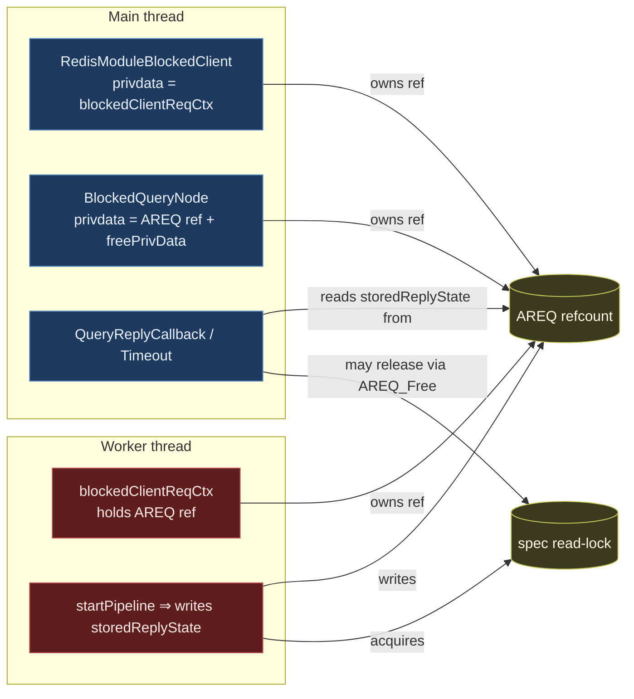
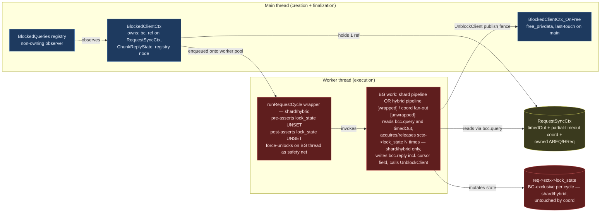
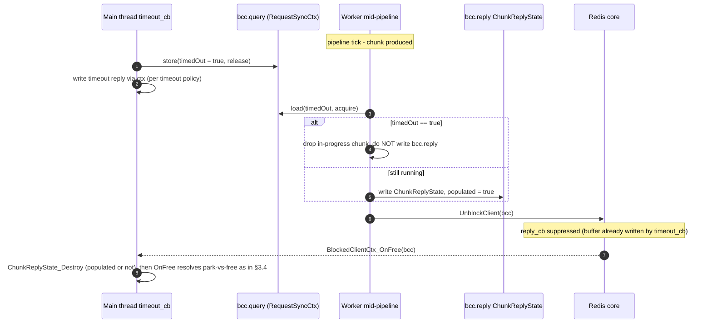

# Blocked-Client and Cross-Thread Ownership Refactor

> **Status:** Draft / RFC for team review.
> **Scope:** `RedisModule_BlockClient` callers, `BlockedQueries` registry, AREQ /
> HybridRequest cross-thread handoff, and spec-lock ownership across the
> main-thread / worker-thread boundary.
> **Non-scope:** the result-processor pipeline, the iterator tree, the spec
> rwlock semantics themselves (covered by [`sound_iterator_revalidation.md`][sir]).

[sir]: ./sound_iterator_revalidation.md

## TL;DR

Today, an `AREQ` (and its wrappers `MRCtx`, `blockedClientReqCtx`,
`BlockClientCtx`) is passed across the main / worker boundary with its
refcount split across three independent owners (blocked-client privdata,
`BlockedQueries` node, worker context). The spec read-lock can be acquired
on a worker and released on the main thread via `AREQ_Free`, which is
undefined behaviour for `pthread_rwlock_t`. This RFC replaces the implicit
ownership with two explicit roles plus one single-owner wrapper:

| Role | Owns | Lives on |
| --- | --- | --- |
| **`BlockedClientCtx`** | The `RedisModuleBlockedClient`, one ref on the `RequestSyncCtx` carrying the query, the `ChunkReplyState`, and the `BlockedQueries` registry node. Singly owned by Redis via `bc`'s privdata. | Created on main inside `RedisModule_BlockClient`, freed on main inside the `free_privdata` callback. |
| **`SpecLockState`** (enum field on `sctx`) | The spec-lock state (replaces today's `RSContextFlags flags`). Stateful — supports multiple acquire/release per cycle, queryable mid-pipeline. **No new struct type — just a renamed enum field on `RedisSearchCtx`.** | Reached as `req->sctx->lock_state`. Whichever thread is currently driving the request owns it. For BCC-mediated shard / hybrid cycles the BG thread is the sole accessor for the duration of the cycle (enforced by the `runRequestCycle` wrapper); for synchronous main-thread commands (e.g. `FT.EXPLAIN`) main is the sole accessor. |

`RequestSyncCtx` is the existing per-request struct (today embedded inside
`AREQ` / `HybridRequest`, holding `refcount`, `timedOut`, and the
partial-timeout coordination state). Step 0 **inverts** that containment:
the wrapper becomes the top-level container that owns the `AREQ` /
`HybridRequest`. Ownership of the wrapper is single-owner with explicit
transfer: `bcc->query` owns it during a cycle, `cursor->query` owns it
between cycles, and the transfer happens on main under the cursor mutex
at `BCC_New` and `OnFree`. The `refcount` field is dropped — the
cross-thread invariants it used to guarantee are now provided by the
Redis BlockedClient API's BCC-lifetime guarantee (BG borrows during the
cycle) plus the existing `Cursor.delete_mark` mechanism (handles
`CURSOR DEL` / GC during in-flight). See §3.1.1.

`BlockedQueries` becomes a pure non-owning observer, registered/unregistered
through the `BlockedClientCtx`. `useReplyCallback` and `storedReplyState`
move off `AREQ` onto the `BlockedClientCtx`, taking the existing
`ChunkReplyState` type with them.

The names align with existing conventions: `Blocked*` matches
`BlockedQueries` / `BlockedQueryNode`; `*Ctx` matches `MRCtx` /
`CoordRequestCtx` / `ConcurrentSearchBlockClientCtx`;
`SpecLockState` is just a rename of today's `RSContextFlags flags` field
on `sctx` (same role, same shape, with a per-cycle ownership invariant
imposed by the `runRequestCycle` wrapper); and
`ChunkReplyState` is the same struct as today, just relocated.
`RequestSyncCtx` keeps its existing name — only its containment direction
flips (see §3.2 and Step 0).

> **Note on the existing `BlockClientCtx`.** Today's `BlockClientCtx`
> (the init-parameter bag in `info_redis/block_client.h`, different
> prefix: `Block` vs. `Blocked`) is deleted in step 2 — `BlockedClientCtx_New`
> takes its arguments directly, so the init-bag has no remaining users
> and there's no need for an intermediate rename.

---

## 1. Background

### 1.1 Current cross-thread structs (inventory)

The following structs are passed across the main/worker boundary today.

| Struct | Defined in | Carries | Owners (today) |
| --- | --- | --- | --- |
| `AREQ` | `aggregate/aggregate.h` | Query, pipeline, results, `useReplyCallback`, `storedReplyState`, `sctx` (with spec lock state), refcount. | Worker ctx (`blockedClientReqCtx.req`), `BlockedQueryNode.privdata`, sometimes the cursor. |
| `HybridRequest` | `hybrid/hybrid_request.h` | Multiple `AREQ`s + tail pipeline. | Same shape as `AREQ`. |
| `blockedClientReqCtx` | `aggregate/aggregate_exec.c` | `AREQ*`, `RedisModuleBlockedClient*`, `RedisModuleCtx*`. | Allocated on main, consumed on worker. |
| `BlockClientCtx` | `info/info_redis/block_client.h` | reply/timeout callback ptrs, free-privdata ptr, timeout, `ast` (for diagnostic dump). | Stack-built on main, consumed during `RedisModule_BlockClient`. |
| `BlockedQueryNode` / `BlockedCursorNode` | `info/info_redis/types/blocked_queries.h` | `privdata` (an `AREQ*` ref), `freePrivData`, `spec` (`StrongRef`), query string. | Linked into a TLS list on the main thread; "non-owning" by comment, owning by code. |
| `MRCtx` | `coord/rmr/rmr.c` | Coordinator fan-out state, `RedisModuleBlockedClient*`. | Created on main, consumed by `uv` IO thread. |
| `CoordRequestCtx` | `module.c` (FT.SEARCH coord) | Coordinator-side request bag. | Created on main, consumed by `uv` IO thread. |
| `BCHCtx` | `hybrid/hybrid_exec.c` | Hybrid blocked-client wrapper. | Same shape as `blockedClientReqCtx`. |
| `ChunkReplyState` (inside `AREQ`) | `aggregate/aggregate.h` | BG-produced results, error copy, `cv`, `limit`, `cursor`, `hasStoredResults`. | Written by BG, read by main; lives on AREQ. |

### 1.2 Today's ownership graph



The two failure modes that have bitten us are visible here:

1. **Three independent refcounts on `AREQ`** with no single source of truth.
   The "transfer the ref by NULL-ing the source" pattern is used at multiple
   call-sites, and any missed transfer or double-decrement leaks or double-frees
   the request.
2. **The spec read-lock crosses threads.** It is acquired by the worker (inside
   `startPipeline`) and may end up being released by the main thread when
   `AREQ_Free` runs — a `pthread_rwlock` UB.

### 1.3 Concrete footguns, in code

- `req->storedReplyState.useReplyCallback` is mutated by `RSCursorReadCommand`
  on a cursor whose AREQ was previously left in the opposite mode — a write to
  shared state from the main thread between BG cycles.
- `BlockedQueryNode.freePrivData = AREQ_DecrRefWrapper`. The struct comment
  says "non-owning"; the code makes it an owner. This is the second of the
  three refcounts.
- `blockedClientReqCtx_destroy` performs four steps in a strict order
  (`MeasureTimeEnd` → `GetPrivateData` → `UnblockClient` → free our struct).
  Any reordering, or any path that frees the wrapper before unblocking, is a
  bug — and there is no compile-time check that prevents it.
- Coordinator queries (`module.c:4412`, `rmr.c:359`) are **not** registered in
  `BlockedQueries`, so a hung coordinator query is invisible to `FT.INFO` and
  the crash report.

---

## 2. Goals and non-goals

### 2.1 Goals

- A single-owner `RequestSyncCtx` per query, with ownership held by
  exactly one of `bcc->query` or `cursor->query` at any instant.
  Transfers happen on main, under the cursor mutex, at exactly two
  sites (`BCC_New` and `OnFree`). The unconstrained "transfer the ref
  by NULL-ing the source" pattern — scattered across many call-sites
  today — is replaced by a constrained two-site transfer. No
  refcounting on the wrapper.
- Spec-lock acquire and release on the **same** thread, enforced by a wrapper
  with a debug-only thread-id assertion. Cursor handoff is explicit, not implicit.
- One uniform path to `RedisModule_BlockClient` for query-shaped work, with
  `BlockedQueries` registration done through the same path so coordinator
  queries become visible to the watchdog.
- Reply-mode (inline vs. main-thread reply callback) is a per-cycle, immutable
  property of the `BlockedClientCtx` — never a mutable field on the request.
- The `free_privdata` callback registered with `RedisModule_BlockClient`
  becomes the deterministic last-touch on the main thread; no more manual
  `MeasureTimeEnd` + `UnblockClient` + free-our-wrapper dance at every
  call-site. Throughout this doc the implementation hook is called
  `BlockedClientCtx_OnFree`; "the `free_privdata` callback" and
  "`OnFree`" refer to the same thing.

### 2.2 Non-goals

- Changing the result-processor pipeline, iterator tree, or the spec rwlock
  semantics themselves.
- Changing how coordinator fan-out talks to shards (`rmr` IO threads stay).
- Eliminating the worker-pool (`workersThreadPool_*`) or moving away from
  `libuv` for coordinator-side blocking.
- Touching the operational `RedisModule_BlockClient` callers in `gc.c` and
  `debug_commands.c` beyond moving them to the standard "always wire a free
  callback" pattern.

---

## 3. Proposed model

### 3.1 The two roles



- **`BlockedClientCtx`** is the singly-owned context for one cross-thread
  unit of query work. Redis owns it via the blocked-client's privdata; it
  exists exactly between `RedisModule_BlockClient` and the
  `BlockedClientCtx_OnFree` (`free_privdata`) callback, both of which run on
  the main thread. It carries one ref on a `RequestSyncCtx` (which owns the
  underlying `AREQ` or `HybridRequest`), the `ChunkReplyState`, and the
  cached `BlockedQueries` registry node. Its reply mode is fixed at
  construction: `reply_cb == NULL` ⇒ inline reply, `reply_cb != NULL` ⇒
  deferred reply.
- **`SpecLockState`** is just a renamed field on the existing
  heap-allocated `RedisSearchCtx` (owned by `AREQ` via `req->sctx`).
  Today's `RSContextFlags flags` becomes `SpecLockState lock_state` —
  same enum shape (`UNSET` / `READ` / `WRITE`), no new struct type,
  no new API surface. The lock primitives
  (`RedisSearchCtx_LockSpecRead` / `_TryLockSpecRead` / `_LockSpecWrite`
  / `_UnlockSpec`) keep their signatures; their bodies just operate on
  `sctx->lock_state`. Multiple acquire/release transitions per cycle
  remain first-class (the existing `handleSpecLockAndRevalidate`,
  `UnlockSpec_and_ReturnRPResult`, and safe-loader unlock-and-relock
  patterns all keep working). Cross-thread safety comes from the
  **`runRequestCycle` wrapper** (see §3.5) — invoked on the worker pool
  thread for shard and hybrid pipelines: pre-asserts `lock_state ==
  UNSET` on cycle entry, runs the BG work, post-asserts `UNSET` before
  `UnblockClient` (with a same-thread force-unlock safety net for
  release builds). Coord queries don't use the wrapper — they never
  acquire the spec lock locally, so there's nothing to assert. Outside
  BCC cycles (synchronous main-thread commands like `FT.EXPLAIN`), main
  is the legitimate accessor; the design imposes no thread-id check,
  only the cycle invariant.

#### 3.1.1 Single-owner ownership of the `RequestSyncCtx`

`RequestSyncCtx` is **not** refcounted. At any instant exactly one
holder owns it, and ownership is transferred at well-defined
main-thread sites under the cursor mutex. The two possible holders:

- `bcc->query` — set during a cycle (lifetime guaranteed by the Redis
  BlockedClient API).
- `cursor->query` — set between cycles (lifetime managed by the cursor
  table and its `pthread_mutex`).

Why no refcount works: each cross-thread concern that *might* require
shared ownership turns out to be solved by an existing primitive.

| Concern | What handles it |
| --- | --- |
| BG ↔ main lifetime during a cycle | Redis BlockedClient API guarantees BCC alive until `OnFree` returns. The BG dereferences `bcc->query` freely; no ref needed. |
| Cursor ↔ BCC ownership across cycles | Single-owner-with-transfer at `BCC_New` and `OnFree`. Cursor mutex serializes the transfer block against `Cursor_Free`. |
| `CURSOR DEL` / GC during in-flight cycle | The existing `delete_mark` flag on `Cursor` ([cursor.c:352](../../src/cursor.c#L352)). `Cursors_Purge` sets it when the cursor isn't idle; `OnFree`'s park branch checks it and converts to free if set. No new mechanism. |
| timeout_cb ↔ BG concurrent AREQ access | BCC lifetime guarantee covers timeout_cb too (it reaches AREQ via `bcc->query`). The partial-timeout CAS / condvar coordinates *who writes the reply*, not lifetime. |

**Ownership transfers** happen at exactly two sites, both on main,
both inside the cursor mutex:

```c
// Inside BlockedClientCtx_New (cursor read path):
bcc->query = cursor->query;
cursor->query = NULL;     // single-owner: cursor relinquishes during cycle

// Inside BlockedClientCtx_OnFree:
if (cursor && !cursor->delete_mark
           && !(bcc->query->areq->stateflags & QEXEC_S_ITERDONE)) {
  cursor->query = bcc->query;     // transfer back to cursor (park)
  bcc->query   = NULL;
  Cursor_Pause(cursor);
} else {
  RequestSyncCtx_Free(bcc->query);   // free path: destroys AREQ + wrapper
  bcc->query = NULL;
  if (cursor) Cursor_Free(cursor);   // remove from registry
}
```

For initial WITHCURSOR queries: `Cursors_Reserve` (main, before
dispatch) creates the cursor entry with `cursor->query = NULL` —
the cursor exists in the registry but doesn't own anything yet. BCC
owns from `BCC_New` through `OnFree`'s park branch, which is when the
cursor first acquires `query`. CURSOR DEL during this initial cycle
just sets `delete_mark`; OnFree converts park to free.

For standalone queries / hybrid-without-cursor: BCC owns from `New`
through `OnFree`; the free branch always runs. `cursor` is NULL.

For coord BCCs: same as standalone — BCC owns; OnFree always frees.

The "transfer the ref by NULL-ing the source" pattern that the refactor
retires is the *unconstrained* version — transfers scattered across
many call-sites, easy to miss or double-transfer. The two transfers
above are constrained: always main, always under the cursor mutex,
always at `BCC_New` or `OnFree`. That's a state machine you can audit
by reading two functions.

So: BG borrows, main owns (via BCC during cycle, via cursor between
cycles), and the AREQ is freed when `OnFree`'s free branch runs
`RequestSyncCtx_Free`.

#### 3.1.2 Single-writer invariant

This is the safety property the rest of the design rests on. At any instant,
each cross-thread struct is touched by exactly one thread:

| Struct / field | Touched by main when… | Touched by worker when… |
| --- | --- | --- |
| `AREQ` / `HybridRequest` (owned by `RequestSyncCtx`) | Before dispatch (setup); and after `BlockedClientCtx_OnFree` returns iff `OnFree`'s free branch ran (the destructor runs inside `RequestSyncCtx_Free`). | Between dispatch and `UnblockClient`. Reached via `bcc.query->areq` / `->hreq`. |
| `bcc.query` (the `RequestSyncCtx*` pointer) | Read at `New` (to set), read/written in `OnFree` to either transfer to `cursor->query` (park) or call `RequestSyncCtx_Free` (free). All under the cursor mutex. | Read each pipeline tick to reach the AREQ/HReq and to load `timedOut`. Never written. |
| `RequestSyncCtx.timedOut` | Atomic store in `timeout_cb` (see §4.2). | Atomic load each pipeline tick. |
| `bcc.reply` (embedded `ChunkReplyState`) | Read by `reply_cb`; freed in `OnFree`. | Written before `UnblockClient`. The `UnblockClient` call is the publish fence; main reads only after it. |
| `bcc.bc`, `bcc.registry_node`, `bcc.reply_cb` | Written only in `New`; read in `reply_cb` and `OnFree`. | Reads `bc` (for `UnblockClient`) and `reply_cb` (to decide whether to write `reply` inline or defer). Writes nothing. |
| `sctx->lock_state` (`SpecLockState`) | **Never during a shard/hybrid BCC cycle.** Reads in `OnFree`/`AREQ_Free` are pure `state == UNSET` assertions. (For non-BCC paths — synchronous `FT.EXPLAIN`, etc. — main is the legitimate accessor; for coord BCCs the lock is never acquired at all.) | Acquire / release / state queries N times per cycle. The `runRequestCycle` wrapper (§3.5) bookends shard/hybrid cycles with `state == UNSET` assertions; the BG thread is the sole accessor between entry and exit. |

The single exception is the **timeout fence** between the timeout callback
(main) and the still-running worker. That window is described in §4.2 and is
the only place where shared access requires explicit synchronization
(`RequestSyncCtx.timedOut` atomic, `ChunkReplyState` discard rules).

### 3.2 Struct sketches

Illustrative; field names are finalized during the step that introduces each.

The reply-mode dichotomy used below (inline vs. deferred) is fully spelled
out in §4.1; the short version is *inline* ⇒ `reply_cb == NULL`, BG wrote
the reply via a thread-safe context before `UnblockClient`; *deferred* ⇒
`reply_cb != NULL`, BG populated `bcc.reply` and `reply_cb` will run on
main after `UnblockClient`.

```c
// --- RequestSyncCtx ---------------------------------------------------------
// Single-owner wrapper around an AREQ or a HybridRequest. Owns the underlying
// query: RequestSyncCtx_Free destroys both the contained query (via AREQ_Free
// / HybridRequest_Free) and the wrapper itself.
//
// Ownership is held by exactly one of two pointers at any instant:
//   - bcc->query (during a cycle), or
//   - cursor->query (between cycles).
// Transfers happen on main under the cursor mutex at BCC_New (cursor read)
// and OnFree (park or free). See §3.1.1.
//
// Step 0 promotes today's embedded `syncCtx` (inside AREQ / HybridRequest) to
// a heap-allocated wrapper that owns the query. The `refcount` field on the
// embedded struct is dropped — the cross-thread invariants the refcount used
// to guarantee are now provided by the BCC lifetime guarantee plus the
// cursor-mutex-serialized ownership transfer (§3.1.1). The partial-timeout
// coordination (CAS + mutex/cond) and the abort-wake channel migrate
// verbatim; they're independent of lifetime and stay as the §4.2 contract's
// internal coordination.
//
// The kind discriminator lives on the wrapper (not on the BCC) because it is
// a property of the query, not of the cycle. The union is accessed only
// through helpers (RequestSyncCtx_AsAREQ, RequestSyncCtx_ForEachAREQ); a
// future Rust port can replace it with an enum without touching call-sites.
typedef enum {
  REQUEST_KIND_AREQ,    // query.areq is set
  REQUEST_KIND_HYBRID,  // query.hreq is set
} RequestKind;

typedef struct RequestSyncCtx {
  // ---- Containment inversion (introduced in Step 0) ---------------------
  RequestKind  kind;            // const after construction
  union {
    AREQ          *areq;
    HybridRequest *hreq;
  } query;                      // owned; freed by RequestSyncCtx_Free

  // ---- Existing fields, migrate from the embedded struct as-is ----------
  RS_Atomic(bool)  timedOut;    // §4.2 cross-thread contract

  // Partial-timeout coordination, gated by `requiresAggregateResultsSync`.
  // The CAS claim grants exclusive ownership of the result-production
  // phase; the BG-thread winner runs AggregateResults, the timeout-cb
  // winner replies empty. Internal to the wrapper; not part of the §4.2
  // contract beyond what §4.1's OnFree assertion permits (the timeout-cb
  // winner produces `populated == false`).
  bool                requiresAggregateResultsSync;
  RS_Atomic(bool)     aggregatingResults;
  bool                aggregateResultsDone;
  pthread_mutex_t     aggregateResultsLock;
  pthread_cond_t      aggregateResultsCond;

  // Abort-wake registration. BG reader (coord side) registers its blocking
  // MR channel; timeout_cb broadcasts on it after flipping `timedOut`.
  // Internal to the wrapper.
  struct MRChannel *abortWakeChannel;
  pthread_mutex_t   abortWakeLock;
} RequestSyncCtx;

RequestSyncCtx *RequestSyncCtx_NewAREQ(AREQ *areq);
RequestSyncCtx *RequestSyncCtx_NewHybrid(HybridRequest *hreq);
void            RequestSyncCtx_Free(RequestSyncCtx *rsc);   // destroys query + wrapper

// --- BlockedClientCtx -------------------------------------------------------
// Singly-owned context for one cross-thread unit of query work. Allocated
// on main inside BlockedClientCtx_New (which wraps RedisModule_BlockClient),
// handed to Redis as the blocked-client privdata, freed on main inside
// BlockedClientCtx_OnFree (the registered free_privdata callback).
typedef struct BlockedClientCtx {
  RedisModuleBlockedClient *bc;          // Redis-owned; valid until OnFree returns
  RequestSyncCtx           *query;       // single-owner ptr; transferred to
                                         // cursor->query (park) or freed via
                                         // RequestSyncCtx_Free (free) in OnFree.
  const RedisModuleCmdFunc  reply_cb;    // NULL ⇒ inline mode; non-NULL ⇒ deferred
                                         // mode. See §4.1. Const after init.
  ChunkReplyState           reply;       // populated by BG in deferred mode;
                                         // single slot for AREQ + Hybrid
                                         // (was AREQ.storedReplyState +
                                         // HybridRequest.storedReplyState).
                                         // The cursor field on the reply
                                         // (today's `storedReplyState.cursor`)
                                         // is how BG signals "main should
                                         // pause/free this cursor after
                                         // finishing the reply" — no
                                         // separate outcome enum is needed.
  BlockedNode              *registry_node; // unified node type (§5); NULL for
                                         // operational paths that skip
                                         // BlockedQueries registration
} BlockedClientCtx;
```

The worker pool takes a `BlockedClientCtx *` directly — there is no
separate task-wrapper struct. The worker only ever touches
`bcc->query` (to reach the underlying AREQ/HReq and to poll
`timedOut`), `bcc->reply` (to publish results in deferred mode),
`bcc->reply_cb` (to decide between inline and deferred), and `bcc->bc` (to
call `UnblockClient`). It does not read `registry_node`, does not
mutate the wrapper's ownership pointer (no `IncrRef` / `DecrRef`
exist; transfers happen on main), and never touches `bcc` after
`UnblockClient`.

```c
// --- SpecLockState ----------------------------------------------------------
// Renamed `RSContextFlags flags` field on RedisSearchCtx. No new struct type,
// no new API surface — just a clearer name for the same per-request lock
// state, with a cycle-boundary invariant imposed by runRequestCycle (§3.5).
typedef enum {
  SPEC_LOCK_UNSET,
  SPEC_LOCK_READ,
  SPEC_LOCK_WRITE,
} SpecLockState;

// On RedisSearchCtx (heap-allocated, owned by AREQ via req->sctx; unchanged
// from today): replace `RSContextFlags flags` with `SpecLockState lock_state`.
```

The existing lock-API call-sites (`RedisSearchCtx_LockSpecRead`,
`_UnlockSpec`, `_TryLockSpecRead`, `_LockSpecWrite`) keep their
signatures; their bodies are essentially today's bodies with
`ctx->flags = RS_CTX_*` rewritten as `ctx->lock_state = SPEC_LOCK_*`.
Code that today reads `sctx->flags == RS_CTX_UNSET` reads
`sctx->lock_state == SPEC_LOCK_UNSET` instead. The ~89 callers of the
lock APIs and the ~225 `->sctx` field accesses are not churned beyond
this rename.

### 3.3 Lifetime / ownership of one cycle (no cursor)

```mermaid
sequenceDiagram
  autonumber
  participant Main as Main thread
  participant Pool as Worker pool
  participant Worker as Worker thread
  participant Redis as Redis core

  Main->>Main: RequestSyncCtx_NewAREQ(areq)  [rsc owns the AREQ]
  Main->>Main: BlockedClientCtx_New(rsc, ...)  [bcc.query = rsc; sole owner; calls RM_BlockClient]
  Note right of Main: free_privdata wired to BlockedClientCtx_OnFree<br/>reply_cb may be NULL inline or set deferred
  Main->>Main: register in BlockedQueries  [observer, caches bcc.registry_node]
  Main->>Pool: enqueue bcc
  Pool->>Worker: dispatch
  Worker->>Worker: runRequestCycle entry: assert lock_state == UNSET
  Worker->>Worker: run pipeline on bcc.query->areq  [pipeline acquires/releases sctx->lock_state N times internally; writes bcc.reply incl. cursor field]
  Worker->>Worker: write bcc.reply ChunkReplyState  [deferred mode only]
  Worker->>Worker: runRequestCycle exit: assert lock_state == UNSET (force-unlock-on-worker if violated)
  Worker->>Redis: RedisModule_UnblockClient(bcc.bc, bcc)
  Note right of Worker: BG drops its bcc pointer here.<br/>bcc still alive, owned by Redis.
  Redis-->>Main: reply_cb(bcc)  [iff reply_cb != NULL]
  Main->>Main: read bcc.reply, write reply
  Redis-->>Main: BlockedClientCtx_OnFree(bcc)  [free_privdata]
  Main->>Main: BlockedQueries_RemoveNode(bcc.registry_node)
  Main->>Main: ChunkReplyState_Destroy(&bcc.reply)
  Main->>Main: RequestSyncCtx_Free(bcc.query)  [destroys AREQ + wrapper]
  Main->>Main: free(bcc)
```

The two key invariants visible above:

- **All spec-lock acquire/release happens on the same BG thread.**
  `lock_state` lives on `sctx`; the BG thread mutates it freely during
  the pipeline. The `runRequestCycle` wrapper asserts `lock_state ==
  UNSET` on cycle entry and again on cycle exit before `UnblockClient`.
  If the post-assert catches a held lock, the safety net force-unlocks
  **on the same BG thread**, so the cross-thread unlock UB is
  structurally impossible. Main does not touch `lock_state` during a
  shard/hybrid BCC cycle (the cycle invariant); outside BCC cycles main
  is the legitimate accessor for synchronous commands.
- **`BlockedClientCtx_OnFree` is the single, deterministic, last-touch on
  the main thread.** Everything that needs to be freed on main is freed
  there. For non-cursor cycles `OnFree`'s free branch always runs:
  `RequestSyncCtx_Free(bcc.query)` destroys both the AREQ/HReq and the
  wrapper. For cursor cycles `OnFree` either transfers `bcc.query` to
  `cursor->query` (park) or runs `RequestSyncCtx_Free` (free). The
  decision is made under the cursor mutex (see §3.4).

### 3.4 Lifetime / ownership of a cursor read

A cursor outlives many `CURSOR READ` cycles. Between cycles the cursor
**owns** the `RequestSyncCtx` via `cursor->query` (a single-owner
pointer); there is no `BlockedClientCtx`, no in-flight BG, and no spec
lock. Each `CURSOR READ` cycle starts on main with an ownership
transfer:

```c
// Inside BlockedClientCtx_New, under the cursor mutex:
bcc->query     = cursor->query;
cursor->query  = NULL;     // cursor relinquishes for the cycle
```

The cycle runs. `OnFree` on main, also under the cursor mutex,
transfers ownership back to the cursor (park) or frees it (exhaust):

```c
// Inside BlockedClientCtx_OnFree:
if (cursor && !cursor->delete_mark
           && !(bcc->query->areq->stateflags & QEXEC_S_ITERDONE)) {
  cursor->query = bcc->query;          // park
  bcc->query    = NULL;
  Cursor_Pause(cursor);
} else {
  RequestSyncCtx_Free(bcc->query);     // free; destroys wrapper + AREQ
  bcc->query = NULL;
  if (cursor) Cursor_Free(cursor);
}
```

Both transfers run on main under the cursor mutex. The pre-existing
`Cursor.delete_mark` flag is what handles `CURSOR DEL` / GC firing
during an in-flight cycle: `Cursors_Purge` ([cursor.c:352](../../src/cursor.c#L352))
sets `delete_mark` when the cursor is not idle; `OnFree`'s park branch
checks it and falls through to free. No new defensive mechanism is
needed.

The spec read-lock is acquired and released **independently** in each
cycle, just like the no-cursor path in §3.3. This matches the current
behaviour described in [`sound_iterator_revalidation.md`][sir] §1.2 (the
lock is released between batches and the iterator tree revalidates on
re-acquire).

The cursor itself can disappear in three ways:

1. The reading client issues `CURSOR DEL` (explicit free) — main.
2. The cursor's idle timeout fires and the cursor GC frees it — main.
3. A `CURSOR READ` cycle determines that the iterator is exhausted and
   the cursor is freed at the end of that cycle (`OnFree`'s free
   branch).

Cases 1 and 2 between cycles: cursor owns RSC; `Cursor_Free` runs
`RequestSyncCtx_Free(cursor->query)` and removes the cursor from the
registry. Cases 1 and 2 *during* an in-flight cycle: BCC owns RSC,
cursor's `query` is NULL; `Cursors_Purge` sets `delete_mark` and the
cursor's registry entry stays until `OnFree` cleans it up. Case 3 is
the `OnFree` free branch above.

For initial WITHCURSOR queries, today's `AREQ_StartCursor`
([aggregate_exec.c:1790](../../src/aggregate/aggregate_exec.c#L1790))
calls `Cursors_Reserve` on **main** before dispatching to BG, so
`r->cursor_id` is set on main before the cycle starts. The cursor
exists in the registry from that point with `cursor->query == NULL`
(BCC owns); the first ownership transfer to the cursor happens at the
first `OnFree` park branch. CURSOR DEL during the initial cycle just
sets `delete_mark`; OnFree converts park to free.

```mermaid
sequenceDiagram
  autonumber
  participant Main as Main thread
  participant W1 as BG cycle N (initial query)
  participant Curs as Cursor parked between cycles
  participant W2 as BG cycle N+1 (CURSOR READ)
  participant GC as Cursor GC or DEL on main

  Note over Main: Initial query with WITHCURSOR
  Main->>Main: RequestSyncCtx_NewAREQ(areq)  [bcc will own]
  Main->>Main: Cursors_Reserve → cursor exists in registry with cursor.query = NULL  [cursor.id known]
  Main->>Main: BCC_New(rsc)  [bcc.query = rsc; sole owner]
  Main->>W1: enqueue bcc
  W1->>W1: runRequestCycle: pre-assert UNSET, run pipeline, post-assert UNSET
  W1->>W1: pipeline observes !ITERDONE; stashes cursor in bcc.reply.cursor for deferred-mode reply_cb
  W1->>Main: UnblockClient(bcc)
  Main->>Main: reply_cb: serialize bcc.reply (with cursor.id)
  Main->>Main: OnFree (under cursor mutex): cursor.query = bcc.query; bcc.query = NULL; Cursor_Pause(cursor)
  Note over Curs: Cursor owns rsc via cursor.query.<br/>No lock, no in-flight bcc.

  Note over Main: Subsequent CURSOR READ
  Main->>Main: BCC_New (under cursor mutex): bcc.query = cursor.query; cursor.query = NULL
  Main->>W2: enqueue bcc
  W2->>W2: runRequestCycle: pre-assert UNSET, run pipeline, post-assert UNSET
  W2->>W2: pipeline observes ITERDONE iff exhausted; stashes cursor in bcc.reply.cursor for deferred-mode reply_cb
  W2->>Main: UnblockClient(bcc)
  Main->>Main: reply_cb: serialize bcc.reply
  alt iterator exhausted (or delete_mark set)
    Main->>Main: OnFree (free branch): RequestSyncCtx_Free(bcc.query); Cursor_Free(cursor)
  else more chunks
    Main->>Main: OnFree (park branch): cursor.query = bcc.query; Cursor_Pause(cursor)
  end

  Note over GC: Independent: CURSOR DEL or idle GC
  GC->>Curs: Cursor_Free(cursor) when parked  [RequestSyncCtx_Free(cursor.query); cursor mutex serializes]
  Note right of GC: If a bcc is concurrently in flight, cursor.query is NULL there;<br/>Cursors_Purge sets delete_mark instead, OnFree handles the free.
```

Mechanically:

- **The cursor list `pthread_mutex` is what makes registry mutation
  thread-safe.** Any thread (main, BG, GC) that holds the mutex can
  add/remove a cursor. `BCC_New`'s and `OnFree`'s ownership-transfer
  blocks both run inside that mutex.
- **Single-owner invariant.** At any instant either `bcc->query` or
  `cursor->query` points at the wrapper (not both, not neither while
  the cursor exists). Transfers happen at `BCC_New` (cursor → BCC)
  and `OnFree` (BCC → cursor or destroy). Both on main, both
  mutex-protected.
- **`delete_mark` handles the in-flight CURSOR DEL race.** Set by
  `Cursors_Purge` when the cursor isn't idle; checked by `OnFree`'s
  park branch and by `Cursor_Pause` ([cursor.c:278-280](../../src/cursor.c#L278-L280)).
  If set, the cursor entry is freed instead of parked.
- **`AREQ_Free` runs from inside `RequestSyncCtx_Free`**, which is
  called from exactly two places: `OnFree`'s free branch (BCC owned)
  and `Cursor_Free` for a parked cursor (cursor owned). Either way,
  always main, always after the cycle's publish fence.

Invariants:

- **`lock_state` is always `UNSET` between cycles.** Each cycle's
  `runRequestCycle` wrapper enforces this with pre/post assertions; the
  pipeline acquires and releases as needed inside the cycle. The lock
  is never held across cycles.
- **At most one `BlockedClientCtx` per cursor is in flight at a time.**
  The cursor's parked/in-flight state is determined by `cursor->query`:
  non-NULL means parked (cursor owns the wrapper); NULL means a BCC is
  in flight. `BCC_New` only runs the transfer when the cursor is parked
  (`cursor->query` non-NULL), serialized by the cursor mutex.
  `CURSOR DEL` / GC during in-flight see `cursor->query == NULL` and
  set `delete_mark`; `OnFree` resolves it.
- **`AREQ_Free` does not touch the spec lock.** The lock is always
  released by the BG thread that took it, before unblocking — enforced
  by the `runRequestCycle` post-assertion. `AREQ_Free` runs only inside
  `RequestSyncCtx_Free`, which is called from exactly two places —
  `OnFree`'s free branch and `Cursor_Free` on a parked cursor — both
  on main, both after the cycle's publish fence. It asserts
  `lock_state == UNSET` and otherwise never touches `lock_state`. The
  silent "if locked, unlock" branch in today's `AREQ_Free` is deleted.

> **Future improvement (out of scope).** If profiling shows that the
> revalidate cost between consecutive cursor reads is significant, a separate
> change can introduce an opt-in "hold lock across reads" mode. That would
> require lock state to persist across cycles (and a different ownership story)
> and is deliberately not part of this refactor; the goal here is
> correctness, not the optimization.

### 3.5 The `runRequestCycle` wrapper

`runRequestCycle` is the per-cycle "scope" on whichever BG thread is
driving the request. It owns the cycle's pre/post invariants and is the
only path through which a `BlockedClientCtx` is dispatched. The same
shape applies across **shard worker pipelines**, **hybrid pipelines**, and
**coordinator fan-out** — three different BG runtimes, one wrapper.

```c
typedef void (*RequestBgFn)(BlockedClientCtx *bcc);

void runRequestCycle(BlockedClientCtx *bcc, RequestBgFn run_bg) {
  RedisSearchCtx *sctx = BCC_SearchCtx(bcc);   // resolves AREQ.sctx or HReq.sctx

  // Pre-condition. For a fresh cycle the lock_state was UNSET from
  // AREQ_Init; for a cursor read, the previous cycle's post-assertion
  // guaranteed it; between cycles main never touches it.
  RS_ASSERT(sctx->lock_state == SPEC_LOCK_UNSET);

  run_bg(bcc);   // existing pipeline; calls UnblockClient internally

  // Post-condition. Every BG exit path (EOF, error, timeout-bail,
  // safe-loader unwind) must leave the lock UNSET. Debug crashes if
  // not; release-build force-unlocks here as a safety net. Either way,
  // the unlock runs on the BG thread that took the lock — never on
  // main.
  if (sctx->lock_state != SPEC_LOCK_UNSET) {
    RS_ASSERT(0 && "BG left spec lock held");
    RedisSearchCtx_UnlockSpec(sctx);
  }
}
```

The two concrete instantiations:

| Kind | BG thread | `run_bg` body |
| --- | --- | --- |
| Shard query | Worker-pool worker | `runPipeline(areq)` — current shard pipeline. Acquires/releases the lock per existing patterns (`handleSpecLockAndRevalidate`, `UnlockSpec_and_ReturnRPResult`, safe-loader unlock-and-relock). Calls `UnblockClient` at the end. |
| Hybrid query | Worker-pool worker | The hybrid pipeline (sub-AREQ runs + tail merge). One shared `sctx`, one shared `lock_state` across all sub-pipelines (per [`sound_iterator_revalidation.md`][sir] §1.2). Calls `UnblockClient` at the end. |

**Coord queries don't go through `runRequestCycle`.** Coord-side BG work
(libuv reply collection) doesn't touch `sctx->lock_state` at all — there
is no local pipeline to lock against. Wrapping a no-op in pre/post
assertions adds nothing. Coord paths construct a BCC, dispatch the
fan-out, and call `UnblockClient` from the libuv reply handler exactly
as they do today (just with `BlockedClientCtx_New` / `OnFree` replacing
the per-callsite `MRCtx` glue — see Step 5).

What the wrapper enforces:

- **No cross-thread unlock UB.** The post-cycle force-unlock (replacing
  today's `AREQ_Free` "if locked, unlock" branch) runs on the same BG
  thread that called any `Acquire`. Main never calls `Unlock` during a
  shard/hybrid BCC cycle.
- **Loud failure on convention violation.** Today's `AREQ_Free` safety
  net silently papers over leaked locks (and sometimes runs cross-thread,
  triggering the UB). The new safety net asserts in debug, recovers in
  release, always on the BG thread.
- **The cycle-entry/exit invariant is the contract.** "Main does not
  touch `lock_state` during a shard/hybrid BCC cycle" follows from the
  wrapper's pre/post assertions and the single-writer invariant on
  `bcc.query`, not from a thread-id check. `AREQ_Free`'s
  `lock_state == UNSET` assertion is the matching post-condition on the
  main side.

What the wrapper does **not** require:

- Plumbing a guard or token through the BG work. The BG still reaches
  the lock state via `sctx->lock_state` on the same heap-allocated
  `RedisSearchCtx` it uses today. Iterators and RPs are unchanged (and
  PR #8947 already removed the `sctx`-stored-on-iterators dependency).
- Pairing every `Acquire` with a `Release` in lexical scope. Multiple
  acquire/release transitions per cycle are first-class — only the
  cycle-boundary invariant matters.
- Any cycle-outcome enum or cursor-registry-mutation rerouting. The BG
  signals post-cycle state through `bcc.reply` (which already carries a
  `cursor` field — see today's `storedReplyState.cursor`) and AREQ
  state-flags. Main reads those in `reply_cb` / `OnFree` to decide
  pause-vs-free. Cursor table mutations remain free to happen on
  whichever thread is convenient: the cursor list's `pthread_mutex`
  serializes registry access, and the single-owner-with-transfer
  model (cursor owns when parked, BCC owns during cycle, transfer at
  `BCC_New` and `OnFree` under the mutex; `delete_mark` for in-flight
  CURSOR DEL) handles ownership end-to-end.

---

## 4. Reply-mode contract

### 4.1 Mode is fixed at construction

Two facts about `RedisModule_BlockClient` are load-bearing:

1. The free callback (if registered) is called on the main thread **after**
   the reply or timeout callback returns, and always after `UnblockClient`.
2. The reply callback fires **iff** the BG did not write to the reply buffer
   before `UnblockClient` (i.e. did not call any `RM_ReplyWith*` on a thread-
   safe context).

These translate directly into the `BlockedClientCtx`'s `reply_cb` field.
The mode is encoded as `reply_cb == NULL` (inline) vs. `reply_cb != NULL`
(deferred), is fixed at `BlockedClientCtx_New`, and is read-only
thereafter — there is no separate boolean flag to keep in sync.

| Mode | `reply_cb` | BG contract | Main contract |
| --- | --- | --- | --- |
| **Inline** | `NULL` | Must call `RM_ReplyWith*` via `GetThreadSafeContext(bc)` before `UnblockClient`. Must not write to `bcc.reply`. | Only `OnFree` runs; nothing to serialize. |
| **Deferred** | non-NULL | Must populate `bcc.reply` (a `ChunkReplyState`) and **not** touch any thread-safe reply context. | `reply_cb(bcc)` reads the reply state and serializes. Then `OnFree`. |

**Inline mode requires `timeout_ms == 0`.** Once the BG has begun writing to
the reply buffer there is no safe way to abort and emit a timeout reply
instead — Fact 2 says the timeout-reply path would be a no-op (the buffer is
already touched), and the BG cannot tell whether the client is still around.
`BlockedClientCtx_New` asserts that `reply_cb == NULL` implies
`timeout_ms == 0`. All current shard query paths use deferred mode; only
operational fire-and-forget paths use inline. None of the inline callers have
timeouts today, so this rule costs nothing.

Two debug-only enforcement hooks make Fact 2 violations crash loudly:

- `BlockedClientCtx_BeginInlineReply(bcc)` is the only way for BG code to
  obtain a thread-safe reply context. It increments a debug counter on the
  `BlockedClientCtx` (and asserts `bcc->reply_cb == NULL`).
- `BlockedClientCtx_OnFree` asserts:
  - if `bcc->reply_cb == NULL` then `bcc.reply.populated == false` and the
    inline-reply counter is `> 0`;
  - if `bcc->reply_cb != NULL` then `bcc.reply.populated == true` *or* the
    request bailed without producing results — i.e. a hard timeout fired
    (`bcc.query->timedOut == true`, see §4.2) *or* the partial-timeout
    coordination resolved with the timeout-cb winner replying empty (see
    §3.2's note on `requiresAggregateResultsSync`). The inline-reply counter
    must be `0`.

Today's `useReplyCallback` field on `AREQ` is **deleted**. Every place that
reads it switches to `(bcc->reply_cb == NULL)` (via the worker's pointer
to the `BlockedClientCtx` during execution; see step 4 of the migration
plan).

### 4.2 The timeout race window

The single legitimate window where main and BG threads are simultaneously
live around the same request is between **timeout_cb firing** and the BG
calling `UnblockClient`. This subsection enumerates exactly what each thread
may touch in that window, and what synchronizes them.



Cross-thread synchronization contract in this window. The wrapper may use
additional internal coordination (the partial-timeout CAS/condvar described
in §3.2) which is encapsulated inside `RequestSyncCtx` and not part of this
contract; the table below enumerates only the touches the design relies on:

| Field | Main may | Worker may | Synchronization |
| --- | --- | --- | --- |
| `bcc.query->timedOut` | Store `true` once. | Load each pipeline tick. | Atomic acquire/release. |
| `bcc.reply` (`ChunkReplyState`) | **Not touch.** Reads only happen in `OnFree` (after `UnblockClient` fence). | Write iff `timedOut == false` after acquire-load. | Publish-via-`UnblockClient`. |
| `bcc.bc` | Read by `OnFree` only. | Read for `UnblockClient`. | Redis API guarantees `bc` is valid until `OnFree` returns. |
| `AREQ` pipeline state (reached via `bcc.query->areq` / `->hreq`) | **Not touch.** `timeout_cb` must not read pipeline stats or iterator state — only metadata pre-stamped at `New` (snapshotted into the registry node, see §5). | Free use; this is the worker's exclusive territory. | Single-writer (only worker). |
| `req->sctx->lock_state` | **Not touch.** Calling any lock primitive from `timeout_cb` is forbidden — the BG thread is the sole accessor during a shard/hybrid cycle. | Acquire/release/state queries during the pipeline. Any bail-out triggered by `timedOut == true` must release the lock before returning to `runRequestCycle`. | BG-thread-exclusive within the cycle. timeout_cb and `lock_state` share no state — they coexist concurrently without coordination. |

Forbidden shared touches:

- `timeout_cb` **must not** read the AREQ's pipeline state. If it needs
  per-query metadata (index name, query string, partial counters), that
  metadata is snapshotted into the registry node at `New`. This is the same
  rule that makes §5's `BlockedQueries` keep its own copy of the index name
  and query string.
- `timeout_cb` **must not** call any lock primitive during a shard/hybrid
  BCC cycle. `lock_state` is BG-thread-exclusive within the cycle.
  timeout_cb's job is to set `timedOut`, optionally write the timeout
  reply, optionally drive the partial-timeout CAS (§3.2), and optionally
  broadcast on the abort-wake channel — none of which interact with the
  spec lock.
- The BG thread **must release the spec lock before bailing** on
  `timedOut == true`. The bail-out is a normal pipeline exit and goes
  through the existing release paths; the `runRequestCycle` post-assertion
  catches any path that forgets.
- The worker **must not** call any `RM_ReplyWith*` after observing
  `timedOut == true`, because the buffer already holds the timeout reply.
  (In deferred mode the worker never replies inline anyway, so this is just
  a comment for future maintainers.)
- The worker **must not** assume `timedOut == false` once it is observed
  false; the next load may flip. Each pipeline tick re-checks.

The `OnFree` assertion is loosened by this section: in deferred mode,
`OnFree` accepts `bcc.reply.populated == false` *if and only if*
`bcc.query->timedOut == true`. That is the documented "BG bailed because
of timeout" path.

---

## 5. `BlockedQueries` becomes a pure observer

Today `BlockedQueryNode.privdata` is an `AREQ*` reference and
`BlockedQueryNode.freePrivData = AREQ_DecrRefWrapper`. The struct comment
calls this "non-owning" but the code makes the registry the second of three
AREQ owners — the source of the lifetime entanglement. The fix is to make
the node hold only display-only snapshots, and let the `BlockedClientCtx`
own all live cross-references.

After the refactor, `BlockedQueryNode` and `BlockedCursorNode` collapse into
a single `BlockedNode` type with a `kind` discriminator. The two DLLISTs
(`queries` and `cursors`) on `BlockedQueries` stay so `FT.INFO` keeps its
two sections without scanning, but the node itself is unified:

```c
typedef enum {
  BLOCKED_NODE_QUERY,
  BLOCKED_NODE_CURSOR,
} BlockedNodeKind;

typedef struct BlockedNode {
  DLLIST_node      llnode;       // node in the queries-or-cursors list
  BlockedNodeKind  kind;         // which list head am I on
  time_t           start;        // when registered
  char            *index_name;   // owned snapshot
  char            *query;        // owned snapshot
  // Cursor-only; ignored when kind == BLOCKED_NODE_QUERY
  uint64_t  cursorId;
  size_t    count;
} BlockedNode;

// Unified API — the kind is set by the caller at registration time, which
// is the same callsite that already chose between query/cursor today.
BlockedNode *BlockedQueries_AddNode(BlockedQueries *list,
                                    BlockedNodeKind kind,
                                    const char *index_name,
                                    const QueryAST *ast,
                                    uint64_t cursorId, size_t count);
void BlockedQueries_RemoveNode(BlockedNode *node);
```

For initial-query / hybrid registrations, the caller passes
`kind=BLOCKED_NODE_QUERY` and `cursorId=0, count=0`. For cursor reads, the
caller passes `kind=BLOCKED_NODE_CURSOR` with the cursor's id and count.
`BlockedClientCtx_New` knows which case it is from the same condition that
selects between today's `BlockQueryClientWithTimeout` and
`BlockCursorClientWithTimeout`.

Lifetime consequences:

- The registry no longer pins the spec: with the index name snapshotted into
  the node, the watchdog (`FT.INFO`, crash report) walks the TLS list and
  reads `node->index_name` / `node->query` directly. An index can be dropped
  while a registered-but-stalled query is still in the list, matching the
  original intent that a pending BG task must not pin its spec.
- `BlockedQueries_RemoveNode` is called **only** from
  `BlockedClientCtx_OnFree`, on the main thread. There is no other
  unregister path. The `BlockedClientCtx.registry_node` field (§3.2) caches
  the node pointer so `OnFree` removes in O(1) without a list scan.
- Coordinator-side `BlockedClientCtx` instances register too (`MR_Fanout`,
  `DistSearchBlockClientWithTimeout`), so coordinator queries become visible
  to the watchdog. This is a functional gain, not a regression.

The `_FreeAREQ` / `FreeQueryNode` shim functions in `block_client.c` and
`aggregate_exec.c` are deleted — there is no privdata for them to free.

### 5.1 BCC ↔ BlockedNode: an observer relationship, not an owner

After the refactor, the registry stops being an owner. The relationship is:

- **BCC → BlockedNode (cached pointer for removal).** `BlockedClientCtx_New`
  on main calls `BlockedQueries_AddNode`, gets a `BlockedNode*`, and
  stashes it in `bcc.registry_node`. `OnFree` on main calls
  `BlockedQueries_RemoveNode(bcc.registry_node)` — O(1) removal, no
  list scan.
- **BlockedNode → ∅.** The node owns only its snapshot strings
  (`index_name`, `query`, plus cursor-only `cursorId`/`count`). It
  does **not** point back to the BCC, the AREQ, the spec, or any
  other live struct. After this step removes `privdata` /
  `freePrivData`, the node has no live cross-references at all.
- **`BlockedQueries` → contains BlockedNodes.** A doubly-linked list
  (two heads — queries and cursors — for FT.INFO's two output
  sections). Pure storage, no pointers out into BCC/AREQ-land.

This separation is what lets an `IndexSpec` be dropped while a
registered-but-stalled query is still in the list: the snapshots keep
`FT.INFO` and the crash-report walker correct without dereferencing
anything that might be gone.

### 5.2 Why a `pthread_key_t` for `BlockedQueries` today?

The list is conceptually process-wide — there's logically one list of
all in-flight queries. But it's stored under a `pthread_key_t` (see
[main_thread.c:21-46](../../src/info/info_redis/threads/main_thread.c#L21-L46)),
not in a plain global. The TLS isn't there to give each thread its
own list; it's a **main-thread-only sentinel**:

- Only the main thread calls `MainThread_InitBlockedQueries()` (which
  does `pthread_setspecific`). The actual list lives in *that* TLS
  slot.
- Any other thread calling `MainThread_GetBlockedQueries()` gets
  `NULL` (because no other thread ever set its TLS slot).

That NULL-on-non-main behavior is then exploited as a thread-discrimination
guard in [block_client.c:43-44](../../src/info/info_redis/block_client.c#L43-L44):

```c
BlockedQueries *blockedQueries = MainThread_GetBlockedQueries();
RS_LOG_ASSERT(blockedQueries, "MainThread_InitBlockedQueries was not called, or function not called from main thread");
```

It's effectively `static BlockedQueries *list` with a built-in "you're
not allowed to touch this from BG" assertion. Three properties fall
out:

1. **No mutex on the list itself.** Only main writes/reads, so no
   serialization is needed.
2. **Cheap thread-discrimination** for `Add` / `Remove` / `AddToInfo`
   call-sites — they crash loudly if invoked off main, instead of
   silently corrupting the list.
3. **Crash-safe iteration.** A watchdog signal handler runs in the
   main thread context after a fatal signal and can walk the list
   without locking — locking inside a signal handler would be unsafe.
   The TLS guarantees the list pointer matches what the main thread
   was using.

The refactor preserves this pattern. Registration and removal stay
main-only; the BG thread never touches `BlockedQueries`. Coord BCCs
get registered on main before the libuv fan-out is dispatched — the
coord IO thread doesn't reach the registry either.

---

## 6. Per-callsite migration

The eight `RedisModule_BlockClient` call-sites in `src/` (excluding tests and
`rmutil`) split into three shapes:

| Callsite | Today | After refactor |
| --- | --- | --- |
| `info_redis/block_client.c::BlockQueryClientWithTimeout` | Wraps `BlockClient` + adds `BlockedQueryNode` w/ AREQ ref | `BlockedClientCtx_New(rsc, reply_cb, timeout_cb, timeout, register=true)` where `rsc = RequestSyncCtx_NewAREQ(areq)`. The bcc owns the only ref on the wrapper; no separate registry-side ref. |
| `info_redis/block_client.c::BlockCursorClientWithTimeout` | Same shape, cursor flavour | Same as above with the ownership transfer `bcc.query = cursor->query; cursor->query = NULL;` (under cursor mutex) and cursor-flavoured registration. |
| `coord/rmr/rmr.c::MR_Fanout` (line 359) | `BlockClient(unblockHandler, timeoutHandler, freePrivDataCB, queryTimeout)`; `MRCtx` owns `bc` | `BlockedClientCtx_New` with `register=true` (gain: coord queries visible). The coord-side reader is itself an AREQ / HybridRequest with a `syncCtx` (used for `RequestSyncCtx_RegisterAbortWakeChannel`), so `bcc.query` points to the wrapping `RequestSyncCtx` exactly like the shard path. The `MRCtx` lives on a coord-private field of the BCC alongside `bcc.query`, freed from `OnFree` after `RequestSyncCtx_Free`. `BlockedClientCtx` owns `bc`. |
| `module.c::DistSearchBlockClientWithTimeout` (line 4412) | `BlockClient(DistSearchUnblockClient, timeoutCallback, freePrivDataCallback, queryTimeout)` | Same as `MR_Fanout` — `bcc.query` wraps the coord-side AREQ, `CoordRequestCtx` lives on a coord-private BCC field. Privdata-smuggling hack removed; coord queries gain visibility. |
| `concurrent_ctx.c:122` (`ConcurrentCmdCtx`) | Generic-shaped block-client via `ConcurrentSearchBlockClientCtx`; no registry | Reuse the existing `ConcurrentSearchBlockClientCtx` machinery as the "operational" path. The only change here is to require a non-NULL `free_privdata` (no semantic shift). |
| `debug_commands.c:888,986`, `gc.c:107,187`, `rmr.c:539,569` | `BlockClient(NULL/cb, NULL, NULL/cb, 0)` | Migrate to `ConcurrentSearchBlockClientCtx`. The NULL-callbacks fire-and-forget pattern (`rmr.c:569`) folds into here by supplying a `free_privdata` that frees the small ctx struct. |

There are deliberately **two** distinct entry points after the refactor:

1. **`BlockedClientCtx_New`** — for query-shaped work. Owns (or borrows
   from a cursor) the AREQ/HReq, carries a `ChunkReplyState`, registers in
   `BlockedQueries`.
2. **The existing `ConcurrentSearchBlockClientCtx`** — for non-query
   operational work (GC, debug commands, cluster-info). No query, no reply
   state, no registry. Today this struct exists in `concurrent_ctx.h`; the
   refactor just routes the `NULL`-callback / `BlockClient`-direct call-sites
   through it instead of inventing a new helper.

The only discipline both share is "always wire a non-NULL `free_privdata`
for your privdata."

The `BlockClientCtx` init-bag (with `replyCallback`, `timeoutCallback`,
`free_privdata`, `timeoutMS`, `ast`) in `info_redis/block_client.h` is
**deleted in step 2**. `BlockedClientCtx_New` takes its arguments
directly, and the `Blocked` vs. `Block` prefix collision is resolved by
the deletion rather than by an intermediate rename.

---

## 7. Migration plan

Each step is a self-contained PR; downstream steps assume previous ones merged
unless noted. **Steps 0 and 1 are independent and can ship in parallel** —
Step 0 touches the request-side ownership / wrapper machinery, Step 1 touches
the spec-lock discipline; they don't share files or invariants. Step 2 picks
up both as prerequisites. Steps 0–2 are pure refactors with no behaviour
change. Step 3 onward removes fields and changes API surface.

### Step 0 — Invert `RequestSyncCtx` to wrap the query (single-owner)

- Promote `RequestSyncCtx` (today embedded inside `AREQ` and `HybridRequest`)
  to a heap-allocated wrapper that owns the query. Add the `RequestKind`
  discriminator and the `query` union described in §3.2. Every existing
  field on the embedded struct migrates **except `refcount`**: the
  partial-timeout coord (CAS + mutex/cond), the abort-wake channel, and
  `timedOut` all stay. `refcount` is dropped — see §3.1.1 for why
  single-owner-with-transfer is sufficient.
- Add `RequestSyncCtx_NewAREQ`, `RequestSyncCtx_NewHybrid`,
  `RequestSyncCtx_Free`. `_Free` runs the partial-timeout/abort-wake
  destructors, calls `AREQ_Free` / `HybridRequest_Free` on the contained
  query, and frees the wrapper. **No `_IncrRef` / `_DecrRef`.**
- Rewire call-sites that today touch `req->syncCtx.X` to dereference the
  wrapper instead. Replace `AREQ_IncrRef` / `AREQ_DecrRef` callers (and
  hybrid equivalents) with the appropriate single-owner operation:
  - Construction site (initial query): `RequestSyncCtx_NewAREQ` /
    `_NewHybrid` and store in `bcc->query`.
  - Destruction site (the old `AREQ_DecrRef → 0` path): becomes
    `RequestSyncCtx_Free(...)` at one of the two call sites
    described in §3.1.1 (`OnFree`'s free branch, or `Cursor_Free` for a
    parked cursor). Other historical `DecrRef` call-sites are deleted
    (they were holders that this refactor retires).
- Unify `Cursor.hybrid_ref` (a `StrongRef` to the `HybridRequest`) and
  `Cursor.execState` (the AREQ pointer) into a single `RequestSyncCtx
  *query` field on `Cursor`. The field is non-NULL when the cursor is
  parked (cursor owns) and NULL during an in-flight cycle (BCC owns).
  Mutated only on main, only inside `BCC_New` / `OnFree` / `Cursor_Free`,
  always under the cursor mutex. The BG side never touches `cursor->query`.
- **Retire `StrongRef` for hybrid.** `Cursor.hybrid_ref` and
  `FreeHybridRequest` (the `StrongRef` destructor wired in `hybrid_request.h`)
  are deleted; the wrapper's `RequestSyncCtx_Free` path replaces them.
  `StrongRef`/`WeakRef` exists for crash-safe access to indexes that may be
  dropped from under callers — a query's lifetime is bounded (one owner
  at a time: cursor or BCC) and lives entirely within paths we control,
  so the indirection is overkill. Audit every site that referenced the
  hybrid `StrongRef` to confirm no `WeakRef`-style observer relies on
  the manager indirection beyond what the new wrapper provides; if any
  are found they migrate to direct `RequestSyncCtx*` access in this
  same step.
- **Acceptance:** no behaviour change; ownership semantics preserved
  end-to-end (initial query, cursor read across N cycles, hybrid query,
  timeout, CURSOR DEL during in-flight via the existing `delete_mark`
  flag); no `StrongRef` references to a hybrid query remain in the
  codebase (`grep -n hybrid_ref` is empty); no `RequestSyncCtx_IncrRef`
  / `_DecrRef` symbols exist; ASAN / TSAN clean. Cursor's old
  dual-field discriminator is gone.

### Step 1 — Rename `flags` to `lock_state`; install the `runRequestCycle` wrapper

- Rename `RSContextFlags flags` on `RedisSearchCtx` to `SpecLockState
  lock_state` (same enum shape: `UNSET` / `READ` / `WRITE`; just a
  rename). No new struct type, no new API surface.
- `RedisSearchCtx_LockSpecRead` / `_TryLockSpecRead` /
  `_LockSpecWrite` / `_UnlockSpec` keep their signatures; their bodies
  rewrite the existing `ctx->flags = RS_CTX_*` lines as
  `ctx->lock_state = SPEC_LOCK_*`.
- Iterator / RP / safe-loader call-sites change a single token:
  `sctx->flags == RS_CTX_UNSET` ⇒ `sctx->lock_state == SPEC_LOCK_UNSET`.
  The ~89 lock-API callers and ~225 `->sctx` accesses keep working.
- Add the `runRequestCycle` wrapper (§3.5) on the worker-pool entry
  points for **shard pipelines** (`startPipeline`) and **hybrid
  pipelines** only. The wrapper pre-asserts `lock_state == UNSET`, runs
  the BG work (which calls `UnblockClient` itself, as today),
  post-asserts `UNSET` with a same-thread force-unlock safety net.
  Coord paths skip the wrapper — they don't acquire the spec lock
  locally.
- Delete the "if locked, unlock" branch from `AREQ_Free`. Replace with
  `RS_ASSERT(req->sctx->lock_state == SPEC_LOCK_UNSET)`.
- **Acceptance:** standalone tests pass; `tsan` / `helgrind` runs of the
  cursor read suite pass; the cross-thread unlock UB warning is gone; a
  deliberate "pipeline returns with lock held" violation trips the
  `runRequestCycle` post-assertion.
- **Note:** if profiling later shows the per-cycle revalidate cost on cursor
  reads is significant, a follow-up can introduce an opt-in "hold lock
  across reads" mode. That is explicitly out of scope here (see §3.4).

### Step 2 — Introduce `BlockedClientCtx` and delete the init-bag

- Depends on Steps 0 and 1.
- Add `blocked_client_ctx.{h,c}`. Implement `BlockedClientCtx_New` (taking
  arguments directly — `bc`, `rsc`, `reply_cb`, `timeout_cb`, `timeout`,
  `register`, etc.) and `BlockedClientCtx_OnFree`; register `OnFree` as
  the `free_privdata` callback when calling `RedisModule_BlockClient`.
- **Delete the existing `BlockClientCtx` init-bag** (in
  `info_redis/block_client.h`) at the same time the helpers that consumed
  it (`BlockQueryClientWithTimeout`, `BlockCursorClientWithTimeout`,
  hybrid equivalent) switch to `BlockedClientCtx_New`. No intermediate
  rename: the init-bag has no remaining users after this step.
- Convert `BlockQueryClientWithTimeout`, `BlockCursorClientWithTimeout`,
  and the hybrid block-client wrapper to call `BlockedClientCtx_New`
  internally. Initial-query / hybrid sites construct a fresh
  `RequestSyncCtx` and hand it to the BCC (BCC becomes sole owner).
  Cursor-read sites perform the ownership transfer
  `bcc->query = cursor->query; cursor->query = NULL;` under the cursor
  mutex. The BCC always holds exactly one (single-owner) reference to
  the wrapper. Mode is derived from the existing `useReplyCallback`
  field for now (still mutable; tightened in step 4).
- Move per-callsite teardown — `MeasureTimeEnd`, the privdata free,
  `RM_UnblockClient` follow-ups, and the existing `ASM_AccountRequestFinished`
  call — into `BlockedClientCtx_OnFree`. ASM accounting is internal to its
  tracker (see `asm_state_machine.h`); the only contract this design has to
  preserve is "exactly one finish call per request, on main", which `OnFree`
  delivers naturally.
- Reply / timeout callbacks read `bcc.reply` (the `ChunkReplyState`); behind
  the scenes they reach the AREQ via `bcc.query->areq` (or `->hreq`).
- **Acceptance:** standalone query, cursor read, hybrid query, and timeout
  paths exercise the new `BlockedClientCtx`; `bc` destroy / privdata code is
  centralized in `OnFree`; ASM keyspace-version count balanced under the
  existing sanitizer leak check.

### Step 3 — Sever `BlockedQueries` from privdata ownership and unify nodes

- Collapse `BlockedQueryNode` and `BlockedCursorNode` into the single
  `BlockedNode` type (with `BlockedNodeKind kind`) described in §5.
  Replace `privdata` + `freePrivData` + spec `StrongRef` with the owned
  `index_name` / `query` snapshot fields and the cursor-only `cursorId` /
  `count` (zeroed for query-kind nodes).
- Replace `BlockedQueries_AddQuery` / `_AddCursor` /
  `_RemoveQuery` / `_RemoveCursor` with a single `BlockedQueries_AddNode`
  (taking `kind`) and `BlockedQueries_RemoveNode`. The two DLLISTs on
  `BlockedQueries` stay so `FT.INFO` keeps its sections; the kind decides
  which list head the node is linked to.
- Move `BlockedQueries_AddNode` / `RemoveNode` calls into
  `BlockedClientCtx_New` / `OnFree`. Cache the returned `BlockedNode*` on
  `bcc.registry_node` so `OnFree` removes in O(1).
- Drop the cloned `StrongRef` on the spec; the registry no longer pins it.
- Delete `_FreeAREQ` / `FreeQueryNode` / `FreeCursorNode` shims.
- **Acceptance:** AREQ has exactly one owner (the `BlockedClientCtx` for
  initial query / hybrid; the cursor while parked, lent to the BCC during
  a cursor read); a leak-test under ASAN shows no AREQ outliving its
  `OnFree`; an index can be dropped while a registered-but-stalled query is
  still in the TLS list (the snapshot keeps `FT.INFO` correct).

### Step 4 — Collapse `useReplyCallback` and `storedReplyState` onto a single BCC slot

- Move `ChunkReplyState` ownership to `BlockedClientCtx.reply` — **a
  single slot** for both AREQ and Hybrid cycles. Delete
  `AREQ.storedReplyState` and `HybridRequest.storedReplyState`. There is
  one `ChunkReplyState` per cycle, populated by the BG before
  `UnblockClient`, regardless of request kind.
- Sub-AREQs inside a hybrid pipeline **do not carry a
  `ChunkReplyState`.** Their per-sub results flow through the in-process
  tail pipeline within the same BG cycle; the tail pipeline's final
  output lands in `bcc.reply`. (This is the §8 risk #1 resolution: the
  reply state is shaped by the cross-thread contract, not by the
  hybrid's internal sub-pipeline structure.)
- Rewrite `AREQ_StoreResults`, `AREQ_ReplyWithStoredResults`,
  `QueryReplyCallback`, `CursorReadReplyCallback`, and the hybrid
  equivalents to read/write through `BlockedClientCtx`.
- Replace every read of `req->useReplyCallback` (on both AREQ and
  HybridRequest) with the equivalent check on the `BlockedClientCtx`: a
  NULL `bcc.reply_cb` means inline-reply mode; a non-NULL callback means
  deferred-reply mode (see §4.1). There is no separate boolean flag.
- Delete `req->useReplyCallback`, `req->storedReplyState`, and
  `HybridRequest.useReplyCallback` / `HybridRequest.storedReplyState`.
- Delete the `RSCursorReadCommand` mutation that flips the mode
  mid-flight. Cursor reads pick the mode at `BlockedClientCtx_New` time,
  derived from the same conditions today's mutation tests for, and fixed
  for the cycle.
- Add the debug-only inline-reply counter and `OnFree` assertions
  described in §4.1, plus the timeout-bail relaxation from §4.2.
- **Acceptance:** `grep -n storedReplyState src/` is empty; the
  per-cursor `useReplyCallback` mutation is gone; mode is fixed at `New`;
  hybrid replies pass through `bcc.reply` end-to-end; assertions catch a
  deliberate Fact-2 violation in a unit test; assertions also catch a
  deliberate "wrote `ChunkReplyState` after observing `timedOut`"
  violation.

### Step 5 — Coordinator path: `MR_Fanout` and `DistSearchBlockClientWithTimeout`

- Convert both coordinator block-client sites to `BlockedClientCtx_New`
  with `register_in_blocked_queries=true`.
- The coord-side reader is itself an AREQ / HybridRequest with a `syncCtx`
  (used today for `RequestSyncCtx_RegisterAbortWakeChannel`), so `bcc.query`
  points to the wrapping `RequestSyncCtx` exactly like the shard path.
  `OnFree` always calls `RequestSyncCtx_Free(bcc.query)` — there is no
  coord-specific skip branch (and no cursor parking, since coord BCCs
  don't host shard-style cursors).
- **Coord queries do not go through `runRequestCycle`.** Coord-side BG
  work doesn't touch `sctx->lock_state` (no local pipeline → no lock to
  acquire), so the wrapper's pre/post assertions would be trivially
  no-ops. The libuv reply handler calls `UnblockClient` directly, just
  as it does today. The only changes vs. today are: the privdata
  becomes a `BlockedClientCtx*`; `OnFree` is the registered
  `free_privdata`; teardown of `MRCtx` / `CoordRequestCtx` happens in
  `OnFree` after `RequestSyncCtx_Free`.
- `MRCtx` / `CoordRequestCtx` (the fan-out / coord-private bag, distinct
  from the underlying AREQ) lives on a coord-private field of the BCC
  alongside `bcc.query`. `OnFree` frees it via the existing coord teardown
  path after `RequestSyncCtx_Free`.
- The `BlockedClientCtx` owns `bc`.
- **Acceptance:** a hung coordinator query appears in `FT.INFO`'s blocked-
  query section and in the crash report; coordinator timeout / unblock paths
  pass tests; the abort-wake registration that today goes through
  `RequestSyncCtx_RegisterAbortWakeChannel(&areq->syncCtx, ...)` now goes
  through the wrapper without a code change at the call-site (it already
  accepts `RequestSyncCtx*`).

### Step 6 — Route remaining call-sites through `ConcurrentSearchBlockClientCtx`

- Migrate `gc.c`, `debug_commands.c`, and the two non-query `rmr.c` sites
  to allocate / wire a `ConcurrentSearchBlockClientCtx` (the existing
  operational helper) instead of calling `RedisModule_BlockClient` directly.
- The fire-and-forget `MR_uvReplyClusterInfo` call-site gets a `free_privdata`
  that frees its small ctx struct, instead of `NULL` callbacks plus manual
  free.
- Tighten `ConcurrentSearchBlockClientCtx` to require a non-NULL
  `free_privdata`.
- **Acceptance:** `RedisModule_BlockClient` is no longer called directly
  outside `BlockedClientCtx_New` and `ConcurrentSearchBlockClientCtx`
  (search by grep).

### Step 7 — Clean up

- Delete `blockedClientReqCtx`, `blockedClientHybridCtx`, and the manual
  `MeasureTimeEnd` / `UnblockClient` / `free` sequences they implemented.
- Tighten asserts where steps 0–6 left them temporarily lax.

---

## 8. Risks and open questions

1. **Hybrid pipeline's internal sub-AREQ races are out of scope.** A
   `HybridRequest` runs multiple sub-pipelines internally and must reach
   a single "all sub-queries done" point before the top-level
   `BlockedClientCtx` publishes `bcc.reply` and calls `RM_UnblockClient`.
   Any worker→worker or worker→depleter handoff inside the hybrid is a
   hybrid-internal race, and the hybrid implementation owns its own
   synchronization (today: a single shared `sctx`, all sub-AREQs read
   under that lock). At the cross-thread boundary the design enforces
   exactly the same contract as for shard and coord queries: the hybrid
   runs inside the same `runRequestCycle` wrapper (one wrapper, three
   instantiations — see §3.5), pre/post-asserting
   `sctx->lock_state == SPEC_LOCK_UNSET`. Sub-AREQs do **not** carry their
   own `ChunkReplyState`; the tail pipeline's output lands in the single
   `bcc.reply` slot (Step 4). From `UnblockClient` on, only the main
   thread touches the `BlockedClientCtx`. If a future hybrid optimization
   wants per-sub-pipeline lock holders or staged unblocking, that is a
   hybrid redesign on top of this layer, not a change to the top-level
   lifecycle.
2. **Profile mode ordering.** `IsProfile(req)` paths read timing data from
   the AREQ on the main thread after the BG completes. Verify that nothing
   in profile-reply reads `storedReplyState` after step 4 without going
   through the `BlockedClientCtx`. **Proposed:** profile state stays on AREQ
   (it's pipeline-internal), reply path reaches it via `bcc.query->areq`.
3. **`concurrent_ctx.c` callers that *are* queries.** The dispatcher is used
   today for some commands that block on a query path. Audit before step 6
   whether any of them should migrate to `BlockedClientCtx_New` instead of
   staying on `ConcurrentSearchBlockClientCtx`.
4. **TLS-list crash safety on coordinator threads.** `BlockedQueries` is
   currently main-thread TLS. Coordinator queries created on the main thread
   are fine, but verify with the rmr team that no fan-out path
   constructs/registers from a `uv` IO thread. **Proposed:** registration
   stays main-thread-only; the coord call-site registers before scheduling
   the IO work.
5. **Cluster-info / connection-pool-state opcodes (`rmr.c:539,569`).** These
   currently use `NULL` callbacks and free their context manually pre-
   `UnblockClient`. Verify there is no caller that relies on the synchronous
   ordering before adding a `free_privdata`.
6. **Cursor revalidation cost.** §3.4 admits that the spec lock is
   released between cursor reads (the pipeline drops it before the worker
   exits `runRequestCycle`), forcing the iterator tree to revalidate on the
   next acquire. The current code does the same thing (it releases between
   batches), so this is not a regression, but it is worth measuring on
   high-rate cursor workloads before declaring step 1 complete. If a
   regression appears, the "hold lock across reads" follow-up (a holder
   whose lifetime spans cycles) moves up the queue.
7. **Hybrid `StrongRef` retirement is part of Step 0, not a follow-up.**
   The detail moved into Step 0's body (see §7). The remaining open question
   is whether any `WeakRef`-style observer of the hybrid request exists
   beyond the cursor. The acceptance criterion for Step 0 (`grep -n
   hybrid_ref` empty) makes this falsifiable; if a residual consumer
   surfaces during the audit, it migrates to `RequestSyncCtx*` access in
   the same patch.

---

## 9. Out of scope (for later)

- Porting any of these new types to Rust. The new boundaries are
  intentionally Rust-port-friendly (see §10), but no Rust code is added in
  this work.
- Replacing the worker pool implementation.
- Changing the cursor lifecycle (parking, GC) beyond what §3.4 spells out.
- Reworking how timeouts are signalled to the BG (still via
  `RequestSyncCtx.timedOut`).
- Long-lived leases held across cursor reads (see §3.4 future-improvement
  note and §8 risk 6).

---

## 10. Rust port notes

The shapes introduced here are deliberately chosen so that a future Rust
port can reuse the C structs as the FFI surface and wrap them with idiomatic
Rust types without having to redesign the lifetimes. This section is
informational for the eventual port; nothing here is committed in this work.

| C concept | Rust analogue |
| --- | --- |
| `BlockedClientCtx` | `Box<BlockedClientCtx>` owned by Redis: allocated by Rust, handed to Redis as `*mut c_void`, freed in `free_privdata` by reconstructing the `Box`. Exactly one owner at a time. |
| `RequestSyncCtx` | `Box<RequestSyncCtx>` — single-owner heap allocation, no `Arc`. Held by `Option<Box<RequestSyncCtx>>` on either the `BlockedClientCtx` or the `Cursor`; ownership transfers between them are `Option::take` + assignment, performed under the cursor mutex at `BCC_New` and `OnFree`. The `query` union becomes `enum { AREQ(Box<AREQ>), Hybrid(Box<HybridRequest>) }`. The C `kind` discriminator falls away (matched on the enum). |
| `bcc.query` | `Option<Box<RequestSyncCtx>>` field on the BCC. `None` after the `OnFree`-time transfer to the cursor (park) or after `RequestSyncCtx_Free` (free). |
| `cursor.query` | Symmetric `Option<Box<RequestSyncCtx>>` on `Cursor`. `Some` between cycles, `None` while a BCC is in flight. |
| `ChunkReplyState` (in `bcc.reply`) | `OnceCell<ChunkReplyState>`: single producer (worker) → single consumer (main); written once before `UnblockClient`, taken once in the reply callback. |
| `SpecLockState` | A `Cell<SpecLockState>` field on the `RedisSearchCtx` analogue (just a renamed `flags`; the multi-acquire/release-per-cycle pattern doesn't fit a single RAII guard, so the Rust port keeps the plain enum field). The `runRequestCycle` wrapper becomes a method on the worker-pool entry point that asserts `lock_state == UNSET` at cycle entry and exit. The single-BG-thread invariant is enforced at the cycle boundary, not inside any holder type. |
| `RequestSyncCtx.timedOut` | `AtomicBool` with `Acquire`/`Release` ordering as in §4.2. Lives on the wrapper; reachable from main (timeout_cb) and from BG via the BCC's `Option<Box<...>>` while it holds ownership. |
| `BlockedQueries` registry | Per-thread snapshot list; entries are `Send` because they own only strings (§5). |
| Inline-vs-deferred mode | `match bcc.reply_cb` — `None` means inline, `Some(cb)` means deferred; fixed at construction (§4.1). |

Three design choices in the C version are specifically there to keep the
Rust port cheap:

1. **Single-owner wrapper with constrained-site transfer instead of
   refcounting.** The C `RequestSyncCtx*` ownership lives in either
   `bcc->query` or `cursor->query`, never both, with transfer only at
   `BCC_New` and `OnFree` under the cursor mutex. In Rust this maps
   directly onto `Option<Box<RequestSyncCtx>>` + `Option::take`. An
   `Arc` would also work but isn't needed — the C design proves single
   ownership is enough, so the Rust port can stay on `Box`.
2. **Single-writer invariant on the AREQ.** Without this, a Rust port would
   have to wrap the AREQ in `Mutex<AREQ>` or `RwLock<AREQ>`. With it, the
   AREQ stays a plain `&mut` borrow inside the worker and a plain `&` borrow
   inside the reply callback — no synchronization primitive needed.
3. **`SpecLockState` is a plain enum field, not a transferable guard.**
   A guard would have been simpler in Rust but doesn't fit the C usage
   (multiple acquire/release per cycle, queryable mid-pipeline state,
   idempotent unlock). The state is just a `Cell<SpecLockState>` field
   on `sctx`; the `runRequestCycle` wrapper carries the single-BG-thread
   invariant that a transferable guard would otherwise provide via
   `!Send`.

`ConcurrentSearchBlockClientCtx` (the operational, non-query path) is left
out of the Rust mapping above on purpose — it is unrelated to query
execution and need not be ported in the same effort.
