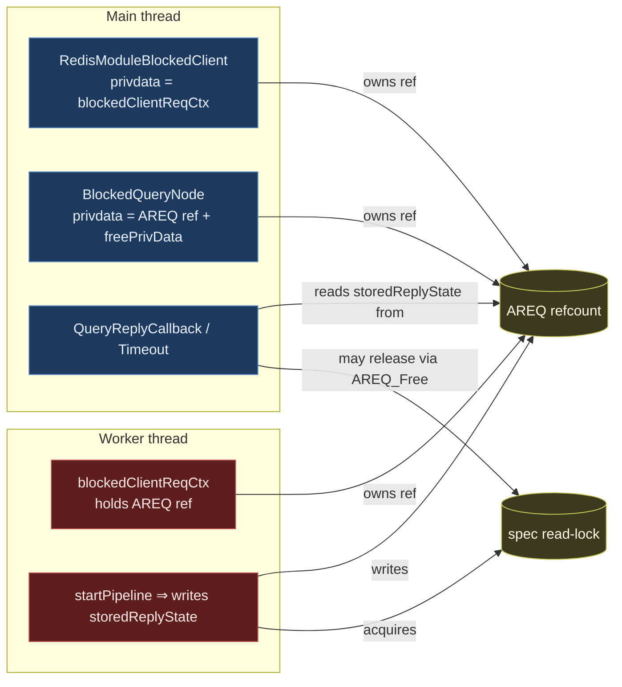
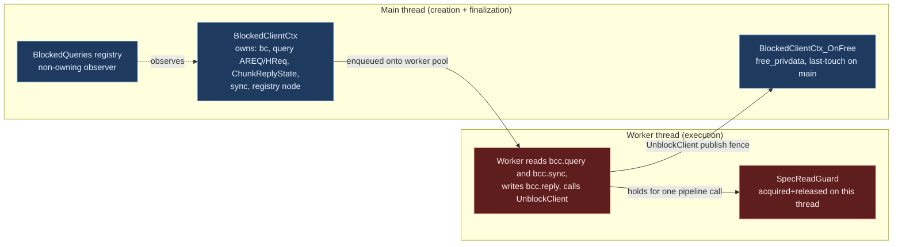
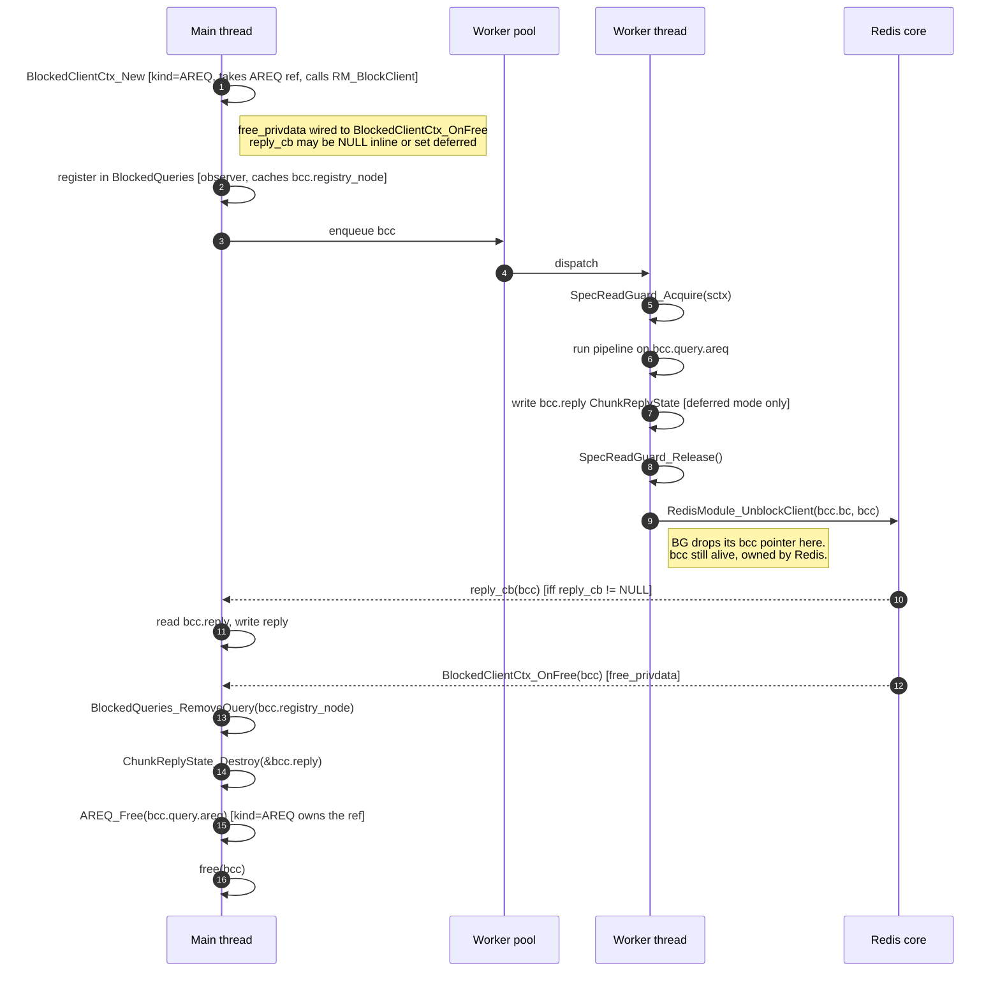
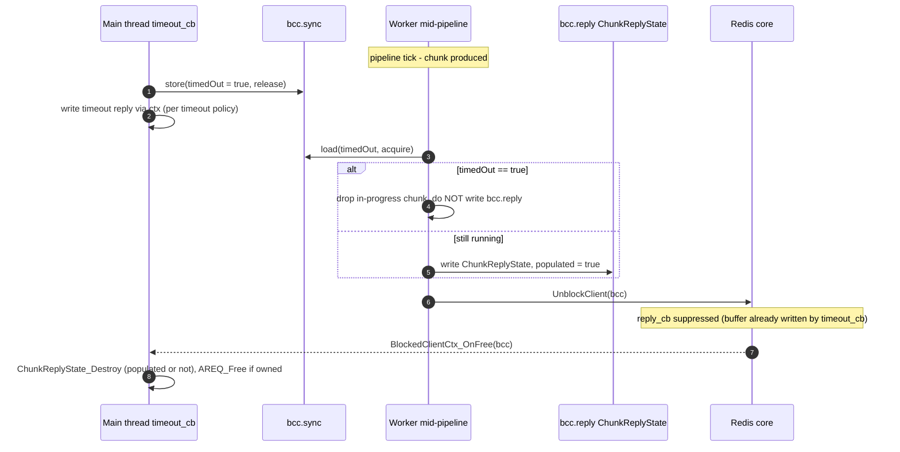

# Blocked-Client and Cross-Thread Ownership Refactor

> **Status:** Draft / RFC for team review.
> **Scope:** `RedisModule_BlockClient` callers, `BlockedQueries` registry, AREQ /
> HybridRequest cross-thread handoff, and spec-lock ownership across the
> main-thread / worker-thread boundary.
> **Non-scope:** the result-processor pipeline, the iterator tree, the spec
> rwlock semantics themselves (covered by [`sound_iterator_revalidation.md`][sir]).

[sir]: ./sound_iterator_revalidation.md

## TL;DR

Today, an `AREQ` (and its wrappers `MRCtx`, `blockedClientReqCtx`,
`BlockClientCtx`) is passed across the main / worker boundary with its
refcount split across three independent owners (blocked-client privdata,
`BlockedQueries` node, worker context). The spec read-lock can be acquired
on a worker and released on the main thread via `AREQ_Free`, which is
undefined behaviour for `pthread_rwlock_t`. This RFC replaces the implicit
ownership with two explicit roles:

| Role | Owns | Lives on |
| --- | --- | --- |
| **`BlockedClientCtx`** | The `RedisModuleBlockedClient`, the query (`AREQ` / `HybridRequest` / borrowed cursor read), the `ChunkReplyState`, the timeout-sync state, and the `BlockedQueries` registry node. Singly owned by Redis via `bc`'s privdata. | Created on main inside `RedisModule_BlockClient`, freed on main inside the `free_privdata` callback. |
| **`SpecReadGuard`** | One acquisition of the spec read-lock. | Acquired and released on the **same** thread; never crosses threads. |

`BlockedQueries` becomes a pure non-owning observer, registered/unregistered
through the `BlockedClientCtx`. `useReplyCallback` and `storedReplyState`
move off `AREQ` onto the `BlockedClientCtx`, taking the existing
`ChunkReplyState` type with them. A cursor still owns its parked `AREQ`
between cycles; each `CURSOR READ` lends that AREQ to a fresh
`BlockedClientCtx` for the duration of the cycle (see §3.4).

The names align with existing conventions: `Blocked*` matches
`BlockedQueries` / `BlockedQueryNode`; `*Ctx` matches `MRCtx` /
`CoordRequestCtx` / `ConcurrentSearchBlockClientCtx`; `*Guard` matches the
existing `RedisSearchCtx_LockSpecRead` / `_UnlockSpec` pair; and
`ChunkReplyState` is the same struct as today, just relocated.

> **Name collision with the existing `BlockClientCtx`.** Today's
> `BlockClientCtx` (the init-parameter bag in `info_redis/block_client.h`,
> different prefix: `Block` vs. `Blocked`) is renamed to `BlockClientSpec`
> in step 2 to free the name, and deleted in step 7 once
> `BlockedClientCtx_New` takes its arguments directly.

---

## 1. Background

### 1.1 Current cross-thread structs (inventory)

The following structs are passed across the main/worker boundary today.

| Struct | Defined in | Carries | Owners (today) |
| --- | --- | --- | --- |
| `AREQ` | `aggregate/aggregate.h` | Query, pipeline, results, `useReplyCallback`, `storedReplyState`, `sctx` (with spec lock state), refcount. | Worker ctx (`blockedClientReqCtx.req`), `BlockedQueryNode.privdata`, sometimes the cursor. |
| `HybridRequest` | `hybrid/hybrid_request.h` | Multiple `AREQ`s + tail pipeline. | Same shape as `AREQ`. |
| `blockedClientReqCtx` | `aggregate/aggregate_exec.c` | `AREQ*`, `RedisModuleBlockedClient*`, `RedisModuleCtx*`. | Allocated on main, consumed on worker. |
| `BlockClientCtx` | `info/info_redis/block_client.h` | reply/timeout callback ptrs, free-privdata ptr, timeout, `ast` (for diagnostic dump). | Stack-built on main, consumed during `RedisModule_BlockClient`. |
| `BlockedQueryNode` / `BlockedCursorNode` | `info/info_redis/types/blocked_queries.h` | `privdata` (an `AREQ*` ref), `freePrivData`, `spec` (`StrongRef`), query string. | Linked into a TLS list on the main thread; "non-owning" by comment, owning by code. |
| `MRCtx` | `coord/rmr/rmr.c` | Coordinator fan-out state, `RedisModuleBlockedClient*`. | Created on main, consumed by `uv` IO thread. |
| `CoordRequestCtx` | `module.c` (FT.SEARCH coord) | Coordinator-side request bag. | Created on main, consumed by `uv` IO thread. |
| `BCHCtx` | `hybrid/hybrid_exec.c` | Hybrid blocked-client wrapper. | Same shape as `blockedClientReqCtx`. |
| `ChunkReplyState` (inside `AREQ`) | `aggregate/aggregate.h` | BG-produced results, error copy, `cv`, `limit`, `cursor`, `hasStoredResults`. | Written by BG, read by main; lives on AREQ. |

### 1.2 Today's ownership graph



The two failure modes that have bitten us are visible here:

1. **Three independent refcounts on `AREQ`** with no single source of truth.
   The "transfer the ref by NULL-ing the source" pattern is used at multiple
   call-sites, and any missed transfer or double-decrement leaks or double-frees
   the request.
2. **The spec read-lock crosses threads.** It is acquired by the worker (inside
   `startPipeline`) and may end up being released by the main thread when
   `AREQ_Free` runs — a `pthread_rwlock` UB.

### 1.3 Concrete footguns, in code

- `req->storedReplyState.useReplyCallback` is mutated by `RSCursorReadCommand`
  on a cursor whose AREQ was previously left in the opposite mode — a write to
  shared state from the main thread between BG cycles.
- `BlockedQueryNode.freePrivData = AREQ_DecrRefWrapper`. The struct comment
  says "non-owning"; the code makes it an owner. This is the second of the
  three refcounts.
- `blockedClientReqCtx_destroy` performs four steps in a strict order
  (`MeasureTimeEnd` → `GetPrivateData` → `UnblockClient` → free our struct).
  Any reordering, or any path that frees the wrapper before unblocking, is a
  bug — and there is no compile-time check that prevents it.
- Coordinator queries (`module.c:4412`, `rmr.c:359`) are **not** registered in
  `BlockedQueries`, so a hung coordinator query is invisible to `FT.INFO` and
  the crash report.

---

## 2. Goals and non-goals

### 2.1 Goals

- A single canonical owner per work item (AREQ / HybridRequest / cursor read).
- Spec-lock acquire and release on the **same** thread, enforced by a wrapper
  with a debug-only thread-id assertion. Cursor handoff is explicit, not implicit.
- One uniform path to `RedisModule_BlockClient` for query-shaped work, with
  `BlockedQueries` registration done through the same path so coordinator
  queries become visible to the watchdog.
- Reply-mode (inline vs. main-thread reply callback) is a per-cycle, immutable
  property of the `BlockedClientCtx` — never a mutable field on the request.
- The `free_privdata` callback registered with `RedisModule_BlockClient`
  becomes the deterministic last-touch on the main thread; no more manual
  `MeasureTimeEnd` + `UnblockClient` + free-our-wrapper dance at every
  call-site. Throughout this doc the implementation hook is called
  `BlockedClientCtx_OnFree`; "the `free_privdata` callback" and
  "`OnFree`" refer to the same thing.

### 2.2 Non-goals

- Changing the result-processor pipeline, iterator tree, or the spec rwlock
  semantics themselves.
- Changing how coordinator fan-out talks to shards (`rmr` IO threads stay).
- Eliminating the worker-pool (`workersThreadPool_*`) or moving away from
  `libuv` for coordinator-side blocking.
- Touching the operational `RedisModule_BlockClient` callers in `gc.c` and
  `debug_commands.c` beyond moving them to the standard "always wire a free
  callback" pattern.

---

## 3. Proposed model

### 3.1 The two roles



- **`BlockedClientCtx`** is the singly-owned context for one cross-thread
  unit of query work. Redis owns it via the blocked-client's privdata; it
  exists exactly between `RedisModule_BlockClient` and the
  `BlockedClientCtx_OnFree` (`free_privdata`) callback, both of which run on
  the main thread. It carries the query (`AREQ` / `HybridRequest` /
  cursor-borrowed `AREQ`), the `ChunkReplyState`, the timeout-sync atomic,
  and the cached `BlockedQueries` registry node. Its reply mode is fixed at
  construction: `reply_cb == NULL` ⇒ inline reply, `reply_cb != NULL` ⇒
  deferred reply.
- **`SpecReadGuard`** wraps one acquisition of the spec read-lock.
  `Acquire` and `Release` assert (debug build) that they run on the same OS
  thread. The guard never crosses threads: each pipeline call (initial query
  or `CURSOR READ` cycle) acquires its own guard and releases it before the
  worker unblocks.

#### 3.1.1 Cursors borrow the query, they don't share the BCC

A cursor outlives many `CURSOR READ` cycles. Between cycles the cursor is
the sole owner of its parked `AREQ` (no `BlockedClientCtx`, no spec lock,
no in-flight worker). Each `CURSOR READ` constructs a *fresh*
`BlockedClientCtx` whose `query.areq` is **lent** by the cursor for the
duration of that cycle:

- The cursor keeps owning the `AREQ` ref. The new `BlockedClientCtx` does
  not take an additional ref and does not call `AREQ_Free` in
  `BlockedClientCtx_OnFree`.
- The worker either re-parks the AREQ on the cursor (`Cursor_Pause`) or
  exhausts the iterator and frees the cursor (`Cursor_Free`, which drops
  the cursor's owning ref). Either way the lend is over before
  `UnblockClient`.

For non-cursor work (initial query, hybrid query) the `BlockedClientCtx`
is itself the AREQ/HReq's owner, and `BlockedClientCtx_OnFree` calls
`AREQ_Free` / `HybridRequest_Free` directly. The `kind` discriminator on
the BCC selects between these two ownership flavours; see §3.2.

### 3.1.2 Single-writer invariant

This is the safety property the rest of the design rests on. At any instant,
each cross-thread struct is touched by exactly one thread:

| Struct / field | Touched by main when… | Touched by worker when… |
| --- | --- | --- |
| `AREQ` / `HybridRequest` | Before dispatch (setup), and after `BlockedClientCtx_OnFree` returns (last touch, via `AREQ_Free` for owned cycles or via the cursor for lent cycles). | Between dispatch and `UnblockClient`. |
| `bcc.reply` (embedded `ChunkReplyState`) | Read by `reply_cb`; freed in `OnFree`. | Written before `UnblockClient`. The `UnblockClient` call is the publish fence; main reads only after it. |
| `bcc.query` (the AREQ/HReq pointer) | Read in `OnFree` to decide whether to free. | May be cleared once via `Cursor_Pause` (cursor takes the AREQ ref); otherwise unchanged. The clear is on the worker side of the publish fence. |
| `bcc.bc`, `bcc.registry_node`, `bcc.kind`, `bcc.reply_cb` | Written only in `New`; read in `reply_cb` and `OnFree`. | Reads `bc` (for `UnblockClient`) and `reply_cb` (to decide whether to write `reply` inline or defer). Writes nothing. |
| `bcc.sync.timedOut` | Atomic store in `timeout_cb` (see §4.2). | Atomic load each pipeline tick. |
| `SpecReadGuard` | Never. | Acquire → use → release on the same worker. |

The single exception is the **timeout fence** between the timeout callback
(main) and the still-running worker. That window is described in §4.2 and is
the only place where shared access requires explicit synchronization
(`bcc.sync.timedOut` atomic, `ChunkReplyState` discard rules).

### 3.2 Struct sketches

Illustrative; field names are finalized during the step that introduces each.

The reply-mode dichotomy used below (inline vs. deferred) is fully spelled
out in §4.1; the short version is *inline* ⇒ `reply_cb == NULL`, BG wrote
the reply via a thread-safe context before `UnblockClient`; *deferred* ⇒
`reply_cb != NULL`, BG populated `bcc.reply` and `reply_cb` will run on
main after `UnblockClient`.

```c
// --- BlockedClientCtx -------------------------------------------------------
// Singly-owned context for one cross-thread unit of query work. Allocated
// on main inside BlockedClientCtx_New (which wraps RedisModule_BlockClient),
// handed to Redis as the blocked-client privdata, freed on main inside
// BlockedClientCtx_OnFree (the registered free_privdata callback).
//
// All access to `query` goes through accessor helpers
// (BlockedClientCtx_AsAREQ, BlockedClientCtx_ForEachAREQ); the union is
// not addressed directly by callers, so a future Rust port can replace it
// with an enum without touching call-sites.
typedef enum {
  BLOCKED_QUERY_AREQ,        // query.areq is set; bcc owns the AREQ ref
  BLOCKED_QUERY_HYBRID,      // query.hreq is set; bcc owns the HReq ref
  BLOCKED_QUERY_CURSOR_READ, // query.areq is set; ref BORROWED from the cursor
} BlockedQueryKind;

typedef struct BlockedClientCtx {
  RedisModuleBlockedClient *bc;          // Redis-owned; valid until OnFree returns
  BlockedQueryKind          kind;        // const after init
  union {
    AREQ          *areq;
    HybridRequest *hreq;
  } query;                               // see ownership note in `kind`

  RequestSyncCtx            sync;        // timeout-vs-completion atomic (existing)

  const RedisModuleCmdFunc  reply_cb;    // NULL ⇒ inline mode; non-NULL ⇒ deferred
                                         // mode. See §4.1. Const after init.
  ChunkReplyState           reply;       // populated by worker in deferred mode;
                                         // moved off AREQ.storedReplyState
  union {                                // diagnostic registry node, or NULL
    BlockedQueryNode  *query_node;
    BlockedCursorNode *cursor_node;
  } registry_node;
} BlockedClientCtx;
```

The worker pool takes a `BlockedClientCtx *` directly — there is no
separate task-wrapper struct. The worker only ever touches
`bcc->query` (to drive the pipeline), `bcc->sync` (to poll the timeout
flag), `bcc->reply` (to publish results in deferred mode), `bcc->reply_cb`
(to decide between inline and deferred), and `bcc->bc` (to call
`UnblockClient`). It does not read `registry_node` and never touches
`bcc` after `UnblockClient`.

```c
// --- SpecReadGuard ----------------------------------------------------------
// One acquisition of the spec read-lock. Acquire and Release must run on the
// same OS thread (debug-asserted via tid). Wraps the existing
// RedisSearchCtx_LockSpecRead / _UnlockSpec pair.
typedef struct SpecReadGuard {
  RedisSearchCtx *sctx;
#ifdef RS_DEBUG
  pthread_t       owner_tid;
#endif
} SpecReadGuard;

SpecReadGuard *SpecReadGuard_Acquire(RedisSearchCtx *sctx);   // asserts caller tid
void           SpecReadGuard_Release(SpecReadGuard *guard);   // asserts caller == owner
```

### 3.3 Lifetime / ownership of one cycle (no cursor)



The two key invariants visible above:

- **The guard is acquired and released on the same worker thread.** No other
  thread ever calls `SpecReadGuard_Release` on this guard.
- **`BlockedClientCtx_OnFree` is the single, deterministic, last-touch on
  the main thread.** Everything that needs to be freed on main is freed
  there. For `kind=AREQ` and `kind=HYBRID` the BCC owns the query ref and
  `AREQ_Free` / `HybridRequest_Free` runs from `OnFree`; for
  `kind=CURSOR_READ` the AREQ ref belongs to the cursor and `OnFree` does
  not free it (see §3.4).

### 3.4 Lifetime / ownership of a cursor read

A cursor outlives many `CURSOR READ` cycles. Between cycles the cursor
**owns** the parked `AREQ`; there is no `BlockedClientCtx` and no spec
lock. Each `CURSOR READ` cycle is its own end-to-end ctx → worker
pipeline, and is wrapped by a fresh `BlockedClientCtx` to which the cursor
**lends** its AREQ for the duration of that cycle.

This "cursor owns, BCC borrows-per-cycle" split is the reason `kind`
exists on `BlockedClientCtx` (§3.2). For `kind=CURSOR_READ` the BCC
participates fully in the cross-thread protocol — same registry, same
reply-mode contract, same `free_privdata` callback — but the AREQ ref is
not its to free. `BlockedClientCtx_OnFree` reads `kind` and skips
`AREQ_Free` for cursor-borrow cycles; the cursor (still alive, parked
again, or freed at cycle end) keeps the ownership.

The spec read-lock is acquired and released **independently** in each
cycle, just like the no-cursor path in §3.3. This matches the current
behaviour described in [`sound_iterator_revalidation.md`][sir] §1.2 (the
lock is released between batches and the iterator tree revalidates on
re-acquire).

The cursor itself can disappear in three ways, and the design must handle
all of them:

1. The reading client issues `CURSOR DEL` (explicit free).
2. The cursor's idle timeout fires and the cursor GC frees it.
3. A `CURSOR READ` cycle determines that the iterator is exhausted and frees
   the cursor at the end of that cycle.

Crucially, the worker handling a `CURSOR READ` does **not** know in advance
whether its cycle is the last one; it discovers exhaustion only after running
the pipeline. So "the worker frees the cursor on the last read" is just one
of the three exit paths, not a special case.

```mermaid
sequenceDiagram
  autonumber
  participant Main as Main thread
  participant W1 as Worker cycle N initial query
  participant Curs as Cursor parked between cycles
  participant W2 as Worker cycle N+1 CURSOR READ
  participant GC as Cursor GC or DEL on main

  Note over Main: Initial query with WITHCURSOR
  Main->>W1: enqueue bcc  [kind=AREQ; bcc owns AREQ ref]
  W1->>W1: SpecReadGuard_Acquire(sctx), run pipeline, SpecReadGuard_Release()
  W1->>W1: Cursor_Pause(bcc.query.areq)  [cursor takes the AREQ ref]
  Note right of W1: AREQ ownership has moved from bcc to cursor.<br/>bcc.query.areq is cleared so OnFree skips AREQ_Free.
  W1->>Main: UnblockClient(bcc)
  Main->>Main: reply_cb -> BlockedClientCtx_OnFree  [no AREQ_Free; cursor owns it]
  Note over Curs: AREQ held by cursor only.<br/>No lock, no in-flight bcc, no worker.

  Note over Main: Subsequent CURSOR READ
  Main->>Main: BlockedClientCtx_New  [kind=CURSOR_READ; AREQ ref LENT by cursor]
  Main->>W2: enqueue bcc
  W2->>W2: SpecReadGuard_Acquire(sctx), run pipeline, SpecReadGuard_Release()
  alt iterator exhausted
    W2->>W2: Cursor_Free(cursor)  [drops cursor ref; AREQ left for bcc to free in OnFree]
  else more chunks
    W2->>W2: Cursor_Pause(bcc.query.areq)  [re-park; clear bcc.query.areq]
  end
  W2->>Main: UnblockClient(bcc)
  Main->>Main: reply_cb -> BlockedClientCtx_OnFree  [AREQ_Free iff bcc.query.areq != NULL]

  Note over GC: Independent: CURSOR DEL or idle GC
  GC->>Curs: Cursor_Free(cursor)  [main thread, only legal when no in-flight bcc]
```

Mechanically, the worker is allowed exactly one mutation of `bcc.query`
during a cycle: it either calls `Cursor_Pause` (which takes the AREQ ref
and clears `bcc.query.areq`) or `Cursor_Free` (which drops the cursor's
ref but leaves the AREQ alive for the bcc to free in `OnFree`). This
mutation happens *before* `UnblockClient`, so it is on the worker side of
the publish fence. `BlockedClientCtx_OnFree` then calls `AREQ_Free` iff
`bcc.query.areq != NULL`, which is the single rule that unifies both
flavours.

Invariants:

- **The guard is always acquired and released by the same worker, within one
  pipeline call.** It never sits on the cursor, never crosses cycles.
- **At most one `BlockedClientCtx` per cursor is in flight at a time.** The
  cursor's parked/in-flight state is tracked by the existing cursor mutex;
  main only constructs a `kind=CURSOR_READ` BCC when the cursor is parked.
  `Cursor_Free` from GC/DEL asserts the cursor is parked (no in-flight
  bcc).
- **`AREQ_Free` does not touch the spec lock.** The lock is always released
  by the worker that took it, before unblocking. `AREQ_Free` runs only when
  the *last* owner drops the AREQ ref: either `BlockedClientCtx_OnFree` (if
  `bcc.query.areq` is still set), or whichever of "cycle-end exhaust" /
  "GC" / "DEL" frees the cursor in the borrow flow. By invariant no guard
  is alive at that point.

> **Future improvement (out of scope).** If profiling shows that the
> revalidate cost between consecutive cursor reads is significant, a separate
> change can introduce an opt-in "hold lock across reads" mode. That would
> require a guard that survives across cycles (and a different ownership
> story) and is deliberately not part of this refactor; the goal here is
> correctness, not the optimization.

---

## 4. Reply-mode contract

### 4.1 Mode is fixed at construction

Two facts about `RedisModule_BlockClient` are load-bearing:

1. The free callback (if registered) is called on the main thread **after**
   the reply or timeout callback returns, and always after `UnblockClient`.
2. The reply callback fires **iff** the BG did not write to the reply buffer
   before `UnblockClient` (i.e. did not call any `RM_ReplyWith*` on a thread-
   safe context).

These translate directly into the `BlockedClientCtx`'s `reply_cb` field.
The mode is encoded as `reply_cb == NULL` (inline) vs. `reply_cb != NULL`
(deferred), is fixed at `BlockedClientCtx_New`, and is read-only
thereafter — there is no separate boolean flag to keep in sync.

| Mode | `reply_cb` | BG contract | Main contract |
| --- | --- | --- | --- |
| **Inline** | `NULL` | Must call `RM_ReplyWith*` via `GetThreadSafeContext(bc)` before `UnblockClient`. Must not write to `bcc.reply`. | Only `OnFree` runs; nothing to serialize. |
| **Deferred** | non-NULL | Must populate `bcc.reply` (a `ChunkReplyState`) and **not** touch any thread-safe reply context. | `reply_cb(bcc)` reads the reply state and serializes. Then `OnFree`. |

**Inline mode requires `timeout_ms == 0`.** Once the BG has begun writing to
the reply buffer there is no safe way to abort and emit a timeout reply
instead — Fact 2 says the timeout-reply path would be a no-op (the buffer is
already touched), and the BG cannot tell whether the client is still around.
`BlockedClientCtx_New` asserts that `reply_cb == NULL` implies
`timeout_ms == 0`. All current shard query paths use deferred mode; only
operational fire-and-forget paths use inline. None of the inline callers have
timeouts today, so this rule costs nothing.

Two debug-only enforcement hooks make Fact 2 violations crash loudly:

- `BlockedClientCtx_BeginInlineReply(bcc)` is the only way for BG code to
  obtain a thread-safe reply context. It increments a debug counter on the
  `BlockedClientCtx` (and asserts `bcc->reply_cb == NULL`).
- `BlockedClientCtx_OnFree` asserts:
  - if `bcc->reply_cb == NULL` then `bcc.reply.populated == false` and the
    inline-reply counter is `> 0`;
  - if `bcc->reply_cb != NULL` then `bcc.reply.populated == true` *or* a
    timeout fired (see §4.2), and the inline-reply counter is `0`.

Today's `useReplyCallback` field on `AREQ` is **deleted**. Every place that
reads it switches to `(bcc->reply_cb == NULL)` (via the worker's pointer
to the `BlockedClientCtx` during execution; see step 4 of the migration
plan).

### 4.2 The timeout race window

The single legitimate window where main and BG threads are simultaneously
live around the same request is between **timeout_cb firing** and the BG
calling `UnblockClient`. This subsection enumerates exactly what each thread
may touch in that window, and what synchronizes them.



Allowed shared touches in the window:

| Field | Main may | Worker may | Synchronization |
| --- | --- | --- | --- |
| `bcc.sync.timedOut` | Store `true` once. | Load each pipeline tick. | Atomic acquire/release. |
| `bcc.reply` (`ChunkReplyState`) | **Not touch.** Reads only happen in `OnFree` (after `UnblockClient` fence). | Write iff `timedOut == false` after acquire-load. | Publish-via-`UnblockClient`. |
| `bcc.bc` | Read by `OnFree` only. | Read for `UnblockClient`. | Redis API guarantees `bc` is valid until `OnFree` returns. |
| `AREQ` pipeline state | **Not touch.** `timeout_cb` must not read pipeline stats or iterator state — only metadata pre-stamped at `New` (snapshotted into the registry node, see §5). | Free use; this is the worker's exclusive territory. | Single-writer (only worker). |

Forbidden shared touches:

- `timeout_cb` **must not** read the AREQ's pipeline state. If it needs
  per-query metadata (index name, query string, partial counters), that
  metadata is snapshotted into the registry node at `New`. This is the same
  rule that makes §5's `BlockedQueries` keep its own copy of the index name
  and query string.
- The worker **must not** call any `RM_ReplyWith*` after observing
  `timedOut == true`, because the buffer already holds the timeout reply.
  (In deferred mode the worker never replies inline anyway, so this is just
  a comment for future maintainers.)
- The worker **must not** assume `timedOut == false` once it is observed
  false; the next load may flip. Each pipeline tick re-checks.

The `OnFree` assertion is loosened by this section: in deferred mode,
`OnFree` accepts `bcc.reply.populated == false` *if and only if*
`bcc.sync.timedOut == true`. That is the documented "BG bailed because of
timeout" path.

---

## 5. `BlockedQueries` becomes a pure observer

Today `BlockedQueryNode.privdata` is an `AREQ*` reference and
`BlockedQueryNode.freePrivData = AREQ_DecrRefWrapper`. The struct comment
calls this "non-owning" but the code makes the registry the second of three
AREQ owners — the source of the lifetime entanglement. The fix is to make
the node hold only display-only snapshots, and let the `BlockedClientCtx`
own all live cross-references.

The `BlockedQueries_AddQuery` / `_AddCursor` API stays; only its parameter
list shrinks:

```c
// Before — node carries an AREQ reference + free callback + spec StrongRef:
BlockedQueryNode *BlockedQueries_AddQuery(BlockedQueries *list, StrongRef spec,
    QueryAST *ast, void *privdata, BlockedQueryNode_FreePrivData freePrivData);

// After — node carries only owned display strings:
BlockedQueryNode *BlockedQueries_AddQuery(BlockedQueries *list,
    const char *index_name, const QueryAST *ast);
```

The corresponding field changes on `BlockedQueryNode` / `BlockedCursorNode`:
`privdata`, `freePrivData`, and the spec `StrongRef` are deleted; an owned
`index_name` string replaces them. `start`, `query`, and the cursor-flavoured
fields (`cursorId`, `count`) stay.

Lifetime consequences:

- The registry no longer pins the spec: with the index name snapshotted into
  the node, the watchdog (`FT.INFO`, crash report) walks the TLS list and
  reads `node->index_name` / `node->query` directly. An index can be dropped
  while a registered-but-stalled query is still in the list, matching the
  original intent that a pending BG task must not pin its spec.
- `BlockedQueries_RemoveQuery` / `_RemoveCursor` are called **only** from
  `BlockedClientCtx_OnFree`, on the main thread. There is no other
  unregister path. The `BlockedClientCtx.registry_node` field (§3.2) caches
  the node pointer so `OnFree` removes in O(1) without a list scan.
- Coordinator-side `BlockedClientCtx` instances register too (`MR_Fanout`,
  `DistSearchBlockClientWithTimeout`), so coordinator queries become visible
  to the watchdog. This is a functional gain, not a regression.

The `_FreeAREQ` / `FreeQueryNode` shim functions in `block_client.c` and
`aggregate_exec.c` are deleted — there is no privdata for them to free.

---

## 6. Per-callsite migration

The eight `RedisModule_BlockClient` call-sites in `src/` (excluding tests and
`rmutil`) split into three shapes:

| Callsite | Today | After refactor |
| --- | --- | --- |
| `info_redis/block_client.c::BlockQueryClientWithTimeout` | Wraps `BlockClient` + adds `BlockedQueryNode` w/ AREQ ref | `BlockedClientCtx_New(query=areq, reply_cb, timeout_cb, timeout, register=true)`. The bcc takes the AREQ ref directly; no separate registry-side ref. |
| `info_redis/block_client.c::BlockCursorClientWithTimeout` | Same shape, cursor flavour | Same as above with `kind=CURSOR_READ` (AREQ ref lent by the cursor) and cursor-flavoured registration. |
| `coord/rmr/rmr.c::MR_Fanout` (line 359) | `BlockClient(unblockHandler, timeoutHandler, freePrivDataCB, queryTimeout)`; `MRCtx` owns `bc` | `BlockedClientCtx_New` with `register=true` (gain: coord queries visible). `MRCtx` becomes the query payload (or moves into the BCC), `BlockedClientCtx` owns `bc`. |
| `module.c::DistSearchBlockClientWithTimeout` (line 4412) | `BlockClient(DistSearchUnblockClient, timeoutCallback, freePrivDataCallback, queryTimeout)` | Same as `MR_Fanout`; gain coord visibility. Privdata-smuggling hack removed. |
| `concurrent_ctx.c:122` (`ConcurrentCmdCtx`) | Generic-shaped block-client via `ConcurrentSearchBlockClientCtx`; no registry | Reuse the existing `ConcurrentSearchBlockClientCtx` machinery as the "operational" path. The only change here is to require a non-NULL `free_privdata` (no semantic shift). |
| `debug_commands.c:888,986`, `gc.c:107,187`, `rmr.c:539,569` | `BlockClient(NULL/cb, NULL, NULL/cb, 0)` | Migrate to `ConcurrentSearchBlockClientCtx`. The NULL-callbacks fire-and-forget pattern (`rmr.c:569`) folds into here by supplying a `free_privdata` that frees the small ctx struct. |

There are deliberately **two** distinct entry points after the refactor:

1. **`BlockedClientCtx_New`** — for query-shaped work. Owns (or borrows
   from a cursor) the AREQ/HReq, carries a `ChunkReplyState`, registers in
   `BlockedQueries`.
2. **The existing `ConcurrentSearchBlockClientCtx`** — for non-query
   operational work (GC, debug commands, cluster-info). No query, no reply
   state, no registry. Today this struct exists in `concurrent_ctx.h`; the
   refactor just routes the `NULL`-callback / `BlockClient`-direct call-sites
   through it instead of inventing a new helper.

The only discipline both share is "always wire a non-NULL `free_privdata`
for your privdata."

The `BlockClientCtx` init-bag (with `replyCallback`, `timeoutCallback`,
`free_privdata`, `timeoutMS`, `ast`) in `info_redis/block_client.h` is
**renamed to `BlockClientSpec`** in step 2 to free the `BlockedClientCtx`
name for the new struct (note the `Blocked` vs. `Block` prefix). The
init-bag itself is deleted in step 7 once `BlockedClientCtx_New` takes its
arguments directly.

---

## 7. Migration plan

Each step is a self-contained PR; downstream steps assume previous ones merged.
Steps 1–2 are pure refactors with no behaviour change. Step 3 onward removes
fields and changes API surface.

### Step 1 — Introduce `SpecReadGuard`

- Add `spec_read_guard.{h,c}` exposing only `SpecReadGuard_Acquire(sctx)` and
  `SpecReadGuard_Release(guard)`. Both assert same-tid in debug builds. There
  is **no** `TransferToCursor` / `AdoptFromCursor`; a guard never outlives
  the function that created it.
- Convert the standalone shard pipeline (`startPipeline`) so that the
  acquire/release pair brackets the pipeline call. Cursor-park happens
  *after* the guard is released; cursor-resume acquires a fresh guard in
  the worker that picks up the next read.
- `req->sctx` stays in place (the guard wraps it); `SpecReadGuard_Release`
  calls `RedisSearchCtx_UnlockSpec` exactly as today's release path does.
- Delete the "if locked, unlock" branch from `AREQ_Free`. Add a debug
  assertion that the spec is not held when the AREQ is freed — the worker
  must have released its guard first.
- **Acceptance:** standalone tests pass; `tsan` / `helgrind` runs of the
  cursor read suite pass; the cross-thread unlock UB warning is gone.
- **Note:** if profiling later shows the per-cycle revalidate cost on cursor
  reads is significant, a follow-up can introduce an opt-in long-lived
  guard. That is explicitly out of scope here (see §3.4).

### Step 2 — Introduce `BlockedClientCtx` for standalone queries

- Rename today's init-bag `BlockClientCtx` (in `info_redis/block_client.h`)
  to `BlockClientSpec` to free the name.
- Add `blocked_client_ctx.{h,c}`. Implement `BlockedClientCtx_New` and
  `BlockedClientCtx_OnFree`; register `OnFree` as the `free_privdata`
  callback when calling `RedisModule_BlockClient`.
- Convert `BlockQueryClientWithTimeout`, `BlockCursorClientWithTimeout`, and
  the hybrid block-client wrapper to call `BlockedClientCtx_New` internally.
  The BCC takes the AREQ/HReq ref directly (or, for `kind=CURSOR_READ`,
  records the cursor as the lender). Mode is derived from the existing
  `useReplyCallback` field for now (still mutable; tightened in step 4).
- Move per-callsite teardown — `MeasureTimeEnd`, the privdata free,
  `RM_UnblockClient` follow-ups, and the existing `ASM_AccountRequestFinished`
  call — into `BlockedClientCtx_OnFree`. ASM accounting is internal to its
  tracker (see `asm_state_machine.h`); the only contract this design has to
  preserve is "exactly one finish call per request, on main", which `OnFree`
  delivers naturally.
- Reply / timeout callbacks read `bcc.reply` (the `ChunkReplyState`); behind
  the scenes they still reach the AREQ via the `bcc.query` union.
- **Acceptance:** standalone query, cursor read, hybrid query, and timeout
  paths exercise the new `BlockedClientCtx`; `bc` destroy / privdata code is
  centralized in `OnFree`; ASM keyspace-version count balanced under the
  existing sanitizer leak check.

### Step 3 — Sever `BlockedQueries` from privdata ownership

- Replace `BlockedQueryNode.privdata` + `freePrivData` with the owned
  `index_name` / `query` snapshot fields described in §5. Same change for
  `BlockedCursorNode`.
- Change `BlockedQueries_AddQuery` / `_AddCursor` signatures to take the
  snapshot strings directly (no `privdata`, no `freePrivData`, no spec
  `StrongRef`).
- Move `BlockedQueries_AddQuery` / `RemoveQuery` calls into
  `BlockedClientCtx_New` / `OnFree`. Cache the returned
  `BlockedQueryNode*` on `bcc.registry_node` so `OnFree` removes in O(1).
- Drop the cloned `StrongRef` on the spec; the registry no longer pins it.
- Delete `_FreeAREQ` / `FreeQueryNode` shims.
- **Acceptance:** AREQ has exactly one owner (the `BlockedClientCtx` for
  initial query / hybrid; the cursor while parked, lent to the BCC during
  a cursor read); a leak-test under ASAN shows no AREQ outliving its
  `OnFree`; an index can be dropped while a registered-but-stalled query is
  still in the TLS list (the snapshot keeps `FT.INFO` correct).

### Step 4 — Move `useReplyCallback` and `storedReplyState` off AREQ

- Move `ChunkReplyState` ownership from `AREQ` to `BlockedClientCtx.reply`;
  rewrite `AREQ_StoreResults`, `AREQ_ReplyWithStoredResults`,
  `QueryReplyCallback`, and `CursorReadReplyCallback` to read/write through
  the `BlockedClientCtx`.
- Replace every read of `req->useReplyCallback` with the equivalent check on
  the `BlockedClientCtx`: a NULL `bcc.reply_cb` means inline-reply mode; a
  non-NULL callback means deferred-reply mode (see §4.1). There is no
  separate boolean flag.
- Delete `req->useReplyCallback` and `req->storedReplyState`.
- Delete the `RSCursorReadCommand` mutation that flips the mode mid-flight.
  Cursor reads pick the mode at `BlockedClientCtx_New` time, derived from
  the same conditions today's mutation tests for, and fixed for the cycle.
- Add the debug-only inline-reply counter and `OnFree` assertions described
  in §4.1, plus the timeout-bail relaxation from §4.2.
- **Acceptance:** the per-cursor `useReplyCallback` mutation is gone; mode
  is fixed at `New`; assertions catch a deliberate Fact-2 violation in a
  unit test; assertions also catch a deliberate "wrote `ChunkReplyState`
  after observing `timedOut`" violation.

### Step 5 — Coordinator path: `MR_Fanout` and `DistSearchBlockClientWithTimeout`

- Convert both coordinator block-client sites to `BlockedClientCtx_New`
  with `register_in_blocked_queries=true`.
- `MRCtx` and `CoordRequestCtx` become the `bcc.query` payload; the
  `BlockedClientCtx` owns `bc`.
- **Acceptance:** a hung coordinator query appears in `FT.INFO`'s blocked-
  query section and in the crash report; coordinator timeout / unblock paths
  pass tests.

### Step 6 — Route remaining call-sites through `ConcurrentSearchBlockClientCtx`

- Migrate `gc.c`, `debug_commands.c`, and the two non-query `rmr.c` sites
  to allocate / wire a `ConcurrentSearchBlockClientCtx` (the existing
  operational helper) instead of calling `RedisModule_BlockClient` directly.
- The fire-and-forget `MR_uvReplyClusterInfo` call-site gets a `free_privdata`
  that frees its small ctx struct, instead of `NULL` callbacks plus manual
  free.
- Tighten `ConcurrentSearchBlockClientCtx` to require a non-NULL
  `free_privdata`.
- **Acceptance:** `RedisModule_BlockClient` is no longer called directly
  outside `BlockedClientCtx_New` and `ConcurrentSearchBlockClientCtx`
  (search by grep).

### Step 7 — Clean up

- Delete `blockedClientReqCtx`, `blockedClientHybridCtx`, and the manual
  `MeasureTimeEnd` / `UnblockClient` / `free` sequences they implemented.
- Delete the `BlockClientSpec` init-bag now that `BlockedClientCtx_New`
  takes its arguments directly.
- Tighten asserts where steps 1–6 left them temporarily lax.

---

## 8. Risks and open questions

1. **Hybrid pipeline's internal sub-AREQ races are out of scope.** A
   `HybridRequest` runs multiple sub-pipelines internally and must reach a
   single "all sub-queries done" point before the top-level `BlockedClientCtx`
   publishes `bcc.reply` and calls `RM_UnblockClient`. Any worker→worker or
   worker→depleter handoff inside the hybrid is a hybrid-internal race, and
   the hybrid implementation owns its own synchronization (today: a single
   shared `sctx`, all sub-AREQs read under that lock). The contract this
   design enforces at the boundary is the same as for a standalone query:
   the hybrid takes a single `SpecReadGuard` for the duration of its work,
   releases it before publishing the reply, and from then on only the main
   thread touches the `BlockedClientCtx`. If a future hybrid optimization
   wants per-sub-pipeline guards or staged unblocking, that is a hybrid
   redesign on top of this layer, not a change to the top-level lifecycle.
2. **Profile mode ordering.** `IsProfile(req)` paths read timing data from
   the AREQ on the main thread after the BG completes. Verify that nothing
   in profile-reply reads `storedReplyState` after step 4 without going
   through the `BlockedClientCtx`. **Proposed:** profile state stays on AREQ
   (it's pipeline-internal), reply path reaches it via `bcc.query`.
3. **`concurrent_ctx.c` callers that *are* queries.** The dispatcher is used
   today for some commands that block on a query path. Audit before step 6
   whether any of them should migrate to `BlockedClientCtx_New` instead of
   staying on `ConcurrentSearchBlockClientCtx`.
4. **TLS-list crash safety on coordinator threads.** `BlockedQueries` is
   currently main-thread TLS. Coordinator queries created on the main thread
   are fine, but verify with the rmr team that no fan-out path
   constructs/registers from a `uv` IO thread. **Proposed:** registration
   stays main-thread-only; the coord call-site registers before scheduling
   the IO work.
5. **Cluster-info / connection-pool-state opcodes (`rmr.c:539,569`).** These
   currently use `NULL` callbacks and free their context manually pre-
   `UnblockClient`. Verify there is no caller that relies on the synchronous
   ordering before adding a `free_privdata`.
6. **Cursor revalidation cost.** §3.4 admits that releasing the
   `SpecReadGuard` between cursor reads forces the iterator tree to
   revalidate on the next acquire. The current code does the same thing (it
   releases between batches), so this is not a regression, but it is worth
   measuring on high-rate cursor workloads before declaring step 1 complete.
   If a regression appears, the long-lived-guard follow-up moves up the
   queue.

---

## 9. Out of scope (for later)

- Porting any of these new types to Rust. The new boundaries are
  intentionally Rust-port-friendly (see §10), but no Rust code is added in
  this work.
- Replacing the worker pool implementation.
- Changing the cursor lifecycle (parking, GC) beyond what §3.4 spells out.
- Reworking how timeouts are signalled to the BG (still via
  `RequestSyncCtx.timedOut`).
- Long-lived leases held across cursor reads (see §3.4 future-improvement
  note and §8 risk 6).

---

## 10. Rust port notes

The shapes introduced here are deliberately chosen so that a future Rust
port can reuse the C structs as the FFI surface and wrap them with idiomatic
Rust types without having to redesign the lifetimes. This section is
informational for the eventual port; nothing here is committed in this work.

| C concept | Rust analogue |
| --- | --- |
| `BlockedClientCtx` | `Box<BlockedClientCtx>` owned by Redis: allocated by Rust, handed to Redis as `*mut c_void`, freed in `free_privdata` by reconstructing the `Box`. Exactly one owner at a time. The `bcc.query` field is an enum (`Owned(AREQ)` / `Owned(HReq)` / `LentByCursor(&Cursor)`) capturing the lending model from §3.4. |
| `ChunkReplyState` (in `bcc.reply`) | `OnceCell<ChunkReplyState>`: single producer (worker) → single consumer (main); written once before `UnblockClient`, taken once in the reply callback. |
| `SpecReadGuard` | RAII guard, `!Send`. Same-thread invariant becomes a type-system guarantee; `Drop` calls `RedisSearchCtx_UnlockSpec`. |
| `RequestSyncCtx.timedOut` | `AtomicBool` with `Acquire`/`Release` ordering as in §4.2. Lives on the AREQ/HReq, not on the `BlockedClientCtx` — it is request-lifetime and survives across cursor reads. |
| `BlockedQueries` registry | Per-thread snapshot list; entries are `Send` because they own only strings (§5). |
| Inline-vs-deferred mode | `match bcc.reply_cb` — `None` means inline, `Some(cb)` means deferred; fixed at construction (§4.1). |

Two design choices in the C version are specifically there to keep the Rust
port cheap:

1. **Single-writer invariant on the AREQ.** Without this, a Rust port would
   have to wrap the AREQ in `Mutex<AREQ>` or `RwLock<AREQ>`. With it, the
   AREQ stays a plain `&mut` borrow inside the worker and a plain `&` borrow
   inside the reply callback — no synchronization primitive needed.
2. **`SpecReadGuard` non-transferability.** A transferable guard would have
   to be `Send`, forcing it away from being a stack-local borrow of the
   spec's lock. Forbidding transfer keeps it a plain RAII guard.

`ConcurrentSearchBlockClientCtx` (the operational, non-query path) is left
out of the Rust mapping above on purpose — it is unrelated to query
execution and need not be ported in the same effort.
