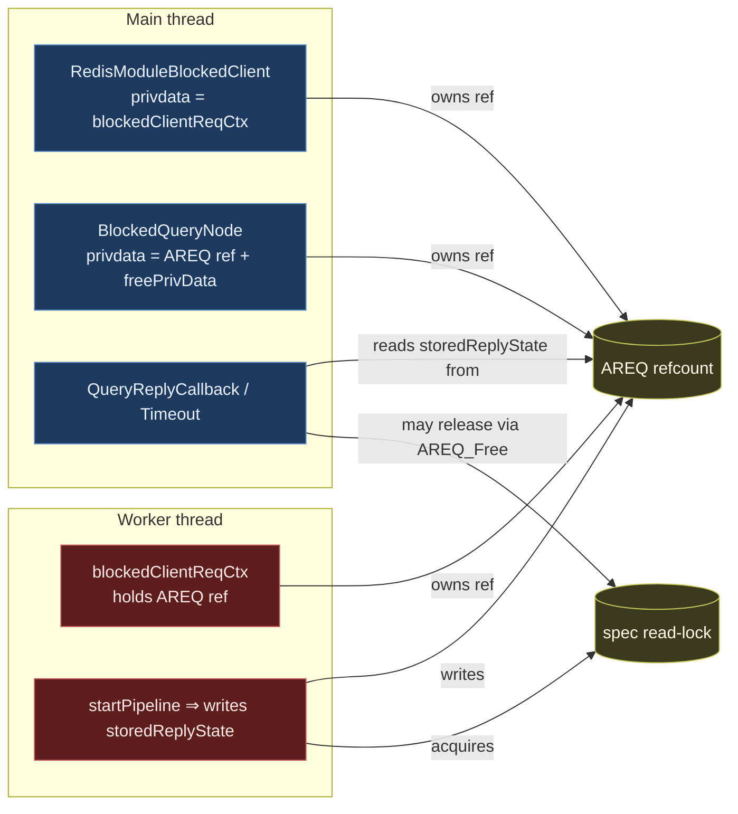
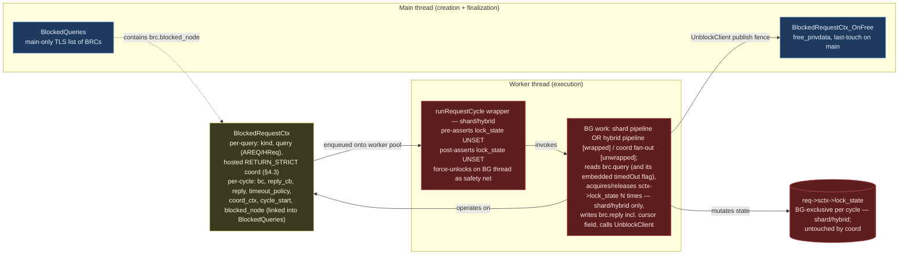
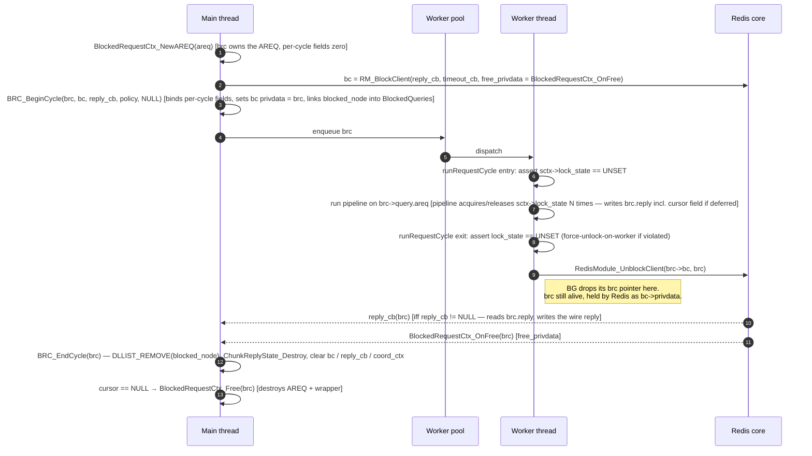
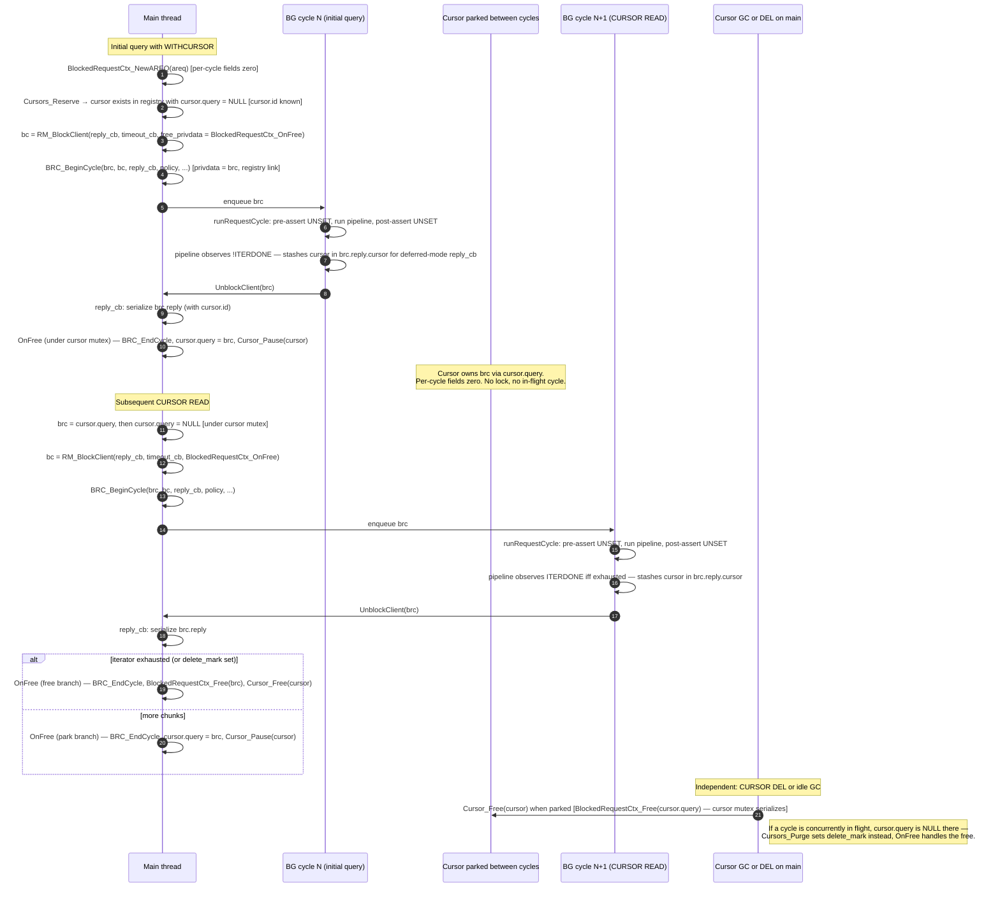
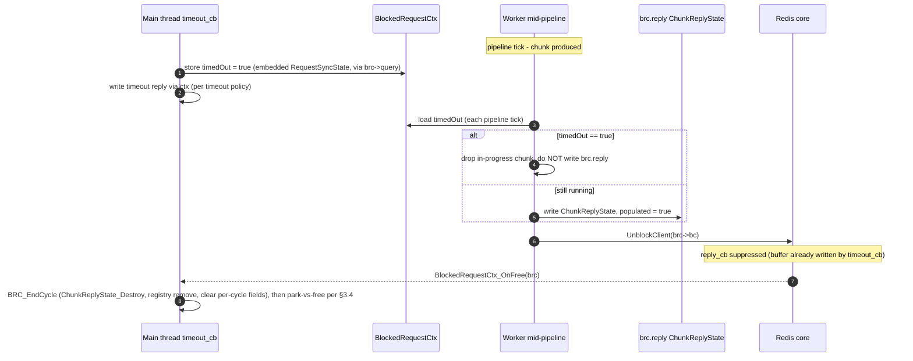

# Blocked-Client and Cross-Thread Ownership Refactor

> **Status:** Draft / RFC for team review. **Refreshed 2026-07** against
> master after the `ON_TIMEOUT RETURN_STRICT` mechanism was completed
> (MOD-13617 family, through MOD-16091 "deplete RETURN_STRICT cursors on
> timeout" and MOD-16267 safe-loader GIL preempt).
> **Scope:** `RedisModule_BlockClient` callers, `BlockedQueries` registry, AREQ /
> HybridRequest cross-thread handoff, and spec-lock ownership across the
> main-thread / worker-thread boundary.
> **Non-scope:** the result-processor pipeline, the iterator tree, the spec
> rwlock semantics themselves (covered by [`sound_iterator_revalidation.md`][sir]),
> and the **RETURN_STRICT coordination protocol itself** (the claim / wait /
> GIL-preempt handshake) — this refactor re-homes that state onto the new
> wrapper verbatim and leaves its semantics alone; a separate follow-up
> simplifies it (see §4.3 and §9).

[sir]: ./sound_iterator_revalidation.md

## TL;DR

Today, an `AREQ` (and its wrappers `MRCtx`, `blockedClientReqCtx`,
`BlockClientCtx`) is passed across the main / worker boundary with its
refcount split across three independent owners (blocked-client privdata,
`BlockedQueries` node, worker context). The spec read-lock can be acquired
on a worker and released on the main thread via `AREQ_Free`, which is
undefined behaviour for `pthread_rwlock_t`. This RFC replaces the implicit
ownership with two explicit roles plus one single-owner wrapper:

| Role | Owns | Lives on |
| --- | --- | --- |
| **`BlockedRequestCtx`** (heap wrapper) | The query (AREQ or HybridRequest), the **hosted RETURN_STRICT coordination block** (claim CAS, done-latch, safe-loader-GIL handshake — moved verbatim, semantics untouched), AND per-cycle handle (`bc`, `reply_cb`, `ChunkReplyState reply`, `timeout_policy`, `blocked_node`, optional `coord_ctx`). Single-owner: Redis holds `BlockedRequestCtx*` as `bc->privdata` during a cycle; `cursor->query` holds it between cycles. | Allocated on main at `BlockedRequestCtx_New`. Per-cycle fields bound at `BRC_BeginCycle`, cleared at `BRC_EndCycle` (called from `OnFree`). Wrapper destroyed by `BlockedRequestCtx_Free` from `OnFree`'s free branch (or `Cursor_Free` for a parked cursor). |
| **`RequestSyncState`** (embedded, per request) | The per-request timeout flag (`timedOut`) and the single-slot abort-wake channel. Stays embedded in **every** AREQ and HybridRequest — including hybrid sub-AREQs, which need their own flag/channel (the hybrid timeout callbacks wake each subquery's channel) but are never wrapped. | Inline field on the request, as today's embedded struct — minus the refcount and the top-level coordination state, which move to the wrapper. |
| **`SpecLockState`** (enum field on `sctx`) | The spec-lock state (replaces today's `RSContextFlags flags`). Stateful — supports multiple acquire/release per cycle, queryable mid-pipeline. **No new struct type — just a renamed enum field on `RedisSearchCtx`.** | Reached as `req->sctx->lock_state`. Whichever thread is currently driving the request owns it. For shard / hybrid cycles the BG thread is the sole accessor for the duration of the cycle (enforced by the `runRequestCycle` wrapper); for synchronous main-thread commands (e.g. `FT.EXPLAIN`) main is the sole accessor. |

Today's embedded `RequestSyncCtx` (inside `AREQ` / `HybridRequest`)
holds `refcount`, `timedOut`, the RETURN_STRICT partial-timeout
coordination (claim CAS + done-latch + condvar), the safe-loader-GIL
handshake, and the abort-wake channel. Step 0 **splits** it:

- the per-request piece (`timedOut`, abort-wake) stays embedded and is
  renamed `RequestSyncState` — sub-AREQs keep their own copy;
- the top-level piece (ownership + the RETURN_STRICT coordination
  block) becomes the heap-allocated `BlockedRequestCtx` wrapper that
  **owns** the `AREQ` / `HybridRequest` (containment inverts).

Ownership of the wrapper is single-owner with explicit transfer:
`bc->privdata` owns it during a cycle, `cursor->query` owns it between
cycles, and the transfer happens on main under the cursor mutex at
`BRC_BeginCycle` and `OnFree`. The `refcount` field is dropped in the
final state (Step 0 carries a temporary refcount bridge; see §7) —
the cross-thread invariants it used to guarantee are provided by the
Redis BlockedClient API's privdata-lifetime guarantee (BG borrows
during the cycle) plus the existing `Cursor.delete_mark` mechanism
(handles `CURSOR DEL` / GC during in-flight). See §3.1.1. Even the
shard-level hybrid multi-cursor case (N sub-cursors, one
HybridRequest) needs no counting: the container is dissolved at the
end of the initial cycle — the blocked-client API's `reply_cb` →
`OnFree` ordering on main guarantees no `CURSOR READ` can race the
dissolution — and each sub-cursor's BRC owns its sub-AREQ outright;
see §3.6.

`BlockedQueries` becomes a pure non-owning observer, registered at
`BRC_BeginCycle` and removed at `BRC_EndCycle`. `useReplyCallback` and
`storedReplyState` move off `AREQ` / `HybridRequest` onto the
`BlockedRequestCtx`'s per-cycle fields, taking the existing
`ChunkReplyState` type with them.

The names align with existing conventions: `Blocked*` matches
`BlockedQueries` / `BlockedQueryNode`; `*Ctx` matches `MRCtx` /
`CoordRequestCtx` / `ConcurrentSearchBlockClientCtx`;
`SpecLockState` is just a rename of today's `RSContextFlags flags` field
on `sctx` (same role, same shape, with a per-cycle ownership invariant
imposed by the `runRequestCycle` wrapper); and
`ChunkReplyState` is the same struct as today, just relocated.
The heap wrapper is **renamed** from today's (embedded)
`RequestSyncCtx` to `BlockedRequestCtx` (abbreviated **BRC**
throughout): after the split, the wrapper's job is ownership plus the
blocked-client cycle handle — not synchronization — so the sync name
stays with the slice that keeps the sync job (`RequestSyncState`).
The rename also disambiguates the old and new structs in diffs during
the migration (see §3.2 and Step 0).

Two facts about the completed RETURN_STRICT mechanism shape this
refresh:

1. **A timed-out cursor is always dropped.** Under RETURN_STRICT a
   timeout on any cursor path replies a *depleted* cursor (id 0) and
   purges/frees the cursor object (MOD-16091, MOD-15285, MOD-14076);
   under FAIL the cursor is freed outright; under RETURN there is no
   blocked-client timer at all. So **a parked cursor is never in a
   timed-out state**, `OnFree`'s park branch simply requires
   `!timedOut`, and no timeout state has to be reconciled across
   cursor cycles.
2. **The main thread still waits for BG on strict timeouts** (the
   claim/wait/GIL-preempt handshake). That is unchanged here — the
   wrapper hosts it as an opaque block — and a planned follow-up
   removes the wait entirely by making the timeout callback drain a
   generic thread-safe result list and return (§4.3, §9). The
   per-cycle `brc->reply` slot is deliberately shaped as that generic
   result container so the follow-up is a local change.

> **Note on the existing `BlockClientCtx`.** Today's `BlockClientCtx`
> (the init-parameter bag in `info_redis/block_client.h`) is deleted
> in step 2 — `BlockedRequestCtx_New` + `BRC_BeginCycle` take their
> arguments directly. The per-cycle fields it carried now live on
> `BlockedRequestCtx` (§3.2).

---

## 1. Background

### 1.1 Current cross-thread structs (inventory)

The following structs are passed across the main/worker boundary today.

| Struct | Defined in | Carries | Owners (today) |
| --- | --- | --- | --- |
| `AREQ` | `aggregate/aggregate.h` | Query, pipeline, results, `useReplyCallback`, `storedReplyState`, `sctx` (with spec lock state), embedded `RequestSyncCtx`. | Worker ctx (`blockedClientReqCtx.req`), `BlockedQueryNode.privdata`, sometimes the cursor, on coord paths also `CoordRequestCtx`. |
| `RequestSyncCtx` (embedded) | `aggregate/aggregate.h:181` | `refcount` (the AREQ/HReq lifetime refcount itself), `timedOut`, the RETURN_STRICT coordination (`requiresAggregateResultsSync`, `aggregatingResults` CAS, `aggregateResultsClaimLost`, done-latch + mutex/cond), the safe-loader-GIL handshake (`safeLoaderHoldingGIL` + Enter/Exit/Preempt, MOD-16267), abort-wake channel. | Inline on every AREQ and HybridRequest (sub-AREQs included). |
| `HybridRequest` | `hybrid/hybrid_request.h` | Multiple `AREQ`s + tail pipeline. | Same shape as `AREQ`. |
| `blockedClientReqCtx` | `aggregate/aggregate_exec.c` | `AREQ*`, `RedisModuleBlockedClient*`, `WeakRef spec_ref`. | Allocated on main, consumed on worker. |
| `BlockClientCtx` | `info/info_redis/block_client.h` | reply/timeout callback ptrs, free-privdata ptr, timeout, `ast` (for diagnostic dump). | Stack-built on main, consumed during `RedisModule_BlockClient`. |
| `BlockedQueryNode` / `BlockedCursorNode` | `info/info_redis/types/blocked_queries.h` | `privdata` (an `AREQ*` ref), `freePrivData`, `spec` (`StrongRef`), query string. | Linked into a TLS list on the main thread; "non-owning" by comment, owning by code. |
| `MRCtx` | `coord/rmr/rmr.c` | Coordinator fan-out state, `RedisModuleBlockedClient*`. | Created on main, consumed by `uv` IO thread. |
| `CoordRequestCtx` | `coord/coord_request_ctx.{h,c}` | Coordinator-side request bag for the AREQ-shaped coord paths (`DistAggregate` / `DistHybrid` / coord `FT.CURSOR READ`): `type` + `areq`/`hreq` union, atomic `timedOut`, `setReqLock` (guards the "BG creates the request after BlockClient" binding race), `preRequestError`, `useReplyCallback`, `isCursorReadReturnStrict`, and a **sticky `timeoutPolicy`** captured on main at dispatch (MOD-16023 TOCTOU fix vs. concurrent `FT.CONFIG SET`). The `FT.SEARCH` coord path does not use it — it uses `MRCtx` + `searchRequestCtx` instead. | Created on main as `bc->privdata`, consumed by the DIST_THREADPOOL worker; freed by the BC free callback (`DistCoordReqFreePrivData`), which also runs `AREQ_CleanUpStoredCursor` to dispose a cursor stashed by a preempted cycle. |
| `blockedClientHybridCtx` | `hybrid/hybrid_exec.c` | Hybrid blocked-client wrapper (instances are named `BCHCtx`). | Same shape as `blockedClientReqCtx`. |
| `ChunkReplyState` (inside `AREQ`) | `aggregate/aggregate.h` | BG-produced results, error copy, `cv`, `limit`, `cursor`, `hasStoredResults`. | Written by BG, read by main; lives on AREQ. |

### 1.2 Today's ownership graph



The two failure modes that have bitten us are visible here:

1. **Three independent refcounts on `AREQ`** with no single source of truth.
   The "transfer the ref by NULL-ing the source" pattern is used at multiple
   call-sites, and any missed transfer or double-decrement leaks or double-frees
   the request.
2. **The spec read-lock crosses threads.** It is acquired by the worker (inside
   `startPipeline`) and may end up being released by the main thread when
   `AREQ_Free` runs — a `pthread_rwlock` UB. (The silent unlock no longer
   sits in `AREQ_Free` itself; it lives in `SearchCtx_Free` →
   `SearchCtx_CleanUp` → `RedisSearchCtx_UnlockSpec`, which is a no-op
   when `flags == RS_CTX_UNSET` and otherwise unlocks — an idempotence
   that `HREQ_Execute_Callback` deliberately relies on today.)

### 1.3 Concrete footguns, in code

- `req->useReplyCallback` (a plain `bool` field on `AREQ`, distinct from the
  `storedReplyState` `ChunkReplyState`) is mutated by `RSCursorReadCommand`
  on a cursor whose AREQ was previously left in the opposite mode — a write to
  shared state from the main thread between BG cycles.
- `BlockedQueryNode.freePrivData = AREQ_DecrRefWrapper`. The struct comment
  says "non-owning"; the code makes it an owner. This is the second of the
  three refcounts.
- `blockedClientReqCtx_destroy` performs four steps in a strict order
  (`MeasureTimeEnd` → `GetPrivateData` → `UnblockClient` → free our struct).
  Any reordering, or any path that frees the wrapper before unblocking, is a
  bug — and there is no compile-time check that prevents it.
- Coordinator queries (`DistSearchBlockClientWithTimeout` in `module.c`,
  `MR_Fanout` in `rmr.c`) call `RedisModule_BlockClient` directly and are
  **not** registered in `BlockedQueries`, so a hung coordinator query is
  invisible to `FT.INFO` and the crash report.
- The RETURN_STRICT work left per-path ownership patch-ups whose only
  job is compensating for the scattered ownership: `CoordRequestCtx`'s
  `setReqLock` + `preRequestError` exist because the request is created
  on the BG thread *after* `RM_BlockClient` (so the timeout callback
  may fire before there is a request); `AREQ_CleanUpStoredCursor` is
  called from **two** different free callbacks to dispose a cursor a
  preempted cycle stashed in `storedReplyState.cursor` (MOD-16091,
  MOD-16267). Under the refactor both disappear structurally: the
  request is bound to the wrapper on main *before* `RM_BlockClient`,
  and `OnFree` is the single park-or-free site.

---

## 2. Goals and non-goals

### 2.1 Goals

- A single-owner `BlockedRequestCtx` per query, with ownership held by
  exactly one of `bc->privdata` or `cursor->query` at any instant.
  Transfers happen on main, under the cursor mutex, at exactly two
  sites (`BRC_BeginCycle` and `OnFree`). The unconstrained "transfer
  the ref by NULL-ing the source" pattern — scattered across many
  call-sites today — is replaced by a constrained two-site transfer.
  No refcounting on the wrapper, no separate per-cycle struct (the
  `BlockedRequestCtx` carries the per-cycle fields directly).
- Spec-lock acquire and release on the **same** thread, enforced by a wrapper
  with a debug-only thread-id assertion. Cursor handoff is explicit, not implicit.
- One uniform path to `RedisModule_BlockClient` for query-shaped work, with
  `BlockedQueries` registration done through the same path so coordinator
  queries become visible to the watchdog.
- Reply-mode (inline vs. main-thread reply callback) is a per-cycle, immutable
  property of the `BlockedRequestCtx`'s per-cycle fields — never a mutable
  field on the request itself.
- The `free_privdata` callback registered with `RedisModule_BlockClient`
  becomes the deterministic last-touch on the main thread; no more manual
  `MeasureTimeEnd` + `UnblockClient` + free-our-wrapper dance at every
  call-site. Throughout this doc the implementation hook is called
  `BlockedRequestCtx_OnFree`; "the `free_privdata` callback" and
  "`OnFree`" refer to the same thing.

### 2.2 Non-goals

- Changing the result-processor pipeline, iterator tree, or the spec rwlock
  semantics themselves.
- **Changing the RETURN_STRICT coordination protocol.** The claim CAS,
  done-latch condvar, safe-loader-GIL handshake, and abort-wake channel
  move onto the new structs *verbatim* (top-level coordination onto the
  `BlockedRequestCtx` wrapper, per-request flag/channel onto the embedded
  `RequestSyncState`) with identical semantics. The planned
  simplification — the main thread never waits for BG; the timeout
  callback drains a generic thread-safe result list and returns — is a
  separate follow-up (§4.3, §9) that this refactor only *prepares for*
  by giving the reply state one generic per-cycle home (`brc->reply`).
- Changing how coordinator fan-out talks to shards (`rmr` IO threads stay).
- Eliminating the worker-pool (`workersThreadPool_*`) or moving away from
  `libuv` for coordinator-side blocking.
- Touching the operational `RedisModule_BlockClient` callers in `gc.c` and
  `debug_commands.c` beyond moving them to the standard "always wire a free
  callback" pattern.

---

## 3. Proposed model

### 3.1 The two roles



- **`BlockedRequestCtx`** is the singly-owned per-query context — there
  is no separate per-cycle struct. Redis holds the `BlockedRequestCtx*`
  directly as `bc->privdata`; it exists from `BlockedRequestCtx_New`
  through the `BlockedRequestCtx_OnFree` (`free_privdata`) callback.
  Both endpoints run on the main thread.

  The struct has two field-validity classes (see §3.2):

  - **Per-query fields** — set at `BlockedRequestCtx_New`, valid for the
    full lifetime: `kind`, the AREQ/HReq union, and the hosted
    RETURN_STRICT coordination block (§4.3). The per-request
    `timedOut` flag and abort-wake channel stay embedded on the
    request itself (`RequestSyncState`), reached via `brc->query`.
  - **Per-cycle fields** — set at `BRC_BeginCycle` and cleared at
    `BRC_EndCycle` (called from `OnFree`): `bc`, `reply_cb`,
    `timeout_policy`, `reply` (`ChunkReplyState`), `blocked_node`,
    optional `coord_ctx`. For
    a non-cursor query these align with the per-query lifetime. For
    cursor reads they cycle through bound → unbound states, with the
    cursor mutex serializing the transitions.

  Reply mode is fixed *for the cycle* at `BeginCycle`: `reply_cb ==
  NULL` ⇒ inline reply, `reply_cb != NULL` ⇒ deferred reply. Cursor
  reads can pick a different mode per cycle (the previous mid-flight
  mutation in `RSCursorReadCommand` is gone — the choice is fixed
  once per cycle, at `BeginCycle`).
- **`SpecLockState`** is just a renamed field on the existing
  heap-allocated `RedisSearchCtx` (owned by `AREQ` via `req->sctx`).
  Today's `RSContextFlags flags` becomes `SpecLockState lock_state` —
  same enum shape (`UNSET` / `READ` / `WRITE`), no new struct type,
  no new API surface. The lock primitives
  (`RedisSearchCtx_LockSpecRead` / `_TryLockSpecRead` / `_LockSpecWrite`
  / `_UnlockSpec`) keep their signatures; their bodies just operate on
  `sctx->lock_state`. Multiple acquire/release transitions per cycle
  remain first-class (the existing `handleSpecLockAndRevalidate`,
  `UnlockSpec_and_ReturnRPResult`, and safe-loader unlock-and-relock
  patterns all keep working). Cross-thread safety comes from the
  **`runRequestCycle` wrapper** (see §3.5) — invoked on the worker pool
  thread for shard and hybrid pipelines: pre-asserts `lock_state ==
  UNSET` on cycle entry, runs the BG work, post-asserts `UNSET` before
  `UnblockClient` (with a same-thread force-unlock safety net for
  release builds). Coord queries don't use the wrapper — they never
  acquire the spec lock locally, so there's nothing to assert. Outside
  cycles (synchronous main-thread commands like `FT.EXPLAIN`), main
  is the legitimate accessor; the design imposes no thread-id check,
  only the cycle invariant.

#### 3.1.1 Single-owner ownership of the `BlockedRequestCtx`

`BlockedRequestCtx` is **not** refcounted. At any instant exactly one
holder owns it, and ownership is transferred at well-defined
main-thread sites under the cursor mutex. The two possible holders:

- `bc->privdata` — Redis-held during a cycle (lifetime guaranteed by
  the Redis BlockedClient API: `bc->privdata` is alive from
  `RM_BlockClient` until `OnFree` returns).
- `cursor->query` — set between cycles (lifetime managed by the cursor
  table and its `pthread_mutex`).

Why no refcount works: each cross-thread concern that *might* require
shared ownership turns out to be solved by an existing primitive.

| Concern | What handles it |
| --- | --- |
| BG ↔ main lifetime during a cycle | Redis BlockedClient API guarantees `bc->privdata` (the BRC) alive until `OnFree` returns. BG dereferences the BRC via `bc->privdata` freely; no ref needed. |
| Cursor ↔ in-flight cycle ownership | Single-owner-with-transfer at `BRC_BeginCycle` and `OnFree`. Cursor mutex serializes the transfer block against `Cursor_Free`. |
| `CURSOR DEL` / GC during in-flight cycle | The existing `delete_mark` flag on `Cursor` ([cursor.c:452](../../src/cursor.c#L452)). `Cursors_Purge` sets it when the cursor isn't idle; `OnFree`'s park branch checks it and converts to free if set. No new mechanism. |
| timeout_cb ↔ BG concurrent AREQ access | BlockedClient API lifetime guarantee covers timeout_cb too (it reaches the AREQ via the BRC). The partial-timeout CAS / condvar coordinates *who writes the reply*, not lifetime. |

**Ownership transfers** happen at exactly two sites, both on main,
both inside the cursor mutex:

```c
// In the cursor-read entry point (under the cursor mutex):
BlockedRequestCtx *brc = cursor->query;     // cursor relinquishes during cycle
cursor->query = NULL;
bc = RedisModule_BlockClient(ctx, reply_cb, timeout_cb,
                             BlockedRequestCtx_OnFree, timeout_ms);
BRC_BeginCycle(brc, bc, reply_cb, policy, NULL);  // sets bc privdata = brc
// ...dispatch to the worker pool...

// In BlockedRequestCtx_OnFree, the registered free_privdata callback:
BlockedRequestCtx *brc = privdata;
Cursor *cursor = brc->reply.cursor;  // take the BG-stashed cursor (may be
                                     // NULL) BEFORE EndCycle destroys reply
BRC_EndCycle(brc);   // ChunkReplyState_Destroy, registry remove,
                     // clear bc / reply_cb / blocked_node / coord_ctx
if (cursor && !cursor->delete_mark
           && !AREQ_TimedOut(brc->query.areq)        // timed out ⇒ dropped
           && !(brc->query.areq->stateflags & QEXEC_S_ITERDONE)) {
  cursor->query = brc;          // transfer back to cursor (park)
  Cursor_Pause(cursor);
} else {
  BlockedRequestCtx_Free(brc);     // free path: destroys AREQ + wrapper
  if (cursor) Cursor_Free(cursor);
}
```

The `!timedOut` arm encodes the decision that landed with
MOD-16091/MOD-15285: **a cursor whose cycle timed out is never
parked**. The timeout callback already answered the client — a
depleted (id 0) cursor reply under RETURN_STRICT, a plain TIMEDOUT
error under FAIL (master frees the cursor on both today; RETURN has
no timer) — so the wrapper and cursor are freed here.
This single branch replaces today's scattered equivalents
(`shouldSetCursorDone` forcing done on timeout, `runCursor` freeing
the cursor on a lost claim, `AREQ_CleanUpStoredCursor` patch-ups in
two free callbacks). It is also what keeps parked state trivial: a
parked cursor is always a live, non-timed-out request, so no timeout
synchronization state survives across cycles — `BRC_BeginCycle` on a
cursor read starts from a clean slate (today's
`AREQ_ResetForCursorReadReturnStrict`).

For initial WITHCURSOR queries: `Cursors_Reserve` (main, before
dispatch) creates the cursor entry with `cursor->query = NULL` — the
cursor exists in the registry but doesn't own the BRC yet. The
in-flight cycle owns the BRC (via `bc->privdata`) from
`BlockedRequestCtx_New` through `OnFree`'s park branch, which is when
the cursor first acquires `query`. `CURSOR DEL` during this initial
cycle just sets `delete_mark`; `OnFree` converts park to free.

For standalone queries / hybrid-without-cursor: the cycle owns from
`New` through `OnFree`; the free branch always runs. `cursor` is NULL.

For coord queries: same as standalone — cycle owns; `OnFree` always
frees.

The "transfer the ref by NULL-ing the source" pattern that the refactor
retires is the *unconstrained* version — transfers scattered across
many call-sites, easy to miss or double-transfer. The two transfers
above are constrained: always main, always under the cursor mutex,
always at `BRC_BeginCycle` or `OnFree`. That's a state machine you
can audit by reading two functions.

So: BG borrows the BRC during a cycle (via `bc->privdata`), main
owns it via the BlockedClient API during the cycle and via
`cursor->query` between cycles, and the AREQ is freed when `OnFree`'s
free branch runs `BlockedRequestCtx_Free`.

#### 3.1.2 Single-writer invariant

This is the safety property the rest of the design rests on. At any instant,
each cross-thread struct is touched by exactly one thread:

| Struct / field | Touched by main when… | Touched by worker when… |
| --- | --- | --- |
| `AREQ` / `HybridRequest` (owned by `BlockedRequestCtx`) | Before dispatch (setup); and after `BlockedRequestCtx_OnFree` returns iff `OnFree`'s free branch ran (the destructor runs inside `BlockedRequestCtx_Free`). | Between dispatch and `UnblockClient`. Reached via `brc->query.areq` / `.hreq`. |
| `bc->privdata` (the `BlockedRequestCtx*` pointer Redis holds) | Set at `New`/`BeginCycle` when `RM_BlockClient` is called; read in `reply_cb` / `OnFree`. `OnFree` either transfers the pointer to `cursor->query` (park) or calls `BlockedRequestCtx_Free` (free). All under the cursor mutex. | Reads via `RM_GetBlockedClientPrivateData(bc)` (or whatever the dispatch handed in) to reach the AREQ/HReq and load `timedOut`. Never written. |
| `RequestSyncState.timedOut` (embedded on the request; reached from `timeout_cb` via `brc->query`) | Atomic store in `timeout_cb` (see §4.2). | Atomic load each pipeline tick. |
| Hosted RETURN_STRICT coordination on the BRC (claim CAS, done-latch, GIL flag) | `timeout_cb` runs TryClaim / Wait / GIL-preempt (RETURN_STRICT only). | BG runs TryClaim / Signal; safe loader sets/clears the GIL flag. |
| `brc.reply` (embedded `ChunkReplyState`) | Read by `reply_cb`; destroyed in `BRC_EndCycle` inside `OnFree` (both park and free branches). | Written before `UnblockClient`. The `UnblockClient` call is the publish fence; main reads only after it. |
| `brc.bc`, `brc.blocked_node`, `brc.reply_cb`, `brc.coord_ctx` | Per-cycle fields. Written in `BRC_BeginCycle`; cleared in `BRC_EndCycle` (called from `OnFree`). Read in `reply_cb` and `OnFree`. | Reads `bc` (for `UnblockClient`) and `reply_cb` (to decide whether to write `reply` inline or defer). Writes nothing. Between cycles these fields are NULL/zeroed and must not be read. |
| `sctx->lock_state` (`SpecLockState`) | **Never during a shard/hybrid cycle.** Reads in `OnFree` / `AREQ_Free` are pure `state == UNSET` assertions. (For synchronous main-thread commands like `FT.EXPLAIN` — outside any blocked-client cycle — main is the legitimate accessor; for coord queries the lock is never acquired at all.) | Acquire / release / state queries N times per cycle. The `runRequestCycle` wrapper (§3.5) bookends shard/hybrid cycles with `state == UNSET` assertions; the BG thread is the sole accessor between entry and exit. |

The single exception is the **timeout fence** between the timeout callback
(main) and the still-running worker. That window is described in §4.2 and is
the only place where shared access requires explicit synchronization
(the embedded `RequestSyncState.timedOut` atomic, `ChunkReplyState`
discard rules, and the hosted RETURN_STRICT handshake — §4.3).

### 3.2 Struct sketches

Illustrative; field names are finalized during the step that introduces each.

The reply-mode dichotomy used below (inline vs. deferred) is fully spelled
out in §4.1; the short version is *inline* ⇒ `reply_cb == NULL`, BG wrote
the reply via a thread-safe context before `UnblockClient`; *deferred* ⇒
`reply_cb != NULL`, BG populated `brc.reply` and `reply_cb` will run on
main after `UnblockClient`.

`BlockedRequestCtx` is the single struct that flows across the
main/worker boundary. There is no separate per-cycle "BlockedClientCtx"
type — the per-cycle fields live on `BlockedRequestCtx` itself, with
explicit `BRC_BeginCycle` / `BRC_EndCycle` brackets that bound their
validity. For non-cursor queries the per-query and per-cycle scopes
coincide. For cursor reads they diverge: the per-query fields persist
across cycles via `cursor->query`; the per-cycle fields are bound at
`BeginCycle` and cleared at `EndCycle` (called from `OnFree`).

```c
// --- RequestSyncState (embedded, per request) -------------------------------
// The per-request slice of today's embedded syncCtx. Stays inline on every
// AREQ and HybridRequest — including hybrid sub-AREQs, which need their own
// timeout flag and abort-wake channel (the hybrid timeout callbacks wake the
// tail's channel AND each subquery's channel) but are never wrapped.
typedef struct RequestSyncState {
  RS_Atomic(bool)  timedOut;    // §4.2 cross-thread contract

  // Abort-wake registration (single-slot). BG reader registers its blocking
  // MR channel; timeout_cb broadcasts on it after flipping `timedOut`.
  // `abortWakeLock` serializes register/unregister/wake.
  struct MRChannel *abortWakeChannel;
  pthread_mutex_t   abortWakeLock;
} RequestSyncState;

// --- BlockedRequestCtx ---------------------------------------------------------
// Single-owner per-query context. Holds the AREQ/HReq, the top-level
// RETURN_STRICT coordination block (hosted verbatim — see §4.3), AND the
// per-cycle "blocked client" handle (bc, reply, reply_cb, timeout_policy,
// blocked_node). Redis holds BlockedRequestCtx* as bc->privdata during a cycle.
//
// Ownership of the wrapper at any instant:
//   - bc->privdata (Redis-held during a cycle, alive until OnFree returns), or
//   - cursor->query (between cycles).
// Transfers happen on main under the cursor mutex at BRC_BeginCycle (cursor
// read) and OnFree (park or free). See §3.1.1. For the shard-level hybrid
// multi-cursor case (N sub-cursors sharing one HybridRequest) see §3.6.
//
// Step 0 splits today's embedded `syncCtx`: the per-request slice stays
// embedded as RequestSyncState (above); the top-level slice becomes this
// heap-allocated wrapper that owns the query. The `refcount` field is
// dropped in the final state (see §3.1.1 for why; Step 0 carries a
// temporary bridge). The RETURN_STRICT coordination migrates verbatim.
// The per-cycle fields below are introduced in Step 2 (handle + reply)
// and Step 3 (blocked_node / cycle_start registry linkage).
typedef enum {
  REQUEST_KIND_AREQ,    // query.areq is set
  REQUEST_KIND_HYBRID,  // query.hreq is set
} RequestKind;

typedef struct BlockedRequestCtx {
  // ===== Per-query fields ================================================
  // Set at New. Valid for the wrapper's whole lifetime (potentially many
  // cursor cycles). Untouched by BRC_BeginCycle / BRC_EndCycle.

  RequestKind  kind;            // const after New
  union {
    AREQ          *areq;
    HybridRequest *hreq;
  } query;                      // owned; freed by BlockedRequestCtx_Free

  // --- Hosted RETURN_STRICT coordination (§4.3) — moved verbatim from ---
  // --- today's embedded syncCtx; semantics unchanged by this refactor ---
  // The CAS claim grants exclusive ownership of the result-production
  // phase; the BG-thread winner runs AggregateResults, the timeout-cb
  // winner replies empty. The done-latch + condvar implement the
  // main-thread wait; the GIL flag implements the safe-loader preempt
  // (MOD-16267). All gated by `requiresAggregateResultsSync`
  // (RETURN_STRICT only). Reset per cursor read at BRC_BeginCycle
  // (today's AREQ_ResetForCursorReadReturnStrict).
  bool                requiresAggregateResultsSync;
  RS_Atomic(bool)     aggregatingResults;      // CAS claim
  bool                aggregateResultsClaimLost; // BG lost the claim
  bool                aggregateResultsDone;    // guarded by the lock below
  pthread_mutex_t     aggregateResultsLock;
  pthread_cond_t      aggregateResultsCond;
  bool                safeLoaderHoldingGIL;    // guarded by the lock above

  // ===== Per-cycle fields ================================================
  // Set in BRC_BeginCycle, cleared in BRC_EndCycle (called from OnFree).
  // Between cycles these are NULL/zeroed and MUST NOT be read.

  RedisModuleBlockedClient *bc;            // Redis-owned; valid for the cycle
  RedisModuleCmdFunc        reply_cb;      // NULL ⇒ inline mode; non-NULL ⇒
                                           // deferred. Fixed for the cycle. §4.1
  RSTimeoutPolicy           timeout_policy; // captured on main at BeginCycle;
                                           // the sticky-policy TOCTOU fix
                                           // (MOD-16023) generalized to all
                                           // cycles. Immutable for the cycle.
  ChunkReplyState           reply;         // BG-populated in deferred mode; one
                                           // slot for AREQ + Hybrid. The
                                           // generic result container the
                                           // §4.3 follow-up will drain from
                                           // main. ChunkReplyState_Destroy
                                           // runs in BRC_EndCycle.
  void                     *coord_ctx;     // MRCtx* / CoordRequestCtx* for coord
                                           // paths; NULL for shard.
  time_t                    cycle_start;   // when the current cycle began;
                                           // FT.INFO / crash report read this.

  // ===== BlockedQueries linkage (per-cycle) ==============================
  // The BRC itself is linked into BlockedQueries.queries or .cursors based
  // on `kind`. No separate node type — see §5. List is main-only TLS-guarded,
  // mutated via plain DLLIST_PREPEND / _REMOVE with no extra locking.

  DLLIST_node               blocked_node;
} BlockedRequestCtx;

BlockedRequestCtx *BlockedRequestCtx_NewAREQ(AREQ *areq);
BlockedRequestCtx *BlockedRequestCtx_NewHybrid(HybridRequest *hreq);

// Bind the per-cycle fields. Called on main AFTER RM_BlockClient returned
// `bc` (with BlockedRequestCtx_OnFree registered as free_privdata) and BEFORE
// dispatching BG work. It:
//   - records bc / reply_cb / coord_ctx and captures the timeout policy for
//     the cycle (the MOD-16023 sticky-policy pattern, generalized);
//   - sets brc as the blocked client's privdata
//     (RedisModule_BlockClientSetPrivateData(bc, brc));
//   - links &brc->blocked_node into BlockedQueries and stamps cycle_start;
//   - on cursor reads, performs the per-read RETURN_STRICT reset (today's
//     AREQ_ResetForCursorReadReturnStrict).
// The canonical call sequence at every query-shaped call-site is therefore:
//   bc = RedisModule_BlockClient(ctx, reply_cb, timeout_cb,
//                                BlockedRequestCtx_OnFree, timeout_ms);
//   BRC_BeginCycle(brc, bc, reply_cb, policy, coord_ctx);
//   <dispatch to worker pool / coord pool>;
void BRC_BeginCycle(BlockedRequestCtx *brc, RedisModuleBlockedClient *bc,
                    RedisModuleCmdFunc reply_cb, RSTimeoutPolicy policy,
                    void *coord_ctx);

// Unlink from BlockedQueries, run ChunkReplyState_Destroy, clear the
// per-cycle fields. Called by OnFree on both park and free branches
// before deciding what to do with the wrapper.
void BRC_EndCycle(BlockedRequestCtx *brc);

// Kind-dispatching accessors. Most call-sites don't need to know whether
// a given BRC wraps an AREQ or a HybridRequest — they reach the AREQ via
// these helpers. Future Rust port replaces them with `match`.
static inline RedisSearchCtx *BRC_SearchCtx(BlockedRequestCtx *brc) {
  return brc->kind == REQUEST_KIND_AREQ
         ? brc->query.areq->sctx
         : brc->query.hreq->sctx;
}
AREQ *BRC_AsAREQ(BlockedRequestCtx *brc);                 // NULL if hybrid
void  BRC_ForEachAREQ(BlockedRequestCtx *brc,             // dispatches over
                      void (*fn)(AREQ *, void *ud),    // sub-AREQs for hybrid;
                      void *ud);                       // single AREQ otherwise

// Destroys per-query state + AREQ/HReq + wrapper. Called only from
// OnFree's free branch (or Cursor_Free for a parked cursor).
void BlockedRequestCtx_Free(BlockedRequestCtx *brc);

// The free_privdata callback registered with RM_BlockClient. Runs on main.
// Calls BRC_EndCycle, then either transfers brc to cursor->query (park) or
// calls BlockedRequestCtx_Free (free). All under the cursor mutex.
void BlockedRequestCtx_OnFree(void *privdata);
```

The worker pool takes a `BlockedRequestCtx *` directly. The worker only
touches `brc->query` (AREQ/HReq — including the request's embedded
`RequestSyncState.timedOut`, polled atomically each pipeline tick via
the existing `AREQ_TimedOut` / `HybridRequest_TimedOut` helpers), the
hosted coordination block (claim CAS / signal — RETURN_STRICT cycles
only), `brc->reply` (write in deferred mode), `brc->reply_cb` (mode
check), and `brc->bc` (`UnblockClient`). It never touches
`brc->blocked_node`, `brc->coord_ctx`, or `brc->cycle_start`, does not
mutate any ownership pointer, and never touches `brc` after
`UnblockClient`.

```c
// --- SpecLockState ----------------------------------------------------------
// Renamed `RSContextFlags flags` field on RedisSearchCtx. No new struct type,
// no new API surface — just a clearer name for the same per-request lock
// state, with a cycle-boundary invariant imposed by runRequestCycle (§3.5).
typedef enum {
  SPEC_LOCK_UNSET,
  SPEC_LOCK_READ,
  SPEC_LOCK_WRITE,
} SpecLockState;

// On RedisSearchCtx (heap-allocated, owned by AREQ via req->sctx; unchanged
// from today): replace `RSContextFlags flags` with `SpecLockState lock_state`.
```

The existing lock-API call-sites (`RedisSearchCtx_LockSpecRead`,
`_UnlockSpec`, `_TryLockSpecRead`, `_LockSpecWrite`) keep their
signatures; their bodies are essentially today's bodies with
`ctx->flags = RS_CTX_*` rewritten as `ctx->lock_state = SPEC_LOCK_*`.
Code that today reads `sctx->flags == RS_CTX_UNSET` reads
`sctx->lock_state == SPEC_LOCK_UNSET` instead. The ~89 callers of the
lock APIs and the ~225 `->sctx` field accesses are not churned beyond
this rename.

#### File organization for the new types

| Symbol | Lives in |
| --- | --- |
| `BlockedRequestCtx` (struct + `New` / `Free` / `BeginCycle` / `EndCycle` / `OnFree` / kind-dispatch accessors / abort-wake API) | `src/info_redis/blocked_request_ctx.{h,c}` (new) — alongside `block_client.{h,c}`. The struct is shared by AREQ and HReq, so it doesn't belong inside `aggregate/`; it pairs naturally with the existing `info_redis/block_client.{h,c}` helpers that consume it. The current declaration in `aggregate/aggregate.h` (the embedded `syncCtx` field on AREQ) moves out as part of Step 0. |
| `runRequestCycle` wrapper | `src/aggregate/aggregate_exec.c` — next to `runPipeline` and `AREQ_Execute_Callback`. The hybrid wrapper sits in `src/hybrid/hybrid_exec.c` next to the hybrid BG entry. |
| Coord BG shim (`coord_bg`, post-Step-6 dispatch) | Stays alongside the existing handlers — `src/coord/dist_aggregate.c` for AREQ coord, `src/coord/hybrid/dist_hybrid.c` for hybrid coord. |
| `OpBlockClientCtx` (Step 7 replacement for `ConcurrentSearchBlockClientCtx`) | `src/info_redis/block_client.{h,c}` — next to `BlockQueryClientWithTimeout`. |
| `SpecLockState` enum + lock APIs | Unchanged: `src/redisearch_ctx.{h,c}` (just renamed from `RSContextFlags`). |
| `concurrent_ctx.{h,c}` | Survives as the coord thread-pool primitive (Step 6 deletes everything else from it). Renamed to `coord_pool.{h,c}` in Step 8 to match its post-refactor purpose. |

### 3.3 Lifetime / ownership of one cycle (no cursor)



The two key invariants visible above:

- **All spec-lock acquire/release happens on the same BG thread.**
  `lock_state` lives on `sctx`; the BG thread mutates it freely during
  the pipeline. The `runRequestCycle` wrapper asserts `lock_state ==
  UNSET` on cycle entry and again on cycle exit before `UnblockClient`.
  If the post-assert catches a held lock, the safety net force-unlocks
  **on the same BG thread**, so the cross-thread unlock UB is
  structurally impossible. Main does not touch `lock_state` during a
  shard/hybrid cycle (the cycle invariant); outside cycles main is the
  legitimate accessor for synchronous commands.
- **`BlockedRequestCtx_OnFree` is the single, deterministic, last-touch on
  the main thread.** Everything that needs to happen on main happens
  there. It always calls `BRC_EndCycle` first (clears per-cycle
  fields, destroys the `ChunkReplyState`, removes the registry node).
  Then for non-cursor cycles it runs the free branch:
  `BlockedRequestCtx_Free(brc)` destroys both the AREQ/HReq and the
  wrapper. For cursor cycles it either transfers the wrapper to
  `cursor->query` (park) or runs `BlockedRequestCtx_Free` (free). The
  decision is made under the cursor mutex (see §3.4).

### 3.4 Lifetime / ownership of a cursor read

A cursor outlives many `CURSOR READ` cycles. Between cycles the cursor
**owns** the `BlockedRequestCtx` via `cursor->query` (a single-owner
pointer); the wrapper's per-cycle fields (`bc`, `reply_cb`, `reply`,
`blocked_node`, `coord_ctx`) are NULL/zeroed and must not be read.
There is no in-flight BG, no spec lock. Each `CURSOR READ` cycle
starts on main:

```c
// Cursor read entry point, under the cursor mutex:
BlockedRequestCtx *brc = cursor->query;
cursor->query = NULL;                // cursor relinquishes for the cycle
bc = RedisModule_BlockClient(ctx, reply_cb, timeout_cb,
                             BlockedRequestCtx_OnFree, timeout_ms);
BRC_BeginCycle(brc, bc, reply_cb, policy, coord_ctx);  // binds per-cycle
                                                       // fields, privdata,
                                                       // registry link
// caller proceeds to dispatch the BG work
```

The cycle runs. `OnFree` on main, also under the cursor mutex, runs
`BRC_EndCycle` (clears per-cycle fields, destroys `ChunkReplyState`,
removes the registry node) and then either transfers the wrapper
back to the cursor (park) or frees it (exhaust):

```c
// In BlockedRequestCtx_OnFree (under cursor mutex):
BlockedRequestCtx *brc = privdata;
Cursor *cursor = brc->reply.cursor;  // taken before EndCycle destroys reply
BRC_EndCycle(brc);
if (cursor && !cursor->delete_mark
           && !AREQ_TimedOut(brc->query.areq)   // timed out ⇒ dropped, §3.1.1
           && !(brc->query.areq->stateflags & QEXEC_S_ITERDONE)) {
  cursor->query = brc;                 // park
  Cursor_Pause(cursor);
} else {
  BlockedRequestCtx_Free(brc);            // free; destroys wrapper + AREQ
  if (cursor) Cursor_Free(cursor);
}
```

Both transfers run on main under the cursor mutex. The pre-existing
`Cursor.delete_mark` flag is what handles `CURSOR DEL` / GC firing
during an in-flight cycle: `Cursors_Purge` ([cursor.c:452](../../src/cursor.c#L452))
sets `delete_mark` when the cursor is not idle; `OnFree`'s park branch
checks it and falls through to free. No new defensive mechanism is
needed.

The spec read-lock is acquired and released **independently** in each
cycle, just like the no-cursor path in §3.3. This matches the current
behaviour described in [`sound_iterator_revalidation.md`][sir]'s
"Lock-Release-Revalidate Lifecycle" section (the
lock is released between batches and the iterator tree revalidates on
re-acquire).

The cursor itself can disappear in three ways:

1. The reading client issues `CURSOR DEL` (explicit free) — main.
2. The cursor's idle timeout fires and the cursor GC frees it — main.
3. A `CURSOR READ` cycle determines that the iterator is exhausted and
   the cursor is freed at the end of that cycle (`OnFree`'s free
   branch).

Cases 1 and 2 between cycles: cursor owns BRC; `Cursor_Free` runs
`BlockedRequestCtx_Free(cursor->query)` and removes the cursor from the
registry. Cases 1 and 2 *during* an in-flight cycle: cycle owns BRC
(via `bc->privdata`), `cursor->query` is NULL; `Cursors_Purge` sets
`delete_mark` and the cursor's registry entry stays until `OnFree`
cleans it up. Case 3 is the `OnFree` free branch above.

For initial WITHCURSOR queries, today's `AREQ_StartCursor`
([aggregate_exec.c:1802](../../src/aggregate/aggregate_exec.c#L1802))
calls `Cursors_Reserve` on **main** before dispatching to BG, so
`r->cursor_id` is set on main before the cycle starts. The cursor
exists in the registry from that point with `cursor->query == NULL`
(the cycle owns the BRC); the first ownership transfer to the cursor
happens at the first `OnFree` park branch. CURSOR DEL during the
initial cycle just sets `delete_mark`; OnFree converts park to free.



Invariants:

- **Single owner at all times.** Either `bc->privdata` (during a cycle)
  or `cursor->query` (between cycles) points at the BRC — never both,
  never neither while the cursor exists. Transfers happen at
  `BRC_BeginCycle` (cursor → cycle) and `OnFree` (cycle → cursor or
  destroy), both on main, both under the cursor `pthread_mutex`.
- **`delete_mark` handles the in-flight CURSOR DEL race.** Set by
  `Cursors_Purge` when the cursor isn't idle; checked by `OnFree`'s
  park branch and by `Cursor_Pause` ([cursor.c:278-280](../../src/cursor.c#L278-L280));
  if set, the cursor entry is freed instead of parked.
- **`BRC_EndCycle` resets per-cycle state on both branches.** It
  unlinks `blocked_node`, runs `ChunkReplyState_Destroy(&brc->reply)`,
  and clears `bc` / `reply_cb` / `coord_ctx`. After it returns the
  wrapper is in the same shape it had after `BlockedRequestCtx_New`, so
  the next cycle (or the parked cursor) sees no stale state.
- **`lock_state` is always `UNSET` between cycles.** `runRequestCycle`
  enforces this with pre/post assertions; the lock is never held
  across cycles.
- **`AREQ_Free` does not touch the spec lock.** It runs only from
  `BlockedRequestCtx_Free`, called from `OnFree`'s free branch or
  `Cursor_Free` on a parked cursor — both on main, after the publish
  fence, with `lock_state == UNSET` already guaranteed. The silent
  "if locked, unlock" branch in today's `AREQ_Free` is deleted.

The cursor mechanics above apply uniformly whether the wrapped
request is a shard query, a hybrid query, or a coord-side query
(`_FT.HYBRID WITHCURSOR` and similar coord cursors flow through the
same `cursor->query` ↔ `bc->privdata` transfer; the `lock_state`
piece is simply trivial for coord since the lock is never acquired).

> **Future improvement (out of scope).** If profiling shows that the
> revalidate cost between consecutive cursor reads is significant, a separate
> change can introduce an opt-in "hold lock across reads" mode. That would
> require lock state to persist across cycles (and a different ownership story)
> and is deliberately not part of this refactor; the goal here is
> correctness, not the optimization.

### 3.5 The `runRequestCycle` wrapper

`runRequestCycle` is a narrow scope on the worker-pool thread for
**shard and hybrid pipelines**. It bookends the BG work with
`lock_state == UNSET` assertions, plus a same-thread force-unlock
safety net. It doesn't manage `brc` fields and doesn't call
`UnblockClient` — the BG work does that itself.

```c
typedef void (*RequestBgFn)(BlockedRequestCtx *brc);

void runRequestCycle(BlockedRequestCtx *brc, RequestBgFn run_bg) {
  RedisSearchCtx *sctx = BRC_SearchCtx(brc);
  RS_ASSERT(sctx->lock_state == SPEC_LOCK_UNSET);
  run_bg(brc);   // existing pipeline; calls UnblockClient internally
  if (sctx->lock_state != SPEC_LOCK_UNSET) {
    RS_ASSERT(0 && "BG left spec lock held");
    RedisSearchCtx_UnlockSpec(sctx);   // safety net, same thread
  }
}
```

The two `run_bg` bodies:

- **Shard query** — `runPipeline(areq)`. The pipeline acquires and
  releases the lock per the existing patterns
  (`handleSpecLockAndRevalidate`, `UnlockSpec_and_ReturnRPResult`,
  safe-loader unlock-and-relock).
- **Hybrid query** — sub-AREQ runs + tail merge over one shared
  `sctx` (per the shared-`sctx` locking scheme in
  [`sound_iterator_revalidation.md`][sir]).

**Coord queries skip the wrapper** — coord-side BG work never
acquires the spec lock, so the assertions would be no-ops. Coord
just constructs an BRC, registers, dispatches via libuv, and calls
`UnblockClient` from the reply handler (Step 5).

What this gives us:

- **No cross-thread unlock UB.** The force-unlock runs on the BG
  thread that took the lock — never on main.
- **Loud failure on leaks.** Today's `AREQ_Free` "if locked, unlock"
  silently papered over leaks (and sometimes ran cross-thread). The
  new safety net asserts in debug, recovers in release.
- **No guard/token plumbing.** Pipeline code still reads / mutates
  `sctx->lock_state` directly; iterators and RPs are unchanged (PR
  #8947 already removed the iterator-`sctx` dependency).

### 3.6 Shard-level hybrid cursors: dissolve the container at the end of the initial cycle

One request shape does not fit the single-owner model directly. A
shard-level `_FT.HYBRID ... WITHCURSOR` (internal mode) creates **one
cursor per subquery** (`HybridRequest_StartCursors`): each cursor
holds a `StrongRef` clone of the HybridRequest (`cursor->hybrid_ref`)
plus a borrowed `execState` pointing at *its* sub-AREQ. The
coordinator then reads each sub-cursor independently — possibly
concurrently — and each read's per-cycle state lives on that
sub-AREQ's `storedReplyState` today. So today the HybridRequest has N
simultaneous owners and dies with whichever sub-cursor happens to be
freed last.

The refactor resolves this **without any counting or shared
ownership**: the container does not outlive the initial cycle at all.

The key facts (verified on master) that make this sound:

- **Sub-cursor reads are already hybrid-agnostic.** In internal mode
  no tail/merge pipeline is built on the shard
  (`HybridRequest_BuildDepletionPipeline` only); before the cursor IDs
  are ever replied, `StartCursors` fully depletes every subquery
  pipeline (`RPSafeDepleter_DepleteAll` / `RPDepleter_DepleteAll`), so
  every subsequent `FT.CURSOR READ` just yields the sub-AREQ
  depleter's pre-buffered results through the subquery plan's lookup.
  Each sub-AREQ has its **own** sctx and thread-safe ctx; timeout
  config is value-cached on the Cursor at creation.
- **The one hard container dependency is `hreq->args`**: sub-AREQs
  never run `AREQ_Compile`, so their plans (query string, LOAD-step
  `ArgsCursor`s, borrowed `RLookupKey` names used by every reply)
  point into the container's sds array, shared by both sub-AREQs.
- **Two latent pointers**: each safe depleter holds
  `nextThreadCtx == hreq->sctx` (provably unused once depletion
  flipped to Yield, but dangling otherwise), and each subquery's
  `qctx.err` points at `hreq->errors[i]` (overwritten by every read,
  but a dangling default).

So `StartCursors` performs an explicit **handoff** per sub-cursor,
after depletion completes and before the cursor IDs are replied:

1. Create one `BlockedRequestCtx` per sub-cursor, wrapping the
   sub-AREQ (`kind == REQUEST_KIND_AREQ`), stored as that cursor's
   `cursor->query`. Per-cycle state (reply slot, `bc`, mode) lives on
   the sub-cursor's own BRC — matching today's per-sub-AREQ
   `storedReplyState`, and keeping concurrent sub-cursor reads
   trivially disjoint.
2. Sever the container ties: duplicate the arg strings the sub-AREQ's
   plan borrows into the sub-AREQ's own `args` slot (which `AREQ_Free`
   already frees; the §9 `RM_HoldString` follow-up turns these copies
   into refcount bumps), NULL the safe depleter's `nextThreadCtx`, and
   reset `qctx.err`.

The container itself — tail pipeline, `hreq->sctx`, `errors`, `args`,
`cursorMutex`, the hybrid `syncCtx` — is freed at the end of the
initial cycle, in the hybrid BRC's `OnFree`, after `reply_cb`
serialized the cursor IDs. **No race is possible**: the blocked-client
API runs `reply_cb` then `OnFree` back-to-back on the main thread, and
the client cannot issue a `CURSOR READ` before it has received the
reply — any such command is processed on main strictly after `OnFree`
returned. A timeout during the initial cycle also stays inside the
cycle: `timeout_cb` (main, before `OnFree`) disposes the cursors under
the existing `cursorMutex` (which remains initial-cycle-internal — it
serializes the timeout callback against `StartCursors` still running
on BG), and `OnFree` then frees the container as usual.

After the initial cycle there is **no shared object left**: each
sub-cursor's BRC owns its sub-AREQ outright and frees it like any
other cursor-parked request (`Cursor_FreeInternal`'s hybrid special
case — "skip the AREQ, the hybrid frees it" — is deleted, along with
`cursor->hybrid_ref`, the `StrongRef` manager, and the embedded
refcount). No owner count, no refs, cursors die in any order.

The coordinator-side FT.HYBRID (one reply, no user-facing cursor) and
the non-cursor shard hybrid keep the simple shape: one BRC of
`kind == REQUEST_KIND_HYBRID` owning the whole request, exactly as
§3.3 — for those, `BlockedRequestCtx_Free` in `OnFree` frees the
intact HybridRequest, sub-AREQs included.

This replaces Step 0's original "unify `Cursor.hybrid_ref` +
`Cursor.execState` into `cursor->query`" bullet — the unification
still happens (the dual field pair is deleted), but it lands in the
step that introduces the handoff, not as a pure rename (see §7,
Step 2b).

---

## 4. Reply-mode contract

### 4.1 Mode is fixed at construction

Two facts about `RedisModule_BlockClient` are load-bearing:

1. The free callback (if registered) is called on the main thread **after**
   the reply or timeout callback returns, and always after `UnblockClient`.
2. The reply callback fires **iff** the BG did not write to the reply buffer
   before `UnblockClient` (i.e. did not call any `RM_ReplyWith*` on a thread-
   safe context).

These translate directly into the `BlockedRequestCtx`'s per-cycle
`reply_cb` field. The mode is encoded as `reply_cb == NULL` (inline)
vs. `reply_cb != NULL` (deferred), is fixed for the cycle at
`BRC_BeginCycle`, and is read-only thereafter — there is no separate
boolean flag to keep in sync. Different cycles for the same cursor
can pick different modes; the choice is fixed once per cycle.

| Mode | `reply_cb` | BG contract | Main contract |
| --- | --- | --- | --- |
| **Inline** | `NULL` | Must call `RM_ReplyWith*` via `GetThreadSafeContext(bc)` before `UnblockClient`. Must not write to `brc.reply`. | Only `OnFree` runs; nothing to serialize. |
| **Deferred** | non-NULL | Must populate `brc.reply` (a `ChunkReplyState`) and **not** touch any thread-safe reply context. | `reply_cb(brc)` reads the reply state and serializes. Then `OnFree`. |

**Inline mode requires `timeout_ms == 0`.** Once the BG has begun writing to
the reply buffer there is no safe way to abort and emit a timeout reply
instead — Fact 2 says the timeout-reply path would be a no-op (the buffer is
already touched), and the BG cannot tell whether the client is still around.
The block-client helper that issues `RM_BlockClient` asserts that
`reply_cb == NULL` implies `timeout_ms == 0` (`BRC_BeginCycle` itself
never sees `timeout_ms` — the timer belongs to `RM_BlockClient`). All
current shard query paths use deferred mode; only operational
fire-and-forget paths use inline. None of the inline callers have
timeouts today, so this rule costs nothing. This matches master's
RETURN policy exactly: RETURN passes NULL callbacks and timeout 0 and
replies inline from BG; FAIL and RETURN_STRICT arm the timer and use
deferred mode.

Two debug-only enforcement hooks make Fact 2 violations crash loudly:

- `BRC_BeginInlineReply(brc)` is the only way for BG code to obtain a
  thread-safe reply context. It increments a debug counter on the
  `BlockedRequestCtx` (and asserts `brc->reply_cb == NULL`).
- `BlockedRequestCtx_OnFree` asserts:
  - if `brc->reply_cb == NULL` then `brc->reply.populated == false`
    and the inline-reply counter is `> 0`;
  - if `brc->reply_cb != NULL` then `brc->reply.populated == true`
    *or* the request bailed without producing results — i.e. a hard
    timeout fired (the request's `timedOut` is set, see §4.2) *or*
    the RETURN_STRICT coordination resolved with the timeout-cb
    winner replying empty (claim won or GIL-preempt, see §4.3). The
    inline-reply counter must be `0`.

Today's `useReplyCallback` field on `AREQ` is **deleted**. Every place
that reads it switches to `(brc->reply_cb == NULL)` (via the worker's
pointer to the `BlockedRequestCtx` during execution; see step 4 of the
migration plan).

### 4.2 The timeout race window

The single legitimate window where main and BG threads are simultaneously
live around the same request is between **timeout_cb firing** and the BG
calling `UnblockClient`. This subsection enumerates exactly what each thread
may touch in that window, and what synchronizes them.



Cross-thread synchronization contract in this window. The wrapper may use
additional internal coordination (the partial-timeout CAS/condvar described
in §3.2) which is encapsulated inside `BlockedRequestCtx` and not part of this
contract; the table below enumerates only the touches the design relies on:

| Field | Main may | Worker may | Synchronization |
| --- | --- | --- | --- |
| `timedOut` (embedded `RequestSyncState`, reached via `brc->query`) | Store `true` once. | Load each pipeline tick. | Atomic; relaxed ordering as on master today (MOD's 7f589d309) — the flag is a monotonic bail signal, and the ordering that matters for the reply state is provided by `UnblockClient` / the hosted handshake's mutex. |
| `brc->reply` (`ChunkReplyState`) | **Not touch.** Reads only happen in `reply_cb` and destruction in `BRC_EndCycle`, both after the `UnblockClient` fence. | Write iff `timedOut == false` after acquire-load. | Publish-via-`UnblockClient`. |
| `brc->bc` | Read by `OnFree` only. | Read for `UnblockClient`. | Redis API guarantees `bc` is valid until `OnFree` returns. |
| `AREQ` pipeline state (reached via `brc->query.areq` / `.hreq`) | **Not touch** (outside the hosted §4.3 handshake). `timeout_cb` must not read pipeline stats or iterator state — only stable identifying metadata (`areq->query`, `sctx->spec`), read the same way §5.1's walker reads it. | Free use; this is the worker's exclusive territory. | Single-writer (only worker). |
| `req->sctx->lock_state` | **Not touch.** Calling any lock primitive from `timeout_cb` is forbidden — the BG thread is the sole accessor during a shard/hybrid cycle. | Acquire/release/state queries during the pipeline. Any bail-out triggered by `timedOut == true` must release the lock before returning to `runRequestCycle`. | BG-thread-exclusive within the cycle. timeout_cb and `lock_state` share no state — they coexist concurrently without coordination. |

Forbidden shared touches:

- `timeout_cb` **must not** read the AREQ's pipeline state, except
  through the hosted §4.3 handshake (which serializes the strict
  drain against BG completion). For identifying metadata (index name,
  query string) it reads the same stable fields §5.1's walker reads
  (`areq->query`, `sctx->spec` with the `<DELETED>` fallback) — no
  snapshot copies are kept anywhere.
- `timeout_cb` **must not** call any lock primitive during a shard/hybrid
  cycle. `lock_state` is BG-thread-exclusive within the cycle.
  timeout_cb's job is to set `timedOut`, optionally write the timeout
  reply, optionally drive the hosted RETURN_STRICT handshake (§4.3),
  and optionally broadcast on the abort-wake channel — none of which
  interact with the spec lock.
- The BG thread **must release the spec lock before bailing** on
  `timedOut == true`. The bail-out is a normal pipeline exit and goes
  through the existing release paths; the `runRequestCycle` post-assertion
  catches any path that forgets.
- The worker **must not** call any `RM_ReplyWith*` after observing
  `timedOut == true`, because the buffer already holds the timeout reply.
  (In deferred mode the worker never replies inline anyway, so this is just
  a comment for future maintainers.)
- The worker **must not** assume `timedOut == false` once it is observed
  false; the next load may flip. Each pipeline tick re-checks.

The `OnFree` assertion is loosened by this section: in deferred mode,
`OnFree` accepts `brc->reply.populated == false` *if and only if* the
request timed out. That is the documented "BG bailed because of
timeout" path (including the claim-lost and GIL-preempt variants,
where BG never produced results at all).

### 4.3 Hosting the RETURN_STRICT coordination (unchanged semantics, one home)

Under `ON_TIMEOUT RETURN_STRICT` the timeout callback does more than
set a flag. The completed mechanism on master works like this (all of
it moves onto the wrapper verbatim; none of it changes here):

1. `timeout_cb` sets `timedOut`, then runs the **claim CAS**
   (`aggregatingResults`). Winning means BG never entered the
   result-production phase ⇒ reply *empty* (via the `reply_empty.c`
   builders; depleted cursor id 0 on cursor paths) and return.
2. If BG holds the claim, `timeout_cb` checks the **safe-loader GIL
   handshake** (`safeLoaderHoldingGIL`, MOD-16267): if the worker is
   parked waiting for the GIL that `timeout_cb` itself holds, reply
   empty instead of deadlocking.
3. Otherwise `timeout_cb` **waits** on the done-latch condvar
   (`AREQ_WaitForAggregateResultsComplete`) — on coord paths after
   broadcasting the **abort-wake channel** so a BG reader blocked in
   `MRIterator_NextWithTimeout` wakes — then drains what BG stored
   (RPSorter heap / RPNet drain-only mode, where the pipeline shape
   allows it) and replies partial results with a TIMEOUT warning.

The refactor's only changes to this are *locational*:

- The claim / done-latch / GIL state lives on the `BlockedRequestCtx`
  wrapper (per-query fields); the `timedOut` flag and abort-wake
  channel live on the embedded `RequestSyncState` of each request —
  including hybrid sub-AREQs, whose channels the hybrid timeout
  callbacks wake individually.
- `timeout_cb` reaches everything through `bc->privdata` (the BRC),
  whose lifetime the BlockedClient API guarantees until `OnFree`
  returns — so the handshake needs no lifetime management of its own
  (today that job leaks into `setReqLock`, `preRequestError`, and the
  extra refcounts).
- The per-read reset (`AREQ_ResetForCursorReadReturnStrict`) runs at
  `BRC_BeginCycle` on main, and only ever on a live parked cursor —
  a timed-out cursor was already dropped (§3.1.1), so the reset never
  races a timeout from a previous cycle.

> **Planned follow-up (separate effort, out of scope here).** The
> main-thread wait in step 3 is the part we intend to delete: the
> target shape is that BG appends produced chunks to a **generic,
> thread-safe result list** on the BRC as it goes, and the timeout
> callback simply *drains whatever is already there* via a generic
> drain callback and returns — never waiting for BG, never touching
> pipeline internals (no RPSorter-heap / RPNet-drain reach-ins). BG
> keeps running until it observes `timedOut` and exits through
> `UnblockClient` as usual; `OnFree` remains the single teardown
> point. The claim CAS then degenerates to "did the timeout callback
> already reply", and the condvar, the GIL handshake, and
> `pipelineCanYieldPartialResults` all become deletable. This works
> *because* of the ownership model built here — the BRC is alive for
> both threads for the whole cycle by the BlockedClient API guarantee,
> and `brc->reply` is already the single generic result container both
> sides agree on. This refactor deliberately does not make that change;
> it only ensures nothing in the new ownership model depends on the
> main-thread wait.

---

## 5. `BlockedQueries` is a list of `BlockedRequestCtx`s

Today `BlockedQueryNode.privdata` is an `AREQ*` reference and
`BlockedQueryNode.freePrivData = AREQ_DecrRefWrapper` — the registry
is one of three AREQ owners. After the refactor the registry stops
being an owner *and* stops being a separate type: the
`BlockedRequestCtx` itself is what's linked into the list, via the
`blocked_node` `DLLIST_node` field on BRC (§3.2). No `BlockedNode`
struct, no `BlockedQueryNode` / `BlockedCursorNode`, no
`AddNode` / `RemoveNode` API.

```c
// In BRC_BeginCycle (main, before RM_BlockClient):
BlockedQueries *bq = MainThread_GetBlockedQueries();
DLLIST *list = (brc->kind == REQUEST_KIND_AREQ &&
                AREQ_RequestFlags(brc->query.areq) & QEXEC_F_IS_CURSOR)
               ? &bq->cursors : &bq->queries;
brc->cycle_start = time(NULL);
DLLIST_PREPEND(list, &brc->blocked_node);

// In BRC_EndCycle (main, inside OnFree):
DLLIST_REMOVE(&brc->blocked_node);
```

Both calls are plain pointer ops — no allocation, no mutex (the list
is main-only via the TLS sentinel below).

### 5.1 The registry stops pinning the spec; spec name uses a fallback

Today's nodes pin the spec to keep the name printable:
`BlockedQueries_AddQuery` takes a `StrongRef_Clone` of the spec, and
`BlockedQueries_AddCursor` promotes the cursor's `WeakRef`
(deliberately weak so a registered cursor doesn't block index
deletion). After the refactor the registry holds no spec reference at
all — the walker reads through `brc->query.areq->sctx->spec` instead,
preserving the "cursors never block index deletion" property and
extending it to queries. Two cases:

- **Spec alive.** Read `IndexSpec_FormatName(spec, ...)` and
  `areq->query` directly. Same output as before.
- **Spec was dropped while in flight.** `areq->sctx->spec` is NULL
  (the StrongRef destructor zeroed it). The walker prints
  `"<DELETED>"` for the index name and elides the query string.

```c
// FT.INFO / crash-report formatter:
const char *blocked_format_index_name(const BlockedRequestCtx *brc) {
  AREQ *areq = (brc->kind == REQUEST_KIND_AREQ)
               ? brc->query.areq
               : brc->query.hreq->requests[0];
  IndexSpec *spec = areq->sctx ? areq->sctx->spec : NULL;
  return spec ? IndexSpec_FormatName(spec, RSGlobalConfig.hideUserDataFromLog)
              : "<DELETED>";
}
```

The walker's safety rests on two claims, the first of which already
holds and the second of which Step 3 must verify:

- **The BRC is in the list only between `BRC_BeginCycle` and
  `BRC_EndCycle`.** During that window the AREQ and its `sctx` are
  intact — `BlockedRequestCtx_Free` runs *after* `EndCycle`.
- **`sctx->spec` is either alive or NULL.** Today
  `RedisSearchCtx::spec` is a plain `IndexSpec*` and the spec-drop
  path doesn't necessarily NULL it. Step 3's acceptance must
  confirm one of: (a) the existing ref machinery (StrongRef on the
  AREQ / sctx) keeps `sctx->spec` valid for the in-flight BRC's
  whole lifetime, or (b) we add an explicit NULL'ing of
  `sctx->spec` in the spec-drop path. The fallback is benign only
  if reads cannot dereference freed memory.

Coord-side BRCs register too, so coordinator queries become visible
to the watchdog — a functional gain.

### 5.2 The `pthread_key_t` for `BlockedQueries`

The list is conceptually process-wide — there's logically one list of
all in-flight BRCs. It's stored under a `pthread_key_t` (see
[main_thread.c:21-46](../../src/info/info_redis/threads/main_thread.c#L21-L46))
as a **main-thread-only sentinel**: only the main thread calls
`MainThread_InitBlockedQueries()` and gets a non-NULL list back; any
other thread calling `MainThread_GetBlockedQueries()` returns NULL.
The non-NULL check is exploited as a thread-discrimination guard
([block_client.c:43-44](../../src/info/info_redis/block_client.c#L43-L44)).

Three properties:

1. **No mutex on the list.** Only main mutates it.
2. **Off-main calls crash loudly** instead of silently corrupting.
3. **Crash-safe iteration.** A watchdog signal handler runs in main
   context and walks the list without locking — locking inside a
   signal handler would be unsafe.

The refactor preserves this pattern. Registration and removal stay
main-only; the BG thread never touches `BlockedQueries`. Coord-side
BRCs get registered on main before the libuv fan-out is dispatched —
the coord IO thread doesn't reach the registry either.

The `_FreeAREQ` / `FreeQueryNode` shim functions in `block_client.c`
and `aggregate_exec.c` are deleted — there's no privdata for them to
free.

---

## 6. Per-callsite migration

The eight `RedisModule_BlockClient` call-sites in `src/` (excluding tests and
`rmutil`) split into three shapes:

| Callsite | Today | After refactor |
| --- | --- | --- |
| `info_redis/block_client.c::BlockQueryClientWithTimeout` | Wraps `BlockClient` + adds `BlockedQueryNode` w/ AREQ ref | `brc = BlockedRequestCtx_NewAREQ(areq); bc = RM_BlockClient(reply_cb, timeout_cb, BlockedRequestCtx_OnFree, timeout_ms); BRC_BeginCycle(brc, bc, reply_cb, policy, NULL /*coord_ctx*/)`. `BeginCycle` sets `bc`'s privdata to `brc` and links `&brc->blocked_node` into `BlockedQueries.queries` itself. |
| `info_redis/block_client.c::BlockCursorClientWithTimeout` | Same shape, cursor flavour | `brc = cursor->query; cursor->query = NULL;` (under cursor mutex), then `BRC_BeginCycle(...)` and `RM_BlockClient(...)` as above. `BeginCycle` links `&brc->blocked_node` into `BlockedQueries.cursors` and performs the per-read RETURN_STRICT reset (today's `AREQ_ResetForCursorReadReturnStrict`). |
| `concurrent_ctx.c:144` (`ConcurrentSearch_HandleRedisCommandEx`) — coord FT.AGGREGATE (`module.c:3793`), FT.HYBRID (`module.c:3887`), coord `FT.CURSOR READ` on FAIL/RETURN_STRICT cursors (`module.c:3999`) | `BlockClient` with `CoordRequestCtx` privdata (freed by `DistCoordReqFreePrivData`); BG creates the AREQ/HReq *after* blocking, bound under `setReqLock`; `threadHandleCommand` unblocks unless the handler took `ConcurrentCmdCtx_KeepBlockedClient` (WITHCOUNT deferred exec, hybrid tail) | `brc = BlockedRequestCtx_NewAREQ/_NewHybrid` **on main** (or `brc = cursor->query` for coord cursor reads), `bc = RM_BlockClient(..., BlockedRequestCtx_OnFree, ...)`, `BRC_BeginCycle(brc, bc, ...)`, then dispatch to the pool. `CoordRequestCtx` retires in Step 6 (fields migrate to BRC/AREQ — see the updated table there). The `KeepBlockedClient` continuations need no special plumbing: the cycle simply ends when whichever BG stage finishes calls `UnblockClient`; the BRC stays `bc->privdata` throughout. |
| `coord/rmr/rmr.c::MR_Fanout` (line 352, `block=true` admin/fan-out mode) | `BlockClient(unblockHandler, timeoutHandler, freePrivDataCB, 0)`; `MRCtx` owns `bc` | Not query-shaped (FT.INFO fan-out, spellcheck, TAGVALS): stays on `MRCtx`, migrates to the operational helper (Step 7) for the "always wire free_privdata" discipline only. |
| `module.c::DistSearchBlockClientWithTimeout` (line 4522) | `BlockClient(DistSearchReplyCallback, timeoutCallback, DistSearchFreePrivData, queryTimeout)`; `MRCtx` as privdata; `searchRequestCtx` parsed on main | Out of scope for the BRC shape (non-AREQ legacy reducer — §9 follow-up). Unchanged except Step 7's free-callback discipline. Note it should adopt the sticky-policy capture (it still reads the live config in callbacks today). |
| `debug_commands.c:993,1098`, `gc.c` (unblock sites 107,187), `rmr.c:532,562` | `BlockClient(NULL/cb, NULL, NULL/cb, 0)` | Migrate to the operational helper (Step 7). The NULL-callbacks fire-and-forget pattern (`rmr.c:562`) folds into here by supplying a `free_privdata` that frees the small ctx struct. |

There are deliberately **two** distinct entry points after the refactor:

1. **`BlockedRequestCtx_New` + `BRC_BeginCycle`** — for query-shaped work.
   Owns (or transferred from a cursor) the AREQ/HReq, carries a
   `ChunkReplyState`, registers in `BlockedQueries`. `RM_BlockClient`
   uses `brc` as privdata and `BlockedRequestCtx_OnFree` as
   `free_privdata`.
2. **The operational helper (`OpBlockClientCtx`, Step 7)** — for
   non-query operational work (GC, debug commands, cluster-info,
   `MR_Fanout` admin fan-outs). No query, no reply state, no registry.
   It replaces today's `ConcurrentSearchBlockClientCtx` shape (which
   Step 6 deletes along with the rest of the `_HandleRedisCommandEx`
   machinery) and absorbs the `NULL`-callback / `BlockClient`-direct
   call-sites.

The only discipline both share is "always wire a non-NULL `free_privdata`
for your privdata."

The `BlockClientCtx` init-bag (with `replyCallback`, `timeoutCallback`,
`free_privdata`, `timeoutMS`, `ast`) in `info_redis/block_client.h` is
**deleted in step 2**. `BRC_BeginCycle` takes its arguments directly,
and there is no separate `BlockedClientCtx` type to introduce — the
per-cycle fields live on `BlockedRequestCtx` itself (§3.2).

---

## 7. Migration plan

Each step is a self-contained PR; downstream steps assume previous ones
merged unless noted. **Steps 0 and 1 are independent and can ship in
parallel** — Step 0 touches the request-side ownership / wrapper
machinery, Step 1 touches the spec-lock discipline; they don't share
files or invariants. **Step 2 is the heaviest step**: it depends on
both 0 and 1, introduces the per-cycle fields and the
`New` / `BeginCycle` / `EndCycle` / `OnFree` API, and migrates the
helper call-sites in one go. Step 2b then unifies the cursor fields
and retires the Step-0 refcount bridge. Steps 0–2b are pure refactors
with no behaviour change — with one deliberate, reviewed exception:
the uniform `timeout_policy` capture in Step 2 (risk 9). Step 3
onward removes fields and changes API surface. Throughout, the RETURN_STRICT protocol is only re-homed,
never re-designed (§2.2, §4.3) — every step's acceptance includes the
strict timeout suites passing unchanged.

### Step 0 — Split the embedded sync struct; invert containment (refcount bridge)

This step exists as a draft on the `guyav-blocked-client-refactor-step0`
branch (to be rebased onto current master); the description below is
its shape. The branch still names the heap wrapper `RequestSyncCtx`;
the rename to `BlockedRequestCtx` lands with the rebase.

- Split today's embedded `RequestSyncCtx` (inside `AREQ` and
  `HybridRequest`) into:
  - **`RequestSyncState`** (stays embedded on every request, sub-AREQs
    included): `timedOut` + the abort-wake channel/lock. The abort-wake
    API renames to `RequestSyncState_Register/Unregister/WakeAbortChannel`.
  - **`BlockedRequestCtx`** (new heap wrapper): `RequestKind` + `query`
    union owning the AREQ/HReq, plus the hosted RETURN_STRICT
    coordination block moved verbatim (`requiresAggregateResultsSync`,
    `aggregatingResults`, `aggregateResultsClaimLost`,
    `aggregateResultsDone`, lock/cond, `safeLoaderHoldingGIL`). Each
    request gets a non-owning back-pointer `req->brc` so existing
    call-sites (`AREQ_TryClaimAggregateResults`,
    `AREQ_WaitForAggregateResultsComplete`, the safe-loader GIL
    helpers, …) keep their signatures and just indirect through it.
    Hybrid sub-AREQs have `brc == NULL` — with one exception: a
    sub-AREQ that backs a shard hybrid sub-cursor gets its own wrapper
    at `HybridRequest_StartCursors` time, because a RETURN_STRICT
    `FT.CURSOR READ` on that sub-cursor runs the claim/done-latch
    handshake against *that* AREQ's state today (per-sub-AREQ
    granularity). In Step 0 this wrapper is a handshake host only —
    the container (via the existing `StrongRef` scheme, untouched
    until Step 2b) still owns the sub-AREQ, and the wrapper is freed
    alongside it from `HybridRequest_Free`. Full per-sub-cursor
    ownership arrives with the §3.6 handoff in Step 2b. This keeps
    Step 0 behaviour-neutral for the strict cursor-read suite.
- Add `BlockedRequestCtx_NewAREQ`, `BlockedRequestCtx_NewHybrid`,
  `BlockedRequestCtx_Free`. `_Free` destroys the coordination state,
  calls `AREQ_Free` / `HybridRequest_Free` on the contained query, and
  frees the wrapper.
- **Interim refcount bridge.** The wrapper temporarily carries the
  refcount that today lives on the embedded struct;
  `AREQ_IncrRef`/`AREQ_DecrRef` (and hybrid equivalents) delegate to
  `BlockedRequestCtx_IncrRef`/`_DecrRef` when `req->brc != NULL` and
  free directly otherwise (unwrapped sub-AREQs). This keeps Step 0 a
  pure mechanical inversion with zero behaviour change. The refcount
  and the `_IncrRef`/`_DecrRef` API are **deleted across Steps 2/2b**
  as `OnFree` becomes the single-owner transfer point (§3.1.1) and the
  hybrid container dissolution (§3.6) removes the last multi-owner
  case. No counted ownership survives.
- `Cursor.hybrid_ref` / `Cursor.execState` are **not** touched in this
  step (the original draft folded that in; the shard hybrid
  multi-cursor analysis in §3.6 showed it isn't a pure rename). They
  are unified in Step 2b.
- **Acceptance:** no behaviour change; the embedded struct holds only
  `timedOut` + abort-wake; the wrapper holds ownership + the strict
  handshake; all RETURN_STRICT tests (`test_blocked_client_timeout.py`,
  `test_hybrid_timeout.py`) pass unchanged; ASAN/TSAN clean.

### Step 1 — Rename `flags` to `lock_state`; install the `runRequestCycle` wrapper

- Rename `RSContextFlags flags` on `RedisSearchCtx` to `SpecLockState
  lock_state` (same enum shape: `UNSET` / `READ` / `WRITE`; just a
  rename). No new struct type, no new API surface.
- `RedisSearchCtx_LockSpecRead` / `_TryLockSpecRead` /
  `_LockSpecWrite` / `_UnlockSpec` keep their signatures; their bodies
  rewrite the existing `ctx->flags = RS_CTX_*` lines as
  `ctx->lock_state = SPEC_LOCK_*`.
- Iterator / RP / safe-loader call-sites change a single token:
  `sctx->flags == RS_CTX_UNSET` ⇒ `sctx->lock_state == SPEC_LOCK_UNSET`.
  The ~89 lock-API callers and ~225 `->sctx` accesses keep working.
- Add the `runRequestCycle` wrapper (§3.5) on the worker-pool entry
  points for **shard pipelines** (`startPipeline`) and **hybrid
  pipelines** only. The wrapper pre-asserts `lock_state == UNSET`, runs
  the BG work (which calls `UnblockClient` itself, as today),
  post-asserts `UNSET` with a same-thread force-unlock safety net.
  Coord paths skip the wrapper — they don't acquire the spec lock
  locally.
- Delete the "if locked, unlock" branch from `AREQ_Free`. Replace with
  `RS_ASSERT(req->sctx->lock_state == SPEC_LOCK_UNSET)`.
- **Acceptance:** standalone tests pass; `tsan` / `helgrind` runs of
  the cursor read suite pass; the cross-thread unlock UB warning is
  gone; a deliberate "pipeline returns with lock held" violation
  trips the `runRequestCycle` post-assertion;
  `grep -n RSContextFlags\\\|RS_CTX_ src/` is empty (only
  `SpecLockState` / `SPEC_LOCK_*` remain).
- **Note:** if profiling later shows the per-cycle revalidate cost on cursor
  reads is significant, a follow-up can introduce an opt-in "hold lock
  across reads" mode. That is explicitly out of scope here (see §3.4).

### Step 2 — Add per-cycle fields and the `BeginCycle` / `OnFree` API on `BlockedRequestCtx`

- Depends on Steps 0 and 1.
- Extend `BlockedRequestCtx` with the per-cycle handle fields (`bc`,
  `reply_cb`, `timeout_policy`, `reply` (`ChunkReplyState`),
  `coord_ctx`) — see §3.2. Initialize them to NULL/zero in
  `BlockedRequestCtx_NewAREQ`/`_NewHybrid`. (The registry-linkage fields
  `blocked_node` / `cycle_start` arrive with Step 3, which is when
  `BeginCycle`/`EndCycle` take over registration.) The uniform
  `timeout_policy` capture is the one deliberate behaviour alignment
  in this otherwise pure refactor — see risk 9.
- Add `BRC_BeginCycle(brc, bc, reply_cb, policy, coord_ctx)`
  (binds per-cycle fields and sets `bc`'s privdata — §3.2's canonical
  sequence), `BRC_EndCycle(brc)` (clears per-cycle
  fields and runs `ChunkReplyState_Destroy`), and
  `BlockedRequestCtx_OnFree(privdata)` (the `free_privdata` callback —
  calls `BRC_EndCycle` then resolves park-vs-free under the cursor
  mutex per §3.1.1). No new struct type — these all operate on
  `BlockedRequestCtx`.
- **Delete the existing `BlockClientCtx` init-bag** (in
  `info_redis/block_client.h`) at the same time the helpers that
  consumed it (`BlockQueryClientWithTimeout`,
  `BlockCursorClientWithTimeout`, hybrid equivalent) switch to the new
  API. No intermediate rename: the init-bag has no remaining users
  after this step.
- Convert `BlockQueryClientWithTimeout`,
  `BlockCursorClientWithTimeout`, and the hybrid block-client wrapper
  to use the new API. Initial-query / hybrid sites:
  `brc = BlockedRequestCtx_NewAREQ(areq); bc = RM_BlockClient(reply_cb,
  timeout_cb, BlockedRequestCtx_OnFree, timeout_ms);
  BRC_BeginCycle(brc, bc, reply_cb, policy, NULL);`
  (the canonical §3.2 sequence). Cursor-read sites use the same
  BeginCycle/OnFree bracket but source the BRC through the request's
  `req->brc` back-pointer and keep Step 0's refcount bridge for the
  cursor's own hold until Step 2b replaces `Cursor.execState` /
  `Cursor.hybrid_ref` with the owning `cursor->query` field and the
  `brc = cursor->query; cursor->query = NULL;` transfer (under the
  cursor mutex). After Step 2b the cycle owns exactly one
  (single-owner) reference at any moment. Mode is derived from the
  existing `useReplyCallback` field for now (still mutable; tightened
  in step 4).
- Move per-callsite teardown — `MeasureTimeEnd`, the privdata free,
  `RM_UnblockClient` follow-ups, and the existing
  `ASM_AccountRequestFinished` call — into `BlockedRequestCtx_OnFree`.
  ASM accounting is internal to its tracker (see `asm_state_machine.h`);
  the only contract this design has to preserve is "exactly one finish
  call per request, on main", which `OnFree` delivers naturally.
- Reply / timeout callbacks read `brc->reply` (the `ChunkReplyState`);
  behind the scenes they reach the AREQ via `brc->query.areq` (or
  `.hreq`).
- **Acceptance:** standalone query, cursor read, hybrid query, and
  timeout paths exercise the merged BRC; `bc` destroy / privdata code
  is centralized in `OnFree`; ASM keyspace-version count balanced
  under the existing sanitizer leak check;
  `grep -n 'BlockClientCtx\\b' src/` returns no struct definitions
  or fields (only the function-name forms `BlockedClientCtx_*`
  may match references in comments, which Step 8 cleans up); no
  `BlockedClientCtx` type is defined.

### Step 2b — Cursor field unification + hybrid container dissolution

(Called out separately because it is the one place the single-owner
model needs the §3.6 handoff. This is also where Step 0's interim
refcount bridge is fully retired.)

- Replace `Cursor.execState` (AREQ borrow) + `Cursor.hybrid_ref`
  (`StrongRef`) with the single `BlockedRequestCtx *query` field. Non-NULL
  when parked (cursor owns), NULL during an in-flight cycle (Redis owns
  the BRC via `bc->privdata`). Mutated only on main, under the cursor
  mutex, at the cursor-read entry point / `OnFree` / `Cursor_Free`.
- Shard hybrid WITHCURSOR: implement the §3.6 handoff in
  `HybridRequest_StartCursors` — one BRC per sub-cursor owning its
  sub-AREQ; duplicate the plan-borrowed arg strings into each
  sub-AREQ's own `args`, NULL the safe depleters' `nextThreadCtx`,
  reset each subquery's `qctx.err`. The container (tail pipeline,
  `hreq->sctx`, `errors`, `args`, `cursorMutex`, hybrid `syncCtx`) is
  freed by the hybrid BRC's `OnFree` at the end of the initial cycle;
  `HybridRequest_Free` gains a "sub-AREQs already handed off" mode (or
  the handoff detaches them from `hreq->requests`). Preserve the
  `ScheduleContextCleanup` ordering for background-executed requests.
- **Retire `StrongRef` for hybrid.** `Cursor.hybrid_ref` and
  `FreeHybridRequest` (the `StrongRef` destructor wired in
  `hybrid_exec.c`) are deleted; so are the dual-mechanism comment block
  in `hybrid_request.h` and `Cursor_FreeInternal`'s hybrid special
  case (skip-the-AREQ). `StrongRef`/`WeakRef` exists for crash-safe
  access to indexes that may be dropped from under callers — a query's
  lifetime is bounded and lives entirely within paths we control, so
  the manager indirection is overkill. Audit every site that
  referenced the hybrid `StrongRef` (command handler `DefaultCleanup`,
  `blockedClientHybridCtx`, sub-cursor clones, single-cursor mode) to
  confirm no `WeakRef`-style observer relies on the indirection; any
  found migrate to direct `BlockedRequestCtx*` access in this same step.
- **Acceptance:** ownership semantics preserved end-to-end (initial
  query, cursor read across N cycles, hybrid multi-cursor reads —
  including two sub-cursors read concurrently and sub-cursors freed
  in both orders, timeout during the initial hybrid cycle, CURSOR DEL
  during in-flight via the existing `delete_mark` flag);
  `grep -n hybrid_ref src/` is empty; no refcount or owner count
  exists anywhere — no `BlockedRequestCtx_IncrRef` / `_DecrRef`
  symbols; a sub-cursor read after the container was freed touches no
  freed memory (ASAN on the hybrid cursor suite); ASAN / TSAN clean.
  Cursor's old dual-field discriminator is gone.

### Step 3 — Link `BlockedRequestCtx` directly into `BlockedQueries`

- Delete `BlockedQueryNode` and `BlockedCursorNode` and their
  associated APIs (`BlockedQueries_AddQuery` / `_AddCursor` /
  `_RemoveQuery` / `_RemoveCursor`, the `_FreeAREQ` /
  `FreeQueryNode` / `FreeCursorNode` shims).
- Add `DLLIST_node blocked_node` and `time_t cycle_start` to
  `BlockedRequestCtx` (§3.2). `BRC_BeginCycle` does
  `DLLIST_PREPEND(&bq->queries-or-cursors, &brc->blocked_node)` and
  sets `cycle_start = time(NULL)`. `BRC_EndCycle` does
  `DLLIST_REMOVE(&brc->blocked_node)`. No allocation, no extra
  locking — the list is main-only via the TLS sentinel (§5.2).
- Two list heads stay on `BlockedQueries` (`queries`, `cursors`) so
  FT.INFO keeps its two sections without scanning. Selection between
  them at `BeginCycle` is by `kind == REQUEST_KIND_AREQ &&
  (areq->reqflags & QEXEC_F_IS_CURSOR)`.
- Update `AddQueriesToInfo` / `AddCursorsToInfo` /
  crash-report walker to read BRC fields directly: index name via
  `brc->query.areq->sctx->spec` with the `<DELETED>` fallback (§5.1),
  query string via `areq->query`, cursor id via `areq->cursor_id`.
- Drop the cloned `StrongRef` on the spec; the registry no longer
  pins it.
- **Verify the spec-drop safety story (§5.1).** Confirm that
  `sctx->spec` is either a live spec or NULL for the entire window
  the BRC is in `BlockedQueries`. If existing ref machinery doesn't
  already give this, add an explicit NULL'ing of `sctx->spec` in
  the spec-drop path before any spec memory is freed. The
  `<DELETED>` fallback is only safe under this property.
- **Acceptance:** AREQ has exactly one owner (the in-flight cycle's
  BRC for initial query / hybrid; the cursor while parked); a
  leak-test under ASAN shows no AREQ outliving its `OnFree` free
  branch; `grep -n BlockedQueryNode\\\|BlockedCursorNode\\\|BlockedQueries_Add\\\|BlockedQueries_Remove src/`
  is empty; FT.INFO + crash report on a dropped-mid-flight spec
  print `<DELETED>` and don't crash; the crash-report walk in a
  signal handler is lock-free.

### Step 4 — Collapse `useReplyCallback` and `storedReplyState` onto the BRC's per-cycle slot

- Move `ChunkReplyState` ownership to `brc->reply` — **a single slot**
  for both AREQ and Hybrid cycles. Delete `AREQ.storedReplyState` and
  `HybridRequest.storedReplyState`. There is one `ChunkReplyState` per
  cycle, populated by the BG before `UnblockClient`, regardless of
  request kind. `BRC_EndCycle` runs `ChunkReplyState_Destroy(&brc->reply)`
  before the park-vs-free decision in `OnFree`, so the next cycle gets
  a fresh slate.
- Sub-AREQs inside a hybrid pipeline **do not carry a
  `ChunkReplyState`.** Their per-sub results flow through the in-process
  tail pipeline within the same BG cycle; the tail pipeline's final
  output lands in `brc->reply`. (This is the §8 risk #1 resolution:
  the reply state is shaped by the cross-thread contract, not by the
  hybrid's internal sub-pipeline structure.)
- Rewrite `AREQ_StoreResults`, `AREQ_ReplyWithStoredResults`,
  `QueryReplyCallback`, `CursorReadReplyCallback`, and the hybrid
  equivalents to read/write through `brc->reply`.
- The cursor-disposal patch-ups collapse into `OnFree`: today the
  cursor stashed in `storedReplyState.cursor` is paused/freed in
  `AREQ_ReplyWithStoredResults` on the happy path, freed by `runCursor`
  itself when the timeout callback won the claim, and swept up by
  `AREQ_CleanUpStoredCursor` from **two** different free callbacks
  when the reply callback never ran (MOD-16091, MOD-16267). After this
  step the reply callbacks only serialize; `OnFree`'s single
  park-or-free branch (§3.1.1, including its `!timedOut` arm) is the
  one place the cursor is paused or freed. `AREQ_CleanUpStoredCursor`
  is deleted.
- Replace every read of `req->useReplyCallback` (on both AREQ and
  HybridRequest) with the equivalent check on the BRC: a NULL
  `brc->reply_cb` means inline-reply mode; a non-NULL callback means
  deferred-reply mode (see §4.1). There is no separate boolean flag.
- Delete `req->useReplyCallback`, `req->storedReplyState`, and
  `HybridRequest.useReplyCallback` / `HybridRequest.storedReplyState`.
- Delete the `RSCursorReadCommand` mutation that flips the mode
  mid-flight. Cursor reads pick the mode at `BRC_BeginCycle` time
  (different cycles for the same cursor can pick different modes; the
  choice is fixed once per cycle), derived from the same conditions
  today's mutation tests for.
- Add the debug-only inline-reply counter and `OnFree` assertions
  described in §4.1, plus the timeout-bail relaxation from §4.2.
- **Acceptance:** `grep -n storedReplyState src/` is empty; the
  per-cursor `useReplyCallback` mutation is gone; mode is fixed at
  `BeginCycle`; hybrid replies pass through `brc->reply` end-to-end;
  assertions catch a deliberate Fact-2 violation in a unit test;
  assertions also catch a deliberate "wrote `ChunkReplyState` after
  observing `timedOut`" violation.

### Step 5 — Coordinator AREQ-shaped paths: privdata becomes the BRC

Scope: the three `ConcurrentSearch_HandleRedisCommandEx` dispatch
sites (coord FT.AGGREGATE, FT.HYBRID, coord `FT.CURSOR READ` on
FAIL/RETURN_STRICT cursors) whose privdata today is a
`CoordRequestCtx`. The non-AREQ coordinator sites — `MR_Fanout`'s
`block=true` admin mode and `DistSearchBlockClientWithTimeout`
(FT.SEARCH, legacy `searchRequestCtx` reducer with `MRCtx` privdata) —
are **not** converted: the admin mode moves to the operational helper
in Step 7, and FT.SEARCH is the §9 follow-up. (Consequence, stated
honestly: coord FT.AGGREGATE / FT.HYBRID / CURSOR READ gain
`BlockedQueries` watchdog visibility here; coord FT.SEARCH stays
invisible until that follow-up.)

- Convert the three sites to the canonical §3.2 sequence:
  `BlockedRequestCtx_New`, `RM_BlockClient(..., BlockedRequestCtx_OnFree, ...)`,
  `BRC_BeginCycle(brc, bc, ...)`.
- The coord-side reader is itself an AREQ / HybridRequest with an
  embedded `RequestSyncState` (used today for
  `RequestSyncState_RegisterAbortWakeChannel`), so the same BRC wraps
  it just like the shard path. `OnFree` always calls
  `BlockedRequestCtx_Free(brc)` for non-cursor coord queries; coord
  cursor reads park/free via the same §3.1.1 branch as shard cursor
  reads.
- **Coord queries do not go through `runRequestCycle`.** Coord-side
  BG work doesn't touch `sctx->lock_state` (no local pipeline → no
  lock to acquire), so the wrapper's pre/post assertions would be
  trivially no-ops. The BG handler / continuation calls
  `UnblockClient` directly, just as it does today. The only changes
  vs. today are: the privdata becomes a `BlockedRequestCtx*`;
  `BlockedRequestCtx_OnFree` is the registered `free_privdata`; teardown
  of any coord-private bag happens in `OnFree` after
  `BlockedRequestCtx_Free`.
- `CoordRequestCtx` (the coord-private bag, distinct from the
  underlying AREQ) lives on `brc->coord_ctx` for the duration of this
  step. Step 6 retires it entirely once the AREQ-creation move-to-main
  lands; this step preserves it as-is to keep the privdata change
  focused.
- `brc->bc` holds the `RedisModuleBlockedClient*`.
- **Acceptance:** a hung coordinator FT.AGGREGATE / FT.HYBRID appears
  in `FT.INFO`'s blocked-query section and in the crash report;
  coordinator timeout / unblock paths pass tests (including the
  strict cursor-read suite); the abort-wake registration that today
  goes through `RequestSyncState_RegisterAbortWakeChannel(&areq->syncCtx, ...)`
  is unchanged at the call-site (it operates on the embedded state);
  `grep -n 'RedisModule_BlockClient' src/coord/` shows only the
  `MR_Fanout` admin site (until Step 7) and no `CoordRequestCtx`
  privdata remains outside `brc->coord_ctx`.

### Step 6 — Retire `ConcurrentCmdCtx`, `CoordRequestCtx`, and `_HandleRedisCommandEx` (AREQ-shaped coord paths)

Once Step 5 routes the coord-side privdata through `BlockedRequestCtx`,
the per-cycle bags around it (`ConcurrentCmdCtx` for the worker job,
`CoordRequestCtx` for the timeout/AREQ glue) become redundant — every
field they carry is reachable through the BRC, the AREQ, or the kind
discriminator. This step deletes them and aligns the AREQ-shaped coord
paths with the same dispatch model used by shard pipelines.

**Scope: AREQ/HReq-shaped coord paths only** —
`DistAggregate`, `DistHybrid`, and the `_FT.DEBUG` variants. The
`FT.SEARCH` coord path (`DistSearch` + `SearchCmdCtx`) is non-AREQ
shaped (uses the legacy `searchRequestCtx` reducer, with `MRCtx` as
privdata) and is **out of scope** — see §9 follow-up.

- **Move `AREQ_New` from BG to main; `AREQ_Compile` stays on BG.**
  Today the AREQ is allocated on the worker thread inside
  `RSExecDistAggregate` / `HybridRequest_executePlan` and bound to
  `CoordRequestCtx` under `setReqLock`. After this step `AREQ_New` runs
  on main so the AREQ pointer is live in `brc->query.areq` before
  `RM_BlockClient` — that's what removes the AREQ-binding race the
  `setReqLock` mutex guarded. Parse/plan work (`AREQ_Compile`,
  `prepareForExecution`) stays on the worker, preserving today's
  coord-side latency profile. argv lifetime is the only ripple:
  today's `cmdCtx` argv copy moves onto the AREQ at `AREQ_New` time
  on main (a slot on the AREQ holds the captured args until Compile
  consumes them; the §9 `RM_HoldString` follow-up makes this a
  refcount bump rather than a per-string copy). Compile errors land
  on the existing `areq->status` slot and flow through the reply_cb
  path — the same path today's `useReplyCallback` mode already uses.
- **Replace each `ConcurrentSearch_HandleRedisCommandEx` call** with:
  - `brc = BlockedRequestCtx_NewAREQ(areq)` (or `_NewHybrid(hreq)`)
  - `bc = RM_BlockClient(reply_cb, timeout_cb,
    BlockedRequestCtx_OnFree, timeout_ms)`
  - `BRC_BeginCycle(brc, bc, reply_cb, policy, NULL /*coord_ctx*/)`
  - `ConcurrentSearch_ThreadPoolRun(coord_bg, brc, DIST_THREADPOOL)`

  The thread pool primitive itself stays. `coord_bg` is a tiny shim
  that calls the rewritten BG handler with `brc`.
- **Rewrite the BG handlers** (`RSExecDistAggregate`,
  `HybridRequest_executePlan`, the `_FT.DEBUG` shims) to take a
  `BlockedRequestCtx*` argument instead of
  `(RedisModuleCtx*, RedisModuleString**, int, ConcurrentCmdCtx*)`.
  Each cmdCtx field read changes shape:

  | Today (`ConcurrentCmdCtx_*`) | After Step 6 |
  | --- | --- |
  | `_GetBlockedClient(cmdCtx)` | `brc->bc` |
  | `_GetWeakRef(cmdCtx)` + `IndexSpecRef_Promote` | gone — coord-side AREQ holds `sctx->spec->own_ref` (StrongRef) end-to-end; `CurrentThread` slot still populated via `IndexSpecRef_Promote(sctx->spec->own_ref ↦ WeakRef)` if needed |
  | `_GetCoordStartTime(cmdCtx)` | `areq->profileClocks.coordStartTime`, stamped on main at `_NewAREQ` time |
  | `_GetNumShards(cmdCtx)` | stamped on AREQ/HReq from main; coord BG reads it from there |
  | argv copies in `cmdCtx` | `brc->query.areq->args` (the AREQ already owns its argv copy; the §9 `RM_HoldString` follow-up further reduces this to a refcount bump) |
  | `_KeepRedisCtx(cmdCtx)` (used in cursor branch of coord `executePlan`) | replaced by the cursor-cycle ownership transfer (§3.4): the cursor parks the BRC, the next read binds a fresh `bc` and thread-safe `ctx` |

- **Retire `CoordRequestCtx` entirely** — every field migrates:
  - `type`, `areq`/`hreq` union ⇒ `brc->kind` + `brc->query`.
  - `_Atomic(bool) timedOut` ⇒ the request's embedded
    `RequestSyncState.timedOut`, reached by `timeout_cb` via
    `brc->query` — always valid, because the request is bound to the
    BRC on main *before* `RM_BlockClient` (no more "flag on the ctx
    because the request may not exist yet", and no more re-propagation
    of a pre-set flag in `SetRequest`).
  - `setReqLock` + `Lock`/`Unlock`/`SetRequest`/`HasRequest`/
    `GetRequest` ⇒ unnecessary: the AREQ is bound at
    `BRC_BeginCycle` *before* `RM_BlockClient`, so `timeout_cb`
    can always read `brc->query.areq` non-NULL. The hosted claim CAS
    (§4.3) covers the partial-timeout race that the SetRequest mutex
    previously covered indirectly.
  - `preRequestError` + `_ReplyOrStoreError` ⇒ unnecessary because
    Compile errors now land on `areq->status` (the AREQ exists from
    `AREQ_New` on main onward, so there's no "no request yet" window
    for errors to fall into). The reply_cb reads `areq->status`
    on main and formats the error reply, the same path today's
    `useReplyCallback` mode already uses.
  - `useReplyCallback` ⇒ `brc->reply_cb == NULL` (per §4.1; the
    AREQ-side `useReplyCallback` already retired in Step 4).
  - `timeoutPolicy` (the sticky policy captured on main at dispatch,
    MOD-16023) ⇒ `brc->timeout_policy`, a per-cycle field set at
    `BRC_BeginCycle` — same TOCTOU guarantee, now uniform across all
    cycles instead of coord-only. (`applyCoordReqConfigTimeoutPolicy`
    keeps re-pinning the parsed pipelines from it, unchanged.)
  - `isCursorReadReturnStrict` ⇒ derived from `kind ==
    REQUEST_KIND_AREQ` plus "the cycle was begun from a cursor" plus
    `brc->timeout_policy == TimeoutPolicy_ReturnStrict`. No stored flag.
  - `DistCoordReqFreePrivData` (including its `AREQ_CleanUpStoredCursor`
    patch-up) ⇒ deleted; `BlockedRequestCtx_OnFree` is the registered
    `free_privdata` and its park-or-free branch owns cursor disposal.
- **Coord `FT.CURSOR READ` binds the cursor on main.** Today the
  RETURN_STRICT coord read takes the cursor from the table *on the BG
  thread* (`coordCursorReadReturnStrict`) under `setReqLock`, so the
  timeout callback must handle the "BG hasn't taken the cursor yet"
  window by purging the cursor itself (`Cursors_Purge` in
  `DistCursorReadTimeoutReturnStrictCallback`). After this step the
  cursor-read entry point performs `brc = cursor->query;
  cursor->query = NULL;` on main before `RM_BlockClient` — the window
  no longer exists, the timer's purge branch is deleted, and a timeout
  resolves through the uniform path: empty/partial depleted reply from
  the timeout callback, cursor freed in `OnFree` (§3.1.1 `!timedOut`
  arm).
- **`ConcurrentCmdCtx_KeepBlockedClient` continuations need no
  replacement plumbing.** The WITHCOUNT deferred execution
  (`executeAggregateDeferred`) and the hybrid tail
  (`HybridDispatchCtx`) simply mean the cycle's `UnblockClient` is
  called by a later BG stage; the BRC stays `bc->privdata` for the
  whole cycle regardless of which thread finishes it, so the
  "transfer unblock responsibility" flag disappears.

  The header `coord/coord_request_ctx.h` and its `.c` file are
  deleted.
- **Delete from `concurrent_ctx.{h,c}`:** `ConcurrentCmdCtx` struct
  and all `_*` accessors, `ConcurrentSearch_HandleRedisCommandEx`,
  `ConcurrentSearchHandlerCtx` + `_Init`,
  `ConcurrentSearchBlockClientCtx`, the `ConcurrentCmdHandler`
  typedef, the `CMDCTX_KEEP_RCTX` macro, and the unused
  `ConcurrentReopenCallback` typedef. What remains is the thread-pool
  primitive: `_CreatePool`, `_ThreadPoolDestroy`, `_ThreadPoolRun`,
  `_WorkingThreadCount`, `_HighPriorityPendingJobsCount`, plus the
  four debug helpers (`_isPaused`, `_pause`, `_resume`, `_getStats`).
- **`coord_ctx` slot on BRC** ends up NULL for AREQ/HReq coord
  paths (their bag was just `CoordRequestCtx`, now retired). The
  field stays as a typed `void *` because non-AREQ coord paths
  (`DistSearch` follow-up) may eventually populate it; if no caller
  sets it after this step, Step 8 prunes the field.
- **Acceptance:**
  `grep -n 'ConcurrentCmdCtx\|ConcurrentSearchHandlerCtx\|ConcurrentSearchBlockClientCtx\|ConcurrentSearch_HandleRedisCommandEx\|ConcurrentCmdHandler\|CMDCTX_KEEP_RCTX\|ConcurrentReopenCallback' src/`
  is empty;
  `grep -rn 'CoordRequestCtx' src/` is empty;
  `grep -n 'AREQ_New\b\|HybridRequest_New' src/coord/dist_aggregate.c src/coord/hybrid/dist_hybrid.c`
  shows no construction sites (allocation moved to `module.c`;
  `AREQ_Compile` callsites stay where they are on the worker);
  a tsan run of the coord query suite is clean (the AREQ-binding
  race that `setReqLock` guarded is structurally impossible after
  the AREQ is bound to the BRC before `BlockClient`).

### Step 7 — Route remaining call-sites through the operational `OpBlockClientCtx` helper

> **Note:** Step 6 retires `ConcurrentSearchBlockClientCtx` along with
> the rest of the `_HandleRedisCommandEx` machinery. This step needs to
> introduce a replacement helper for the operational paths it covers
> (or migrate them to a different shape). Concretely: define a small
> `OpBlockClientCtx { reply_cb, timeout_cb, free_privdata, privdata,
> timeout_ms }` in `info_redis/block_client.h` (next to the existing
> query-side helpers) and route the operational sites through it. The
> structural goal — a single typed entry point for non-BRC blocked
> clients with a mandatory `free_privdata` — is unchanged from the
> previous Step 6.

- Migrate `gc.c`, `debug_commands.c`, and the two non-query `rmr.c` sites
  to allocate / wire the new `OpBlockClientCtx` instead of calling
  `RedisModule_BlockClient` directly.
- The fire-and-forget `MR_uvReplyClusterInfo` call-site gets a `free_privdata`
  that frees its small ctx struct, instead of `NULL` callbacks plus manual
  free.
- Tighten the helper to require a non-NULL `free_privdata`.
- **Acceptance:** `grep -n 'RedisModule_BlockClient' src/` shows
  callers only inside `info_redis/block_client.c` (the
  `BlockedRequestCtx_New` + `BRC_BeginCycle` helpers, plus the new
  `OpBlockClientCtx` helper), the coord command handlers in
  `module.c` for AREQ-shaped paths (Step 6), and the
  `DistSearchBlockClientWithTimeout` site for the non-AREQ
  `FT.SEARCH` coord path; zero direct callers in `gc.c`,
  `debug_commands.c`, or operational `rmr.c` sites.

### Step 8 — Clean up

- Delete `blockedClientReqCtx`, `blockedClientHybridCtx`, and the manual
  `MeasureTimeEnd` / `UnblockClient` / `free` sequences they implemented.
- Prune `brc->coord_ctx` if no caller sets it after Step 6.
- Unify the duplicate
  `BlockedClientTimeoutCB` / `BlockedClientFreePrivDataCB` typedefs
  ([info_redis/block_client.h:21-23](../../src/info/info_redis/block_client.h#L21-L23)
  vs. [module.c:4286-4287](../../src/module.c#L4286-L4287); the
  `block_client.h` `free_privdata` typedef has the wrong signature
  — single-arg, but Redis's API is `(RedisModuleCtx*, void*)`). Keep
  the correct two-arg shape and delete the module.c local copies.
- Rename `concurrent_ctx.{h,c}` → `coord_pool.{h,c}` and rename the
  surviving symbols accordingly (`ConcurrentSearch_*` →
  `CoordPool_*`, `ConcurrentSearchPool_*` → `CoordPool_*`).
  Post-Step-6 the file is purely the coord thread-pool primitive
  (`CreatePool`, `ThreadPoolDestroy`, `ThreadPoolRun`,
  `WorkingThreadCount`, `HighPriorityPendingJobsCount`, plus four
  debug helpers); the "ConcurrentSearch" naming is left over from
  when the file carried per-command context state and is now
  misleading. The callers are few — `module.c` (init / destroy /
  3 dispatch sites), `info/global_stats.c` (2 stat reads),
  `debug_commands.c` (4 debug helpers) — so the rename is a
  bounded mechanical change.
- Tighten asserts where steps 0–7 left them temporarily lax.
- **Acceptance:**
  `grep -n 'blockedClientReqCtx\\\|blockedClientHybridCtx\\\|BlockClientCtx\\b' src/`
  is empty; `grep -n 'AREQ_IncrRef\\\|AREQ_DecrRef' src/` is empty;
  `grep -n 'storedReplyState\\\|useReplyCallback' src/` is empty;
  `grep -n 'BlockedQueryNode\\\|BlockedCursorNode' src/` is empty.

---

## 8. Risks and open questions

1. **Hybrid pipeline's internal sub-AREQ races are out of scope.** A
   `HybridRequest` runs multiple sub-pipelines internally and must
   reach a single "all sub-queries done" point before the top-level
   `BlockedRequestCtx` publishes `brc->reply` and calls `RM_UnblockClient`.
   Any worker→worker or worker→depleter handoff inside the hybrid is
   a hybrid-internal race, and the hybrid implementation owns its own
   synchronization (today: a single shared `sctx`, all sub-AREQs read
   under that lock). At the cross-thread boundary the design enforces
   exactly the same contract as for shard and coord queries: the
   hybrid runs inside the same `runRequestCycle` wrapper (shard +
   hybrid; see §3.5), pre/post-asserting
   `sctx->lock_state == SPEC_LOCK_UNSET`. Sub-AREQs do **not** carry
   their own `ChunkReplyState`; the tail pipeline's output lands in
   the single `brc->reply` slot (Step 4). From `UnblockClient` on,
   only the main thread touches the `BlockedRequestCtx`'s per-cycle
   fields. If a future hybrid optimization wants per-sub-pipeline lock
   holders or staged unblocking, that is a hybrid redesign on top of
   this layer, not a change to the top-level lifecycle.
2. **Profile mode ordering.** `IsProfile(req)` paths read timing data
   from the AREQ on the main thread after the BG completes. Verify
   that nothing in profile-reply reads `storedReplyState` after step
   4 without going through `brc->reply`. **Proposed:** profile state
   stays on AREQ (it's pipeline-internal), reply path reaches it via
   `brc->query.areq`.
3. **`concurrent_ctx.c` query-shaped callers — audit complete.** The
   AREQ/HReq-shaped coord callers (`DistAggregate`, `DistHybrid`)
   migrate to `BlockedRequestCtx_New` + `BRC_BeginCycle` in Step 6, which
   also retires `ConcurrentCmdCtx`, `CoordRequestCtx`, and the
   `_HandleRedisCommandEx` wrapper. The non-AREQ coord caller
   (`DistSearch`, which uses the legacy `searchRequestCtx` reducer
   with `MRCtx` as privdata, dispatched via `SearchCmdCtx`) stays on
   the existing direct-`ThreadPoolRun` path — it doesn't fit the
   AREQ-BRC shape. The remaining `concurrent_ctx.c` thread-pool
   primitive (`_ThreadPoolRun`, pool stats, debug pause/resume) keeps
   serving both the new BRC-based dispatch and the `SearchCmdCtx`
   path unchanged.
4. **TLS-list crash safety on coordinator threads.** `BlockedQueries` is
   currently main-thread TLS. Coordinator queries created on the main thread
   are fine, but verify with the rmr team that no fan-out path
   constructs/registers from a `uv` IO thread. **Proposed:** registration
   stays main-thread-only; the coord call-site registers before scheduling
   the IO work.
5. **Cluster-info / connection-pool-state opcodes (`rmr.c:532,562`).** These
   currently use `NULL` callbacks and free their context manually pre-
   `UnblockClient`. Verify there is no caller that relies on the synchronous
   ordering before adding a `free_privdata`.
6. **Cursor revalidation cost.** §3.4 admits that the spec lock is
   released between cursor reads (the pipeline drops it before the worker
   exits `runRequestCycle`), forcing the iterator tree to revalidate on the
   next acquire. The current code does the same thing (it releases between
   batches), so this is not a regression, but it is worth measuring on
   high-rate cursor workloads before declaring step 1 complete. If a
   regression appears, the "hold lock across reads" follow-up (a holder
   whose lifetime spans cycles) moves up the queue.
7. **Hybrid `StrongRef` retirement lives in Step 2b (was: Step 0).**
   The shard hybrid multi-cursor analysis (§3.6) showed the
   unification is not a pure rename — N sub-cursors share one
   HybridRequest today, so Step 2b implements the container
   dissolution handoff. The §3.6 dependency audit (own sctx per
   sub-AREQ; `hreq->args` as the only hard tie; depleter
   `nextThreadCtx` and `qctx.err` as latent pointers; nothing else
   load-bearing for reads) was done against master at design time and
   **must be re-verified during Step 2b implementation** — any
   newly-grown borrow from the container gets the same treatment as
   `args` (duplicate or move into the sub-AREQ). The other open
   question is whether any `WeakRef`-style observer of the hybrid
   request exists beyond the cursors. The acceptance criteria
   (`grep -n hybrid_ref` empty; ASAN on the hybrid cursor suite) make
   both falsifiable; if a residual consumer surfaces during the
   audit, it migrates to `BlockedRequestCtx*` access in the same
   patch.
8. **Strict handshake granularity on hybrid sub-cursor reads.** Today a
   shard `FT.CURSOR READ` on a hybrid sub-cursor runs the claim /
   done-latch handshake on the *sub-AREQ's* embedded syncCtx. After
   §3.6 the handshake lives on the sub-cursor's own BRC — same
   granularity, new home. Verify with the strict cursor-read suite
   that two sub-cursors of one hybrid read concurrently under
   RETURN_STRICT timeouts stay independent (they should: disjoint
   BRCs, disjoint reply slots, disjoint `bc`s).
9. **`timeout_policy` capture semantics.** Generalizing the sticky
   policy to all cycles (per-cycle field, captured at `BeginCycle`)
   subtly *changes* the shard/standalone paths, which today read the
   live config at various points. This matches the MOD-16023 intent
   (one policy per request lifetime-segment) but should be called out
   in the Step 2 review as the one deliberate behaviour alignment in
   an otherwise pure refactor. The FT.SEARCH coord path (out of
   scope) still reads live config in its callbacks today — noted in
   §6's table as a candidate for the same fix in the §9 follow-up.

---

## 9. Out of scope (for later)

- Porting any of these new types to Rust. The new boundaries are
  intentionally Rust-port-friendly (see §10), but no Rust code is added in
  this work.
- Replacing the worker pool implementation.
- Changing the cursor lifecycle (parking, GC) beyond what §3.4 spells out.
- Reworking how timeouts are signalled to the BG (still via the
  embedded `RequestSyncState.timedOut`).
- Long-lived leases held across cursor reads (see §3.4 future-improvement
  note and §8 risk 6).

### Follow-up enabled by this refactor

- **RETURN_STRICT simplification: the main thread never waits for BG.**
  The headline follow-up (see §4.3's note for the full sketch). BG
  appends produced chunks to a generic thread-safe result list on the
  BRC as it goes; the strict timeout callback drains whatever is
  already there via a generic drain callback and returns — no claim
  CAS beyond "did the timer already reply", no
  `AREQ_WaitForAggregateResultsComplete`, no safe-loader GIL
  handshake, no `pipelineCanYieldPartialResults` /
  `drainPartialResultsAfterTimeout` reach-ins into RPSorter / RPNet
  internals. The hosted coordination block on the BRC (§3.2) is
  precisely the code this follow-up deletes, and `brc->reply` is the
  slot it repurposes; hosting them on one struct is what makes the
  follow-up a bounded, local change. Depends on Steps 0–4.
- **Slim `SearchCmdCtx` for the `FT.SEARCH` coord path.** Step 6
  retires the AREQ-shaped coord bags but leaves
  `SearchCmdCtx` (in
  [module.c:4184](../../src/module.c#L4184)) intact because that
  path uses `searchRequestCtx` + `MRCtx` (legacy non-AREQ reducer),
  not an AREQ. Most of `SearchCmdCtx`'s fields can still move
  closer to their natural owners — `coordStartTime` and
  `coordQueueTime` onto `MRCtx` or `searchRequestCtx`, the argv
  copy retired via `RM_HoldString` (same follow-up as below),
  `bc` reachable from the existing `MRCtx_GetBlockedClient` /
  `MRCtx_SetBlockedClient` accessors. A future pass can either
  collapse the bag entirely or, more ambitiously, migrate the
  coord `FT.SEARCH` path onto AREQ so it shares the BRC dispatch
  with `DistAggregate`. Out of scope here because either route
  touches the shard-reply parsing / reduce / formatter pipeline.
- **`CurrentThread` slot cleanup (deferred).** Today's `IndexSpecRef_Promote`
  / `_Release` pair bundles a `WeakRef_Promote` null-check with
  `CurrentThread_SetIndexSpec` for BG paths
  ([spec.c:4357-4369](../../src/spec.c#L4357-L4369)). After this refactor,
  the null-check on **query / cursor / hybrid** BG paths becomes dead
  code — the in-flight `BlockedRequestCtx` holds a `StrongRef` to the spec
  end-to-end, so the promotion always succeeds. A follow-up can split the
  bundled call on those paths (drop the `QUERY_ERROR_CODE_DROPPED_BACKGROUND`
  bailout, set/clear the slot directly via `runRequestCycle`) and
  optionally inline the `SpecInfo` heap struct into a TLS slot of
  `{ StrongRef, rs_wall_clock }`. Non-query BG callers (GC, scanner,
  the prefix helper at [module.c:4117](../../src/module.c#L4117),
  `threadpool_api.c`) keep `IndexSpecRef_Promote/_Release` — they
  schedule against a stored `WeakRef` with no surrounding BRC, so they
  still need both jobs the wrapper does. Out of scope here because the
  current mechanism already produces correct watchdog output; this is
  a tidy-up, not a correctness fix.
- **Replace `AREQ.args` per-arg `sds` copies with `RedisModule_HoldString`.**
  Today `AREQ_Compile` does `sdsnewlen` for every `argv[i]` and pairs each
  with a matching `sdsfree` in `AREQ_Free`. The copy is historical (a
  pre-Redis-6 interop pattern), not load-bearing. With this refactor's
  guarantee that `AREQ_Free` runs only on main (from `BlockedRequestCtx_Free`,
  which is called from `OnFree` or `Cursor_Free` — both main-only), we
  can switch to `HoldString` in `Compile` and `RedisModule_FreeString` in
  `Free`. Zero copy, refcount bump only. The conversion ripples through
  the ~3–5 readers that treat `req->args[i]` as `sds`/`char*`; they
  switch to `RedisModule_StringPtrLen` at use. The parser already has an
  `RString` mode (`ArgsCursor_InitRString`). Same conversion applies to
  `HybridRequest.args`. Worth its own bounded PR; orthogonal to the
  cross-thread ownership cleanup.

---

## 10. Rust port notes

The shapes introduced here are deliberately chosen so that a future Rust
port can reuse the C structs as the FFI surface and wrap them with idiomatic
Rust types without having to redesign the lifetimes. This section is
informational for the eventual port; nothing here is committed in this work.

| C concept | Rust analogue |
| --- | --- |
| `BlockedRequestCtx` | `Box<BlockedRequestCtx>` — single-owner heap allocation, no `Arc`. Holds per-query state (kind, query union, hosted RETURN_STRICT coordination) and per-cycle state (`Option<bc>`, `Option<reply_cb>`, `timeout_policy`, `Option<ChunkReplyState>`, `Option<coord_ctx>`, `cycle_start`, intrusive `blocked_node` linkage). The `query` union becomes `enum { AREQ(Box<AREQ>), Hybrid(Box<HybridRequest>) }`. The C `kind` discriminator falls away (matched on the enum). |
| `RequestSyncState` (embedded) | A plain field on the AREQ/HybridRequest analogue: `AtomicBool` timedOut + `Mutex<Option<&MRChannel>>` abort-wake slot. Sub-AREQs carry their own. |
| Ownership pointer to BRC | `Option<Box<BlockedRequestCtx>>` on either `Cursor.query` or — during a cycle — Redis-held as `bc->privdata`. Transfers between them are `Option::take` + assignment, performed under the cursor mutex at `BRC_BeginCycle` and `OnFree`. |
| `cursor.query` | `Option<Box<BlockedRequestCtx>>` on `Cursor`. `Some` between cycles, `None` while a cycle is in flight. |
| `ChunkReplyState` (in `brc->reply`) | `Option<ChunkReplyState>` on the BRC's per-cycle fields. Written once by BG before `UnblockClient`; read once in `reply_cb`; taken/destroyed in `BRC_EndCycle`. |
| `SpecLockState` | A `Cell<SpecLockState>` field on the `RedisSearchCtx` analogue (just a renamed `flags`; the multi-acquire/release-per-cycle pattern doesn't fit a single RAII guard, so the Rust port keeps the plain enum field). The `runRequestCycle` wrapper becomes a method on the worker-pool entry point that asserts `lock_state == UNSET` at cycle entry and exit. The single-BG-thread invariant is enforced at the cycle boundary, not inside any holder type. |
| `RequestSyncState.timedOut` | `AtomicBool` (relaxed ordering as on master; see §4.2). Lives on the request; reachable from main (timeout_cb) via `bc->privdata → query` and from BG via the dispatch handle while the cycle owns it. |
| `BlockedQueries` registry | Main-thread-only intrusive list of BRC links (`blocked_node`); the walker reads through the BRC with the `<DELETED>` fallback (§5). No owned snapshots. |
| Inline-vs-deferred mode | `match brc.reply_cb` — `None` means inline, `Some(cb)` means deferred; fixed for the cycle at `BRC_BeginCycle` (§4.1). |

Three design choices in the C version are specifically there to keep the
Rust port cheap:

1. **Single-owner wrapper with constrained-site transfer instead of
   refcounting.** The C `BlockedRequestCtx*` ownership lives in either
   `bc->privdata` or `cursor->query`, never both, with transfer only
   at `BRC_BeginCycle` and `OnFree` under the cursor mutex. In Rust
   this maps
   directly onto `Option<Box<BlockedRequestCtx>>` + `Option::take`. An
   `Arc` would also work but isn't needed — the C design proves single
   ownership is enough, so the Rust port can stay on `Box`.
2. **Single-writer invariant on the AREQ.** Without this, a Rust port would
   have to wrap the AREQ in `Mutex<AREQ>` or `RwLock<AREQ>`. With it, the
   AREQ stays a plain `&mut` borrow inside the worker and a plain `&` borrow
   inside the reply callback — no synchronization primitive needed.
3. **`SpecLockState` is a plain enum field, not a transferable guard.**
   A guard would have been simpler in Rust but doesn't fit the C usage
   (multiple acquire/release per cycle, queryable mid-pipeline state,
   idempotent unlock). The state is just a `Cell<SpecLockState>` field
   on `sctx`; the `runRequestCycle` wrapper carries the single-BG-thread
   invariant that a transferable guard would otherwise provide via
   `!Send`.

`OpBlockClientCtx` (the operational, non-query path introduced in
Step 7) is left out of the Rust mapping above on purpose — it is
unrelated to query execution and need not be ported in the same
effort.
