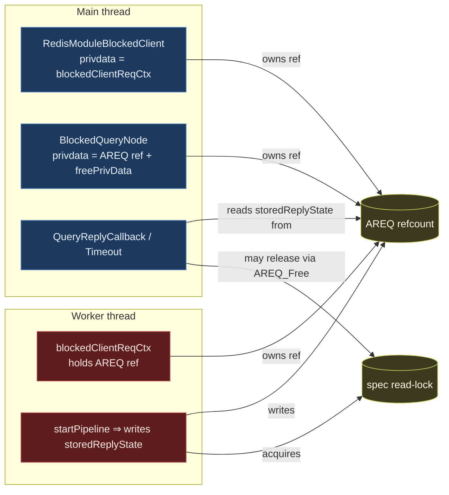
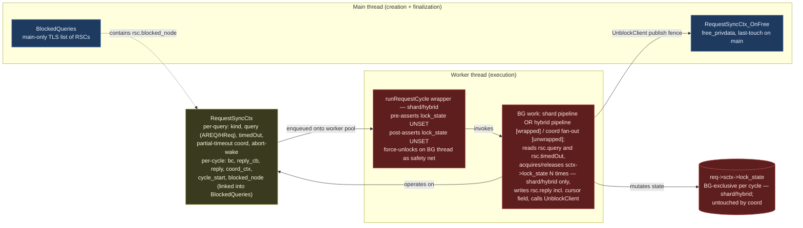
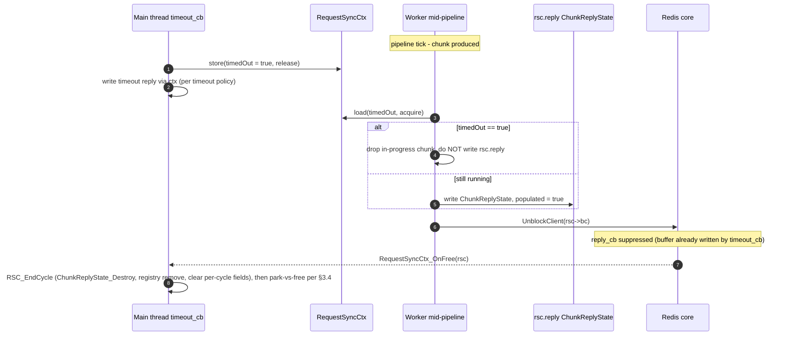

# Blocked-Client and Cross-Thread Ownership Refactor

> **Status:** Draft / RFC for team review.
> **Scope:** `RedisModule_BlockClient` callers, `BlockedQueries` registry, AREQ /
> HybridRequest cross-thread handoff, and spec-lock ownership across the
> main-thread / worker-thread boundary.
> **Non-scope:** the result-processor pipeline, the iterator tree, the spec
> rwlock semantics themselves (covered by [`sound_iterator_revalidation.md`][sir]).

[sir]: ./sound_iterator_revalidation.md

## TL;DR

Today, an `AREQ` (and its wrappers `MRCtx`, `blockedClientReqCtx`,
`BlockClientCtx`) is passed across the main / worker boundary with its
refcount split across three independent owners (blocked-client privdata,
`BlockedQueries` node, worker context). The spec read-lock can be acquired
on a worker and released on the main thread via `AREQ_Free`, which is
undefined behaviour for `pthread_rwlock_t`. This RFC replaces the implicit
ownership with two explicit roles plus one single-owner wrapper:

| Role | Owns | Lives on |
| --- | --- | --- |
| **`RequestSyncCtx`** | The query (AREQ or HybridRequest), per-query sync state (timedOut, partial-timeout coord, abort-wake), AND per-cycle handle (`bc`, `reply_cb`, `ChunkReplyState reply`, `blocked_node`, optional `coord_ctx`). Single-owner: Redis holds `RequestSyncCtx*` as `bc->privdata` during a cycle; `cursor->query` holds it between cycles. | Allocated on main at `RequestSyncCtx_New`. Per-cycle fields bound at `RSC_BeginCycle`, cleared at `RSC_EndCycle` (called from `OnFree`). Wrapper destroyed by `RequestSyncCtx_Free` from `OnFree`'s free branch (or `Cursor_Free` for a parked cursor). |
| **`SpecLockState`** (enum field on `sctx`) | The spec-lock state (replaces today's `RSContextFlags flags`). Stateful — supports multiple acquire/release per cycle, queryable mid-pipeline. **No new struct type — just a renamed enum field on `RedisSearchCtx`.** | Reached as `req->sctx->lock_state`. Whichever thread is currently driving the request owns it. For shard / hybrid cycles the BG thread is the sole accessor for the duration of the cycle (enforced by the `runRequestCycle` wrapper); for synchronous main-thread commands (e.g. `FT.EXPLAIN`) main is the sole accessor. |

`RequestSyncCtx` is the existing per-request struct (today embedded inside
`AREQ` / `HybridRequest`, holding `refcount`, `timedOut`, and the
partial-timeout coordination state). Step 0 **inverts** that containment:
the wrapper becomes the top-level container that owns the `AREQ` /
`HybridRequest`. Ownership of the wrapper is single-owner with explicit
transfer: `bc->privdata` owns it during a cycle, `cursor->query` owns
it between cycles, and the transfer happens on main under the cursor
mutex at `RSC_BeginCycle` and `OnFree`. The `refcount` field is
dropped — the cross-thread invariants it used to guarantee are now
provided by the Redis BlockedClient API's privdata-lifetime guarantee
(BG borrows during the
cycle) plus the existing `Cursor.delete_mark` mechanism (handles
`CURSOR DEL` / GC during in-flight). See §3.1.1.

`BlockedQueries` becomes a pure non-owning observer, registered at
`RSC_BeginCycle` and removed at `RSC_EndCycle`. `useReplyCallback` and
`storedReplyState` move off `AREQ` / `HybridRequest` onto the
`RequestSyncCtx`'s per-cycle fields, taking the existing
`ChunkReplyState` type with them.

The names align with existing conventions: `Blocked*` matches
`BlockedQueries` / `BlockedQueryNode`; `*Ctx` matches `MRCtx` /
`CoordRequestCtx` / `ConcurrentSearchBlockClientCtx`;
`SpecLockState` is just a rename of today's `RSContextFlags flags` field
on `sctx` (same role, same shape, with a per-cycle ownership invariant
imposed by the `runRequestCycle` wrapper); and
`ChunkReplyState` is the same struct as today, just relocated.
`RequestSyncCtx` keeps its existing name — only its containment direction
flips (see §3.2 and Step 0).

> **Note on the existing `BlockClientCtx`.** Today's `BlockClientCtx`
> (the init-parameter bag in `info_redis/block_client.h`) is deleted
> in step 2 — `RequestSyncCtx_New` + `RSC_BeginCycle` take their
> arguments directly. The per-cycle fields it carried now live on
> `RequestSyncCtx` (§3.2).

---

## 1. Background

### 1.1 Current cross-thread structs (inventory)

The following structs are passed across the main/worker boundary today.

| Struct | Defined in | Carries | Owners (today) |
| --- | --- | --- | --- |
| `AREQ` | `aggregate/aggregate.h` | Query, pipeline, results, `useReplyCallback`, `storedReplyState`, `sctx` (with spec lock state), refcount. | Worker ctx (`blockedClientReqCtx.req`), `BlockedQueryNode.privdata`, sometimes the cursor. |
| `HybridRequest` | `hybrid/hybrid_request.h` | Multiple `AREQ`s + tail pipeline. | Same shape as `AREQ`. |
| `blockedClientReqCtx` | `aggregate/aggregate_exec.c` | `AREQ*`, `RedisModuleBlockedClient*`, `RedisModuleCtx*`. | Allocated on main, consumed on worker. |
| `BlockClientCtx` | `info/info_redis/block_client.h` | reply/timeout callback ptrs, free-privdata ptr, timeout, `ast` (for diagnostic dump). | Stack-built on main, consumed during `RedisModule_BlockClient`. |
| `BlockedQueryNode` / `BlockedCursorNode` | `info/info_redis/types/blocked_queries.h` | `privdata` (an `AREQ*` ref), `freePrivData`, `spec` (`StrongRef`), query string. | Linked into a TLS list on the main thread; "non-owning" by comment, owning by code. |
| `MRCtx` | `coord/rmr/rmr.c` | Coordinator fan-out state, `RedisModuleBlockedClient*`. | Created on main, consumed by `uv` IO thread. |
| `CoordRequestCtx` | `module.c` (FT.SEARCH coord) | Coordinator-side request bag. | Created on main, consumed by `uv` IO thread. |
| `BCHCtx` | `hybrid/hybrid_exec.c` | Hybrid blocked-client wrapper. | Same shape as `blockedClientReqCtx`. |
| `ChunkReplyState` (inside `AREQ`) | `aggregate/aggregate.h` | BG-produced results, error copy, `cv`, `limit`, `cursor`, `hasStoredResults`. | Written by BG, read by main; lives on AREQ. |

### 1.2 Today's ownership graph



The two failure modes that have bitten us are visible here:

1. **Three independent refcounts on `AREQ`** with no single source of truth.
   The "transfer the ref by NULL-ing the source" pattern is used at multiple
   call-sites, and any missed transfer or double-decrement leaks or double-frees
   the request.
2. **The spec read-lock crosses threads.** It is acquired by the worker (inside
   `startPipeline`) and may end up being released by the main thread when
   `AREQ_Free` runs — a `pthread_rwlock` UB.

### 1.3 Concrete footguns, in code

- `req->storedReplyState.useReplyCallback` is mutated by `RSCursorReadCommand`
  on a cursor whose AREQ was previously left in the opposite mode — a write to
  shared state from the main thread between BG cycles.
- `BlockedQueryNode.freePrivData = AREQ_DecrRefWrapper`. The struct comment
  says "non-owning"; the code makes it an owner. This is the second of the
  three refcounts.
- `blockedClientReqCtx_destroy` performs four steps in a strict order
  (`MeasureTimeEnd` → `GetPrivateData` → `UnblockClient` → free our struct).
  Any reordering, or any path that frees the wrapper before unblocking, is a
  bug — and there is no compile-time check that prevents it.
- Coordinator queries (`module.c:4412`, `rmr.c:359`) are **not** registered in
  `BlockedQueries`, so a hung coordinator query is invisible to `FT.INFO` and
  the crash report.

---

## 2. Goals and non-goals

### 2.1 Goals

- A single-owner `RequestSyncCtx` per query, with ownership held by
  exactly one of `bc->privdata` or `cursor->query` at any instant.
  Transfers happen on main, under the cursor mutex, at exactly two
  sites (`RSC_BeginCycle` and `OnFree`). The unconstrained "transfer
  the ref by NULL-ing the source" pattern — scattered across many
  call-sites today — is replaced by a constrained two-site transfer.
  No refcounting on the wrapper, no separate per-cycle struct (the
  `RequestSyncCtx` carries the per-cycle fields directly).
- Spec-lock acquire and release on the **same** thread, enforced by a wrapper
  with a debug-only thread-id assertion. Cursor handoff is explicit, not implicit.
- One uniform path to `RedisModule_BlockClient` for query-shaped work, with
  `BlockedQueries` registration done through the same path so coordinator
  queries become visible to the watchdog.
- Reply-mode (inline vs. main-thread reply callback) is a per-cycle, immutable
  property of the `RequestSyncCtx`'s per-cycle fields — never a mutable
  field on the request itself.
- The `free_privdata` callback registered with `RedisModule_BlockClient`
  becomes the deterministic last-touch on the main thread; no more manual
  `MeasureTimeEnd` + `UnblockClient` + free-our-wrapper dance at every
  call-site. Throughout this doc the implementation hook is called
  `RequestSyncCtx_OnFree`; "the `free_privdata` callback" and
  "`OnFree`" refer to the same thing.

### 2.2 Non-goals

- Changing the result-processor pipeline, iterator tree, or the spec rwlock
  semantics themselves.
- Changing how coordinator fan-out talks to shards (`rmr` IO threads stay).
- Eliminating the worker-pool (`workersThreadPool_*`) or moving away from
  `libuv` for coordinator-side blocking.
- Touching the operational `RedisModule_BlockClient` callers in `gc.c` and
  `debug_commands.c` beyond moving them to the standard "always wire a free
  callback" pattern.

---

## 3. Proposed model

### 3.1 The two roles



- **`RequestSyncCtx`** is the singly-owned per-query context — there
  is no separate per-cycle struct. Redis holds the `RequestSyncCtx*`
  directly as `bc->privdata`; it exists from `RequestSyncCtx_New`
  through the `RequestSyncCtx_OnFree` (`free_privdata`) callback.
  Both endpoints run on the main thread.

  The struct has two field-validity classes (see §3.2):

  - **Per-query fields** — set at `RequestSyncCtx_New`, valid for the
    full lifetime: `kind`, the AREQ/HReq union, `timedOut`,
    partial-timeout coordination, abort-wake.
  - **Per-cycle fields** — set at `RSC_BeginCycle` and cleared at
    `RSC_EndCycle` (called from `OnFree`): `bc`, `reply_cb`, `reply`
    (`ChunkReplyState`), `blocked_node`, optional `coord_ctx`. For
    a non-cursor query these align with the per-query lifetime. For
    cursor reads they cycle through bound → unbound states, with the
    cursor mutex serializing the transitions.

  Reply mode is fixed *for the cycle* at `BeginCycle`: `reply_cb ==
  NULL` ⇒ inline reply, `reply_cb != NULL` ⇒ deferred reply. Cursor
  reads can pick a different mode per cycle (the previous mid-flight
  mutation in `RSCursorReadCommand` is gone — the choice is fixed
  once per cycle, at `BeginCycle`).
- **`SpecLockState`** is just a renamed field on the existing
  heap-allocated `RedisSearchCtx` (owned by `AREQ` via `req->sctx`).
  Today's `RSContextFlags flags` becomes `SpecLockState lock_state` —
  same enum shape (`UNSET` / `READ` / `WRITE`), no new struct type,
  no new API surface. The lock primitives
  (`RedisSearchCtx_LockSpecRead` / `_TryLockSpecRead` / `_LockSpecWrite`
  / `_UnlockSpec`) keep their signatures; their bodies just operate on
  `sctx->lock_state`. Multiple acquire/release transitions per cycle
  remain first-class (the existing `handleSpecLockAndRevalidate`,
  `UnlockSpec_and_ReturnRPResult`, and safe-loader unlock-and-relock
  patterns all keep working). Cross-thread safety comes from the
  **`runRequestCycle` wrapper** (see §3.5) — invoked on the worker pool
  thread for shard and hybrid pipelines: pre-asserts `lock_state ==
  UNSET` on cycle entry, runs the BG work, post-asserts `UNSET` before
  `UnblockClient` (with a same-thread force-unlock safety net for
  release builds). Coord queries don't use the wrapper — they never
  acquire the spec lock locally, so there's nothing to assert. Outside
  cycles (synchronous main-thread commands like `FT.EXPLAIN`), main
  is the legitimate accessor; the design imposes no thread-id check,
  only the cycle invariant.

#### 3.1.1 Single-owner ownership of the `RequestSyncCtx`

`RequestSyncCtx` is **not** refcounted. At any instant exactly one
holder owns it, and ownership is transferred at well-defined
main-thread sites under the cursor mutex. The two possible holders:

- `bc->privdata` — Redis-held during a cycle (lifetime guaranteed by
  the Redis BlockedClient API: `bc->privdata` is alive from
  `RM_BlockClient` until `OnFree` returns).
- `cursor->query` — set between cycles (lifetime managed by the cursor
  table and its `pthread_mutex`).

Why no refcount works: each cross-thread concern that *might* require
shared ownership turns out to be solved by an existing primitive.

| Concern | What handles it |
| --- | --- |
| BG ↔ main lifetime during a cycle | Redis BlockedClient API guarantees `bc->privdata` (the RSC) alive until `OnFree` returns. BG dereferences the RSC via `bc->privdata` freely; no ref needed. |
| Cursor ↔ in-flight cycle ownership | Single-owner-with-transfer at `RSC_BeginCycle` and `OnFree`. Cursor mutex serializes the transfer block against `Cursor_Free`. |
| `CURSOR DEL` / GC during in-flight cycle | The existing `delete_mark` flag on `Cursor` ([cursor.c:352](../../src/cursor.c#L352)). `Cursors_Purge` sets it when the cursor isn't idle; `OnFree`'s park branch checks it and converts to free if set. No new mechanism. |
| timeout_cb ↔ BG concurrent AREQ access | BlockedClient API lifetime guarantee covers timeout_cb too (it reaches the AREQ via the RSC). The partial-timeout CAS / condvar coordinates *who writes the reply*, not lifetime. |

**Ownership transfers** happen at exactly two sites, both on main,
both inside the cursor mutex:

```c
// In the cursor-read entry point, before RM_BlockClient:
RequestSyncCtx *rsc = cursor->query;     // cursor relinquishes during cycle
cursor->query = NULL;
RSC_BeginCycle(rsc, /* bc, reply_cb, blocked_node, ... */);
// ...later: RM_BlockClient(... privdata = rsc ...);

// In RequestSyncCtx_OnFree, the registered free_privdata callback:
RequestSyncCtx *rsc = privdata;
RSC_EndCycle(rsc);   // ChunkReplyState_Destroy, registry remove,
                     // clear bc / reply_cb / blocked_node / coord_ctx
if (cursor && !cursor->delete_mark
           && !(rsc->query.areq->stateflags & QEXEC_S_ITERDONE)) {
  cursor->query = rsc;          // transfer back to cursor (park)
  Cursor_Pause(cursor);
} else {
  RequestSyncCtx_Free(rsc);     // free path: destroys AREQ + wrapper
  if (cursor) Cursor_Free(cursor);
}
```

For initial WITHCURSOR queries: `Cursors_Reserve` (main, before
dispatch) creates the cursor entry with `cursor->query = NULL` — the
cursor exists in the registry but doesn't own the RSC yet. The
in-flight cycle owns the RSC (via `bc->privdata`) from
`RequestSyncCtx_New` through `OnFree`'s park branch, which is when
the cursor first acquires `query`. `CURSOR DEL` during this initial
cycle just sets `delete_mark`; `OnFree` converts park to free.

For standalone queries / hybrid-without-cursor: the cycle owns from
`New` through `OnFree`; the free branch always runs. `cursor` is NULL.

For coord queries: same as standalone — cycle owns; `OnFree` always
frees.

The "transfer the ref by NULL-ing the source" pattern that the refactor
retires is the *unconstrained* version — transfers scattered across
many call-sites, easy to miss or double-transfer. The two transfers
above are constrained: always main, always under the cursor mutex,
always at `RSC_BeginCycle` or `OnFree`. That's a state machine you
can audit by reading two functions.

So: BG borrows the RSC during a cycle (via `bc->privdata`), main
owns it via the BlockedClient API during the cycle and via
`cursor->query` between cycles, and the AREQ is freed when `OnFree`'s
free branch runs `RequestSyncCtx_Free`.

#### 3.1.2 Single-writer invariant

This is the safety property the rest of the design rests on. At any instant,
each cross-thread struct is touched by exactly one thread:

| Struct / field | Touched by main when… | Touched by worker when… |
| --- | --- | --- |
| `AREQ` / `HybridRequest` (owned by `RequestSyncCtx`) | Before dispatch (setup); and after `RequestSyncCtx_OnFree` returns iff `OnFree`'s free branch ran (the destructor runs inside `RequestSyncCtx_Free`). | Between dispatch and `UnblockClient`. Reached via `rsc->query.areq` / `.hreq`. |
| `bc->privdata` (the `RequestSyncCtx*` pointer Redis holds) | Set at `New`/`BeginCycle` when `RM_BlockClient` is called; read in `reply_cb` / `OnFree`. `OnFree` either transfers the pointer to `cursor->query` (park) or calls `RequestSyncCtx_Free` (free). All under the cursor mutex. | Reads via `RM_GetBlockedClientPrivateData(bc)` (or whatever the dispatch handed in) to reach the AREQ/HReq and load `timedOut`. Never written. |
| `RequestSyncCtx.timedOut` | Atomic store in `timeout_cb` (see §4.2). | Atomic load each pipeline tick. |
| `rsc.reply` (embedded `ChunkReplyState`) | Read by `reply_cb`; destroyed in `RSC_EndCycle` inside `OnFree` (both park and free branches). | Written before `UnblockClient`. The `UnblockClient` call is the publish fence; main reads only after it. |
| `rsc.bc`, `rsc.blocked_node`, `rsc.reply_cb`, `rsc.coord_ctx` | Per-cycle fields. Written in `RSC_BeginCycle`; cleared in `RSC_EndCycle` (called from `OnFree`). Read in `reply_cb` and `OnFree`. | Reads `bc` (for `UnblockClient`) and `reply_cb` (to decide whether to write `reply` inline or defer). Writes nothing. Between cycles these fields are NULL/zeroed and must not be read. |
| `sctx->lock_state` (`SpecLockState`) | **Never during a shard/hybrid cycle.** Reads in `OnFree` / `AREQ_Free` are pure `state == UNSET` assertions. (For synchronous main-thread commands like `FT.EXPLAIN` — outside any blocked-client cycle — main is the legitimate accessor; for coord queries the lock is never acquired at all.) | Acquire / release / state queries N times per cycle. The `runRequestCycle` wrapper (§3.5) bookends shard/hybrid cycles with `state == UNSET` assertions; the BG thread is the sole accessor between entry and exit. |

The single exception is the **timeout fence** between the timeout callback
(main) and the still-running worker. That window is described in §4.2 and is
the only place where shared access requires explicit synchronization
(`RequestSyncCtx.timedOut` atomic, `ChunkReplyState` discard rules).

### 3.2 Struct sketches

Illustrative; field names are finalized during the step that introduces each.

The reply-mode dichotomy used below (inline vs. deferred) is fully spelled
out in §4.1; the short version is *inline* ⇒ `reply_cb == NULL`, BG wrote
the reply via a thread-safe context before `UnblockClient`; *deferred* ⇒
`reply_cb != NULL`, BG populated `rsc.reply` and `reply_cb` will run on
main after `UnblockClient`.

`RequestSyncCtx` is the single struct that flows across the
main/worker boundary. There is no separate per-cycle "BlockedClientCtx"
type — the per-cycle fields live on `RequestSyncCtx` itself, with
explicit `RSC_BeginCycle` / `RSC_EndCycle` brackets that bound their
validity. For non-cursor queries the per-query and per-cycle scopes
coincide. For cursor reads they diverge: the per-query fields persist
across cycles via `cursor->query`; the per-cycle fields are bound at
`BeginCycle` and cleared at `EndCycle` (called from `OnFree`).

```c
// --- RequestSyncCtx ---------------------------------------------------------
// Single-owner per-query context. Holds the AREQ/HReq, the cross-thread sync
// state, AND the per-cycle "blocked client" handle (bc, reply, reply_cb,
// blocked_node). Redis holds RequestSyncCtx* as bc->privdata during a cycle.
//
// Ownership of the wrapper at any instant:
//   - bc->privdata (Redis-held during a cycle, alive until OnFree returns), or
//   - cursor->query (between cycles).
// Transfers happen on main under the cursor mutex at RSC_BeginCycle (cursor
// read) and OnFree (park or free). See §3.1.1.
//
// Step 0 promotes today's embedded `syncCtx` (inside AREQ / HybridRequest)
// to a heap-allocated wrapper that owns the query. The `refcount` field on
// the embedded struct is dropped (see §3.1.1 for why). The partial-timeout
// coordination (CAS + mutex/cond) and the abort-wake channel migrate
// verbatim. The per-cycle fields below are introduced in Step 2 (which used
// to introduce a separate BCC struct).
typedef enum {
  REQUEST_KIND_AREQ,    // query.areq is set
  REQUEST_KIND_HYBRID,  // query.hreq is set
} RequestKind;

typedef struct RequestSyncCtx {
  // ===== Per-query fields ================================================
  // Set at New. Valid for the wrapper's whole lifetime (potentially many
  // cursor cycles). Untouched by RSC_BeginCycle / RSC_EndCycle.

  RequestKind  kind;            // const after New
  union {
    AREQ          *areq;
    HybridRequest *hreq;
  } query;                      // owned; freed by RequestSyncCtx_Free

  RS_Atomic(bool)  timedOut;    // §4.2 cross-thread contract

  // Partial-timeout coordination, gated by `requiresAggregateResultsSync`.
  // The CAS claim grants exclusive ownership of the result-production
  // phase; the BG-thread winner runs AggregateResults, the timeout-cb
  // winner replies empty. Internal to the wrapper.
  bool                requiresAggregateResultsSync;
  RS_Atomic(bool)     aggregatingResults;
  bool                aggregateResultsDone;
  pthread_mutex_t     aggregateResultsLock;
  pthread_cond_t      aggregateResultsCond;

  // Abort-wake registration. BG reader (coord side) registers its blocking
  // MR channel; timeout_cb broadcasts on it after flipping `timedOut`.
  // Internal to the wrapper.
  struct MRChannel *abortWakeChannel;
  pthread_mutex_t   abortWakeLock;

  // ===== Per-cycle fields ================================================
  // Set in RSC_BeginCycle, cleared in RSC_EndCycle (called from OnFree).
  // Between cycles these are NULL/zeroed and MUST NOT be read.

  RedisModuleBlockedClient *bc;            // Redis-owned; valid for the cycle
  RedisModuleCmdFunc        reply_cb;      // NULL ⇒ inline mode; non-NULL ⇒
                                           // deferred. Fixed for the cycle. §4.1
  ChunkReplyState           reply;         // BG-populated in deferred mode; one
                                           // slot for AREQ + Hybrid.
                                           // ChunkReplyState_Destroy runs in
                                           // RSC_EndCycle.
  void                     *coord_ctx;     // MRCtx* / CoordRequestCtx* for coord
                                           // paths; NULL for shard.
  time_t                    cycle_start;   // when the current cycle began;
                                           // FT.INFO / crash report read this.

  // ===== BlockedQueries linkage (per-cycle) ==============================
  // The RSC itself is linked into BlockedQueries.queries or .cursors based
  // on `kind`. No separate node type — see §5. List is main-only TLS-guarded,
  // mutated via plain DLLIST_PREPEND / _REMOVE with no extra locking.

  DLLIST_node               blocked_node;
} RequestSyncCtx;

RequestSyncCtx *RequestSyncCtx_NewAREQ(AREQ *areq);
RequestSyncCtx *RequestSyncCtx_NewHybrid(HybridRequest *hreq);

// Bind the per-cycle fields and link rsc into BlockedQueries.
// Caller must follow with RM_BlockClient using rsc as privdata.
void RSC_BeginCycle(RequestSyncCtx *rsc, RedisModuleBlockedClient *bc,
                    RedisModuleCmdFunc reply_cb, void *coord_ctx);

// Unlink from BlockedQueries, run ChunkReplyState_Destroy, clear the
// per-cycle fields. Called by OnFree on both park and free branches
// before deciding what to do with the wrapper.
void RSC_EndCycle(RequestSyncCtx *rsc);

// Kind-dispatching accessors. Most call-sites don't need to know whether
// a given RSC wraps an AREQ or a HybridRequest — they reach the AREQ via
// these helpers. Future Rust port replaces them with `match`.
static inline RedisSearchCtx *RSC_SearchCtx(RequestSyncCtx *rsc) {
  return rsc->kind == REQUEST_KIND_AREQ
         ? rsc->query.areq->sctx
         : rsc->query.hreq->sctx;
}
AREQ *RSC_AsAREQ(RequestSyncCtx *rsc);                 // NULL if hybrid
void  RSC_ForEachAREQ(RequestSyncCtx *rsc,             // dispatches over
                      void (*fn)(AREQ *, void *ud),    // sub-AREQs for hybrid;
                      void *ud);                       // single AREQ otherwise

// Destroys per-query state + AREQ/HReq + wrapper. Called only from
// OnFree's free branch (or Cursor_Free for a parked cursor).
void RequestSyncCtx_Free(RequestSyncCtx *rsc);

// The free_privdata callback registered with RM_BlockClient. Runs on main.
// Calls RSC_EndCycle, then either transfers rsc to cursor->query (park) or
// calls RequestSyncCtx_Free (free). All under the cursor mutex.
void RequestSyncCtx_OnFree(void *privdata);
```

The worker pool takes a `RequestSyncCtx *` directly. The worker only
touches `rsc->query` (AREQ/HReq), `rsc->timedOut` (atomic poll),
`rsc->reply` (write in deferred mode), `rsc->reply_cb` (mode check),
and `rsc->bc` (`UnblockClient`). It never touches `rsc->blocked_node`,
`rsc->coord_ctx`, or `rsc->cycle_start`, does not mutate any ownership
pointer, and never touches `rsc` after `UnblockClient`.

```c
// --- SpecLockState ----------------------------------------------------------
// Renamed `RSContextFlags flags` field on RedisSearchCtx. No new struct type,
// no new API surface — just a clearer name for the same per-request lock
// state, with a cycle-boundary invariant imposed by runRequestCycle (§3.5).
typedef enum {
  SPEC_LOCK_UNSET,
  SPEC_LOCK_READ,
  SPEC_LOCK_WRITE,
} SpecLockState;

// On RedisSearchCtx (heap-allocated, owned by AREQ via req->sctx; unchanged
// from today): replace `RSContextFlags flags` with `SpecLockState lock_state`.
```

The existing lock-API call-sites (`RedisSearchCtx_LockSpecRead`,
`_UnlockSpec`, `_TryLockSpecRead`, `_LockSpecWrite`) keep their
signatures; their bodies are essentially today's bodies with
`ctx->flags = RS_CTX_*` rewritten as `ctx->lock_state = SPEC_LOCK_*`.
Code that today reads `sctx->flags == RS_CTX_UNSET` reads
`sctx->lock_state == SPEC_LOCK_UNSET` instead. The ~89 callers of the
lock APIs and the ~225 `->sctx` field accesses are not churned beyond
this rename.

### 3.3 Lifetime / ownership of one cycle (no cursor)

```mermaid
sequenceDiagram
  autonumber
  participant Main as Main thread
  participant Pool as Worker pool
  participant Worker as Worker thread
  participant Redis as Redis core

  Main->>Main: RequestSyncCtx_NewAREQ(areq)  [rsc owns the AREQ; per-cycle fields zero]
  Main->>Main: register in BlockedQueries → blocked_node
  Main->>Main: RSC_BeginCycle(rsc, bc, reply_cb, blocked_node)  [per-cycle fields bound]
  Main->>Redis: RM_BlockClient(... privdata = rsc, free_privdata = RequestSyncCtx_OnFree ...)
  Main->>Pool: enqueue rsc
  Pool->>Worker: dispatch
  Worker->>Worker: runRequestCycle entry: assert sctx->lock_state == UNSET
  Worker->>Worker: run pipeline on rsc->query.areq  [pipeline acquires/releases sctx->lock_state N times; writes rsc.reply incl. cursor field if deferred]
  Worker->>Worker: runRequestCycle exit: assert lock_state == UNSET (force-unlock-on-worker if violated)
  Worker->>Redis: RedisModule_UnblockClient(rsc->bc, rsc)
  Note right of Worker: BG drops its rsc pointer here.<br/>rsc still alive, held by Redis as bc->privdata.
  Redis-->>Main: reply_cb(rsc)  [iff reply_cb != NULL; reads rsc.reply, writes the wire reply]
  Redis-->>Main: RequestSyncCtx_OnFree(rsc)  [free_privdata]
  Main->>Main: RSC_EndCycle(rsc) — DLLIST_REMOVE(blocked_node), ChunkReplyState_Destroy, clear bc / reply_cb / coord_ctx
  Main->>Main: cursor == NULL → RequestSyncCtx_Free(rsc)  [destroys AREQ + wrapper]
```

The two key invariants visible above:

- **All spec-lock acquire/release happens on the same BG thread.**
  `lock_state` lives on `sctx`; the BG thread mutates it freely during
  the pipeline. The `runRequestCycle` wrapper asserts `lock_state ==
  UNSET` on cycle entry and again on cycle exit before `UnblockClient`.
  If the post-assert catches a held lock, the safety net force-unlocks
  **on the same BG thread**, so the cross-thread unlock UB is
  structurally impossible. Main does not touch `lock_state` during a
  shard/hybrid cycle (the cycle invariant); outside cycles main is the
  legitimate accessor for synchronous commands.
- **`RequestSyncCtx_OnFree` is the single, deterministic, last-touch on
  the main thread.** Everything that needs to happen on main happens
  there. It always calls `RSC_EndCycle` first (clears per-cycle
  fields, destroys the `ChunkReplyState`, removes the registry node).
  Then for non-cursor cycles it runs the free branch:
  `RequestSyncCtx_Free(rsc)` destroys both the AREQ/HReq and the
  wrapper. For cursor cycles it either transfers the wrapper to
  `cursor->query` (park) or runs `RequestSyncCtx_Free` (free). The
  decision is made under the cursor mutex (see §3.4).

### 3.4 Lifetime / ownership of a cursor read

A cursor outlives many `CURSOR READ` cycles. Between cycles the cursor
**owns** the `RequestSyncCtx` via `cursor->query` (a single-owner
pointer); the wrapper's per-cycle fields (`bc`, `reply_cb`, `reply`,
`blocked_node`, `coord_ctx`) are NULL/zeroed and must not be read.
There is no in-flight BG, no spec lock. Each `CURSOR READ` cycle
starts on main:

```c
// Cursor read entry point, under the cursor mutex:
RequestSyncCtx *rsc = cursor->query;
cursor->query = NULL;                // cursor relinquishes for the cycle
RSC_BeginCycle(rsc, bc, reply_cb,    // bind per-cycle fields
               blocked_node, coord_ctx);
// caller proceeds to RM_BlockClient(... privdata = rsc ...)
```

The cycle runs. `OnFree` on main, also under the cursor mutex, runs
`RSC_EndCycle` (clears per-cycle fields, destroys `ChunkReplyState`,
removes the registry node) and then either transfers the wrapper
back to the cursor (park) or frees it (exhaust):

```c
// In RequestSyncCtx_OnFree (under cursor mutex):
RequestSyncCtx *rsc = privdata;
RSC_EndCycle(rsc);
if (cursor && !cursor->delete_mark
           && !(rsc->query.areq->stateflags & QEXEC_S_ITERDONE)) {
  cursor->query = rsc;                 // park
  Cursor_Pause(cursor);
} else {
  RequestSyncCtx_Free(rsc);            // free; destroys wrapper + AREQ
  if (cursor) Cursor_Free(cursor);
}
```

Both transfers run on main under the cursor mutex. The pre-existing
`Cursor.delete_mark` flag is what handles `CURSOR DEL` / GC firing
during an in-flight cycle: `Cursors_Purge` ([cursor.c:352](../../src/cursor.c#L352))
sets `delete_mark` when the cursor is not idle; `OnFree`'s park branch
checks it and falls through to free. No new defensive mechanism is
needed.

The spec read-lock is acquired and released **independently** in each
cycle, just like the no-cursor path in §3.3. This matches the current
behaviour described in [`sound_iterator_revalidation.md`][sir] §1.2 (the
lock is released between batches and the iterator tree revalidates on
re-acquire).

The cursor itself can disappear in three ways:

1. The reading client issues `CURSOR DEL` (explicit free) — main.
2. The cursor's idle timeout fires and the cursor GC frees it — main.
3. A `CURSOR READ` cycle determines that the iterator is exhausted and
   the cursor is freed at the end of that cycle (`OnFree`'s free
   branch).

Cases 1 and 2 between cycles: cursor owns RSC; `Cursor_Free` runs
`RequestSyncCtx_Free(cursor->query)` and removes the cursor from the
registry. Cases 1 and 2 *during* an in-flight cycle: cycle owns RSC
(via `bc->privdata`), `cursor->query` is NULL; `Cursors_Purge` sets
`delete_mark` and the cursor's registry entry stays until `OnFree`
cleans it up. Case 3 is the `OnFree` free branch above.

For initial WITHCURSOR queries, today's `AREQ_StartCursor`
([aggregate_exec.c:1790](../../src/aggregate/aggregate_exec.c#L1790))
calls `Cursors_Reserve` on **main** before dispatching to BG, so
`r->cursor_id` is set on main before the cycle starts. The cursor
exists in the registry from that point with `cursor->query == NULL`
(the cycle owns the RSC); the first ownership transfer to the cursor
happens at the first `OnFree` park branch. CURSOR DEL during the
initial cycle just sets `delete_mark`; OnFree converts park to free.

```mermaid
sequenceDiagram
  autonumber
  participant Main as Main thread
  participant W1 as BG cycle N (initial query)
  participant Curs as Cursor parked between cycles
  participant W2 as BG cycle N+1 (CURSOR READ)
  participant GC as Cursor GC or DEL on main

  Note over Main: Initial query with WITHCURSOR
  Main->>Main: RequestSyncCtx_NewAREQ(areq)  [per-cycle fields zero]
  Main->>Main: Cursors_Reserve → cursor exists in registry with cursor.query = NULL  [cursor.id known]
  Main->>Main: RSC_BeginCycle(rsc, bc, reply_cb, blocked_node, ...)
  Main->>Main: RM_BlockClient(privdata = rsc, free_privdata = RequestSyncCtx_OnFree)
  Main->>W1: enqueue rsc
  W1->>W1: runRequestCycle: pre-assert UNSET, run pipeline, post-assert UNSET
  W1->>W1: pipeline observes !ITERDONE; stashes cursor in rsc.reply.cursor for deferred-mode reply_cb
  W1->>Main: UnblockClient(rsc)
  Main->>Main: reply_cb: serialize rsc.reply (with cursor.id)
  Main->>Main: OnFree (under cursor mutex): RSC_EndCycle; cursor.query = rsc; Cursor_Pause(cursor)
  Note over Curs: Cursor owns rsc via cursor.query.<br/>Per-cycle fields zero. No lock, no in-flight cycle.

  Note over Main: Subsequent CURSOR READ
  Main->>Main: rsc = cursor.query; cursor.query = NULL  [under cursor mutex]
  Main->>Main: RSC_BeginCycle(rsc, bc, reply_cb, blocked_node, ...)
  Main->>Main: RM_BlockClient(privdata = rsc, ...)
  Main->>W2: enqueue rsc
  W2->>W2: runRequestCycle: pre-assert UNSET, run pipeline, post-assert UNSET
  W2->>W2: pipeline observes ITERDONE iff exhausted; stashes cursor in rsc.reply.cursor
  W2->>Main: UnblockClient(rsc)
  Main->>Main: reply_cb: serialize rsc.reply
  alt iterator exhausted (or delete_mark set)
    Main->>Main: OnFree (free branch): RSC_EndCycle; RequestSyncCtx_Free(rsc); Cursor_Free(cursor)
  else more chunks
    Main->>Main: OnFree (park branch): RSC_EndCycle; cursor.query = rsc; Cursor_Pause(cursor)
  end

  Note over GC: Independent: CURSOR DEL or idle GC
  GC->>Curs: Cursor_Free(cursor) when parked  [RequestSyncCtx_Free(cursor.query); cursor mutex serializes]
  Note right of GC: If a cycle is concurrently in flight, cursor.query is NULL there;<br/>Cursors_Purge sets delete_mark instead, OnFree handles the free.
```

Invariants:

- **Single owner at all times.** Either `bc->privdata` (during a cycle)
  or `cursor->query` (between cycles) points at the RSC — never both,
  never neither while the cursor exists. Transfers happen at
  `RSC_BeginCycle` (cursor → cycle) and `OnFree` (cycle → cursor or
  destroy), both on main, both under the cursor `pthread_mutex`.
- **`delete_mark` handles the in-flight CURSOR DEL race.** Set by
  `Cursors_Purge` when the cursor isn't idle; checked by `OnFree`'s
  park branch and by `Cursor_Pause` ([cursor.c:278-280](../../src/cursor.c#L278-L280));
  if set, the cursor entry is freed instead of parked.
- **`RSC_EndCycle` resets per-cycle state on both branches.** It
  unlinks `blocked_node`, runs `ChunkReplyState_Destroy(&rsc->reply)`,
  and clears `bc` / `reply_cb` / `coord_ctx`. After it returns the
  wrapper is in the same shape it had after `RequestSyncCtx_New`, so
  the next cycle (or the parked cursor) sees no stale state.
- **`lock_state` is always `UNSET` between cycles.** `runRequestCycle`
  enforces this with pre/post assertions; the lock is never held
  across cycles.
- **`AREQ_Free` does not touch the spec lock.** It runs only from
  `RequestSyncCtx_Free`, called from `OnFree`'s free branch or
  `Cursor_Free` on a parked cursor — both on main, after the publish
  fence, with `lock_state == UNSET` already guaranteed. The silent
  "if locked, unlock" branch in today's `AREQ_Free` is deleted.

The cursor mechanics above apply uniformly whether the wrapped
request is a shard query, a hybrid query, or a coord-side query
(`_FT.HYBRID WITHCURSOR` and similar coord cursors flow through the
same `cursor->query` ↔ `bc->privdata` transfer; the `lock_state`
piece is simply trivial for coord since the lock is never acquired).

> **Future improvement (out of scope).** If profiling shows that the
> revalidate cost between consecutive cursor reads is significant, a separate
> change can introduce an opt-in "hold lock across reads" mode. That would
> require lock state to persist across cycles (and a different ownership story)
> and is deliberately not part of this refactor; the goal here is
> correctness, not the optimization.

### 3.5 The `runRequestCycle` wrapper

`runRequestCycle` is a narrow scope on the worker-pool thread for
**shard and hybrid pipelines**. It bookends the BG work with
`lock_state == UNSET` assertions, plus a same-thread force-unlock
safety net. It doesn't manage `rsc` fields and doesn't call
`UnblockClient` — the BG work does that itself.

```c
typedef void (*RequestBgFn)(RequestSyncCtx *rsc);

void runRequestCycle(RequestSyncCtx *rsc, RequestBgFn run_bg) {
  RedisSearchCtx *sctx = RSC_SearchCtx(rsc);
  RS_ASSERT(sctx->lock_state == SPEC_LOCK_UNSET);
  run_bg(rsc);   // existing pipeline; calls UnblockClient internally
  if (sctx->lock_state != SPEC_LOCK_UNSET) {
    RS_ASSERT(0 && "BG left spec lock held");
    RedisSearchCtx_UnlockSpec(sctx);   // safety net, same thread
  }
}
```

The two `run_bg` bodies:

- **Shard query** — `runPipeline(areq)`. The pipeline acquires and
  releases the lock per the existing patterns
  (`handleSpecLockAndRevalidate`, `UnlockSpec_and_ReturnRPResult`,
  safe-loader unlock-and-relock).
- **Hybrid query** — sub-AREQ runs + tail merge over one shared
  `sctx` (per [`sound_iterator_revalidation.md`][sir] §1.2).

**Coord queries skip the wrapper** — coord-side BG work never
acquires the spec lock, so the assertions would be no-ops. Coord
just constructs an RSC, registers, dispatches via libuv, and calls
`UnblockClient` from the reply handler (Step 5).

What this gives us:

- **No cross-thread unlock UB.** The force-unlock runs on the BG
  thread that took the lock — never on main.
- **Loud failure on leaks.** Today's `AREQ_Free` "if locked, unlock"
  silently papered over leaks (and sometimes ran cross-thread). The
  new safety net asserts in debug, recovers in release.
- **No guard/token plumbing.** Pipeline code still reads / mutates
  `sctx->lock_state` directly; iterators and RPs are unchanged (PR
  #8947 already removed the iterator-`sctx` dependency).

---

## 4. Reply-mode contract

### 4.1 Mode is fixed at construction

Two facts about `RedisModule_BlockClient` are load-bearing:

1. The free callback (if registered) is called on the main thread **after**
   the reply or timeout callback returns, and always after `UnblockClient`.
2. The reply callback fires **iff** the BG did not write to the reply buffer
   before `UnblockClient` (i.e. did not call any `RM_ReplyWith*` on a thread-
   safe context).

These translate directly into the `RequestSyncCtx`'s per-cycle
`reply_cb` field. The mode is encoded as `reply_cb == NULL` (inline)
vs. `reply_cb != NULL` (deferred), is fixed for the cycle at
`RSC_BeginCycle`, and is read-only thereafter — there is no separate
boolean flag to keep in sync. Different cycles for the same cursor
can pick different modes; the choice is fixed once per cycle.

| Mode | `reply_cb` | BG contract | Main contract |
| --- | --- | --- | --- |
| **Inline** | `NULL` | Must call `RM_ReplyWith*` via `GetThreadSafeContext(bc)` before `UnblockClient`. Must not write to `rsc.reply`. | Only `OnFree` runs; nothing to serialize. |
| **Deferred** | non-NULL | Must populate `rsc.reply` (a `ChunkReplyState`) and **not** touch any thread-safe reply context. | `reply_cb(rsc)` reads the reply state and serializes. Then `OnFree`. |

**Inline mode requires `timeout_ms == 0`.** Once the BG has begun writing to
the reply buffer there is no safe way to abort and emit a timeout reply
instead — Fact 2 says the timeout-reply path would be a no-op (the buffer is
already touched), and the BG cannot tell whether the client is still around.
`RSC_BeginCycle` asserts that `reply_cb == NULL` implies
`timeout_ms == 0`. All current shard query paths use deferred mode; only
operational fire-and-forget paths use inline. None of the inline callers have
timeouts today, so this rule costs nothing.

Two debug-only enforcement hooks make Fact 2 violations crash loudly:

- `RSC_BeginInlineReply(rsc)` is the only way for BG code to obtain a
  thread-safe reply context. It increments a debug counter on the
  `RequestSyncCtx` (and asserts `rsc->reply_cb == NULL`).
- `RequestSyncCtx_OnFree` asserts:
  - if `rsc->reply_cb == NULL` then `rsc->reply.populated == false`
    and the inline-reply counter is `> 0`;
  - if `rsc->reply_cb != NULL` then `rsc->reply.populated == true`
    *or* the request bailed without producing results — i.e. a hard
    timeout fired (`rsc->timedOut == true`, see §4.2) *or* the
    partial-timeout coordination resolved with the timeout-cb winner
    replying empty (see §3.2's note on
    `requiresAggregateResultsSync`). The inline-reply counter must be
    `0`.

Today's `useReplyCallback` field on `AREQ` is **deleted**. Every place
that reads it switches to `(rsc->reply_cb == NULL)` (via the worker's
pointer to the `RequestSyncCtx` during execution; see step 4 of the
migration plan).

### 4.2 The timeout race window

The single legitimate window where main and BG threads are simultaneously
live around the same request is between **timeout_cb firing** and the BG
calling `UnblockClient`. This subsection enumerates exactly what each thread
may touch in that window, and what synchronizes them.



Cross-thread synchronization contract in this window. The wrapper may use
additional internal coordination (the partial-timeout CAS/condvar described
in §3.2) which is encapsulated inside `RequestSyncCtx` and not part of this
contract; the table below enumerates only the touches the design relies on:

| Field | Main may | Worker may | Synchronization |
| --- | --- | --- | --- |
| `rsc->timedOut` | Store `true` once. | Load each pipeline tick. | Atomic acquire/release. |
| `rsc->reply` (`ChunkReplyState`) | **Not touch.** Reads only happen in `reply_cb` and destruction in `RSC_EndCycle`, both after the `UnblockClient` fence. | Write iff `timedOut == false` after acquire-load. | Publish-via-`UnblockClient`. |
| `rsc->bc` | Read by `OnFree` only. | Read for `UnblockClient`. | Redis API guarantees `bc` is valid until `OnFree` returns. |
| `AREQ` pipeline state (reached via `rsc->query.areq` / `.hreq`) | **Not touch.** `timeout_cb` must not read pipeline stats or iterator state — only metadata pre-stamped at `New` (snapshotted into the registry node, see §5). | Free use; this is the worker's exclusive territory. | Single-writer (only worker). |
| `req->sctx->lock_state` | **Not touch.** Calling any lock primitive from `timeout_cb` is forbidden — the BG thread is the sole accessor during a shard/hybrid cycle. | Acquire/release/state queries during the pipeline. Any bail-out triggered by `timedOut == true` must release the lock before returning to `runRequestCycle`. | BG-thread-exclusive within the cycle. timeout_cb and `lock_state` share no state — they coexist concurrently without coordination. |

Forbidden shared touches:

- `timeout_cb` **must not** read the AREQ's pipeline state. If it needs
  per-query metadata (index name, query string, partial counters), that
  metadata is snapshotted into the registry node at `New`. This is the same
  rule that makes §5's `BlockedQueries` keep its own copy of the index name
  and query string.
- `timeout_cb` **must not** call any lock primitive during a shard/hybrid
  cycle. `lock_state` is BG-thread-exclusive within the cycle.
  timeout_cb's job is to set `timedOut`, optionally write the timeout
  reply, optionally drive the partial-timeout CAS (§3.2), and optionally
  broadcast on the abort-wake channel — none of which interact with the
  spec lock.
- The BG thread **must release the spec lock before bailing** on
  `timedOut == true`. The bail-out is a normal pipeline exit and goes
  through the existing release paths; the `runRequestCycle` post-assertion
  catches any path that forgets.
- The worker **must not** call any `RM_ReplyWith*` after observing
  `timedOut == true`, because the buffer already holds the timeout reply.
  (In deferred mode the worker never replies inline anyway, so this is just
  a comment for future maintainers.)
- The worker **must not** assume `timedOut == false` once it is observed
  false; the next load may flip. Each pipeline tick re-checks.

The `OnFree` assertion is loosened by this section: in deferred mode,
`OnFree` accepts `rsc->reply.populated == false` *if and only if*
`rsc->timedOut == true`. That is the documented "BG bailed because of
timeout" path.

---

## 5. `BlockedQueries` is a list of `RequestSyncCtx`s

Today `BlockedQueryNode.privdata` is an `AREQ*` reference and
`BlockedQueryNode.freePrivData = AREQ_DecrRefWrapper` — the registry
is one of three AREQ owners. After the refactor the registry stops
being an owner *and* stops being a separate type: the
`RequestSyncCtx` itself is what's linked into the list, via the
`blocked_node` `DLLIST_node` field on RSC (§3.2). No `BlockedNode`
struct, no `BlockedQueryNode` / `BlockedCursorNode`, no
`AddNode` / `RemoveNode` API.

```c
// In RSC_BeginCycle (main, before RM_BlockClient):
BlockedQueries *bq = MainThread_GetBlockedQueries();
DLLIST *list = (rsc->kind == REQUEST_KIND_AREQ &&
                AREQ_RequestFlags(rsc->query.areq) & QEXEC_F_IS_CURSOR)
               ? &bq->cursors : &bq->queries;
rsc->cycle_start = time(NULL);
DLLIST_PREPEND(list, &rsc->blocked_node);

// In RSC_EndCycle (main, inside OnFree):
DLLIST_REMOVE(&rsc->blocked_node);
```

Both calls are plain pointer ops — no allocation, no mutex (the list
is main-only via the TLS sentinel below).

### 5.1 Snapshot fields are gone; spec name uses a fallback

Today's `BlockedNode` carries owned `index_name` / `query` strings so
the watchdog can print them after a spec drop without dereferencing
freed memory. With RSC linked into the list directly, the walker
reads through `rsc->query.areq->sctx->spec` instead. Two cases:

- **Spec alive.** Read `IndexSpec_FormatName(spec, ...)` and
  `areq->query` directly. Same output as before.
- **Spec was dropped while in flight.** `areq->sctx->spec` is NULL
  (the StrongRef destructor zeroed it). The walker prints
  `"<DELETED>"` for the index name and elides the query string.

```c
// FT.INFO / crash-report formatter:
const char *blocked_format_index_name(const RequestSyncCtx *rsc) {
  AREQ *areq = (rsc->kind == REQUEST_KIND_AREQ)
               ? rsc->query.areq
               : rsc->query.hreq->requests[0];
  IndexSpec *spec = areq->sctx ? areq->sctx->spec : NULL;
  return spec ? IndexSpec_FormatName(spec, RSGlobalConfig.hideUserDataFromLog)
              : "<DELETED>";
}
```

The walker's safety rests on two claims, the first of which already
holds and the second of which Step 3 must verify:

- **The RSC is in the list only between `RSC_BeginCycle` and
  `RSC_EndCycle`.** During that window the AREQ and its `sctx` are
  intact — `RequestSyncCtx_Free` runs *after* `EndCycle`.
- **`sctx->spec` is either alive or NULL.** Today
  `RedisSearchCtx::spec` is a plain `IndexSpec*` and the spec-drop
  path doesn't necessarily NULL it. Step 3's acceptance must
  confirm one of: (a) the existing ref machinery (StrongRef on the
  AREQ / sctx) keeps `sctx->spec` valid for the in-flight RSC's
  whole lifetime, or (b) we add an explicit NULL'ing of
  `sctx->spec` in the spec-drop path. The fallback is benign only
  if reads cannot dereference freed memory.

Coord-side RSCs register too, so coordinator queries become visible
to the watchdog — a functional gain.

### 5.2 The `pthread_key_t` for `BlockedQueries`

The list is conceptually process-wide — there's logically one list of
all in-flight RSCs. It's stored under a `pthread_key_t` (see
[main_thread.c:21-46](../../src/info/info_redis/threads/main_thread.c#L21-L46))
as a **main-thread-only sentinel**: only the main thread calls
`MainThread_InitBlockedQueries()` and gets a non-NULL list back; any
other thread calling `MainThread_GetBlockedQueries()` returns NULL.
The non-NULL check is exploited as a thread-discrimination guard
([block_client.c:43-44](../../src/info/info_redis/block_client.c#L43-L44)).

Three properties:

1. **No mutex on the list.** Only main mutates it.
2. **Off-main calls crash loudly** instead of silently corrupting.
3. **Crash-safe iteration.** A watchdog signal handler runs in main
   context and walks the list without locking — locking inside a
   signal handler would be unsafe.

The refactor preserves this pattern. Registration and removal stay
main-only; the BG thread never touches `BlockedQueries`. Coord-side
RSCs get registered on main before the libuv fan-out is dispatched —
the coord IO thread doesn't reach the registry either.

The `_FreeAREQ` / `FreeQueryNode` shim functions in `block_client.c`
and `aggregate_exec.c` are deleted — there's no privdata for them to
free.

---

## 6. Per-callsite migration

The eight `RedisModule_BlockClient` call-sites in `src/` (excluding tests and
`rmutil`) split into three shapes:

| Callsite | Today | After refactor |
| --- | --- | --- |
| `info_redis/block_client.c::BlockQueryClientWithTimeout` | Wraps `BlockClient` + adds `BlockedQueryNode` w/ AREQ ref | `rsc = RequestSyncCtx_NewAREQ(areq); RSC_BeginCycle(rsc, bc, reply_cb, NULL /*coord_ctx*/); RM_BlockClient(... privdata=rsc, free_privdata=RequestSyncCtx_OnFree ...)`. `BeginCycle` links `&rsc->blocked_node` into `BlockedQueries.queries` itself. |
| `info_redis/block_client.c::BlockCursorClientWithTimeout` | Same shape, cursor flavour | `rsc = cursor->query; cursor->query = NULL;` (under cursor mutex), then `RSC_BeginCycle(...)` and `RM_BlockClient(...)` as above. `BeginCycle` links `&rsc->blocked_node` into `BlockedQueries.cursors`. |
| `coord/rmr/rmr.c::MR_Fanout` (line 359) | `BlockClient(unblockHandler, timeoutHandler, freePrivDataCB, queryTimeout)`; `MRCtx` owns `bc` | `RequestSyncCtx_NewAREQ` + `RSC_BeginCycle` + `RM_BlockClient`. The coord-side reader is itself an AREQ / HybridRequest with a `syncCtx` (used for `RequestSyncCtx_RegisterAbortWakeChannel`), so the same RSC wraps it just like the shard path. The `MRCtx` lives on `rsc->coord_ctx`, freed from `OnFree` after `RequestSyncCtx_Free`. Coord queries gain `BlockedQueries` visibility. |
| `module.c::DistSearchBlockClientWithTimeout` (line 4412) | `BlockClient(DistSearchUnblockClient, timeoutCallback, freePrivDataCallback, queryTimeout)` | Same as `MR_Fanout` — RSC wraps the coord-side AREQ, `CoordRequestCtx` lives on `rsc->coord_ctx`. Privdata-smuggling hack removed; coord queries gain visibility. |
| `concurrent_ctx.c:122` (`ConcurrentCmdCtx`) | Generic-shaped block-client via `ConcurrentSearchBlockClientCtx`; no registry | Reuse the existing `ConcurrentSearchBlockClientCtx` machinery as the "operational" path. The only change here is to require a non-NULL `free_privdata` (no semantic shift). |
| `debug_commands.c:888,986`, `gc.c:107,187`, `rmr.c:539,569` | `BlockClient(NULL/cb, NULL, NULL/cb, 0)` | Migrate to `ConcurrentSearchBlockClientCtx`. The NULL-callbacks fire-and-forget pattern (`rmr.c:569`) folds into here by supplying a `free_privdata` that frees the small ctx struct. |

There are deliberately **two** distinct entry points after the refactor:

1. **`RequestSyncCtx_New` + `RSC_BeginCycle`** — for query-shaped work.
   Owns (or transferred from a cursor) the AREQ/HReq, carries a
   `ChunkReplyState`, registers in `BlockedQueries`. `RM_BlockClient`
   uses `rsc` as privdata and `RequestSyncCtx_OnFree` as
   `free_privdata`.
2. **The existing `ConcurrentSearchBlockClientCtx`** — for non-query
   operational work (GC, debug commands, cluster-info). No query, no reply
   state, no registry. Today this struct exists in `concurrent_ctx.h`; the
   refactor just routes the `NULL`-callback / `BlockClient`-direct call-sites
   through it instead of inventing a new helper.

The only discipline both share is "always wire a non-NULL `free_privdata`
for your privdata."

The `BlockClientCtx` init-bag (with `replyCallback`, `timeoutCallback`,
`free_privdata`, `timeoutMS`, `ast`) in `info_redis/block_client.h` is
**deleted in step 2**. `RSC_BeginCycle` takes its arguments directly,
and there is no separate `BlockedClientCtx` type to introduce — the
per-cycle fields live on `RequestSyncCtx` itself (§3.2).

---

## 7. Migration plan

Each step is a self-contained PR; downstream steps assume previous ones
merged unless noted. **Steps 0 and 1 are independent and can ship in
parallel** — Step 0 touches the request-side ownership / wrapper
machinery, Step 1 touches the spec-lock discipline; they don't share
files or invariants. **Step 2 is the heaviest step**: it depends on
both 0 and 1, introduces the per-cycle fields and the
`New` / `BeginCycle` / `EndCycle` / `OnFree` API, and migrates the
helper call-sites in one go. Steps 0–2 are pure refactors with no
behaviour change. Step 3 onward removes fields and changes API
surface.

### Step 0 — Invert `RequestSyncCtx` to wrap the query (single-owner)

- Promote `RequestSyncCtx` (today embedded inside `AREQ` and `HybridRequest`)
  to a heap-allocated wrapper that owns the query. Add the `RequestKind`
  discriminator and the `query` union described in §3.2. Every existing
  field on the embedded struct migrates **except `refcount`**: the
  partial-timeout coord (CAS + mutex/cond), the abort-wake channel, and
  `timedOut` all stay. `refcount` is dropped — see §3.1.1 for why
  single-owner-with-transfer is sufficient.
- Add `RequestSyncCtx_NewAREQ`, `RequestSyncCtx_NewHybrid`,
  `RequestSyncCtx_Free`. `_Free` runs the partial-timeout/abort-wake
  destructors, calls `AREQ_Free` / `HybridRequest_Free` on the contained
  query, and frees the wrapper. **No `_IncrRef` / `_DecrRef`.**
- Rewire call-sites that today touch `req->syncCtx.X` to dereference
  the wrapper instead. Replace `AREQ_IncrRef` / `AREQ_DecrRef` callers
  (and hybrid equivalents) with the appropriate single-owner
  operation:
  - Construction site (initial query): `RequestSyncCtx_NewAREQ` /
    `_NewHybrid`. The caller is the new owner of the returned RSC.
  - Destruction site (the old `AREQ_DecrRef → 0` path): becomes
    `RequestSyncCtx_Free(...)` at one of the two call sites described
    in §3.1.1 (`OnFree`'s free branch, or `Cursor_Free` for a parked
    cursor). Other historical `DecrRef` call-sites are deleted (they
    were holders that this refactor retires).
- Unify `Cursor.hybrid_ref` (a `StrongRef` to the `HybridRequest`) and
  `Cursor.execState` (the AREQ pointer) into a single `RequestSyncCtx
  *query` field on `Cursor`. The field is non-NULL when the cursor is
  parked (cursor owns) and NULL during an in-flight cycle (Redis owns
  the RSC via `bc->privdata`). Mutated only on main, only inside the
  cursor-read entry point / `OnFree` / `Cursor_Free`, always under the
  cursor mutex. The BG side never touches `cursor->query`.
- **Retire `StrongRef` for hybrid.** `Cursor.hybrid_ref` and
  `FreeHybridRequest` (the `StrongRef` destructor wired in `hybrid_request.h`)
  are deleted; the wrapper's `RequestSyncCtx_Free` path replaces them.
  `StrongRef`/`WeakRef` exists for crash-safe access to indexes that may be
  dropped from under callers — a query's lifetime is bounded (one
  owner at a time: cursor or Redis-via-`bc->privdata`) and lives
  entirely within paths we control, so the indirection is overkill.
  Audit every site that referenced the hybrid `StrongRef` to confirm
  no `WeakRef`-style observer relies on the manager indirection beyond
  what the new wrapper provides; if any are found they migrate to
  direct `RequestSyncCtx*` access in this same step.
- **Acceptance:** no behaviour change; ownership semantics preserved
  end-to-end (initial query, cursor read across N cycles, hybrid query,
  timeout, CURSOR DEL during in-flight via the existing `delete_mark`
  flag); no `StrongRef` references to a hybrid query remain in the
  codebase (`grep -n hybrid_ref` is empty); no `RequestSyncCtx_IncrRef`
  / `_DecrRef` symbols exist; ASAN / TSAN clean. Cursor's old
  dual-field discriminator is gone.

### Step 1 — Rename `flags` to `lock_state`; install the `runRequestCycle` wrapper

- Rename `RSContextFlags flags` on `RedisSearchCtx` to `SpecLockState
  lock_state` (same enum shape: `UNSET` / `READ` / `WRITE`; just a
  rename). No new struct type, no new API surface.
- `RedisSearchCtx_LockSpecRead` / `_TryLockSpecRead` /
  `_LockSpecWrite` / `_UnlockSpec` keep their signatures; their bodies
  rewrite the existing `ctx->flags = RS_CTX_*` lines as
  `ctx->lock_state = SPEC_LOCK_*`.
- Iterator / RP / safe-loader call-sites change a single token:
  `sctx->flags == RS_CTX_UNSET` ⇒ `sctx->lock_state == SPEC_LOCK_UNSET`.
  The ~89 lock-API callers and ~225 `->sctx` accesses keep working.
- Add the `runRequestCycle` wrapper (§3.5) on the worker-pool entry
  points for **shard pipelines** (`startPipeline`) and **hybrid
  pipelines** only. The wrapper pre-asserts `lock_state == UNSET`, runs
  the BG work (which calls `UnblockClient` itself, as today),
  post-asserts `UNSET` with a same-thread force-unlock safety net.
  Coord paths skip the wrapper — they don't acquire the spec lock
  locally.
- Delete the "if locked, unlock" branch from `AREQ_Free`. Replace with
  `RS_ASSERT(req->sctx->lock_state == SPEC_LOCK_UNSET)`.
- **Acceptance:** standalone tests pass; `tsan` / `helgrind` runs of
  the cursor read suite pass; the cross-thread unlock UB warning is
  gone; a deliberate "pipeline returns with lock held" violation
  trips the `runRequestCycle` post-assertion;
  `grep -n RSContextFlags\\\|RS_CTX_ src/` is empty (only
  `SpecLockState` / `SPEC_LOCK_*` remain).
- **Note:** if profiling later shows the per-cycle revalidate cost on cursor
  reads is significant, a follow-up can introduce an opt-in "hold lock
  across reads" mode. That is explicitly out of scope here (see §3.4).

### Step 2 — Add per-cycle fields and the `BeginCycle` / `OnFree` API on `RequestSyncCtx`

- Depends on Steps 0 and 1.
- Extend `RequestSyncCtx` with the per-cycle fields (`bc`, `reply_cb`,
  `reply` (`ChunkReplyState`), `blocked_node`, `coord_ctx`) — see
  §3.2. Initialize them to NULL/zero in
  `RequestSyncCtx_NewAREQ`/`_NewHybrid`.
- Add `RSC_BeginCycle(rsc, bc, reply_cb, blocked_node, coord_ctx)`
  (binds per-cycle fields), `RSC_EndCycle(rsc)` (clears per-cycle
  fields and runs `ChunkReplyState_Destroy`), and
  `RequestSyncCtx_OnFree(privdata)` (the `free_privdata` callback —
  calls `RSC_EndCycle` then resolves park-vs-free under the cursor
  mutex per §3.1.1). No new struct type — these all operate on
  `RequestSyncCtx`.
- **Delete the existing `BlockClientCtx` init-bag** (in
  `info_redis/block_client.h`) at the same time the helpers that
  consumed it (`BlockQueryClientWithTimeout`,
  `BlockCursorClientWithTimeout`, hybrid equivalent) switch to the new
  API. No intermediate rename: the init-bag has no remaining users
  after this step.
- Convert `BlockQueryClientWithTimeout`,
  `BlockCursorClientWithTimeout`, and the hybrid block-client wrapper
  to use the new API. Initial-query / hybrid sites:
  `rsc = RequestSyncCtx_NewAREQ(areq); RSC_BeginCycle(rsc, ...);
  RM_BlockClient(... privdata = rsc, free_privdata =
  RequestSyncCtx_OnFree ...);`. Cursor-read sites: `rsc =
  cursor->query; cursor->query = NULL; RSC_BeginCycle(rsc, ...);
  RM_BlockClient(...);` — all under the cursor mutex. The cycle owns
  exactly one (single-owner) reference at any moment. Mode is derived
  from the existing `useReplyCallback` field for now (still mutable;
  tightened in step 4).
- Move per-callsite teardown — `MeasureTimeEnd`, the privdata free,
  `RM_UnblockClient` follow-ups, and the existing
  `ASM_AccountRequestFinished` call — into `RequestSyncCtx_OnFree`.
  ASM accounting is internal to its tracker (see `asm_state_machine.h`);
  the only contract this design has to preserve is "exactly one finish
  call per request, on main", which `OnFree` delivers naturally.
- Reply / timeout callbacks read `rsc->reply` (the `ChunkReplyState`);
  behind the scenes they reach the AREQ via `rsc->query.areq` (or
  `.hreq`).
- **Acceptance:** standalone query, cursor read, hybrid query, and
  timeout paths exercise the merged RSC; `bc` destroy / privdata code
  is centralized in `OnFree`; ASM keyspace-version count balanced
  under the existing sanitizer leak check;
  `grep -n 'BlockClientCtx\\b' src/` returns no struct definitions
  or fields (only the function-name forms `BlockedClientCtx_*`
  may match references in comments, which Step 7 cleans up); no
  `BlockedClientCtx` type is defined.

### Step 3 — Link `RequestSyncCtx` directly into `BlockedQueries`

- Delete `BlockedQueryNode` and `BlockedCursorNode` and their
  associated APIs (`BlockedQueries_AddQuery` / `_AddCursor` /
  `_RemoveQuery` / `_RemoveCursor`, the `_FreeAREQ` /
  `FreeQueryNode` / `FreeCursorNode` shims).
- Add `DLLIST_node blocked_node` and `time_t cycle_start` to
  `RequestSyncCtx` (§3.2). `RSC_BeginCycle` does
  `DLLIST_PREPEND(&bq->queries-or-cursors, &rsc->blocked_node)` and
  sets `cycle_start = time(NULL)`. `RSC_EndCycle` does
  `DLLIST_REMOVE(&rsc->blocked_node)`. No allocation, no extra
  locking — the list is main-only via the TLS sentinel (§5.2).
- Two list heads stay on `BlockedQueries` (`queries`, `cursors`) so
  FT.INFO keeps its two sections without scanning. Selection between
  them at `BeginCycle` is by `kind == REQUEST_KIND_AREQ &&
  (areq->reqflags & QEXEC_F_IS_CURSOR)`.
- Update `AddQueriesToInfo` / `AddCursorsToInfo` /
  crash-report walker to read RSC fields directly: index name via
  `rsc->query.areq->sctx->spec` with the `<DELETED>` fallback (§5.1),
  query string via `areq->query`, cursor id via `areq->cursor_id`.
- Drop the cloned `StrongRef` on the spec; the registry no longer
  pins it.
- **Verify the spec-drop safety story (§5.1).** Confirm that
  `sctx->spec` is either a live spec or NULL for the entire window
  the RSC is in `BlockedQueries`. If existing ref machinery doesn't
  already give this, add an explicit NULL'ing of `sctx->spec` in
  the spec-drop path before any spec memory is freed. The
  `<DELETED>` fallback is only safe under this property.
- **Acceptance:** AREQ has exactly one owner (the in-flight cycle's
  RSC for initial query / hybrid; the cursor while parked); a
  leak-test under ASAN shows no AREQ outliving its `OnFree` free
  branch; `grep -n BlockedQueryNode\\\|BlockedCursorNode\\\|BlockedQueries_Add\\\|BlockedQueries_Remove src/`
  is empty; FT.INFO + crash report on a dropped-mid-flight spec
  print `<DELETED>` and don't crash; the crash-report walk in a
  signal handler is lock-free.

### Step 4 — Collapse `useReplyCallback` and `storedReplyState` onto the RSC's per-cycle slot

- Move `ChunkReplyState` ownership to `rsc->reply` — **a single slot**
  for both AREQ and Hybrid cycles. Delete `AREQ.storedReplyState` and
  `HybridRequest.storedReplyState`. There is one `ChunkReplyState` per
  cycle, populated by the BG before `UnblockClient`, regardless of
  request kind. `RSC_EndCycle` runs `ChunkReplyState_Destroy(&rsc->reply)`
  before the park-vs-free decision in `OnFree`, so the next cycle gets
  a fresh slate.
- Sub-AREQs inside a hybrid pipeline **do not carry a
  `ChunkReplyState`.** Their per-sub results flow through the in-process
  tail pipeline within the same BG cycle; the tail pipeline's final
  output lands in `rsc->reply`. (This is the §8 risk #1 resolution:
  the reply state is shaped by the cross-thread contract, not by the
  hybrid's internal sub-pipeline structure.)
- Rewrite `AREQ_StoreResults`, `AREQ_ReplyWithStoredResults`,
  `QueryReplyCallback`, `CursorReadReplyCallback`, and the hybrid
  equivalents to read/write through `rsc->reply`.
- Replace every read of `req->useReplyCallback` (on both AREQ and
  HybridRequest) with the equivalent check on the RSC: a NULL
  `rsc->reply_cb` means inline-reply mode; a non-NULL callback means
  deferred-reply mode (see §4.1). There is no separate boolean flag.
- Delete `req->useReplyCallback`, `req->storedReplyState`, and
  `HybridRequest.useReplyCallback` / `HybridRequest.storedReplyState`.
- Delete the `RSCursorReadCommand` mutation that flips the mode
  mid-flight. Cursor reads pick the mode at `RSC_BeginCycle` time
  (different cycles for the same cursor can pick different modes; the
  choice is fixed once per cycle), derived from the same conditions
  today's mutation tests for.
- Add the debug-only inline-reply counter and `OnFree` assertions
  described in §4.1, plus the timeout-bail relaxation from §4.2.
- **Acceptance:** `grep -n storedReplyState src/` is empty; the
  per-cursor `useReplyCallback` mutation is gone; mode is fixed at
  `BeginCycle`; hybrid replies pass through `rsc->reply` end-to-end;
  assertions catch a deliberate Fact-2 violation in a unit test;
  assertions also catch a deliberate "wrote `ChunkReplyState` after
  observing `timedOut`" violation.

### Step 5 — Coordinator path: `MR_Fanout` and `DistSearchBlockClientWithTimeout`

- Convert both coordinator block-client sites to use
  `RequestSyncCtx_New` + `RSC_BeginCycle` with
  `register_in_blocked_queries=true`.
- The coord-side reader is itself an AREQ / HybridRequest with a
  `syncCtx` (used today for `RequestSyncCtx_RegisterAbortWakeChannel`),
  so the same RSC wraps it just like the shard path. `OnFree` always
  calls `RequestSyncCtx_Free(rsc)` — there is no coord-specific skip
  branch (and no cursor parking, since coord-side RSCs don't host
  shard-style cursors).
- **Coord queries do not go through `runRequestCycle`.** Coord-side
  BG work doesn't touch `sctx->lock_state` (no local pipeline → no
  lock to acquire), so the wrapper's pre/post assertions would be
  trivially no-ops. The libuv reply handler calls `UnblockClient`
  directly, just as it does today. The only changes vs. today are:
  the privdata becomes a `RequestSyncCtx*`; `RequestSyncCtx_OnFree`
  is the registered `free_privdata`; teardown of `MRCtx` /
  `CoordRequestCtx` happens in
  `OnFree` after `RequestSyncCtx_Free`.
- `MRCtx` / `CoordRequestCtx` (the fan-out / coord-private bag,
  distinct from the underlying AREQ) lives on `rsc->coord_ctx`. The
  coord teardown that today frees these structs runs from `OnFree`
  before `RequestSyncCtx_Free`.
- `rsc->bc` holds the `RedisModuleBlockedClient*`.
- **Acceptance:** a hung coordinator query appears in `FT.INFO`'s
  blocked-query section and in the crash report; coordinator timeout
  / unblock paths pass tests; the abort-wake registration that today
  goes through `RequestSyncCtx_RegisterAbortWakeChannel(&areq->syncCtx, ...)`
  now goes through the wrapper without a code change at the
  call-site (it already accepts `RequestSyncCtx*`);
  `grep -n 'RedisModule_BlockClient' src/coord/` shows zero direct
  callers outside the new `RequestSyncCtx_New` + `RSC_BeginCycle`
  helpers.

### Step 6 — Route remaining call-sites through `ConcurrentSearchBlockClientCtx`

- Migrate `gc.c`, `debug_commands.c`, and the two non-query `rmr.c` sites
  to allocate / wire a `ConcurrentSearchBlockClientCtx` (the existing
  operational helper) instead of calling `RedisModule_BlockClient` directly.
- The fire-and-forget `MR_uvReplyClusterInfo` call-site gets a `free_privdata`
  that frees its small ctx struct, instead of `NULL` callbacks plus manual
  free.
- Tighten `ConcurrentSearchBlockClientCtx` to require a non-NULL
  `free_privdata`.
- **Acceptance:** `grep -n 'RedisModule_BlockClient' src/` shows
  callers only inside `info_redis/block_client.c` (the
  `RequestSyncCtx_New` + `RSC_BeginCycle` helpers), the coord-side
  helpers from Step 5, and `concurrent_ctx.c`
  (`ConcurrentSearchBlockClientCtx`); zero direct callers in
  `gc.c`, `debug_commands.c`, or operational `rmr.c` sites.

### Step 7 — Clean up

- Delete `blockedClientReqCtx`, `blockedClientHybridCtx`, and the manual
  `MeasureTimeEnd` / `UnblockClient` / `free` sequences they implemented.
- Tighten asserts where steps 0–6 left them temporarily lax.
- **Acceptance:**
  `grep -n 'blockedClientReqCtx\\\|blockedClientHybridCtx\\\|BlockClientCtx\\b' src/`
  is empty; `grep -n 'AREQ_IncrRef\\\|AREQ_DecrRef' src/` is empty;
  `grep -n 'storedReplyState\\\|useReplyCallback' src/` is empty;
  `grep -n 'BlockedQueryNode\\\|BlockedCursorNode' src/` is empty.

---

## 8. Risks and open questions

1. **Hybrid pipeline's internal sub-AREQ races are out of scope.** A
   `HybridRequest` runs multiple sub-pipelines internally and must
   reach a single "all sub-queries done" point before the top-level
   `RequestSyncCtx` publishes `rsc->reply` and calls `RM_UnblockClient`.
   Any worker→worker or worker→depleter handoff inside the hybrid is
   a hybrid-internal race, and the hybrid implementation owns its own
   synchronization (today: a single shared `sctx`, all sub-AREQs read
   under that lock). At the cross-thread boundary the design enforces
   exactly the same contract as for shard and coord queries: the
   hybrid runs inside the same `runRequestCycle` wrapper (shard +
   hybrid; see §3.5), pre/post-asserting
   `sctx->lock_state == SPEC_LOCK_UNSET`. Sub-AREQs do **not** carry
   their own `ChunkReplyState`; the tail pipeline's output lands in
   the single `rsc->reply` slot (Step 4). From `UnblockClient` on,
   only the main thread touches the `RequestSyncCtx`'s per-cycle
   fields. If a future hybrid optimization wants per-sub-pipeline lock
   holders or staged unblocking, that is a hybrid redesign on top of
   this layer, not a change to the top-level lifecycle.
2. **Profile mode ordering.** `IsProfile(req)` paths read timing data
   from the AREQ on the main thread after the BG completes. Verify
   that nothing in profile-reply reads `storedReplyState` after step
   4 without going through `rsc->reply`. **Proposed:** profile state
   stays on AREQ (it's pipeline-internal), reply path reaches it via
   `rsc->query.areq`.
3. **`concurrent_ctx.c` callers that *are* queries.** The dispatcher
   is used today for some commands that block on a query path. Audit
   before step 6 whether any of them should migrate to the
   `RequestSyncCtx_New` + `RSC_BeginCycle` path instead of staying on
   `ConcurrentSearchBlockClientCtx`.
4. **TLS-list crash safety on coordinator threads.** `BlockedQueries` is
   currently main-thread TLS. Coordinator queries created on the main thread
   are fine, but verify with the rmr team that no fan-out path
   constructs/registers from a `uv` IO thread. **Proposed:** registration
   stays main-thread-only; the coord call-site registers before scheduling
   the IO work.
5. **Cluster-info / connection-pool-state opcodes (`rmr.c:539,569`).** These
   currently use `NULL` callbacks and free their context manually pre-
   `UnblockClient`. Verify there is no caller that relies on the synchronous
   ordering before adding a `free_privdata`.
6. **Cursor revalidation cost.** §3.4 admits that the spec lock is
   released between cursor reads (the pipeline drops it before the worker
   exits `runRequestCycle`), forcing the iterator tree to revalidate on the
   next acquire. The current code does the same thing (it releases between
   batches), so this is not a regression, but it is worth measuring on
   high-rate cursor workloads before declaring step 1 complete. If a
   regression appears, the "hold lock across reads" follow-up (a holder
   whose lifetime spans cycles) moves up the queue.
7. **Hybrid `StrongRef` retirement is part of Step 0, not a follow-up.**
   The detail moved into Step 0's body (see §7). The remaining open question
   is whether any `WeakRef`-style observer of the hybrid request exists
   beyond the cursor. The acceptance criterion for Step 0 (`grep -n
   hybrid_ref` empty) makes this falsifiable; if a residual consumer
   surfaces during the audit, it migrates to `RequestSyncCtx*` access in
   the same patch.

---

## 9. Out of scope (for later)

- Porting any of these new types to Rust. The new boundaries are
  intentionally Rust-port-friendly (see §10), but no Rust code is added in
  this work.
- Replacing the worker pool implementation.
- Changing the cursor lifecycle (parking, GC) beyond what §3.4 spells out.
- Reworking how timeouts are signalled to the BG (still via
  `RequestSyncCtx.timedOut`).
- Long-lived leases held across cursor reads (see §3.4 future-improvement
  note and §8 risk 6).

---

## 10. Rust port notes

The shapes introduced here are deliberately chosen so that a future Rust
port can reuse the C structs as the FFI surface and wrap them with idiomatic
Rust types without having to redesign the lifetimes. This section is
informational for the eventual port; nothing here is committed in this work.

| C concept | Rust analogue |
| --- | --- |
| `RequestSyncCtx` | `Box<RequestSyncCtx>` — single-owner heap allocation, no `Arc`. Holds both per-query state (kind, query union, timedOut, partial-timeout coord, abort-wake) and per-cycle state (`Option<bc>`, `Option<reply_cb>`, `Option<ChunkReplyState>`, `Option<coord_ctx>`, `cycle_start`, intrusive `blocked_node` linkage). The `query` union becomes `enum { AREQ(Box<AREQ>), Hybrid(Box<HybridRequest>) }`. The C `kind` discriminator falls away (matched on the enum). |
| Ownership pointer to RSC | `Option<Box<RequestSyncCtx>>` on either `Cursor.query` or — during a cycle — Redis-held as `bc->privdata`. Transfers between them are `Option::take` + assignment, performed under the cursor mutex at `RSC_BeginCycle` and `OnFree`. |
| `cursor.query` | `Option<Box<RequestSyncCtx>>` on `Cursor`. `Some` between cycles, `None` while a cycle is in flight. |
| `ChunkReplyState` (in `rsc->reply`) | `Option<ChunkReplyState>` on the RSC's per-cycle fields. Written once by BG before `UnblockClient`; read once in `reply_cb`; taken/destroyed in `RSC_EndCycle`. |
| `SpecLockState` | A `Cell<SpecLockState>` field on the `RedisSearchCtx` analogue (just a renamed `flags`; the multi-acquire/release-per-cycle pattern doesn't fit a single RAII guard, so the Rust port keeps the plain enum field). The `runRequestCycle` wrapper becomes a method on the worker-pool entry point that asserts `lock_state == UNSET` at cycle entry and exit. The single-BG-thread invariant is enforced at the cycle boundary, not inside any holder type. |
| `RequestSyncCtx.timedOut` | `AtomicBool` with `Acquire`/`Release` ordering as in §4.2. Lives on the wrapper; reachable from main (timeout_cb) via Redis's `bc->privdata` and from BG via the dispatch handle while the cycle owns it. |
| `BlockedQueries` registry | Per-thread snapshot list; entries are `Send` because they own only strings (§5). |
| Inline-vs-deferred mode | `match rsc.reply_cb` — `None` means inline, `Some(cb)` means deferred; fixed for the cycle at `RSC_BeginCycle` (§4.1). |

Three design choices in the C version are specifically there to keep the
Rust port cheap:

1. **Single-owner wrapper with constrained-site transfer instead of
   refcounting.** The C `RequestSyncCtx*` ownership lives in either
   `bc->privdata` or `cursor->query`, never both, with transfer only
   at `RSC_BeginCycle` and `OnFree` under the cursor mutex. In Rust
   this maps
   directly onto `Option<Box<RequestSyncCtx>>` + `Option::take`. An
   `Arc` would also work but isn't needed — the C design proves single
   ownership is enough, so the Rust port can stay on `Box`.
2. **Single-writer invariant on the AREQ.** Without this, a Rust port would
   have to wrap the AREQ in `Mutex<AREQ>` or `RwLock<AREQ>`. With it, the
   AREQ stays a plain `&mut` borrow inside the worker and a plain `&` borrow
   inside the reply callback — no synchronization primitive needed.
3. **`SpecLockState` is a plain enum field, not a transferable guard.**
   A guard would have been simpler in Rust but doesn't fit the C usage
   (multiple acquire/release per cycle, queryable mid-pipeline state,
   idempotent unlock). The state is just a `Cell<SpecLockState>` field
   on `sctx`; the `runRequestCycle` wrapper carries the single-BG-thread
   invariant that a transferable guard would otherwise provide via
   `!Send`.

`ConcurrentSearchBlockClientCtx` (the operational, non-query path) is left
out of the Rust mapping above on purpose — it is unrelated to query
execution and need not be ported in the same effort.
