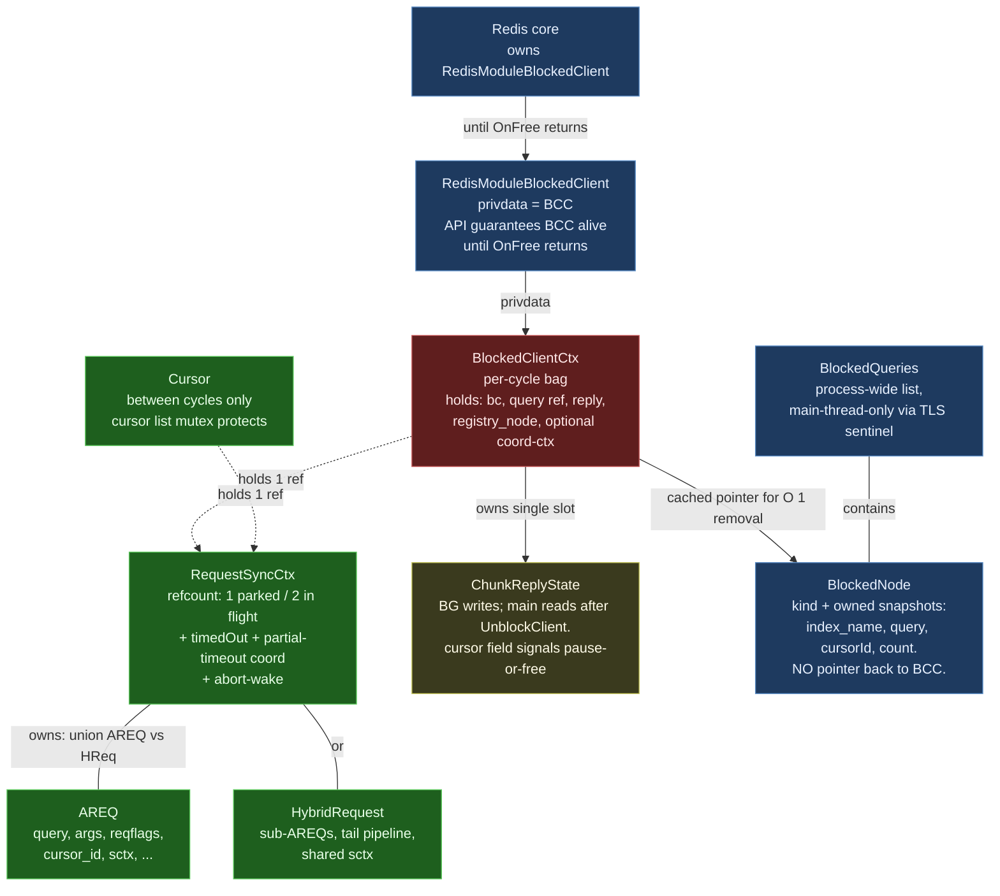

# Struct Relationships — Blocked-Client / Cross-Thread Refactor

> **Status:** Companion to [`blocked_client_refactor.md`](./blocked_client_refactor.md).
> Visualizes the post-refactor ownership graph and per-struct synchronization
> story for the structs involved in the cross-thread query path.

## 1. Ownership graph

Trimmed to the cross-thread structures. Pipeline-internal state
(`QueryProcessingCtx`, the RP chain) lives inside AREQ but is not part
of the cross-thread story — single-thread access during a cycle.

**Color key:**

- 🟦 **Blue (Redis-owned)** — `RedisModuleBlockedClient` (BCC's
  privdata), the `BlockedQueries` list, the `BlockedNode` entries it
  contains.
- 🟥 **Red (per-cycle)** — `BlockedClientCtx`. Created on main, freed
  on main via `OnFree`, BG-accessible in between.
- 🟩 **Green (per-query)** — `RequestSyncCtx`, `AREQ`, `HybridRequest`,
  parked `Cursor`. Lifetime ≥ a single cycle.
- 🟨 **Yellow (shared with explicit fence)** — `ChunkReplyState`. BG
  writes before `UnblockClient`; main reads after.

`SpecLockState` (a field inside `RedisSearchCtx`, which lives at
`AREQ::sctx`) is omitted from the diagram — it's purely BG-local
during a shard/hybrid cycle and the `runRequestCycle` wrapper is what
enforces its boundary. See §4.

`QueryProcessingCtx`, the `Pipeline`, and the RP chain are AREQ-internal
and BG-local during a cycle. They never cross threads, so they don't
appear in this graph.

## 2. Per-struct table

| Struct | Owner | Lifetime | Read / written by | Sync mechanism |
|---|---|---|---|---|
| **`RedisModuleBlockedClient` (`bc`)** | Redis core | From `RM_BlockClient` until `OnFree` returns | BG (`UnblockClient` only); main (`OnFree`); Redis dispatcher | Redis API guarantees |
| **`BlockedClientCtx` (BCC)** | Redis (via `bc->privdata`) — singly owned | Per-cycle: `New` on main → `OnFree` on main, after `UnblockClient` | Main: write at `New`, read in `reply_cb` / `OnFree`. BG: reads `query` / `reply_cb` / `bc`, writes `reply` (deferred mode) | Single-writer per phase; `UnblockClient` is the publish fence |
| **`RequestSyncCtx` (RSC)** | Refcounted; held by BCC and/or Cursor | Span of the underlying query (one or many cycles) | Main: `IncrRef` / `DecrRef`, `timedOut` store. BG: `timedOut` load, partial-timeout CAS / condvar | `refcount` and `timedOut`: `__atomic_*`. Partial-timeout CAS / mutex / condvar: internal to the wrapper. Abort-wake channel: own mutex |
| **`AREQ` / `HybridRequest`** | `RSC` (via union); destroyed in `RequestSyncCtx_DecrRef` when refcount hits 0 | Same as RSC | Main: setup before dispatch + destruction after refcount → 0. BG: free use during cycle | Single-writer invariant (one accessor at a time, with `UnblockClient` as the fence) |
| **`RedisSearchCtx` (`sctx`)** | `AREQ` / `HybridRequest` (via `req->sctx`, heap-alloc; unchanged from today) | Same as the request | Same access discipline as AREQ — pipeline reads `spec`, `redisCtx`, `time`. Cursor mode swaps `redisCtx` per cycle (existing hack, unchanged) | Single-writer (BG during cycle) |
| **`SpecLockState`** (enum field on `sctx`, replaces today's `RSContextFlags flags`) | The enclosing `sctx` | Same as `sctx` (state transitions are per-cycle, not per-lifetime) | **For shard/hybrid BCC cycles: BG thread only.** Acquire / release / state queries during pipeline; the existing patterns — `handleSpecLockAndRevalidate`, `UnlockSpec_and_ReturnRPResult`, safe-loader — all operate on this field. **For coord BCCs: never touched** (no local pipeline). **For non-BCC paths (synchronous `FT.EXPLAIN`, etc.): main is the legitimate accessor.** | The `runRequestCycle` wrapper (shard/hybrid only) pre/post-asserts `state == UNSET` at cycle entry and exit. The post-cycle force-unlock safety net catches leaks on the same BG thread that took the lock. No struct, no API surface beyond the existing four lock primitives. |
| **`QueryProcessingCtx` (`qiter`)** (inline on AREQ) | AREQ | Same as AREQ | BG only (during cycle). All RPs in the pipeline reach it via `rp->parent`; they read `endProc`, `err`, `totalResults`, `minScore`, etc., and write `totalResults` / `err` | Single-writer (BG). Shared *between RPs on the same thread* — no cross-thread issue. RPs run serially within the pipeline. |
| **`Pipeline` / `ResultProcessor` chain** (inline on AREQ; each RP heap-alloc, owned by AREQ via the chain) | AREQ | Same as AREQ | BG only | Single-writer; RPs run serially within the pipeline |
| **`ChunkReplyState`** (in `bcc.reply` post-Step 4) | BCC | Per-cycle | BG writes (deferred mode) before `UnblockClient`; main reads in `reply_cb` then frees in `OnFree`. **One slot for AREQ and Hybrid alike** — sub-AREQs do not carry one. The `cursor` field signals "main, pause/free this after the reply". | Publish-via-`UnblockClient` fence |
| **`BlockedNode`** (registry entry, unified query/cursor) | `BlockedQueries` TLS list | `New` → `OnFree` (main only); cached on `bcc.registry_node` | Main only — registry add / remove, watchdog snapshot reads | Main-thread TLS list; no cross-thread access. The node owns string snapshots so it's `Send`-able if a future port wants. |
| **`Cursor`** | Cursors registry | Cursor's existence (across many cycles) | Today's `Cursor_Pause` / `Cursor_Free` callable from any thread (cursor list `pthread_mutex` serializes registry mutation). Inline-mode BG calls them directly; deferred-mode BG stashes the cursor pointer in `bcc.reply.cursor` and main calls them from `reply_cb`. The cursor's `query` field holds an RSC ref between cycles. | Cursor list `pthread_mutex` for registry access; refcounting (cursor's RSC ref + BCC's RSC ref, independent) for ownership |
| **`MRCtx` / `CoordRequestCtx`** (coord only) | BCC (coord-private field) | Same as BCC | libuv IO threads (BG) + main; uses RSC's abort-wake for unblocking. **Coord BCCs do not go through `runRequestCycle`** — they don't touch `sctx->lock_state`. | Existing rmr / coord protocols (untouched) |
| **`RedisModuleCtx redisCtx`** (inside `sctx`) | `sctx` | Cursor cycles: per-cycle thread-safe ctx, swapped each cycle (existing hack). Initial / one-shot: per-query | BG (during cycle). The cursor swap-out is a single mutation in `AREQ_Free` / cycle exit | Single-writer per cycle |

## 3. Three classes of "shared", each with its own discipline

The colors in §1 reflect three distinct synchronization stories. Conflating
them is the source of every bug this refactor fixes.

### 3.1 Cross-thread shared (BG ↔ main)

Real synchronization required.

- `RequestSyncCtx.timedOut` — `__atomic_*` with acquire/release ordering.
- `RequestSyncCtx.refcount` — `__atomic_*` with acq_rel on the decrement.
- `bcc.reply` (`ChunkReplyState`, including its `cursor` field) —
  published via `UnblockClient`; main reads only after the fence.
- Partial-timeout coordination (`aggregatingResults` CAS,
  `aggregateResultsCond` mutex/condvar) — internal to `RequestSyncCtx`;
  preserved verbatim from today's code.
- Abort-wake channel — internal to `RequestSyncCtx`.

### 3.2 BG-thread shared (across pipeline RPs)

No synchronization needed beyond ordinary single-threaded discipline.

- `QueryProcessingCtx`
- The RP chain (`base->parent`, `base->upstream`)
- `sctx->lock_state` (during a shard/hybrid BCC cycle) — multiple
  acquire/release transitions per cycle, all on the same BG thread.
- AREQ pipeline state generally.

The single rule: **main must not touch any of these *during a
shard/hybrid BCC cycle*.** The `runRequestCycle` wrapper enforces it
for `lock_state` via the entry/exit assertions; the others are guarded
by the more general single-writer invariant on AREQ. Outside BCC
cycles (synchronous main-thread queries), main is the legitimate
accessor. Coord BCCs don't apply — they don't touch any of this.

### 3.3 Main-thread shared (across callbacks)

No synchronization needed; serial within main.

- `BlockedQueries` registry (TLS list)
- `BlockedClientCtx` fields (read by `reply_cb`, then `OnFree`)

### 3.4 Cursor list — its own thread-safe registry

The cursor list is **not** main-only TLS; it's protected by a
`pthread_mutex`. `Cursor_Pause` / `Cursor_Free` can be called from any
thread that holds the mutex. BG-side calls in inline mode use this; GC
and CURSOR DEL use this from main; deferred-mode reply_cb uses this
from main. The mutex is what makes cross-thread cursor-table access
safe; refcounting (independent cursor ref + BCC ref on RSC) is what
makes ownership safe across `Cursor_Free` happening on either side.

## 4. Why `lock_state` doesn't need cross-thread sync

The lock state lives on `sctx`, which lives on `AREQ`, which is
reachable from main during cycle setup and teardown. So *physically*
main can reach it. The design forbids it from doing so during a
shard/hybrid BCC cycle:

- `timeout_cb` (main, may run mid-cycle) explicitly does not call any
  lock primitive. It only sets `timedOut`, optionally writes the reply
  buffer, and optionally drives the partial-timeout CAS / abort-wake —
  none of which touch the lock.
- `OnFree` and `AREQ_Free` (main, post-`UnblockClient`) only read
  `lock_state` for assertion purposes (`== UNSET`); they never call
  Acquire / Unlock.
- The `runRequestCycle` post-assertion (`== UNSET` before `UnblockClient`)
  catches any path that leaks a lock. The safety-net force-unlock that
  handles the leak runs on the **same BG thread that acquired** — so
  even the recovery path is sound.

For non-BCC main-thread paths (synchronous `FT.EXPLAIN`, etc.) main is
the legitimate accessor. For coord BCCs the lock is never acquired at
all. The design imposes no thread-id check; the cycle-boundary
invariant carries the safety property.

For why refcounting is needed (and why the BG thread doesn't hold a
ref), see [`blocked_client_refactor.md` §3.1.1](./blocked_client_refactor.md).
For the `BlockedQueries` ↔ BCC observer relationship and why the list
uses a `pthread_key_t` sentinel today, see §5.1 and §5.2 of the same
document.

## 5. The cycle wrapper

`runRequestCycle` is a narrow construct: it wraps the BG work for
shard and hybrid pipelines with `lock_state == UNSET` assertions
before and after, plus a same-thread force-unlock safety net. It
doesn't manage outcomes, doesn't write `bcc` fields, doesn't call
`UnblockClient` (the BG work does that itself, as today).

| Kind | BG thread | BG work | Wrapped? |
| --- | --- | --- | --- |
| Shard query | Worker-pool worker | `runPipeline(areq)` — current shard pipeline | ✓ |
| Hybrid query | Worker-pool worker | Hybrid pipeline (sub-AREQs + tail merge); single shared `sctx` and `lock_state` | ✓ |
| Coord fan-out | libuv IO thread | Fan-out reply-collection; never acquires the spec lock | ✗ — wrapper would be a no-op, so coord skips it |

Each shard/hybrid cycle:

1. Enter `runRequestCycle`.
2. Pre-assert `sctx->lock_state == SPEC_LOCK_UNSET`.
3. Run BG work (acquires/releases the lock N times via existing
   patterns; calls `UnblockClient` at the end).
4. Post-assert `lock_state == SPEC_LOCK_UNSET` (force-unlock safety net
   on violation).

Main then runs `reply_cb` (deferred mode) and `OnFree`. The cursor
"park or free" decision is signaled by `bcc.reply.cursor` (today's
`storedReplyState.cursor` pattern) plus `QEXEC_S_ITERDONE` on AREQ —
no separate outcome enum is needed.

## 6. What changes vs. today

For quick reference against the current code:

| Change | Today | After refactor |
|---|---|---|
| `AREQ::sctx` | `RedisSearchCtx *sctx` (heap, owned by AREQ) | Unchanged |
| `RedisSearchCtx::flags` | `RSContextFlags flags` (`UNSET` / `READONLY` / `READWRITE`) | Renamed to `lock_state` (`SpecLockState` enum); same shape, no new struct type |
| `RequestSyncCtx` | Embedded inside `AREQ` and `HybridRequest` | Promoted to a heap-allocated wrapper that *owns* AREQ / HReq (containment flips) |
| `Cursor.hybrid_ref` (`StrongRef`) + `Cursor.execState` (`AREQ*`) | Two parallel mechanisms | Single `RequestSyncCtx *query` field |
| `BlockedQueryNode.privdata` (AREQ ref) + `freePrivData` | Registry owns an AREQ ref | Deleted; node carries only owned string snapshots |
| `BlockedQueryNode` + `BlockedCursorNode` (two types) | Two structs, two AddX / RemoveX APIs | Single `BlockedNode` with `kind` discriminator; single AddNode / RemoveNode API |
| AREQ `useReplyCallback` + `storedReplyState` | Two fields on AREQ; `useReplyCallback` mutated by `RSCursorReadCommand` | Encoded as `bcc.reply_cb == NULL` (immutable per cycle); `ChunkReplyState` lives on `bcc.reply` |
| HybridRequest `useReplyCallback` + `storedReplyState` | Duplicated on HybridRequest | **Deleted.** Single `bcc.reply` slot covers AREQ and Hybrid alike. Sub-AREQs don't carry `ChunkReplyState`. |
| BG-side `Cursor_Pause` / `Cursor_Free` | Inline mode: BG calls directly. Deferred mode: BG stashes cursor in `storedReplyState.cursor`, main acts in reply_cb. | Unchanged — cursor list mutex makes this thread-safe; refcounting (cursor + BCC each holds its own RSC ref) makes it ownership-safe. |
| `runRequestCycle` wrapper | (no equivalent; per-call-site teardown) | Shard + hybrid only. Coord paths skip the wrapper (no lock to assert about). |
| `AREQ_Free`'s "if locked, unlock" branch | Present (silent UB if cross-thread) | Deleted; replaced by `RS_ASSERT(lock_state == UNSET)`. The actual safety net moved to `runRequestCycle` on the BG side. |
| Coord BCCs in `BlockedQueries` | Not registered (invisible to FT.INFO) | Registered like shard BCCs (visible to watchdog) |
| `BlockClientCtx` init-bag | Per-call-site init parameter struct | Deleted in Step 2 (no intermediate rename); `BlockedClientCtx_New` takes args directly |
