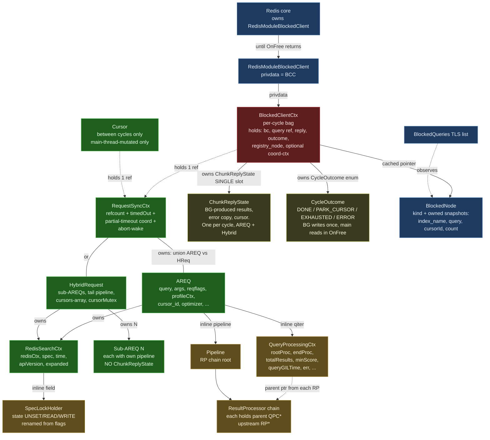

# Struct Relationships — Blocked-Client / Cross-Thread Refactor

> **Status:** Companion to [`blocked_client_refactor.md`](./blocked_client_refactor.md).
> Visualizes the post-refactor ownership graph and per-struct synchronization
> story for the structs involved in the cross-thread query path.

## 1. Ownership graph

**Color key:**

- 🟦 **Blue (Redis-owned)** — the lifetime is dictated by Redis core or
  the Redis API: `RedisModuleBlockedClient`, the `BlockedQueries` TLS
  list, the `BlockedNode` it observes.
- 🟥 **Red (per-cycle)** — exists for exactly one cross-thread cycle:
  `BlockedClientCtx`. Created on main, freed on main, in flight on a BG
  thread for the duration of one cycle.
- 🟩 **Green (per-query)** — exists for the lifetime of the query
  (potentially many cursor cycles): `RequestSyncCtx`, `AREQ`,
  `HybridRequest`, `RedisSearchCtx`, sub-AREQs, and the parked `Cursor`.
- 🟧 **Orange (BG-thread state during a cycle)** — accessed by the BG
  thread between `runRequestCycle` entry and exit: `SpecLockHolder`,
  `QueryProcessingCtx`, `Pipeline`, the RP chain.
- 🟨 **Yellow (shared with explicit fence)** — `ChunkReplyState` and
  `CycleOutcome`: written by BG before `UnblockClient`, read by main in
  `reply_cb` / `OnFree`.

## 2. Per-struct table

| Struct | Owner | Lifetime | Read / written by | Sync mechanism |
|---|---|---|---|---|
| **`RedisModuleBlockedClient` (`bc`)** | Redis core | From `RM_BlockClient` until `OnFree` returns | BG (`UnblockClient` only); main (`OnFree`); Redis dispatcher | Redis API guarantees |
| **`BlockedClientCtx` (BCC)** | Redis (via `bc->privdata`) — singly owned | Per-cycle: `New` on main → `OnFree` on main, after `UnblockClient` | Main: write at `New`, read in `reply_cb` / `OnFree`. BG: reads `query` / `reply_cb` / `bc`, writes `reply` (deferred mode) and `outcome` | Single-writer per phase; `UnblockClient` is the publish fence |
| **`bcc.outcome`** (`CycleOutcome` enum on BCC) | BCC | Per-cycle | BG writes exactly once before `UnblockClient`; main reads in `OnFree` to drive cursor-registry actions | Publish-via-`UnblockClient` fence |
| **`RequestSyncCtx` (RSC)** | Refcounted; held by BCC and/or Cursor | Span of the underlying query (one or many cycles) | Main: `IncrRef` / `DecrRef`, `timedOut` store. BG: `timedOut` load, partial-timeout CAS / condvar | `refcount` and `timedOut`: `__atomic_*`. Partial-timeout CAS / mutex / condvar: internal to the wrapper. Abort-wake channel: own mutex |
| **`AREQ` / `HybridRequest`** | `RSC` (via union); destroyed in `RequestSyncCtx_DecrRef` when refcount hits 0 | Same as RSC | Main: setup before dispatch + destruction after refcount → 0. BG: free use during cycle | Single-writer invariant (one accessor at a time, with `UnblockClient` as the fence) |
| **`RedisSearchCtx` (`sctx`)** | `AREQ` / `HybridRequest` (via `req->sctx`, heap-alloc; unchanged from today) | Same as the request | Same access discipline as AREQ — pipeline reads `spec`, `redisCtx`, `time`. Cursor mode swaps `redisCtx` per cycle (existing hack, unchanged) | Single-writer (BG during cycle) |
| **`SpecLockHolder`** (field inside `sctx`, replaces today's `flags`) | The enclosing `sctx` | Same as `sctx` (state transitions are per-cycle, not per-lifetime) | **For BCC cycles: BG thread only.** Acquire / release / state queries during pipeline; the existing patterns — `handleSpecLockAndRevalidate`, `UnlockSpec_and_ReturnRPResult`, safe-loader — all operate on this field. **For non-BCC paths (synchronous `FT.EXPLAIN`, etc.): main is the legitimate accessor.** | The `runRequestCycle` wrapper pre/post-asserts `state == UNSET` at cycle entry and exit. The post-cycle force-unlock safety net catches leaks on the same BG thread that took the lock. No cross-thread sync inside the holder; the wrapper is the boundary. |
| **`QueryProcessingCtx` (`qiter`)** (inline on AREQ) | AREQ | Same as AREQ | BG only (during cycle). All RPs in the pipeline reach it via `rp->parent`; they read `endProc`, `err`, `totalResults`, `minScore`, etc., and write `totalResults` / `err` | Single-writer (BG). Shared *between RPs on the same thread* — no cross-thread issue. RPs run serially within the pipeline. |
| **`Pipeline` / `ResultProcessor` chain** (inline on AREQ; each RP heap-alloc, owned by AREQ via the chain) | AREQ | Same as AREQ | BG only | Single-writer; RPs run serially within the pipeline |
| **`ChunkReplyState`** (in `bcc.reply` post-Step 4) | BCC | Per-cycle | BG writes (deferred mode) before `UnblockClient`; main reads in `reply_cb` then frees in `OnFree`. **One slot for AREQ and Hybrid alike** — sub-AREQs do not carry one. | Publish-via-`UnblockClient` fence |
| **`BlockedNode`** (registry entry, unified query/cursor) | `BlockedQueries` TLS list | `New` → `OnFree` (main only); cached on `bcc.registry_node` | Main only — registry add / remove, watchdog snapshot reads | Main-thread TLS list; no cross-thread access. The node owns string snapshots so it's `Send`-able if a future port wants. |
| **`Cursor`** | Cursors registry | Cursor's existence (across many cycles) | **Main only.** Today's worker-side `Cursor_Pause` / `Cursor_Free` calls move to main, driven by `bcc->outcome` in `OnFree`. The cursor mutex serializes registry add/remove on main. The cursor's `query` field holds an RSC ref between cycles. | Main-thread mutex on the registry; no cross-thread access |
| **`MRCtx` / `CoordRequestCtx`** (coord only) | BCC (coord-private field) | Same as BCC | libuv IO threads (BG) + main; uses RSC's abort-wake for unblocking. Goes through the same `runRequestCycle` wrapper as shard. | Existing rmr / coord protocols (untouched) |
| **`RedisModuleCtx redisCtx`** (inside `sctx`) | `sctx` | Cursor cycles: per-cycle thread-safe ctx, swapped each cycle (existing hack). Initial / one-shot: per-query | BG (during cycle). The cursor swap-out is a single mutation in `AREQ_Free` / cycle exit | Single-writer per cycle |

## 3. Three classes of "shared", each with its own discipline

The colors in §1 reflect three distinct synchronization stories. Conflating
them is the source of every bug this refactor fixes.

### 3.1 Cross-thread shared (BG ↔ main)

Real synchronization required.

- `RequestSyncCtx.timedOut` — `__atomic_*` with acquire/release ordering.
- `RequestSyncCtx.refcount` — `__atomic_*` with acq_rel on the decrement.
- `bcc.reply` (`ChunkReplyState`) — published via `UnblockClient`; main
  reads only after the fence.
- `bcc.outcome` (`CycleOutcome`) — written once by BG before
  `UnblockClient`; main reads in `OnFree`. Same publish fence.
- Partial-timeout coordination (`aggregatingResults` CAS,
  `aggregateResultsCond` mutex/condvar) — internal to `RequestSyncCtx`;
  preserved verbatim from today's code.
- Abort-wake channel — internal to `RequestSyncCtx`.

### 3.2 BG-thread shared (across pipeline RPs / coord IO chain)

No synchronization needed beyond ordinary single-threaded discipline.

- `QueryProcessingCtx`
- The RP chain (`base->parent`, `base->upstream`)
- `SpecLockHolder` (during a BCC cycle) — multiple acquire/release
  transitions per cycle, all on the same BG thread.
- AREQ pipeline state generally.

The single rule: **main must not touch any of these *during a BCC
cycle*.** The `runRequestCycle` wrapper enforces it for `SpecLockHolder`
via the entry/exit assertions; the others are guarded by the more
general single-writer invariant on AREQ. Outside BCC cycles
(synchronous main-thread queries), main is the legitimate accessor.

### 3.3 Main-thread shared (across callbacks)

No synchronization needed; serial within main.

- `BlockedQueries` registry (TLS list)
- `Cursor` registry — **including all `Cursor_Pause` / `Cursor_Free`
  calls**, which now run on main only, driven by `bcc->outcome`.
- `BlockedClientCtx` fields (read by `reply_cb`, then `OnFree`)

Multiple touch points on main (register/unregister, reply_cb, OnFree,
GC, CURSOR DEL), but they run serially within the thread.

## 4. Why the `SpecLockHolder` doesn't need cross-thread sync

This is the most surprising claim, so it's worth stating explicitly.

The holder lives on `sctx`, which lives on `AREQ`, which is reachable
from main during cycle setup and teardown. So *physically* main can
reach the holder. The design forbids it from doing so during a BCC
cycle:

- `timeout_cb` (main, may run mid-cycle) explicitly does not call any
  `SpecLockHolder_*` operation. It only sets `timedOut`, optionally
  writes the reply buffer, and optionally drives the partial-timeout
  CAS / abort-wake — none of which touch the lock.
- `OnFree` and `AREQ_Free` (main, post-`UnblockClient`) only read the
  holder for assertion purposes (`state == UNSET`); they never call
  Acquire / Unlock.
- The `runRequestCycle` post-assertion (`state == UNSET` before
  `UnblockClient`) catches any path that leaks a lock. The safety-net
  force-unlock that handles the leak runs on the **same BG thread that
  acquired** — so even the recovery path is sound.

For non-BCC main-thread paths (synchronous `FT.EXPLAIN`, etc.) main is
the legitimate accessor. The design imposes no thread-id check; the
cycle-boundary invariant carries the safety property.

## 5. The cycle wrapper and outcome flow

The `runRequestCycle` wrapper applies uniformly to three BG runtimes:

| Kind | BG thread | BG work |
| --- | --- | --- |
| Shard query | Worker-pool worker | `runPipeline(areq)` — current shard pipeline |
| Hybrid query | Worker-pool worker | Hybrid pipeline (sub-AREQs + tail merge); single shared `sctx` and `lock_holder` |
| Coord fan-out | libuv IO thread | Fan-out reply-collection; never acquires the spec lock (no local pipeline) |

Each BG cycle:

1. Enter `runRequestCycle`.
2. Pre-assert `holder.state == UNSET`.
3. Run BG work (acquires/releases the holder N times for shard/hybrid; never for coord).
4. BG work returns a `CycleOutcome`; wrapper writes it to `bcc->outcome`.
5. Post-assert `holder.state == UNSET` (force-unlock safety net on violation).
6. `RedisModule_UnblockClient(bcc->bc, bcc)` — publish fence.

Main then runs `reply_cb` (deferred mode) and `OnFree`. `OnFree`
inspects `bcc->outcome`:

| `outcome` | Main's action | Refcount effect |
| --- | --- | --- |
| `DONE` | Free BCC | `DecrRef(bcc.query)` (BCC's ref) |
| `PARK_CURSOR` (initial) | Allocate Cursor, register, `IncrRef(bcc.query)` for cursor | `DecrRef(bcc.query)` (BCC's ref). Cursor's new ref keeps RSC alive. |
| `PARK_CURSOR` (cursor read, more chunks) | Re-park existing cursor (already holds its ref) | `DecrRef(bcc.query)` (BCC's ref). Cursor's ref stays. |
| `EXHAUSTED` / `ERROR` (cursor) | `Cursor_Free(cursor)` — registry remove + cursor's `DecrRef` | `DecrRef(bcc.query)` (BCC's) and cursor's `DecrRef`. Last ref drops, AREQ_Free runs on main. |

This shape is the resolution to the "BG calls Cursor_Free into a
main-thread TLS structure" cross-thread concern: **the BG thread never
touches the cursor registry. It only writes `bcc->outcome`.**

## 6. What changes vs. today

For quick reference against the current code:

| Change | Today | After refactor |
|---|---|---|
| `AREQ::sctx` | `RedisSearchCtx *sctx` (heap, owned by AREQ) | Unchanged |
| `RedisSearchCtx::flags` | `RSContextFlags flags` (`UNSET` / `READONLY` / `READWRITE`) | Renamed to `lock_holder` (`SpecLockHolder` with just `state`); same shape |
| `RequestSyncCtx` | Embedded inside `AREQ` and `HybridRequest` | Promoted to a heap-allocated wrapper that *owns* AREQ / HReq (containment flips) |
| `Cursor.hybrid_ref` (`StrongRef`) + `Cursor.execState` (`AREQ*`) | Two parallel mechanisms | Single `RequestSyncCtx *query` field |
| `BlockedQueryNode.privdata` (AREQ ref) + `freePrivData` | Registry owns an AREQ ref | Deleted; node carries only owned string snapshots |
| `BlockedQueryNode` + `BlockedCursorNode` (two types) | Two structs, two AddX / RemoveX APIs | Single `BlockedNode` with `kind` discriminator; single AddNode / RemoveNode API |
| AREQ `useReplyCallback` + `storedReplyState` | Two fields on AREQ; `useReplyCallback` mutated by `RSCursorReadCommand` | Encoded as `bcc.reply_cb == NULL` (immutable per cycle); `ChunkReplyState` lives on `bcc.reply` |
| HybridRequest `useReplyCallback` + `storedReplyState` | Duplicated on HybridRequest | **Deleted.** Single `bcc.reply` slot covers AREQ and Hybrid alike. Sub-AREQs don't carry `ChunkReplyState`. |
| Worker-side `Cursor_Pause` / `Cursor_Free` | Worker mutates the cursor registry directly | **Moved to main, driven by `bcc->outcome` in `OnFree`.** BG never touches the cursor registry. |
| `runRequestCycle` wrapper | (no equivalent; per-call-site teardown) | One wrapper, three instantiations: shard worker, hybrid worker, coord libuv. Pre/post `holder.state == UNSET` assertions. |
| `AREQ_Free`'s "if locked, unlock" branch | Present (silent UB if cross-thread) | Deleted; replaced by `RS_ASSERT(holder.state == UNSET)`. The actual safety net moved to `runRequestCycle` on the BG side. |
| Coord BCCs in `BlockedQueries` | Not registered (invisible to FT.INFO) | Registered like shard BCCs; flow through the same `runRequestCycle` wrapper |
| `BlockClientCtx` init-bag | Per-call-site init parameter struct | Deleted in Step 2 (no intermediate rename); `BlockedClientCtx_New` takes args directly |
