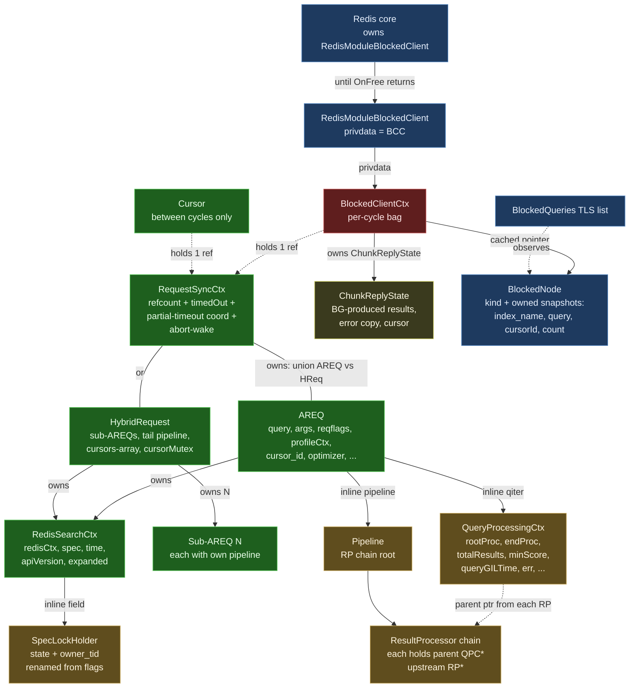

# Struct Relationships — Blocked-Client / Cross-Thread Refactor

> **Status:** Companion to [`blocked_client_refactor.md`](./blocked_client_refactor.md).
> Visualizes the post-refactor ownership graph and per-struct synchronization
> story for the structs involved in the cross-thread query path.

## 1. Ownership graph

**Color key:**

- 🟦 **Blue (Redis-owned)** — the lifetime is dictated by Redis core or the
  Redis API: `RedisModuleBlockedClient`, the `BlockedQueries` TLS list, the
  `BlockedNode` it observes.
- 🟥 **Red (per-cycle)** — exists for exactly one cross-thread cycle:
  `BlockedClientCtx`. Created on main, freed on main, in flight on the
  worker for the duration of one pipeline call.
- 🟩 **Green (per-query)** — exists for the lifetime of the query
  (potentially many cursor cycles): `RequestSyncCtx`, `AREQ`,
  `HybridRequest`, `RedisSearchCtx`, sub-AREQs.
- 🟧 **Orange (worker-thread state)** — accessed exclusively by the worker
  during a cycle: `SpecLockHolder`, `QueryProcessingCtx`, `Pipeline`, the
  RP chain.
- 🟨 **Yellow (shared with explicit fence)** — `ChunkReplyState`: written
  by worker pre-`UnblockClient`, read by main in `reply_cb` / `OnFree`.

## 2. Per-struct table

| Struct | Owner | Lifetime | Read/written by | Sync mechanism |
|---|---|---|---|---|
| **`RedisModuleBlockedClient` (`bc`)** | Redis core | From `RM_BlockClient` until `OnFree` returns | Worker (`UnblockClient` only); main (`OnFree`); Redis dispatcher | Redis API guarantees |
| **`BlockedClientCtx` (BCC)** | Redis (via `bc->privdata`) — singly owned | Per-cycle: `New` on main → `OnFree` on main, after `UnblockClient` | Main: write at `New`, read in `reply_cb` / `OnFree`. Worker: reads `query` / `reply_cb` / `bc`, writes `reply` (deferred mode) | Single-writer per phase; `UnblockClient` is the publish fence |
| **`RequestSyncCtx` (RSC)** | Refcounted; held by BCC and/or Cursor | Span of the underlying query (one or many cycles) | Main: `IncrRef` / `DecrRef`, `timedOut` store. Worker: `timedOut` load, partial-timeout CAS / condvar | `refcount` and `timedOut`: `__atomic_*`. Partial-timeout CAS / mutex / condvar: internal to the wrapper. Abort-wake channel: own mutex |
| **`AREQ` / `HybridRequest`** | `RSC` (via union); destroyed in `RequestSyncCtx_DecrRef` when refcount hits 0 | Same as RSC | Main: setup before dispatch + destruction after refcount → 0. Worker: free use during cycle | Single-writer invariant (one accessor at a time, with `UnblockClient` as the fence) |
| **`RedisSearchCtx` (`sctx`)** | `AREQ` / `HybridRequest` (via `req->sctx`, heap-alloc; unchanged from today) | Same as the request | Same access discipline as AREQ — pipeline reads `spec`, `redisCtx`, `time`. Cursor mode swaps `redisCtx` per cycle (existing hack, unchanged) | Single-writer (worker during cycle) |
| **`SpecLockHolder`** (field inside `sctx`) | The enclosing `sctx` | Same as `sctx` (state transitions are per-cycle, not per-lifetime) | **Worker only.** Acquire / release / state queries during pipeline; the existing patterns — `handleSpecLockAndRevalidate`, `UnlockSpec_and_ReturnRPResult`, safe-loader — all operate on this field. Main never touches it. | Three layers: (1) the `runQueryCycle` worker wrapper pre / post-asserts `state == UNSET`; (2) `owner_tid` debug-asserts same-thread access; (3) force-unlock-on-worker safety net catches violations on the same thread that took the lock. No cross-thread sync needed because the holder is single-thread by construction. |
| **`QueryProcessingCtx` (`qiter`)** (inline on AREQ) | AREQ | Same as AREQ | Worker only (during cycle). All RPs in the pipeline reach it via `rp->parent`; they read `endProc`, `err`, `totalResults`, `minScore`, etc., and write `totalResults` / `err` | Single-writer (worker). Shared *between RPs on the same thread* — no cross-thread issue. RPs assume they don't run concurrently with each other (pipeline is serial). |
| **`Pipeline` / `ResultProcessor` chain** (inline on AREQ; each RP heap-alloc, owned by AREQ via the chain) | AREQ | Same as AREQ | Worker only | Single-writer; RPs run serially within the pipeline |
| **`ChunkReplyState`** (in `bcc.reply` post-Step 4) | BCC | Per-cycle | Worker writes (deferred mode) before `UnblockClient`; main reads in `reply_cb` then frees in `OnFree` | Publish-via-`UnblockClient` fence |
| **`BlockedNode`** (registry entry) | `BlockedQueries` TLS list | `New` → `OnFree` (main only); cached on `bcc.registry_node` | Main only — registry add / remove, watchdog snapshot reads | Main-thread TLS list; no cross-thread access. The node owns string snapshots so it's `Send`-able if a future port wants. |
| **`Cursor`** | Cursors registry | Cursor's existence (across many cycles) | Main-thread mutex on the registry; `Cursor.query` field holds an RSC ref between cycles | Existing cursor mutex (untouched) |
| **`MRCtx` / `CoordRequestCtx`** (coord only) | BCC (coord-private field) | Same as BCC | Worker (coord BG IO threads) + main; uses RSC's abort-wake for unblocking | Existing rmr / coord protocols (untouched) |
| **`RedisModuleCtx redisCtx`** (inside `sctx`) | `sctx` | Cursor cycles: per-cycle thread-safe ctx, swapped each cycle (existing hack). Initial / one-shot: per-query | Worker (during cycle). The cursor swap-out is a single mutation in `AREQ_Free` / cycle exit | Single-writer per cycle |

## 3. Three classes of "shared", each with its own discipline

The colors in §1 reflect three distinct synchronization stories. Conflating
them is the source of every bug this refactor fixes.

### 3.1 Cross-thread shared (worker ↔ main)

Real synchronization required.

- `RequestSyncCtx.timedOut` — `__atomic_*` with acquire/release ordering.
- `RequestSyncCtx.refcount` — `__atomic_*` with acq_rel on the decrement.
- `bcc.reply` (`ChunkReplyState`) — published via `UnblockClient`; main
  reads only after the fence.
- Partial-timeout coordination (`aggregatingResults` CAS, `aggregateResultsCond`
  mutex/condvar) — internal to `RequestSyncCtx`; preserved verbatim from
  today's code.
- Abort-wake channel — internal to `RequestSyncCtx`.

### 3.2 Worker-thread-shared (across pipeline RPs)

No synchronization needed beyond ordinary single-threaded discipline.

- `QueryProcessingCtx`
- The RP chain (`base->parent`, `base->upstream`)
- `SpecLockHolder` — multiple acquire/release transitions per cycle, all on
  the same worker thread.
- AREQ pipeline state generally.

The single rule: **main must not touch any of these.** The
`runQueryCycle` wrapper enforces it for `SpecLockHolder` directly via
`owner_tid`; the others are guarded by the more general single-writer
invariant on AREQ.

### 3.3 Main-thread-shared (across callbacks)

No synchronization needed; serial within main.

- `BlockedQueries` registry (TLS list)
- `Cursor` registry
- `BlockedClientCtx` fields (read by `reply_cb`, then `OnFree`)

Multiple touch points on main (register/unregister, reply_cb, OnFree, GC,
CURSOR DEL), but they run serially within the thread.

## 4. Why the `SpecLockHolder` doesn't need cross-thread sync

This is the most surprising claim, so it's worth stating explicitly.

The holder lives on `sctx`, which lives on `AREQ`, which is reachable from
main during cycle setup and teardown. So *physically* main can reach the
holder. The design forbids it from doing so:

- `timeout_cb` (main, may run mid-cycle) explicitly does not call any
  `SpecLockHolder_*` operation. It only sets `timedOut`, optionally writes
  the reply buffer, and optionally drives the partial-timeout CAS / abort-wake
  — none of which touch the lock.
- `OnFree` and `AREQ_Free` (main, post-`UnblockClient`) only read the
  holder for assertion purposes (`state == UNSET`); they never call
  Acquire / Unlock.
- The `owner_tid` debug field makes "main called Unlock" a `RS_ASSERT`
  failure, not silent corruption.
- The `runQueryCycle` post-assertion (`state == UNSET` before
  `UnblockClient`) catches any path that leaks a lock. The safety-net
  force-unlock that handles the leak runs on the **same worker thread that
  acquired** — so even the recovery path is sound.

So the holder is in §3.2 (worker-thread-shared), not §3.1 (cross-thread).
It's accessed by every RP in the pipeline, but always on one thread, with
the wrapper as the per-cycle scope.

## 5. What changes vs. today

For quick reference against the current code:

| Change | Today | After refactor |
|---|---|---|
| `AREQ::sctx` | `RedisSearchCtx *sctx` (heap, owned by AREQ) | Unchanged |
| `RedisSearchCtx::flags` | `RSContextFlags flags` (`UNSET` / `READONLY` / `READWRITE`) | Renamed to `lock_holder` (`SpecLockHolder` with `state` + debug `owner_tid`); same shape |
| `RequestSyncCtx` | Embedded inside `AREQ` and `HybridRequest` | Promoted to a heap-allocated wrapper that *owns* AREQ / HReq (containment flips) |
| `Cursor.hybrid_ref` (`StrongRef`) + `Cursor.execState` (`AREQ*`) | Two parallel mechanisms | Single `RequestSyncCtx *query` field |
| `BlockedQueryNode.privdata` (AREQ ref) + `freePrivData` | Registry owns an AREQ ref | Deleted; node carries only owned string snapshots |
| `BlockedQueryNode` + `BlockedCursorNode` (two types) | Two structs, two AddX / RemoveX APIs | Single `BlockedNode` with `kind` discriminator; single AddNode / RemoveNode API |
| AREQ `useReplyCallback` + `storedReplyState` | Two fields on AREQ; `useReplyCallback` mutated by `RSCursorReadCommand` | Encoded as `bcc.reply_cb == NULL` (immutable per cycle); `ChunkReplyState` lives on `bcc.reply` |
| `AREQ_Free`'s "if locked, unlock" branch | Present (silent UB if cross-thread) | Deleted; replaced by `RS_ASSERT(holder.state == UNSET)`. The actual safety net moved to `runQueryCycle` on the worker |
| Coord BCCs in `BlockedQueries` | Not registered (invisible to FT.INFO) | Registered like shard BCCs |
