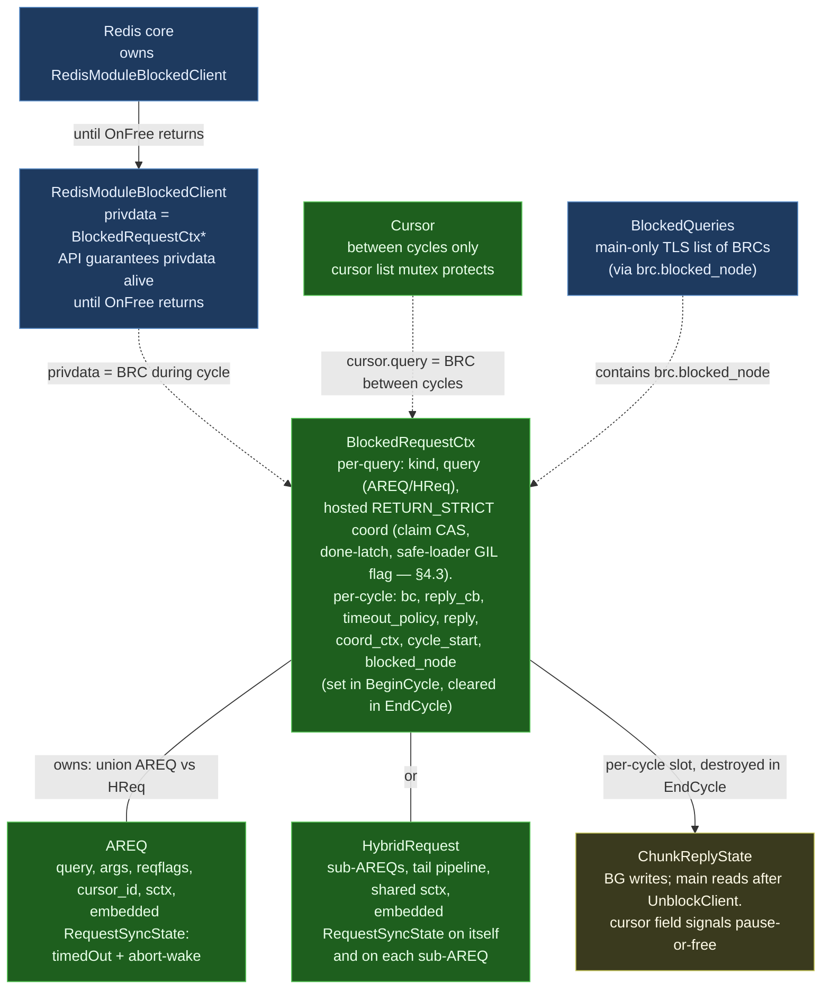

# Struct Relationships — Blocked-Client / Cross-Thread Refactor

> **Status:** Companion to [`blocked_client_refactor.md`](./blocked_client_refactor.md).
> Visualizes the post-refactor ownership graph and per-struct synchronization
> story for the structs involved in the cross-thread query path.

## 1. Ownership graph

Trimmed to the cross-thread structures. Pipeline-internal state
(`QueryProcessingCtx`, the RP chain) lives inside AREQ but is not part
of the cross-thread story — single-thread access during a cycle.

**Color key:**

- 🟦 **Blue (Redis-owned)** — `RedisModuleBlockedClient` (holds the
  BRC pointer as privdata during a cycle), the `BlockedQueries` TLS
  list head.
- 🟩 **Green (per-query)** — `BlockedRequestCtx`, `AREQ`,
  `HybridRequest`, parked `Cursor`. Lifetime ≥ a single cycle.
  BRC's per-cycle fields (`bc`, `reply_cb`, `reply`, `coord_ctx`,
  `cycle_start`, `blocked_node` linkage) are bound only between
  `BRC_BeginCycle` and `BRC_EndCycle` — outside that window they are
  NULL/zero/unlinked.
- 🟨 **Yellow (shared with explicit fence)** — `ChunkReplyState`. BG
  writes before `UnblockClient`; main reads after; destroyed in
  `BRC_EndCycle`.

`SpecLockState` (a field inside `RedisSearchCtx`, which lives at
`AREQ::sctx`) is omitted from the diagram — it's purely BG-local
during a shard/hybrid cycle and the `runRequestCycle` wrapper is what
enforces its boundary. See §4.

`QueryProcessingCtx`, the `Pipeline`, and the RP chain are AREQ-internal
and BG-local during a cycle. They never cross threads, so they don't
appear in this graph.

## 2. Per-struct table

| Struct | Owner | Lifetime | Read / written by | Sync mechanism |
|---|---|---|---|---|
| **`RedisModuleBlockedClient` (`bc`)** | Redis core | From `RM_BlockClient` until `OnFree` returns | BG (`UnblockClient` only); main (`OnFree`); Redis dispatcher | Redis API guarantees |
| **`BlockedRequestCtx` (BRC)** | Single-owner; `bc->privdata` (during cycle) or `cursor->query` (between cycles) | Span of the underlying query (one or many cycles) | Main: `New` / `BeginCycle` / `EndCycle` / `OnFree` (transfers under cursor mutex; RETURN_STRICT timeout callback runs the hosted claim / GIL-preempt / wait). BG: read access via `bc->privdata`; hosted claim CAS / signal; writes `brc->reply` (deferred mode). | Hosted RETURN_STRICT block: claim CAS + mutex/condvar, internal to the wrapper, semantics unchanged (main doc §4.3). Per-cycle fields (`bc`, `reply_cb`, `timeout_policy`, `reply`, `blocked_node`, `coord_ctx`) are publish-via-`UnblockClient`. No refcount (shard hybrid sub-cursors get one BRC each; the parent HybridRequest container is dissolved at the end of the initial cycle — main doc §3.6). |
| **`RequestSyncState`** (embedded, per request — sub-AREQs included) | The enclosing AREQ / HybridRequest | Same as the request | Main: `timedOut` store from timeout_cb (reached via `brc->query`); abort-wake broadcast. BG: `timedOut` load each pipeline tick; abort-wake register/unregister around blocking MR reads. | `timedOut`: atomic (relaxed, as on master). Abort-wake channel: own mutex. |
| **`AREQ` / `HybridRequest`** | `BRC` (via union); destroyed inside `BlockedRequestCtx_Free` (shard hybrid multi-cursor: the container is freed by the hybrid BRC's `OnFree` at the end of the initial cycle after handing each sub-AREQ to its sub-cursor's BRC — main doc §3.6) | Same as BRC | Main: setup before dispatch + destruction inside `OnFree`'s free branch (or `Cursor_Free` for a parked cursor). BG: free use during cycle | Single-writer invariant (one accessor at a time, with `UnblockClient` as the fence) |
| **`RedisSearchCtx` (`sctx`)** | `AREQ` / `HybridRequest` (via `req->sctx`, heap-alloc; unchanged from today) | Same as the request | Same access discipline as AREQ — pipeline reads `spec`, `redisCtx`, `time`. Cursor mode swaps `redisCtx` per cycle (existing hack, unchanged) | Single-writer (BG during cycle) |
| **`SpecLockState`** (enum field on `sctx`, replaces today's `RSContextFlags flags`) | The enclosing `sctx` | Same as `sctx` (state transitions are per-cycle, not per-lifetime) | **For shard/hybrid cycles: BG thread only.** Acquire / release / state queries during pipeline; the existing patterns — `handleSpecLockAndRevalidate`, `UnlockSpec_and_ReturnRPResult`, safe-loader — all operate on this field. **For coord cycles: never touched** (no local pipeline). **For synchronous main-thread commands (`FT.EXPLAIN`, etc.) outside any blocked-client cycle: main is the legitimate accessor.** | The `runRequestCycle` wrapper (shard/hybrid only) pre/post-asserts `state == UNSET` at cycle entry and exit. The post-cycle force-unlock safety net catches leaks on the same BG thread that took the lock. No struct, no API surface beyond the existing four lock primitives. |
| **`QueryProcessingCtx` (`qiter`)** (inline on AREQ) | AREQ | Same as AREQ | BG only (during cycle). All RPs in the pipeline reach it via `rp->parent`; they read `endProc`, `err`, `totalResults`, `minScore`, etc., and write `totalResults` / `err` | Single-writer (BG). Shared *between RPs on the same thread* — no cross-thread issue. RPs run serially within the pipeline. |
| **`Pipeline` / `ResultProcessor` chain** (inline on AREQ; each RP heap-alloc, owned by AREQ via the chain) | AREQ | Same as AREQ | BG only | Single-writer; RPs run serially within the pipeline |
| **`ChunkReplyState`** (in `brc->reply` post-Step 4) | BRC's per-cycle slot | Per-cycle: zero/empty between cycles; populated by BG; destroyed in `BRC_EndCycle` | BG writes (deferred mode) before `UnblockClient`; main reads in `reply_cb` then `BRC_EndCycle` calls `ChunkReplyState_Destroy`. **One slot for AREQ and Hybrid alike** — sub-AREQs do not carry one. The `cursor` field signals "main, pause/free this after the reply". | Publish-via-`UnblockClient` fence |
| **`BlockedQueries` linkage** (BRC's `blocked_node` field) | The BRC itself; `&brc->blocked_node` is appended to / removed from `BlockedQueries.queries` or `.cursors` | Per-cycle: linked at `BRC_BeginCycle`, unlinked at `BRC_EndCycle` (main only) | Main only — list mutation, watchdog walk reading BRC fields directly | Main-thread TLS list; no cross-thread access. No allocation, no extra locking. |
| **`Cursor`** | Cursors registry | Cursor's existence (across many cycles) | Registry mutation guarded by the cursor list `pthread_mutex`. During a cycle BG only *stashes* the cursor pointer in `brc->reply.cursor`; the pause-or-free act happens exactly once, on main, in `OnFree`'s park-or-free branch (park requires `!timedOut && !ITERDONE && !delete_mark`). The cursor's `query` field owns the BRC between cycles (NULL during in-flight). | Cursor list `pthread_mutex` for registry access; single-owner-with-transfer for BRC ownership; `delete_mark` flag handles `CURSOR DEL` during in-flight |
| **`MRCtx`** (coord only) | Owned by the coord BG handler (created inside `MR_Fanout` machinery, freed after fan-out completes); the post-refactor `brc->coord_ctx` slot ends up NULL for AREQ-shaped coord paths because `CoordRequestCtx` retires entirely in Step 6 (its fields migrate to BRC / AREQ). | Per-cycle | libuv IO threads (BG) + main; the timeout callback wakes the embedded `RequestSyncState` abort-wake channel(s) to unpark a blocked MR reader. **Coord-side cycles do not go through `runRequestCycle`** — they don't touch `sctx->lock_state`. | Existing rmr / coord protocols (untouched) |
| **`RedisModuleCtx redisCtx`** (inside `sctx`) | `sctx` | Cursor cycles: per-cycle thread-safe ctx, swapped each cycle (existing hack). Initial / one-shot: per-query | BG (during cycle). The cursor swap-out is a single mutation in `AREQ_Free` / cycle exit | Single-writer per cycle |

## 3. Three classes of "shared", each with its own discipline

The colors in §1 reflect three distinct synchronization stories. Conflating
them is the source of every bug this refactor fixes.

### 3.1 Cross-thread shared (BG ↔ main)

Real synchronization required.

- `RequestSyncState.timedOut` (embedded on the request) — atomic
  (relaxed ordering, as on master today).
- `brc->reply` (`ChunkReplyState`, including its `cursor` field) —
  published via `UnblockClient`; main reads only after the fence;
  destroyed in `BRC_EndCycle`.
- The other per-cycle fields on BRC (`bc`, `reply_cb`,
  `timeout_policy`, `blocked_node`, `coord_ctx`) — written once at
  `BRC_BeginCycle` (main, pre-dispatch), read by BG, cleared at
  `BRC_EndCycle` (main, post-`UnblockClient`).
  Publish-via-`UnblockClient`.
- Hosted RETURN_STRICT coordination (`aggregatingResults` CAS,
  claim-lost flag, done-latch + mutex/condvar, `safeLoaderHoldingGIL`)
  — internal to `BlockedRequestCtx`; preserved verbatim from today's
  code (main doc §4.3). Slated for deletion by the separate
  "main thread never waits" follow-up.
- Abort-wake channel — internal to the embedded `RequestSyncState`
  (per request, sub-AREQs included).

### 3.2 BG-thread shared (across pipeline RPs)

No synchronization needed beyond ordinary single-threaded discipline.

- `QueryProcessingCtx`
- The RP chain (`base->parent`, `base->upstream`)
- `sctx->lock_state` (during a shard/hybrid cycle) — multiple
  acquire/release transitions per cycle, all on the same BG thread.
- AREQ pipeline state generally.

The single rule: **main must not touch any of these *during a
shard/hybrid cycle*.** The `runRequestCycle` wrapper enforces it for
`lock_state` via the entry/exit assertions; the others are guarded by
the more general single-writer invariant on AREQ. Outside cycles
(synchronous main-thread queries), main is the legitimate accessor.
Coord-side cycles don't apply — they don't touch any of this.

### 3.3 Main-thread shared (across callbacks)

No synchronization needed; serial within main.

- `BlockedQueries` registry (TLS list)
- The BRC's per-cycle fields, post-`UnblockClient` (read by
  `reply_cb`, cleared by `BRC_EndCycle` inside `OnFree`)

### 3.4 Cursor list — its own thread-safe registry

The cursor list is **not** main-only TLS; it's protected by a
`pthread_mutex`. `Cursor_Pause` / `Cursor_Free` can be called from any
thread that holds the mutex. BG-side calls in inline mode use this; GC
and CURSOR DEL use this from main; deferred-mode reply_cb uses this
from main. The mutex is what makes cross-thread cursor-table access
safe; the single-owner-with-transfer model (the cycle owns BRC via
`bc->privdata` during a cycle, cursor owns between cycles, transfer
at `BRC_BeginCycle` / `OnFree` under the same mutex; `delete_mark`
for `CURSOR DEL` during in-flight) is what makes BRC ownership safe
across all paths.

## 4. Why `lock_state` doesn't need cross-thread sync

The lock state lives on `sctx`, which lives on `AREQ`, which is
reachable from main during cycle setup and teardown. So *physically*
main can reach it. The design forbids it from doing so during a
shard/hybrid cycle:

- `timeout_cb` (main, may run mid-cycle) explicitly does not call any
  lock primitive. It only sets `timedOut`, optionally writes the reply
  buffer, and optionally drives the hosted RETURN_STRICT handshake
  (claim CAS / GIL-preempt / wait / drain) and the abort-wake
  broadcast — none of which touch the spec lock.
- `OnFree` and `AREQ_Free` (main, post-`UnblockClient`) only read
  `lock_state` for assertion purposes (`== UNSET`); they never call
  Acquire / Unlock.
- The `runRequestCycle` post-assertion (`== UNSET` before `UnblockClient`)
  catches any path that leaks a lock. The safety-net force-unlock that
  handles the leak runs on the **same BG thread that acquired** — so
  even the recovery path is sound.

For synchronous main-thread paths (`FT.EXPLAIN`, etc.) outside any
blocked-client cycle, main is the legitimate accessor. For coord
cycles the lock is never acquired at all. The design imposes no
thread-id check; the cycle-boundary invariant carries the safety
property.

For why the wrapper has **no refcount** (single-owner-with-transfer
between `bc->privdata` and `cursor->query`, with the existing
`delete_mark` flag handling `CURSOR DEL` during in-flight), see
[`blocked_client_refactor.md` §3.1.1](./blocked_client_refactor.md).
For the `BlockedQueries` ↔ BRC observer relationship and why the list
uses a `pthread_key_t` sentinel today, see §5.1 and §5.2 of the same
document.

## 5. The cycle wrapper

`runRequestCycle` is a narrow construct: it wraps the BG work for
shard and hybrid pipelines with `lock_state == UNSET` assertions
before and after, plus a same-thread force-unlock safety net. It
doesn't manage outcomes, doesn't write `brc` fields beyond what the
pipeline already does, and doesn't call `UnblockClient` (the BG work
does that itself, as today).

| Kind | BG thread | BG work | Wrapped? |
| --- | --- | --- | --- |
| Shard query | Worker-pool worker | `runPipeline(areq)` — current shard pipeline | ✓ |
| Hybrid query | Worker-pool worker | Hybrid pipeline (sub-AREQs + tail merge); single shared `sctx` and `lock_state` | ✓ |
| Coord fan-out | libuv IO thread | Fan-out reply-collection; never acquires the spec lock | ✗ — wrapper would be a no-op, so coord skips it |

Each shard/hybrid cycle:

1. Enter `runRequestCycle`.
2. Pre-assert `sctx->lock_state == SPEC_LOCK_UNSET`.
3. Run BG work (acquires/releases the lock N times via existing
   patterns; calls `UnblockClient` at the end).
4. Post-assert `lock_state == SPEC_LOCK_UNSET` (force-unlock safety net
   on violation).

Main then runs `reply_cb` (deferred mode) and `OnFree`. `OnFree`
calls `BRC_EndCycle` first (`DLLIST_REMOVE(blocked_node)`,
`ChunkReplyState_Destroy`, clear per-cycle fields), then resolves
park-vs-free under the cursor mutex. The cursor "park or free"
decision is signaled by `brc->reply.cursor` (today's
`storedReplyState.cursor` pattern) plus `QEXEC_S_ITERDONE` and the
request's `timedOut` flag (a timed-out cursor is always freed, never
parked — the client already got a depleted cursor reply; main doc
§3.1.1) — no separate outcome enum is needed.

## 6. What changes vs. today

For quick reference against the current code:

| Change | Today | After refactor |
|---|---|---|
| `AREQ::sctx` | `RedisSearchCtx *sctx` (heap, owned by AREQ) | Unchanged |
| `RedisSearchCtx::flags` | `RSContextFlags flags` (`UNSET` / `READONLY` / `READWRITE`) | Renamed to `lock_state` (`SpecLockState` enum); same shape, no new struct type |
| `RequestSyncCtx` (today) → `BlockedRequestCtx` + `RequestSyncState` | Embedded inside `AREQ` and `HybridRequest`: refcount + timedOut + RETURN_STRICT coordination + safe-loader GIL handshake + abort-wake | **Split**: per-request slice (`timedOut`, abort-wake) stays embedded as `RequestSyncState` (sub-AREQs included); top-level slice (ownership + hosted RETURN_STRICT coordination, semantics unchanged) becomes the heap wrapper that *owns* AREQ / HReq (containment flips). Refcount dropped (Step-0 bridge removed by Step 2b). |
| `Cursor.hybrid_ref` (`StrongRef`) + `Cursor.execState` (`AREQ*`) | Two parallel mechanisms | Single `BlockedRequestCtx *query` field. Shard hybrid WITHCURSOR: one BRC per sub-cursor owning its sub-AREQ after the StartCursors handoff (args duplicated, container pointers severed); the container itself dies with the initial cycle — no counting (main doc §3.6). |
| Timed-out cursor handling | Scattered: `shouldSetCursorDone` forces done, `runCursor` frees on lost claim, `AREQ_CleanUpStoredCursor` patch-ups in two free callbacks (MOD-16091/16267) | One site: `OnFree`'s park-or-free branch — park requires `!timedOut && !ITERDONE && !delete_mark`; a timed-out cursor is always freed |
| Timeout-policy capture | Sticky `CoordRequestCtx.timeoutPolicy` on coord paths only (MOD-16023); shard paths and coord FT.SEARCH read live config | `brc->timeout_policy`, per-cycle, captured at `BRC_BeginCycle` on main — uniform for all BRC cycles |
| `BlockedQueryNode.privdata` (AREQ ref) + `freePrivData` | Registry owns an AREQ ref (query nodes also pin the spec via `StrongRef_Clone`) | Deleted; no node type and no owned state at all — see next row |
| `BlockedQueryNode` + `BlockedCursorNode` (two types) | Two structs, two AddX / RemoveX APIs, owned snapshot strings | **Both deleted.** BRC has a `DLLIST_node blocked_node` field linked directly into `BlockedQueries.queries` or `.cursors`. Snapshot strings dropped: walker reads `brc->query.areq->sctx->spec` for the index name, falls back to `<DELETED>` when spec is gone. |
| AREQ `useReplyCallback` + `storedReplyState` | Two fields on AREQ; `useReplyCallback` mutated by `RSCursorReadCommand` | Encoded as `brc->reply_cb == NULL` (fixed per cycle, set in `BRC_BeginCycle`); `ChunkReplyState` lives on `brc->reply` |
| HybridRequest `useReplyCallback` + `storedReplyState` | Duplicated on HybridRequest | **Deleted.** Single `brc->reply` slot covers AREQ and Hybrid alike. Sub-AREQs don't carry `ChunkReplyState`. |
| Cursor pause/free after a cycle | Scattered: `runCursor` pauses/frees inline, or stashes in `storedReplyState.cursor` for `AREQ_ReplyWithStoredResults` / timeout drains / `AREQ_CleanUpStoredCursor` to act on. | Centralized: BG only stashes the cursor in `brc->reply.cursor`; `OnFree`'s park-or-free branch on main is the single pause/free site. Cursor list mutex still guards registry access; single-owner-with-transfer on BRC (`bc->privdata` ↔ `cursor->query`) plus the existing `delete_mark` flag for in-flight CURSOR DEL make it ownership-safe. No refcounting on the wrapper. |
| `runRequestCycle` wrapper | (no equivalent; per-call-site teardown) | Shard + hybrid only. Coord paths skip the wrapper (no lock to assert about). |
| `AREQ_Free`'s "if locked, unlock" branch | Present (silent UB if cross-thread) | Deleted; replaced by `RS_ASSERT(lock_state == UNSET)`. The actual safety net moved to `runRequestCycle` on the BG side. |
| Coord-side cycles in `BlockedQueries` | Not registered (invisible to FT.INFO) | Registered like shard cycles (visible to watchdog) |
| `BlockClientCtx` init-bag | Per-call-site init parameter struct | Deleted in Step 2 (no intermediate rename); `BRC_BeginCycle` takes args directly. **No separate `BlockedClientCtx` type either** — per-cycle fields live on `BlockedRequestCtx` itself. |
| `ConcurrentCmdCtx` + `_HandleRedisCommandEx` (coord BG dispatch wrapper) | Heap bag holding bc / ctx / handler / argv copies / WeakRef / coordStartTime / numShards on the BG side; created inside `_HandleRedisCommandEx`, used by `RSExecDistAggregate` / `HybridRequest_executePlan` | **Deleted in Step 6** for AREQ-shaped coord paths. Every field maps onto BRC / AREQ. Coord BG dispatch becomes `ConcurrentSearch_ThreadPoolRun(coord_bg, brc, DIST_THREADPOOL)` with `brc` as the worker argument. The `ConcurrentCmdHandler` typedef, `ConcurrentSearchHandlerCtx`, `ConcurrentSearchBlockClientCtx`, and `CMDCTX_KEEP_RCTX` macro retire with it; also `ConcurrentReopenCallback` (already dead). The thread-pool primitive in `concurrent_ctx.{h,c}` survives. |
| `CoordRequestCtx` + `setReqLock` / `_SetRequest` / `_GetRequest` / `preRequestError` | Heap struct holding the type discriminator, AREQ/HReq union, timeout flag, AREQ-binding mutex, pre-request error slot, `useReplyCallback`, `isCursorReadReturnStrict`, and the sticky `timeoutPolicy` (MOD-16023); today's privdata for `RM_BlockClient` on coord paths | **Deleted in Step 6.** `type` + `areq`/`hreq` union ⇒ `brc->kind` + `brc->query`. `timedOut` ⇒ the request's embedded `RequestSyncState.timedOut`. `setReqLock` ⇒ unnecessary because the AREQ is bound at `BRC_BeginCycle` *before* `RM_BlockClient`, removing the binding race the lock guarded. `preRequestError` ⇒ unnecessary because Compile errors land on the existing `areq->status` and flow through the same `useReplyCallback` reply path. `useReplyCallback` ⇒ `brc->reply_cb == NULL` (per §4.1). `timeoutPolicy` ⇒ `brc->timeout_policy` (per-cycle). `isCursorReadReturnStrict` ⇒ derived from kind + cursor cycle + `brc->timeout_policy`. |
| Coord-side `AREQ_New` location | On the worker thread inside `RSExecDistAggregate` / `HybridRequest_executePlan`, behind `setReqLock` | **On main**, alongside `BlockedRequestCtx_NewAREQ` / `_NewHybrid`. `AREQ_Compile` (parse / plan) stays on the worker, preserving today's coord-side latency profile. argv lifetime is captured on the AREQ at `AREQ_New` time (the `RM_HoldString` follow-up in §9 makes this a refcount bump). |
