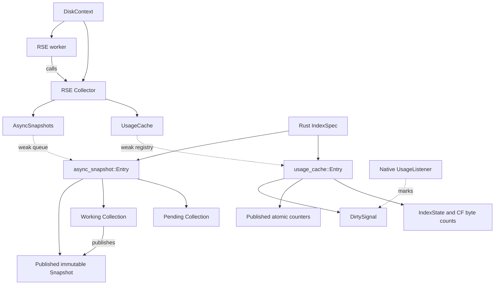

# MOD-18033: Search-owned background metrics

## Scope and behavior

RediSearch and RediSearchEnterprise change together. Redis and Speedb need no
changes. The existing BigModule V1 disk-usage callback returns one atomic total;
it does not walk the C index dictionary or read a native property. Ordinary
reads return the last successful value, including after expiry or an error.
New empty indexes contribute zero. Existing storage is sampled synchronously
when opened, before its contribution becomes visible.

Search INFO still walks visible indexes to aggregate numeric snapshots and live
RAM counters. It does not collect Speedb properties. FT.INFO and other explicit
synchronous diagnostic consumers retain their existing behavior. Speedb's own
internal statistics collection is outside this change.

Operational accounting uses the existing `live-sst-files-size` meaning for the
document-table, fulltext, missing, tag, numeric and vector column families. The
current RSE branch stores the document table in `default`; use its configured
constant rather than an old literal name. This is live SST size, not physical
filesystem usage, retained obsolete files, or memtable bytes.

## Private interface

Four callbacks connect the repositories: `stopMetrics`, `activateTarget`,
`getCachedTotalDiskUsage` and `readCachedIndexMetrics`. All take existing disk or
index handles; no worker handle or scheduling callback crosses FFI.

`readCachedIndexMetrics` returns memory, operational disk usage and block estimates,
and stages the component snapshot for the existing INFO output callback.
Index retirement and INFO-map cleanup use the existing main-thread close callback.

## Executor and scheduling

RSE owns one named Rust thread, `search-metrics`, started by the disk open path.
The worker owns shared collector state, never a mutable DiskContext or C IndexSpec.
A condition variable wakes it for native events, layout changes, or activation;
a monotonic one-second deadline requests full usage reconciliation even under
continuous events. Deadline overruns coalesce into one reconciliation on the next
batch, without a backlog of missed ticks.

One pending request flag coalesces event notifications. The worker clears it before
collection, so requests arriving during collection remain pending. Unfinished
batches continue directly in the loop; there is no job queue or submitted-job flag.
Every iteration services usage and diagnostic collection. Diagnostic snapshots keep
their five-second deadline after a completed pass, checked by worker invocations.
Failed usage reads retain last-good values and keep their minimum one-second retry
backoff. Each cache retains its approximately 5 ms batch budget; a single native
read can exceed it. There is no hard freshness bound under overload.

| Owner | Responsibility |
|---|---|
| RediSearch | Redis API integration, index visibility, INFO routing, early stop before teardown. |
| RSE | Worker, wakeups, deadlines, fork exclusion, collection, cache publication, stop/join. |

The worker's scheduling mutex is never held during native reads or while joining.
Events can therefore notify it while collection is active. Stop marks the worker
stopped, wakes it, and joins its active batch; later notifications are harmless.
The explicit stop callback runs before global index cleanup. Disk close also stops
collection, covering ordinary close and initialization failure, and is idempotent.

Fork hooks are installed once and refer only to a process-lifetime native barrier.
Prepare prevents a new batch and drains the active batch. The parent releases the
barrier and resumes collection. The child never touches inherited Rust scheduler
locks or joins the absent worker; disk close leaves inherited resources alone and
cached reads use the existing scalar mirrors. No Redis timer or new Redis API is
required.

## Ownership and lifecycle

The worker never touches `specDict_g` or C IndexSpecs. Its Rust registry holds
weak entry/DB references and CF names plus native identities. A DB and CF are
pinned only during a native read. A CF-layout revision rejects results collected
for an old target. Each index publishes its contribution and metric categories
atomically; a wider internal ledger prevents overflow from breaking later
subtraction. The externally visible total saturates at `u64::MAX`.

A separate lifetime native listener marks flush and compaction completion dirty
and notifies the executor. Its RAII token is owned alongside the DB using `self_cell`, so it
is removed before the DB closes. Existing GC-scoped listeners retain their
existing reclaimed-byte semantics.

An index becomes accounted when added to the visible C registry. Removal/drop
subtracts its contribution immediately, then drains its current native read
before BigModule unregisters the DB. Late completion cannot re-add a removed
index. Dynamic CF creation replaces the target and requests refresh.
Cold DB open/reopen seeds existing SSTs before activation.

The collector only reads native properties, so foreground persistence windows
do not pause it. Shutdown drains/joins the worker before closing DiskContext. Fork exclusion and
child behavior are described above.

## Cache structure

Two caches share one worker. Operational usage needs immediate create/drop accounting
and one atomic total for quota/eviction. Diagnostic INFO needs stable aggregates of
many properties. Keeping these contracts separate avoids coupling their refresh cycles.

The index owns its entries; the registries never keep an index alive. The worker
borrows native DB/CF handles only for a property read and never accesses C IndexSpecs.

| Type | Role and reason for the boundary |
|---|---|
| `Worker` | DiskContext-owned join handle; stopping it drains collection before teardown. Its thread captures only shared collector state. |
| `Wake` / `State` | Shared condition variable and pending/stopped flags. Native listeners can notify without retaining the worker or disk context. |
| `ForkGate` / `BatchGuard` | Process-lifetime native barrier and its thread-bound guard. Fork hooks cannot retain a particular disk context or touch inherited Rust locks in the child. |
| `Collector` | Shared worker context, separate from the mutable main-thread `DiskContext`. Services both caches each invocation. |
| `Target` | Weak DB reference and CF names/identities, shared by both cache implementations. Detects replaced CFs without retaining native handles. |
| `UsageCache` / `Registry` | Global atomic total for readers; membership and the exact accounting sum change together under the registry lock. |
| `usage_cache::Entry` / `IndexState` | Per-index published counters plus locked lifecycle/refresh state. A separate native-read lock lets drop debit accounting before draining the read. |
| `DirtySignal` / `UsageListener` | Minimal event notification state and its native adapter. A callback can request refresh without retaining the index. |
| `AsyncSnapshots` | Weak scheduling queue serviced by the RSE worker. |
| `async_snapshot::Entry` | One index's pending replacement, active collection, and published result; rejects obsolete results and drains on retirement. |
| `Collection` | Target, cursor, due time, revision, and working snapshot. Resumes a pass after yielding between native properties. |
| `Snapshot` | Stable aggregate plus per-CF last-good values, preserved on failed property reads. |

The diagnostic entry has three distinct roles:

- **Pending:** the latest layout replacement; submitting it must not wait for native I/O.
- **Working:** mutable collection progress; its lock spans one native property read.
- **Published:** an immutable result retained by INFO readers while collection continues.

A layout revision prevents old work from publishing after replacement. Working and
published snapshots share storage until the next property read needs a private copy.
Per-CF history preserves matching last-good values when the layout changes; the
precomputed aggregate keeps INFO from walking that history.

These ownership and synchronization boundaries are the important part, not the
number of named types. Small wrappers could be inlined, but that alone would not
remove the state or locking requirements.

RediSearch requests early stop before index destruction; RSE owns collection and
its execution. Child-process checks do not replace the pre-fork drain.

## Coordinated PRs and qualification

1. **RediSearch:** V1 callback, cached INFO reads, visibility and early-stop hooks,
   private FFI contract and C/C++ integration tests.
2. **RediSearchEnterprise:** worker scheduling and fork exclusion, operational ledger,
   listener ownership, seeding, fair incremental refresh, diagnostic snapshots,
   scalar mirrors, Rust tests and the matching RediSearch dependency.

Validation must cover successful/error/zero samples, overflow followed by drop,
native flush events, persisted reopen, layout replacement, retention of last-good
values on errors, diagnostic fairness, stop/drain, fork and shutdown.
Representative performance qualification remains a separate matched comparison
on an idle machine: normal writes/reads with and without INFO, main-thread
property attribution, operational refresh progress and collector native contention.
Historical prototype timings do not establish this implementation's results.
