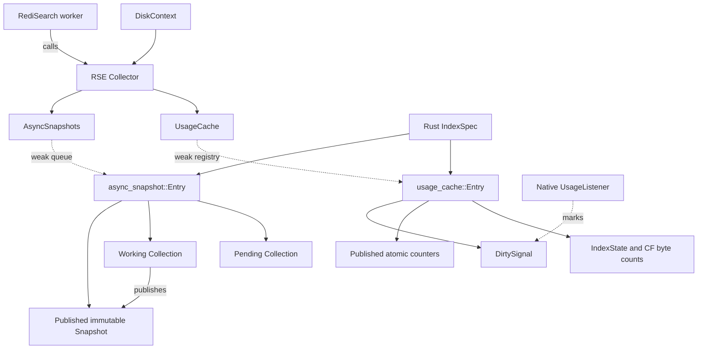

# MOD-18033: Search-owned background metrics

## Scope and behavior

RediSearch and RediSearchEnterprise change together. Redis and Speedb need no
changes. The existing BigModule V1 disk-usage callback returns one atomic total;
it does not walk the C index dictionary or read a native property. Ordinary
reads return the last successful value, including after expiry or an error.
New empty indexes contribute zero. Existing storage is sampled synchronously
when opened, before its contribution becomes visible.

Search INFO still walks visible indexes to aggregate numeric snapshots and live
RAM counters. It does not collect Speedb properties. FT.INFO and other explicit
synchronous diagnostic consumers retain their existing behavior. Speedb's own
internal statistics collection is outside this change.

Operational accounting uses the existing `live-sst-files-size` meaning for the
document-table, fulltext, missing, tag, numeric and vector column families. The
current RSE branch stores the document table in `default`; use its configured
constant rather than an old literal name. This is live SST size, not physical
filesystem usage, retained obsolete files, or memtable bytes.

## Private interface

Five added callbacks connect the repositories: `getCollector` (also registers the executor notification), `collect`,
`activateTarget`,
`getCachedTotalDiskUsage` and `readCachedIndexMetrics`. The last returns one
numeric record containing memory, operational disk usage and block estimates,
and stages the component snapshot for the existing INFO output callback.

Index retirement and INFO-map cleanup run
through the existing main-thread close callback, which receives the owning disk
context. No separate retirement or blocking freshness API crosses FFI.

## Executor and scheduling

RediSearch owns one dedicated single-worker pool using its existing `deps/thpool`
implementation. One Redis timer requests periodic reconciliation every second.
There is no 50 ms poll. RSE marks all registered usage entries dirty for that
periodic request; otherwise it collects only entries with an event request or an
unfinished pass. Diagnostic snapshots retain their five-second deadline after a
completed pass and get a batch on every worker invocation, preventing starvation.
The periodic timer checks that deadline too; it can observe it up to one timer
interval later, before accounting for other load.

Native flush/compaction completion marks the affected index dirty and calls the
thread-safe executor notification registered through `getCollector`. Activation
and layout changes request work through the same path. The callback calls no Redis
timer API and does not wait for collection. It is process-lifetime code; its target
is the static executor gate, not a pointer into a freed collector or index.

| Owner | Responsibility |
|---|---|
| RediSearch | One-second timer, worker pool, coalesced submission, fork barrier, shutdown drain. |
| RSE | Dirty indexes, incremental collection, retry backoff, five-second diagnostic deadline. |

The executor gate protects `submitted`, `requested`, and `periodicRequested`.
Requests set the appropriate flags and submit only if no job is outstanding. A job
consumes these flags before collecting. A request arriving during collection stays
pending; completion schedules at most one successor for that request or unfinished
work. A periodic request received during an active pass is preserved as well.

RSE clears an index's dirty flag before its native reads. Events after that point
survive publication, because a flush after a CF was sampled need not be covered by
the newly published result. Per-index failure state enforces at least a one-second
backoff; the periodic request retries later. Failed reads keep last-good values.
No immediate failure retry loop or dedicated retry timer is needed.

Each worker invocation runs an operational batch and a diagnostic batch. Each
batch checks its approximately 5 ms budget between native reads; a single native
read can exceed that budget. Unfinished work resubmits immediately. Repeated events
coalesce, but sustained changes can cause back-to-back passes; there is no hard
freshness bound. INFO overlays diagnostic SST fields with operational SST values.

Stop disables submissions under the executor gate before draining and destroying
the worker. Later native notifications are harmless. Fork prepare blocks new
submissions and drains the current batch. Pending requests during that window are
serviced by an existing queued job or the next periodic timer in the parent. Child
notifications are rejected before taking executor locks; Rust also checks its
creator PID before calling the notification.

This split reuses RediSearch's module lifecycle and pool wiring. Moving the executor
to RSE remains possible but would still need timer, shutdown, and fork coordination.
No new INFO fields, commands, configuration options, or synchronous expiry fallback
are introduced.

## Ownership and lifecycle

The worker never touches `specDict_g` or C IndexSpecs. Its Rust registry holds
weak entry/DB references and CF names plus native identities. A DB and CF are
pinned only during a native read. A CF-layout revision rejects results collected
for an old target. Each index publishes its contribution and metric categories
atomically; a wider internal ledger prevents overflow from breaking later
subtraction. The externally visible total saturates at `u64::MAX`.

A separate lifetime native listener marks flush and compaction completion dirty
and notifies the executor. Its RAII token is owned alongside the DB using `self_cell`, so it
is removed before the DB closes. Existing GC-scoped listeners retain their
existing reclaimed-byte semantics.

An index becomes accounted when added to the visible C registry. Removal/drop
subtracts its contribution immediately, then drains its current native read
before BigModule unregisters the DB. Late completion cannot re-add a removed
index. Dynamic CF creation replaces the target and requests refresh.
Cold DB open/reopen seeds existing SSTs before activation.

The collector only reads native properties, so foreground persistence windows
do not pause it. Shutdown stops the timer and drains/joins the pool before
closing DiskContext. Generic `pthread_atfork` hooks prevent new work and drain
one current batch before fork. The parent resumes; the child submits/joins no
worker and reads atomic scalar mirrors rather than inherited Rust locks.

## Cache structure

Two caches share one worker. Operational usage needs immediate create/drop accounting
and one atomic total for quota/eviction. Diagnostic INFO needs stable aggregates of
many properties. Keeping these contracts separate avoids coupling their refresh cycles.

The index owns its entries; the registries never keep an index alive. The worker
borrows native DB/CF handles only for a property read and never accesses C IndexSpecs.

| Type | Role and reason for the boundary |
|---|---|
| `Collector` | Shared worker context, separate from the mutable main-thread `DiskContext`. Services both caches each invocation. |
| `Target` | Weak DB reference and CF names/identities, shared by both cache implementations. Detects replaced CFs without retaining native handles. |
| `UsageCache` / `Registry` | Global atomic total for readers; membership and the exact accounting sum change together under the registry lock. |
| `usage_cache::Entry` / `IndexState` | Per-index published counters plus locked lifecycle/refresh state. A separate native-read lock lets drop debit accounting before draining the read. |
| `DirtySignal` / `UsageListener` | Minimal event notification state and its native adapter. A callback can request refresh without retaining the index. |
| `AsyncSnapshots` | Weak scheduling queue; the C executor supplies the single worker. |
| `async_snapshot::Entry` | One index's pending replacement, active collection, and published result; rejects obsolete results and drains on retirement. |
| `Collection` | Target, cursor, due time, revision, and working snapshot. Resumes a pass after yielding between native properties. |
| `Snapshot` | Stable aggregate plus per-CF last-good values, preserved on failed property reads. |

The diagnostic entry has three distinct roles:

- **Pending:** the latest layout replacement; submitting it must not wait for native I/O.
- **Working:** mutable collection progress; its lock spans one native property read.
- **Published:** an immutable result retained by INFO readers while collection continues.

A layout revision prevents old work from publishing after replacement. Working and
published snapshots share storage until the next property read needs a private copy.
Per-CF history preserves matching last-good values when the layout changes; the
precomputed aggregate keeps INFO from walking that history.

These ownership and synchronization boundaries are the important part, not the
number of named types. Small wrappers could be inlined, but that alone would not
remove the state or locking requirements.

RediSearch owns timer/pool scheduling, the pre-fork barrier, and early shutdown.
RSE owns native collection, cache ownership, and accounting. Stop rejects new jobs
and drains before index destruction. Child-process checks do not replace the
pre-fork drain; there is no general pause/resume API or second collector mutex.

## Coordinated PRs and qualification

1. **RediSearch:** the pool, fork/shutdown gates, V1 callback, cached INFO
   reads, visibility hooks, private FFI contract and C/C++ tests.
2. **RediSearchEnterprise:** the operational ledger, listener ownership, seeding,
   fair incremental refresh, diagnostic snapshots and scalar mirrors,
   Rust tests and the matching RediSearch dependency.

Validation must cover successful/error/zero samples, overflow followed by drop,
native flush events, persisted reopen, layout replacement, retention of last-good
values on errors, diagnostic fairness, stop/drain, fork and shutdown.
Representative performance qualification remains a separate matched comparison
on an idle machine: normal writes/reads with and without INFO, main-thread
property attribution, operational refresh progress and collector native contention.
Historical prototype timings do not establish this implementation's results.
