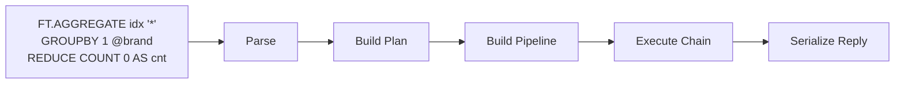
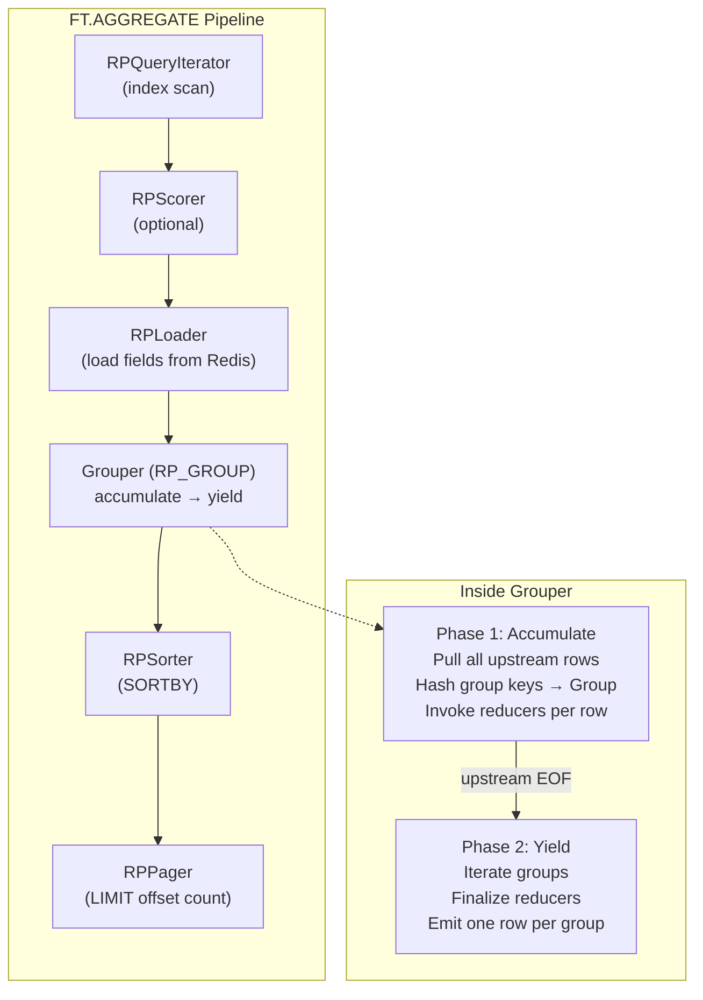
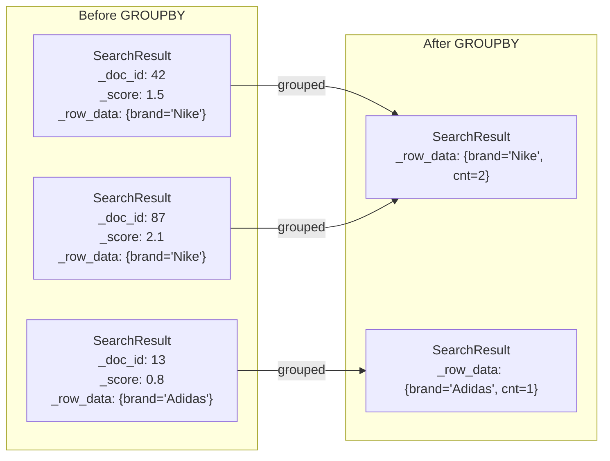

# RediSearch GROUPBY Mechanism — Technical Documentation

This documentation provides an in-depth technical reference for the **GROUPBY** mechanism
in RediSearch's `FT.AGGREGATE` command. It covers the complete lifecycle from command
parsing through result emission, for both single-shard and cluster (multi-shard) deployments.

## Table of Contents

| Document | Description |
|----------|-------------|
| [Data Types & Entities](data-types.md) | Core data structures: `SearchResult`, `RLookupRow`, `Group`, `Grouper`, `Reducer`, the `ResultProcessor` chain, and how they relate to each other |
| [Single-Shard Flow](single-shard-flow.md) | End-to-end walkthrough of a `GROUPBY` on a single shard — from parsing through pipeline construction to result emission |
| [Cluster Flow](cluster-flow.md) | How the coordinator distributes a `GROUPBY` across shards, what data travels over the network, and how partial results are merged |
| [Reducers & Distribution](reducers.md) | The reducer system, all built-in reducers, and the distribution strategies that split reducers between shards and the coordinator |

## Quick Overview

`FT.AGGREGATE` with `GROUPBY` processes results through a **chain of `ResultProcessor`s** — a
linked list where each processor pulls rows from its upstream, transforms them, and passes
them downstream.

The `GROUPBY` step is special — it is a **reducing** processor. It consumes **all** upstream
rows (accumulation phase), groups them by key, runs reducers on each group, then emits one
row per group (yield phase). This two-phase behavior is the fundamental characteristic that
differentiates it from pass-through processors.

### Architecture at a Glance

### Key Insight: SearchResult Transforms

Before `GROUPBY`, each `SearchResult` represents a **document** — it carries a document ID, 
score, and field values loaded from the index or Redis keyspace.

After `GROUPBY`, each `SearchResult` represents a **group** — the document-specific fields 
(`_doc_id`, `_score`, `_document_metadata`) are irrelevant. The `_row_data` (`RLookupRow`) 
now holds the group key values and the reducer output values.

## Source File Map

| Area | Key Files |
|------|-----------|
| Command parsing | `src/aggregate/aggregate_request.c` |
| Aggregate plan | `src/aggregate/aggregate_plan.c`, `src/aggregate/aggregate_plan.h` |
| Grouping engine | `src/aggregate/group_by.c` |
| Reducer framework | `src/aggregate/reducer.h`, `src/aggregate/reducer.c` |
| Reducer impls | `src/aggregate/reducers/count.c`, `sum.c`, `minmax.c`, etc. |
| Pipeline construction | `src/pipeline/pipeline_construction.c` |
| Result processor chain | `src/result_processor.h` |
| Lookup system | `src/rlookup.h`, `src/rlookup.c` |
| SearchResult | `src/redisearch_rs/headers/search_result_rs.h`, `src/search_result.h` |
| Cluster distribution | `src/coord/dist_plan.cpp` |
| Cluster execution | `src/coord/dist_aggregate.c` |
| Network result proc | `src/coord/rpnet.h`, `src/coord/rpnet.c` |
| Aggregate execution | `src/aggregate/aggregate_exec.c` |
