# Cluster GROUPBY Flow

In a Redis Cluster deployment, `FT.AGGREGATE` with `GROUPBY` involves coordination between
a **coordinator node** and multiple **shard nodes**. The coordinator splits the aggregation
plan, distributes partial work to shards, collects partial results, and merges them locally.

## High-Level Architecture

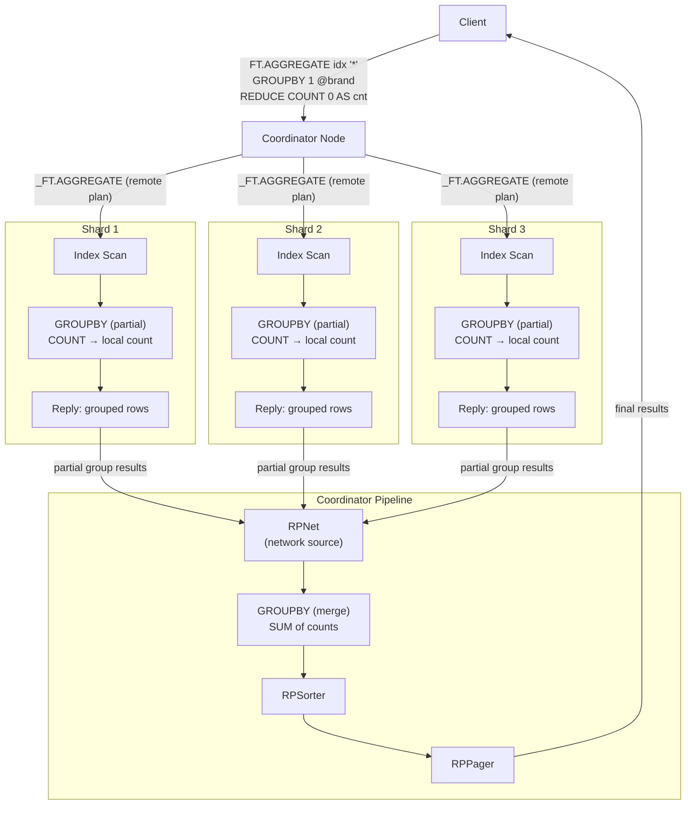

---

## End-to-End Flow

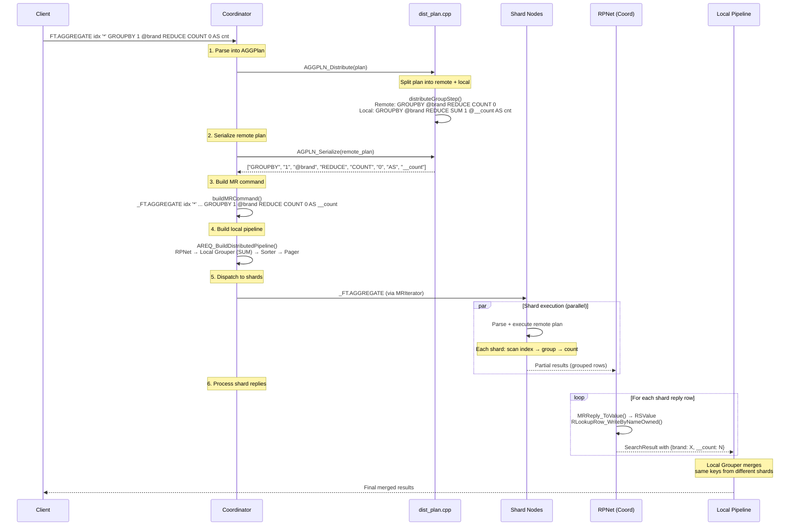

---

## Phase 1: Plan Distribution

**Entry point:** `AGGPLN_Distribute()` in `src/coord/dist_plan.cpp`  
**Called from:** `RSExecDistAggregate()` → `prepareForExecution()`

### How the Plan is Split

`AGGPLN_Distribute()` walks the original plan step by step. Steps that can run on shards
are moved or copied to a **remote plan**. The original plan becomes the **local plan**
(coordinator-side).

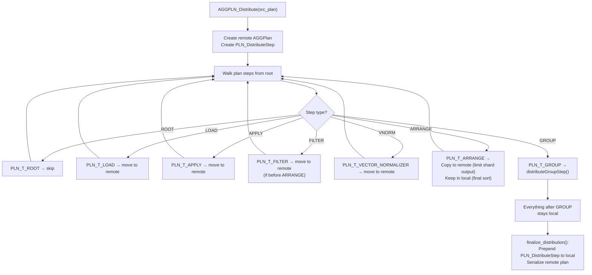

### distributeGroupStep() in Detail

This is the core function that splits a single `GROUPBY` step into remote and local parts.
For each reducer, it calls a **distribution function** that knows how to decompose the
reducer into a shard-side computation and a coordinator-side merge.

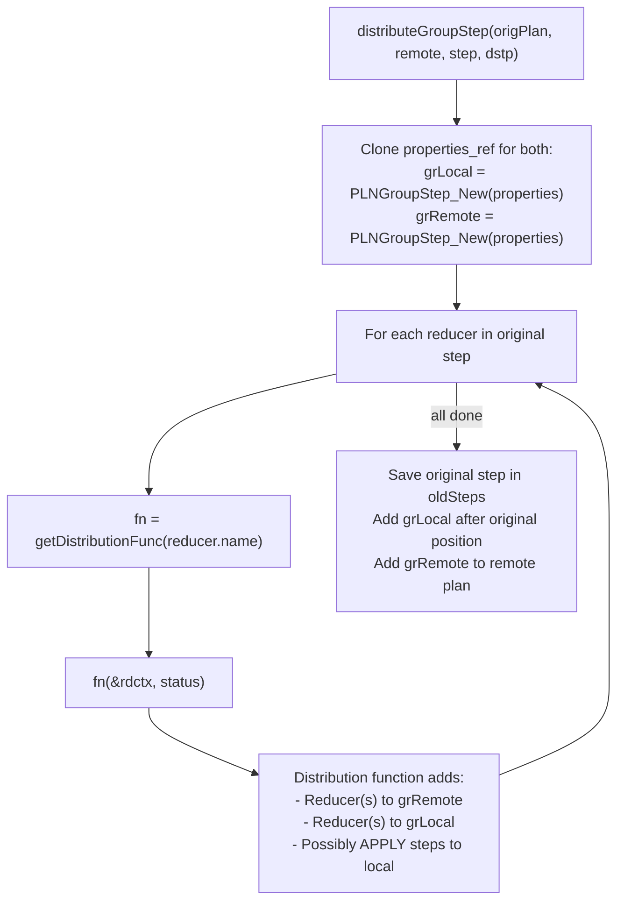

### Plan Before and After Distribution

**Original plan:**
```
ROOT → GROUPBY 1 @brand REDUCE COUNT 0 AS cnt → SORTBY 2 @cnt DESC → LIMIT 0 10
```

**After distribution:**

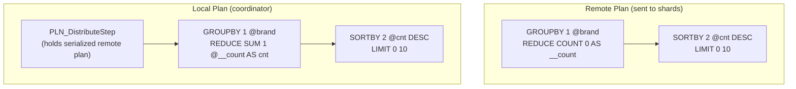

Notice:
- The remote `COUNT` uses a temporary alias `__count` (double-underscore prefix)
- The local step uses `SUM` on `@__count` to merge the partial counts
- The `SORTBY`/`LIMIT` is duplicated to both plans — shards pre-sort and limit their
  output, and the coordinator re-sorts and re-limits the merged result

---

## Phase 2: Command Building and Dispatch

**Entry point:** `buildMRCommand()` in `src/coord/dist_aggregate.c`

### What is Sent to Shards

The coordinator serializes the remote plan and builds an `_FT.AGGREGATE` command (internal
command, prefixed with underscore):

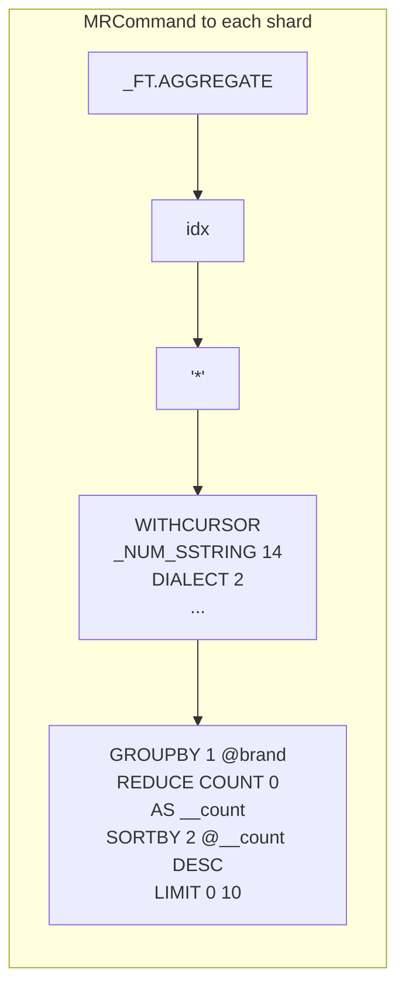

The command includes:
- Index name and query string
- Execution options (`WITHCURSOR`, `DIALECT`, `FORMAT`, `SCORER`, `TIMEOUT`, etc.)
- The serialized remote plan (GROUPBY + reducers + optional SORTBY/LIMIT)
- Any LOAD directives for fields needed by filter expressions
- Query PARAMS if present

### Dispatch via MRIterator

The command is dispatched to all shards via `MR_Iterate()`, which creates an `MRIterator`
that manages concurrent communication with all shards. Replies are collected asynchronously
and made available through `MRIterator_Next()`.

---

## Phase 3: Shard Execution

Each shard receives `_FT.AGGREGATE` and processes it exactly like a [single-shard flow](single-shard-flow.md), except:

1. The plan contains only the **remote** portion (GROUPBY with partial reducers)
2. The shard groups its local documents and applies the partial reducers
3. The result is serialized and sent back to the coordinator

### Shard Reply Format

**RESP2:**
```
*2                       # Array: [results_array, cursor_id]
  *N                     # Results array: [total, row1, row2, ...]
    :42                  # total_results from this shard
    *4                   # Row 1: [field, value, field, value, ...]
      $5 brand
      $4 Nike
      $7 __count
      $2 15
    *4                   # Row 2
      $5 brand
      $6 Adidas
      $7 __count
      $1 8
  :0                     # cursor_id (0 = no more data)
```

**RESP3:**
```
[
  {
    "total_results": 42,
    "results": [
      {"brand": "Nike", "__count": 15},
      {"brand": "Adidas", "__count": 8}
    ]
  },
  0  // cursor_id
]
```

---

## Phase 4: Coordinator Pipeline Execution

### Pipeline Structure

The coordinator's physical pipeline looks like:

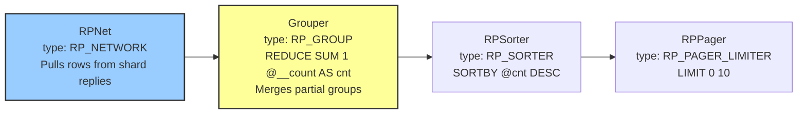

### RPNet: Network to SearchResult

The `RPNet` processor is the bridge between network replies and the local pipeline. Its
`rpnetNext()` function converts shard reply data into `SearchResult` objects.

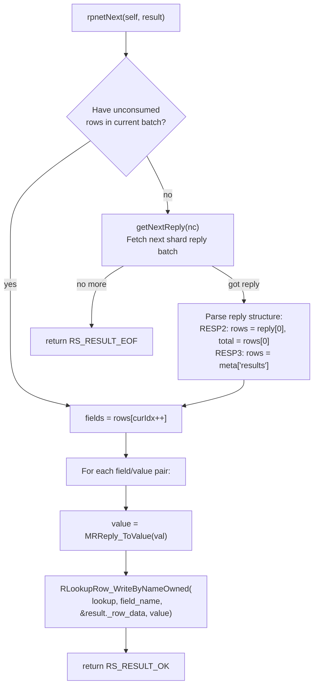

### Merge via Local Grouper

The local Grouper processes rows from RPNet identically to the single-shard Grouper, but
the data it sees is already **pre-grouped** by the shards. Same brand keys from different
shards are merged into the same group, and the local reducers (e.g., `SUM`) aggregate the
partial results.

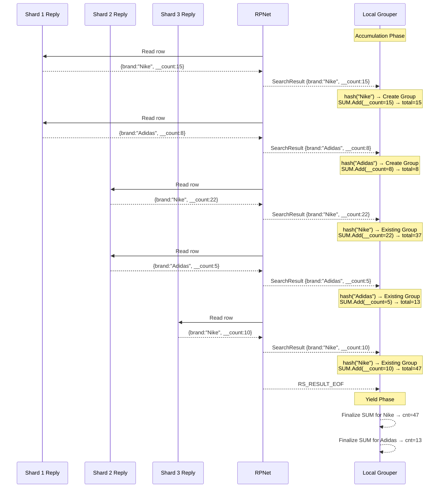

### WITHCOUNT and ShardResponseBarrier

When `WITHCOUNT` is specified, the coordinator needs an **accurate total result count**
from the start of the response. The `ShardResponseBarrier` mechanism ensures this:

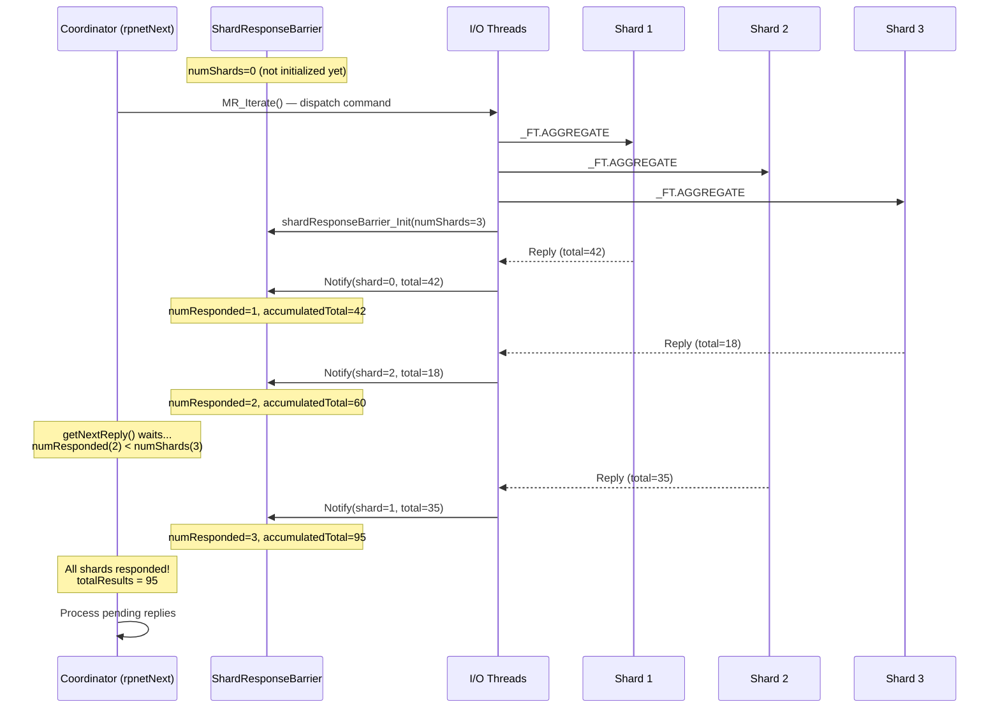

---

## Data Flow Summary: What Moves Where

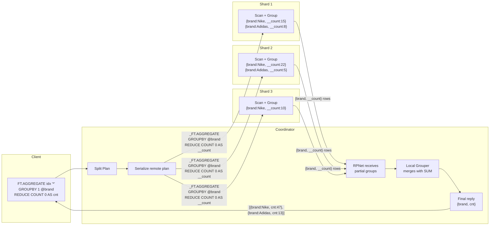

### Network Data Size Considerations

The distribution strategy is designed to minimize network traffic:

1. **Shards group locally** — instead of sending every raw document, shards send one row
   per unique group key. For high-cardinality fields this still produces many rows, but
   for typical group-by fields (category, status, region) this is a massive reduction.

2. **Pre-sorting and limiting on shards** — if the original query has `SORTBY ... LIMIT`,
   the shards also sort and limit, sending at most `offset + limit` rows per shard instead
   of all groups.

3. **Temporary aliases** — distributed reducers use `__`-prefixed aliases (e.g., `__count`)
   as internal column names. These are hidden from the final output.

---

## Deduplication of Remote Reducers

When a query uses multiple reducers that decompose to the same shard-side reducer, the
distribution logic avoids duplication. For example:

```
GROUPBY 1 @brand REDUCE COUNT 0 AS cnt REDUCE AVG 1 @price AS avg_price
```

Both `COUNT` and `AVG` need a `COUNT` on the remote side. The `addRemote()` method in
`ReducerDistCtx` checks for existing reducers with the same name and arguments before
adding a new one:

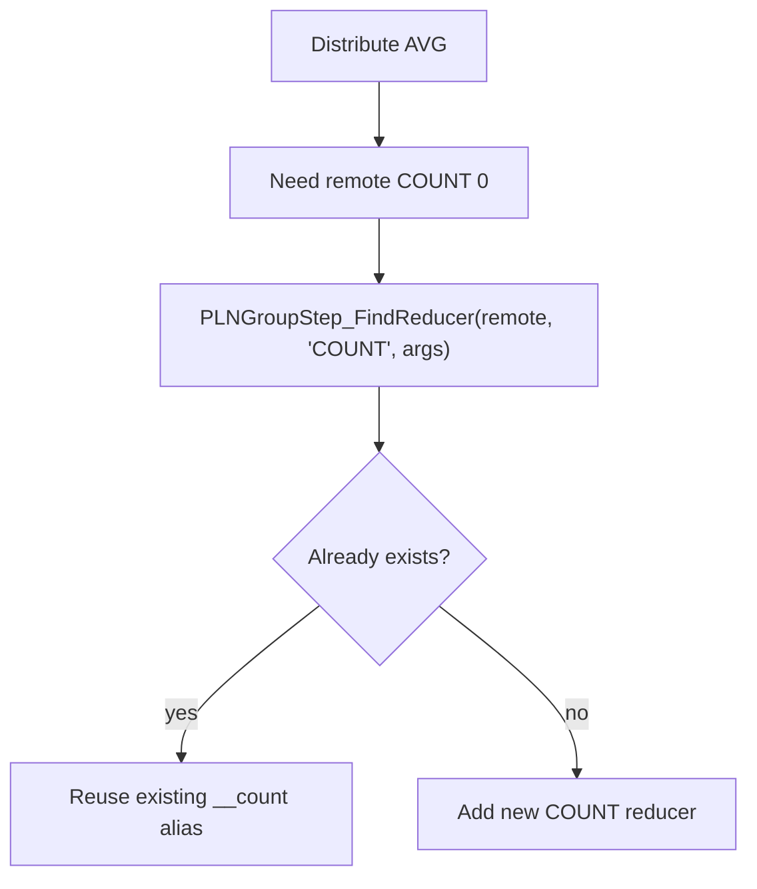

This prevents sending redundant `COUNT` reducers when `COUNT` and `AVG` are used together.

---

## Error and Timeout Handling

### Shard Errors

If any shard returns an error during the collection phase:

1. `ShardResponseBarrier` sets `hasShardError = true`
2. The error reply is extracted from pending replies
3. The error is propagated to `QueryProcessingCtx.err`
4. The coordinator returns `RS_RESULT_ERROR`

### Timeouts

Two timeout scenarios:

1. **Waiting for first responses:** If not all shards respond within the timeout while
   using WITHCOUNT, the barrier check triggers `RS_RESULT_TIMEDOUT`
2. **During row processing:** Each call to `rpnetNext()` checks the query timeout. If
   expired, the `MRIteratorCtx` is flagged and the iterator sends `CURSOR DEL` to shards
   instead of `CURSOR READ`.

### Reducers That Can't Be Distributed

Some reducers (like `COUNT_DISTINCT`, `FIRST_VALUE`) don't have registered distribution
functions. If the coordinator encounters one, `getDistributionFunc()` returns `NULL` and
the step cannot be distributed — the GROUP step stays in the local plan only. This means
all raw rows must be sent from shards (with just LOAD), and grouping happens entirely on
the coordinator. This falls back gracefully but with higher network cost.
