# Data Types & Entities

This document describes the core data structures involved in the GROUPBY mechanism,
how they relate to each other, and how data transforms as it flows through the pipeline.

## Entity Relationship Overview

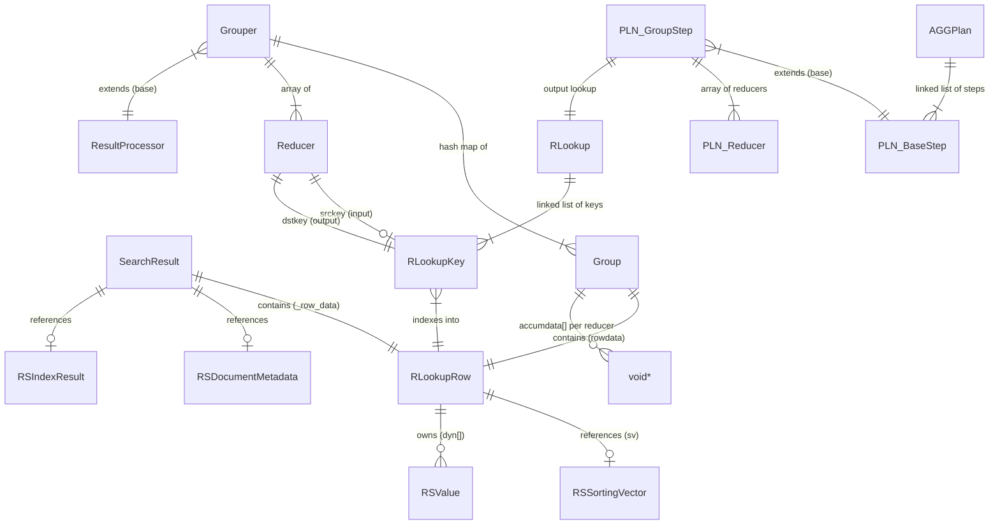

---

## SearchResult

**File:** `src/redisearch_rs/headers/search_result_rs.h`, `src/search_result.h`

The `SearchResult` is the **universal row object** that flows through the entire
`ResultProcessor` chain. Every processor receives a pointer to a `SearchResult`, reads
or modifies it, and passes it downstream.

```c
typedef struct SearchResult {
    t_docId              _doc_id;              // Internal document ID
    double               _score;               // Relevance score
    RSScoreExplain      *_score_explain;        // Score breakdown (optional)
    const RSDocumentMetadata *_document_metadata; // Document metadata pointer
    const RSIndexResult  *_index_result;         // Index result (term positions, etc.)
    RLookupRow           _row_data;             // Field values — the main data carrier
    SearchResultFlags    _flags;                // Flags (e.g., expired doc)
} SearchResult;
```

### Dual Nature: Document vs. Group

The same struct serves two fundamentally different purposes depending on where it is
in the pipeline:

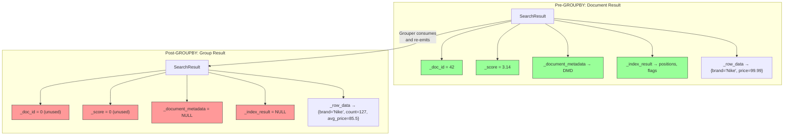

After GROUPBY, only `_row_data` carries meaningful information. The group key values and
reducer outputs are all stored there.

### Key Operations

| Function | Purpose |
|----------|---------|
| `SearchResult_New()` | Zero-initialize a result |
| `SearchResult_Clear(res)` | Reset `_row_data` without freeing the struct |
| `SearchResult_Destroy(res)` | Full cleanup of owned resources |
| `SearchResult_GetRowDataMut(res)` | Get mutable pointer to `_row_data` |

---

## RLookupRow

**File:** `src/rlookup.h`

The `RLookupRow` is the **field-value storage** inside each `SearchResult`. It provides
indexed access to values via `RLookupKey` objects, avoiding string-based lookups at
query time.

```c
typedef struct {
    const RSSortingVector *sv;   // Sortable values from the index (read-only)
    RSValue             **dyn;   // Dynamic values (loaded/computed)
    size_t                ndyn;  // Count of values in dyn
} RLookupRow;
```

### Two Value Sources

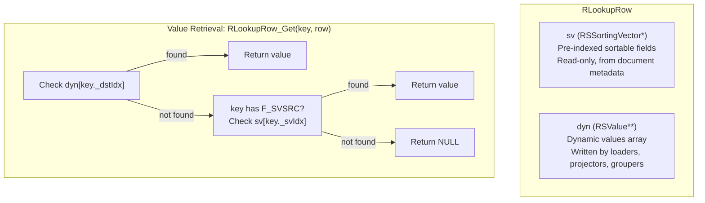

The lookup order is:
1. Check `dyn[key._dstIdx]` — the dynamic array (values written by processors)
2. If not found and key has `RLOOKUP_F_SVSRC`, check `sv[key._svIdx]` — the sorting vector

### In the GROUPBY Context

- **Before GROUPBY:** The row may contain values from the sorting vector (indexed sortable
  fields) and/or dynamically loaded values from the Redis keyspace.
- **Inside GROUPBY:** The Grouper reads values from the upstream row via `srckeys`, then
  writes group key values to the Group's own `RLookupRow` via `dstkeys`.
- **After GROUPBY:** The yielded `SearchResult._row_data` contains only the group key
  values and reducer outputs — no sorting vector, no document source data.

---

## RLookup and RLookupKey

**File:** `src/rlookup.h`, `src/rlookup.c`

An `RLookup` is a **schema registry** — a linked list of `RLookupKey` objects that map
field names to array indices. Each step in the aggregation plan that produces new fields
(like `GROUPBY`) has its own `RLookup`.

```c
typedef struct RLookup {
    RLookupKey *_head;         // First key in linked list
    RLookupKey *_tail;         // Last key
    uint32_t    _rowlen;       // Number of slots in the row
    uint32_t    _options;      // Options flags
    IndexSpecCache *_spcache;  // Schema cache for field resolution
} RLookup;
```

An `RLookupKey` is a **named slot reference**:

```c
typedef struct RLookupKey {
    uint16_t _dstIdx;          // Index in RLookupRow.dyn[]
    uint16_t _svIdx;           // Index in RSSortingVector (if sortable)
    char    *_name;            // Field name (e.g., "brand")
    char    *_path;            // Field path (e.g., "$.brand")
    size_t   _nameLen;
    uint32_t _flags;           // RLOOKUP_F_* flags
    struct RLookupKey *_next;  // Next key in linked list
} RLookupKey;
```

### How Lookups Chain Across Steps

Each reducing step (like `GROUPBY`) introduces a new `RLookup`, breaking the lookup chain.
Non-reducing steps (like `FILTER`, `APPLY`) share the lookup from their upstream reducing step.

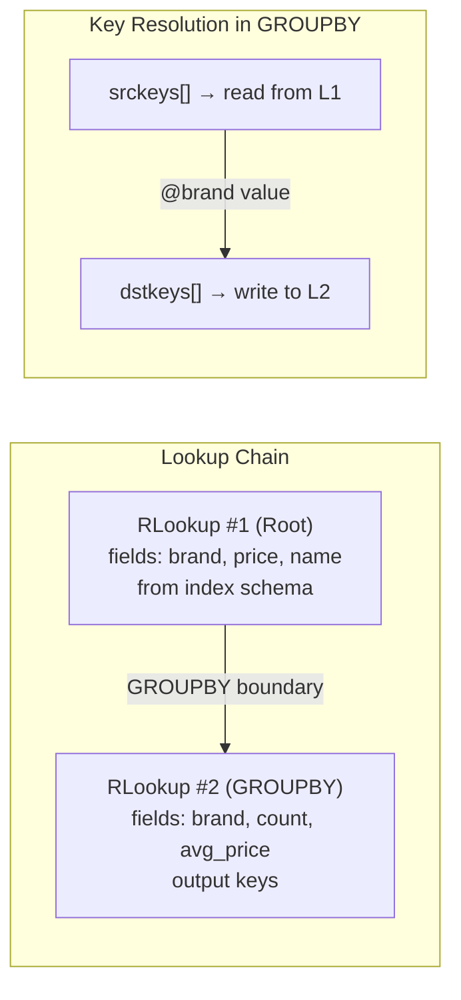

### Key Flag Reference

| Flag | Value | Meaning |
|------|-------|---------|
| `RLOOKUP_F_DOCSRC` | 0x01 | Value comes from the document |
| `RLOOKUP_F_SCHEMASRC` | 0x02 | Field is part of the index schema |
| `RLOOKUP_F_SVSRC` | 0x04 | Value resides in the sorting vector |
| `RLOOKUP_F_QUERYSRC` | 0x08 | Created by the query (APPLY, GROUPBY output) |
| `RLOOKUP_F_HIDDEN` | 0x100 | Transient field, not emitted in output |
| `RLOOKUP_F_UNRESOLVED` | 0x80 | Source unknown, needs resolution later |

---

## Group

**File:** `src/aggregate/group_by.c`

A `Group` is the per-unique-key accumulator. One `Group` is created for each distinct
combination of group key values encountered during accumulation.

```c
typedef struct {
    RLookupRow  rowdata;       // Group key values (for output)
    void       *accumdata[0];  // Flexible array: one slot per reducer
} Group;
```

The `accumdata` array uses a C flexible array member (`[0]`). Its actual length equals
the number of reducers in the `Grouper`. Each slot holds the reducer-specific accumulator
created by `Reducer::NewInstance()`.

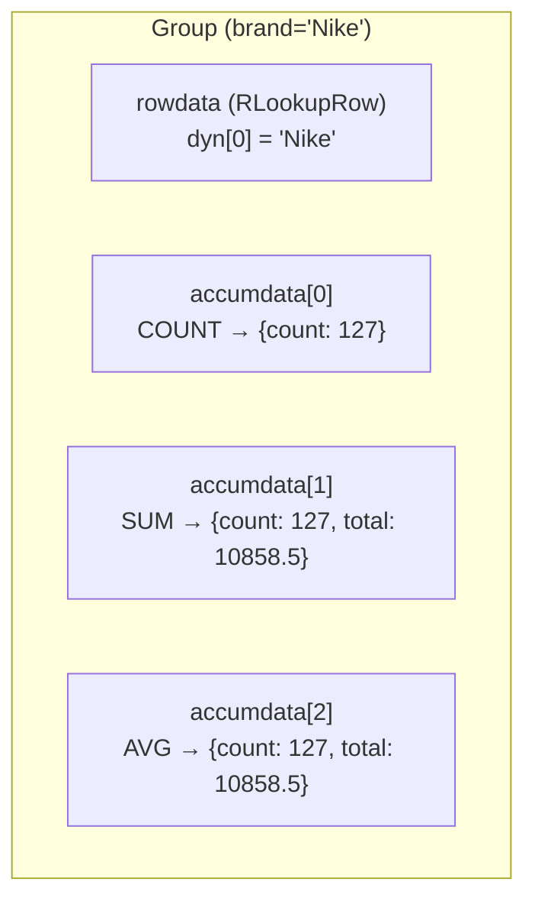

### Memory Layout

Groups are allocated via `BlkAlloc` (block allocator) in 1024-group blocks to minimize
fragmentation. The allocation size per group is:

```
sizeof(Group) + sizeof(void*) * num_reducers
```

### Lifecycle

```mermaid
stateDiagram-v2
    [*] --> Created: extractGroups() finds new hash
    Created --> Accumulating: invokeReducers() calls Reducer::Add()
    Accumulating --> Accumulating: more rows with same key
    Accumulating --> Finalizing: Grouper_rpYield() calls Reducer::Finalize()
    Finalizing --> Emitted: values written to SearchResult._row_data
    Emitted --> [*]: Grouper_rpFree() cleans up
```

---

## Grouper

**File:** `src/aggregate/group_by.c`

The `Grouper` is the **core grouping engine**, implemented as a `ResultProcessor`. It
owns the hash map of groups, the source/destination key mappings, and the reducers.

```c
typedef struct Grouper {
    ResultProcessor     base;          // RP interface (Next, Free, type=RP_GROUP)
    khash_t(khid)      *groups;        // Hash map: uint64_t → Group*
    BlkAlloc            groupsAlloc;   // Block allocator for Group structs
    const RLookupKey  **srckeys;       // Keys to read from upstream rows
    const RLookupKey  **dstkeys;       // Keys to write in output rows
    size_t              nkeys;         // Number of group-by keys
    Reducer           **reducers;      // Array of reducer instances
    khiter_t            iter;          // Iterator for yielding groups
} Grouper;
```

### Two-Phase Operation

The Grouper has a unique two-phase execution model, driven by swapping its `Next` function
pointer:

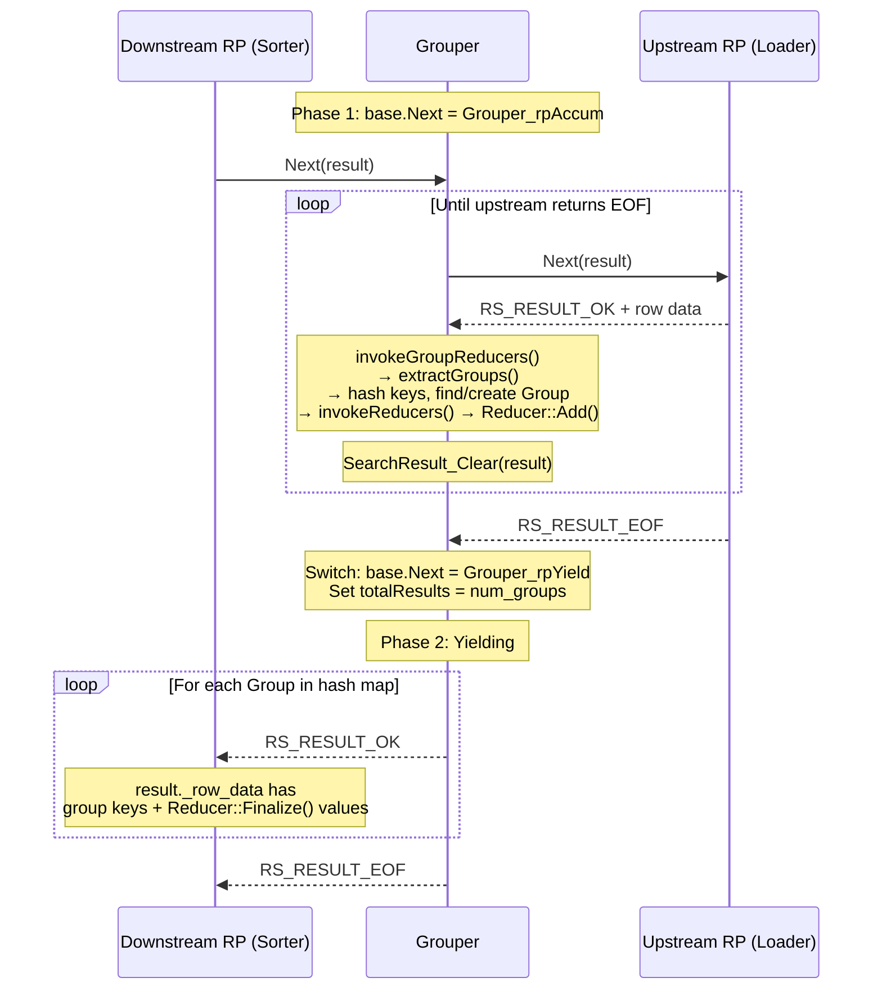

### Key Mapping (srckeys → dstkeys)

The `srckeys` and `dstkeys` arrays are fundamental to understanding how data flows
across the GROUPBY boundary:

- **`srckeys[i]`** — An `RLookupKey` that indexes into the **upstream** `RLookup`. Used
  to read field values from incoming `SearchResult` rows.
- **`dstkeys[i]`** — An `RLookupKey` that indexes into the **GROUPBY step's own** `RLookup`.
  Used to write group key values into the `Group.rowdata` and later into the output
  `SearchResult`.

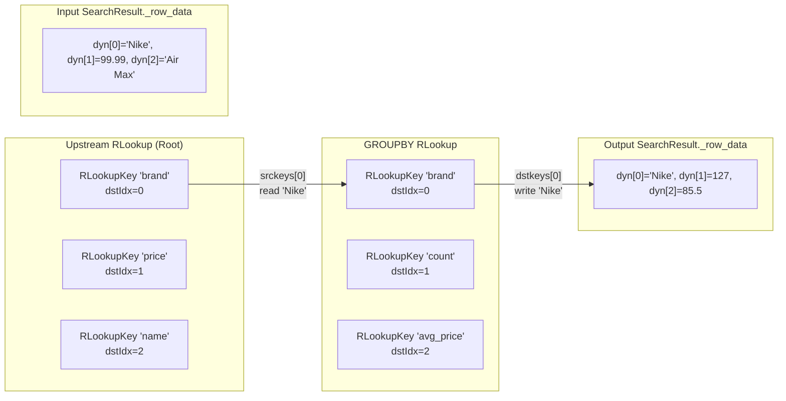

### Hashing and Group Lookup

Groups are stored in a `khash` hash map keyed by a `uint64_t` hash computed from the
group key values. The `extractGroups()` function computes this hash recursively:

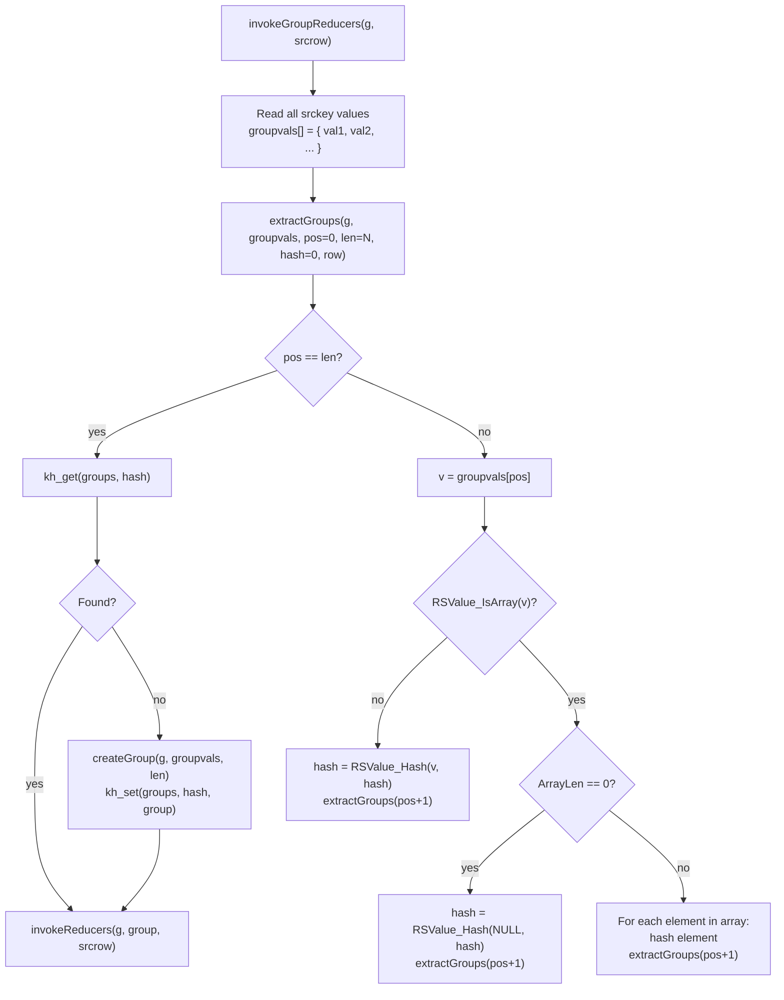

Note the **array expansion** behavior: if a group key value is an array (e.g., a multi-value
TAG field), each array element creates a separate group entry. This is the **cartesian
product** behavior — a document with `tags=['A','B']` grouped by `@tags` will contribute
to both group `A` and group `B`.

---

## Reducer

**File:** `src/aggregate/reducer.h`

A `Reducer` defines a statistically aggregating function. It is a **factory** that creates
per-group accumulator instances and provides callbacks for adding values and finalizing
results.

```c
typedef struct Reducer {
    const RLookupKey *srckey;   // Source field to read from (optional)
    RLookupKey       *dstkey;   // Destination field for output
    BlkAlloc          alloc;    // Block allocator for per-group instances
    uint32_t          reducerId;

    // Per-group lifecycle callbacks:
    void    *(*NewInstance)(struct Reducer *r);
    int      (*Add)(struct Reducer *parent, void *instance, const RLookupRow *srcrow);
    RSValue *(*Finalize)(struct Reducer *parent, void *instance);
    void     (*FreeInstance)(struct Reducer *parent, void *instance);
    void     (*Free)(struct Reducer *r);
} Reducer;
```

### Reducer Lifecycle Per Group

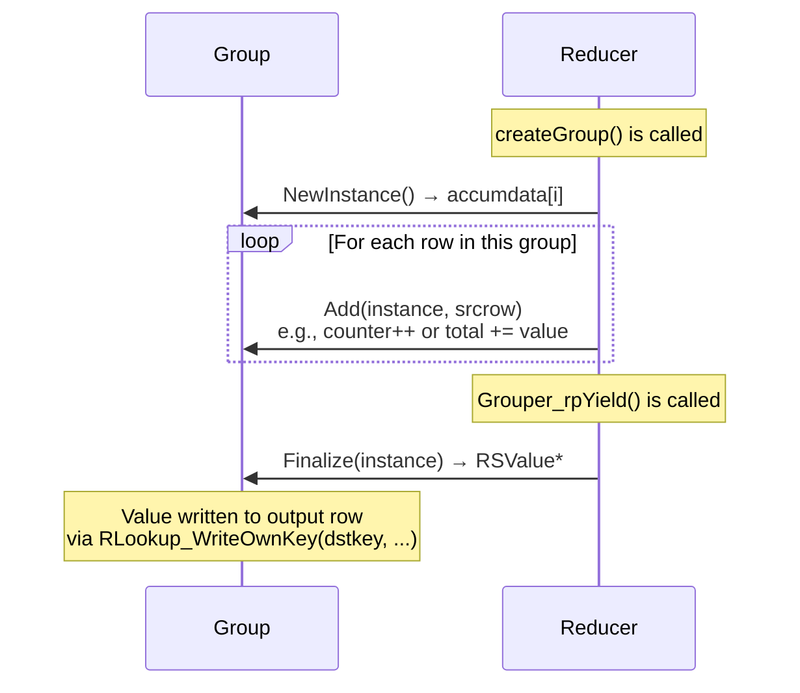

### Reducer Types

| Type | Accumulator State | Finalize Logic |
|------|-------------------|----------------|
| `COUNT` | `{count}` | Return count |
| `SUM` | `{count, total}` | Return total |
| `AVG` | `{count, total}` | Return total/count |
| `MIN` | `{value}` | Return minimum seen |
| `MAX` | `{value}` | Return maximum seen |
| `COUNT_DISTINCT` | Hash set | Return set size |
| `COUNT_DISTINCTISH` | HyperLogLog | Return HLL estimate |
| `TOLIST` | Array of values | Return array |
| `FIRST_VALUE` | `{value, sortval}` | Return first by sort order |
| `RANDOM_SAMPLE` | Reservoir of N items | Return sample array |
| `QUANTILE` | Sorted sample | Return quantile value |
| `STDDEV` | Running stats | Return standard deviation |
| `HLL` | HyperLogLog bytes | Return serialized HLL |
| `HLL_SUM` | Merged HLL | Return estimated count |

See [Reducers & Distribution](reducers.md) for detailed descriptions.

---

## ResultProcessor

**File:** `src/result_processor.h`

The `ResultProcessor` is the **pipeline building block**. Each processor is a node in a
singly-linked list, pulling from its `upstream` and producing results for its caller.

```c
typedef struct ResultProcessor {
    QueryProcessingCtx     *parent;    // Shared query context
    struct ResultProcessor *upstream;   // Previous processor in chain
    ResultProcessorType     type;       // RP_INDEX, RP_GROUP, RP_SORTER, etc.
    int (*Next)(struct ResultProcessor *self, SearchResult *res);
    void (*Free)(struct ResultProcessor *self);
} ResultProcessor;
```

### Processor Types Relevant to GROUPBY

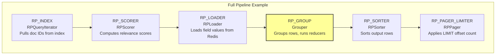

### QueryProcessingCtx

The shared context that all processors in a chain reference:

```c
typedef struct QueryProcessingCtx {
    ResultProcessor *rootProc;      // First processor (usually RPQueryIterator)
    ResultProcessor *endProc;       // Last processor (tail of chain)
    uint32_t         totalResults;  // Total results (set by Grouper = num_groups)
    uint32_t         resultLimit;   // Current chunk limit
    QueryError      *err;           // Error state
    // ... timing, flags, etc.
} QueryProcessingCtx;
```

During GROUPBY accumulation, the Grouper temporarily sets `resultLimit = UINT32_MAX`
to consume all upstream rows, then restores it afterward.

---

## AGGPlan and PLN_GroupStep

**File:** `src/aggregate/aggregate_plan.h`

The `AGGPlan` is the **logical query plan** — a linked list of `PLN_BaseStep` nodes that
describe what operations to perform. It is constructed during parsing and later converted
into the `ResultProcessor` chain during pipeline construction.

```c
struct AGGPlan {
    DLLIST          steps;          // Doubly-linked list of PLN_BaseStep
    PLN_ArrangeStep *arrangement;   // Current SORTBY/LIMIT step
    PLN_FirstStep    firstStep_s;   // Root step with initial RLookup
    uint64_t         steptypes;     // Bitmask of step types present
};
```

### PLN_GroupStep

```c
typedef struct {
    PLN_BaseStep  base;              // Type = PLN_T_GROUP
    RLookup       lookup;            // Output lookup (group keys + reducer outputs)
    StrongRef     properties_ref;    // Reference to property names array (e.g., ["@brand"])
    PLN_Reducer  *reducers;          // Array of reducer definitions
    int           idx;
    bool          strictPrefix;
} PLN_GroupStep;
```

### PLN_Reducer

```c
struct PLN_Reducer {
    const char *name;      // Reducer function name (e.g., "COUNT", "SUM")
    char       *alias;     // Output alias (e.g., "count", "total_price")
    bool        isHidden;  // Hidden from output (used in distribution)
    ArgsCursor  args;      // Arguments to the reducer
};
```

### Plan-to-Pipeline Mapping

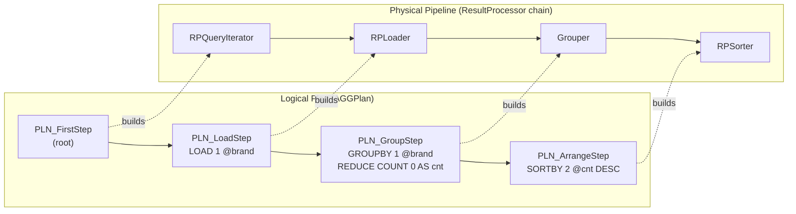

---

## PLN_DistributeStep (Cluster Only)

**File:** `src/coord/dist_plan.cpp`

In cluster mode, the plan is split into a **remote plan** (sent to shards) and a **local
plan** (executed on the coordinator). The `PLN_DistributeStep` is inserted at the head
of the local plan and holds the remote plan plus its serialization.

```c
typedef struct {
    PLN_BaseStep     base;        // Type = PLN_T_DISTRIBUTE
    AGGPlan         *plan;        // The remote plan (to be serialized and sent to shards)
    char           **serialized;  // Serialized remote plan as string array
    PLN_GroupStep  **oldSteps;    // Original steps replaced by distribution
    BlkAlloc         alloc;       // Allocator for distribution metadata
    RLookup          lk;          // Lookup for fields coming from shards
} PLN_DistributeStep;
```

See [Cluster Flow](cluster-flow.md) for how this is used.

---

## RPNet (Cluster Only)

**File:** `src/coord/rpnet.h`

The `RPNet` is a `ResultProcessor` that acts as the **network source** in the coordinator's
pipeline. It replaces `RPQueryIterator` as the root processor, pulling rows from shard
replies instead of a local index.

```c
typedef struct {
    ResultProcessor base;             // RP interface
    struct {
        MRReply *root;                // Current shard reply (for freeing)
        MRReply *rows;                // Array of result rows
        MRReply *meta;                // Reply metadata (RESP3)
    } current;
    RLookup     *lookup;              // Lookup for writing row fields
    size_t       curIdx;              // Current index in rows array
    MRIterator  *it;                  // Multi-shard iterator
    MRCommand    cmd;                 // Command sent to shards
    AREQ        *areq;               // Aggregate request
    // ... cursor mappings, profile data, barrier ...
} RPNet;
```

### How RPNet Populates SearchResult

When `rpnetNext()` is called, it:

1. Gets the next row from the current shard reply (or fetches a new reply via `getNextReply()`)
2. Iterates over field-value pairs in the row
3. Converts each `MRReply` value to an `RSValue` via `MRReply_ToValue()`
4. Writes each value to the `SearchResult._row_data` via `RLookupRow_WriteByNameOwned()`

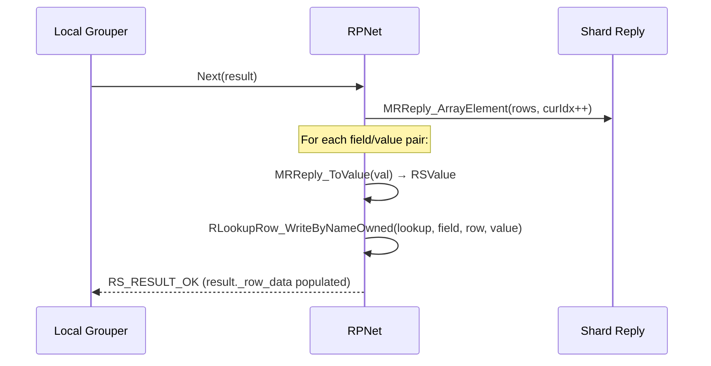
