# Reducers & Distribution Strategies

This document covers the reducer system in detail: the framework, all built-in reducers,
how each one accumulates and finalizes, and — critically — how each is decomposed for
distributed (cluster) execution.

## Reducer Framework

### Architecture

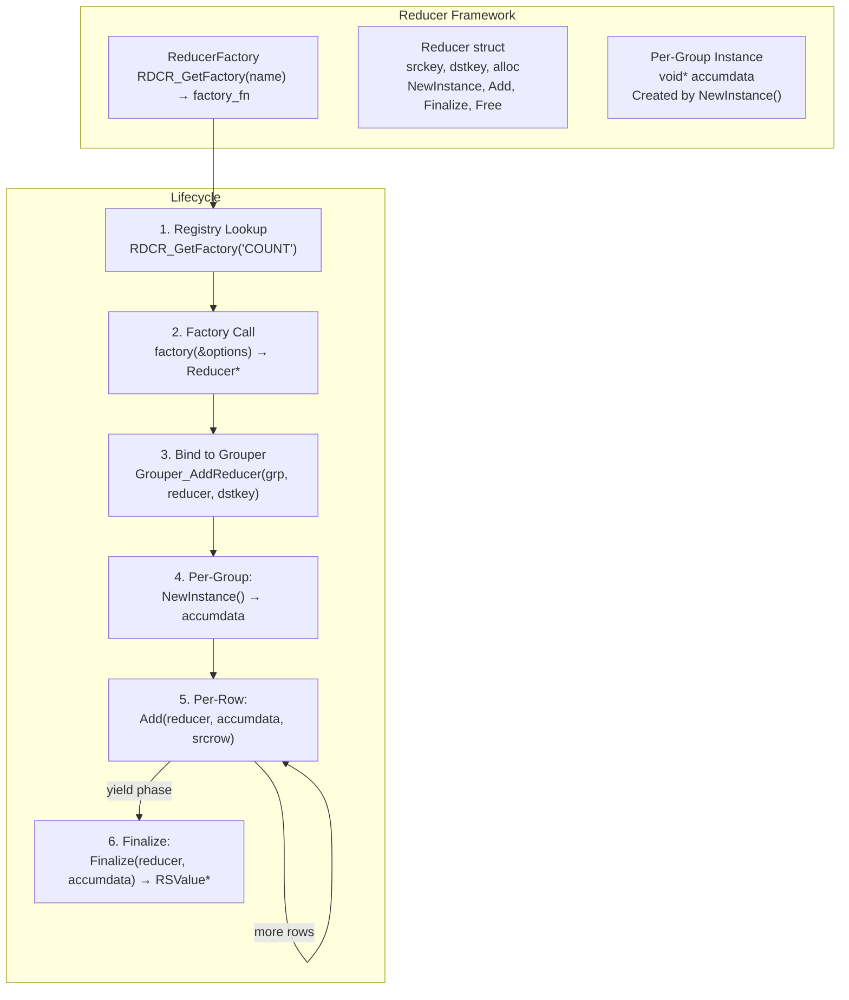

### Factory Registry

**File:** `src/aggregate/reducer.c`

The global reducer registry maps reducer names (case-insensitive) to factory functions:

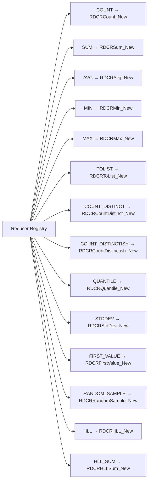

### ReducerOptions

When a factory is called, it receives a `ReducerOptions` struct that provides context:

```c
typedef struct {
    const char    *name;        // Reducer name as called
    ArgsCursor    *args;        // Arguments (e.g., "@price" for SUM)
    RLookup       *srclookup;   // Upstream lookup (for resolving source keys)
    const RLookupKey ***loadKeys; // Out: keys that need loading
    QueryError    *status;      // Out: error info
    bool           strictPrefix; // Require @ prefix
} ReducerOptions;
```

---

## Built-in Reducers

### COUNT

**File:** `src/aggregate/reducers/count.c`  
**Syntax:** `REDUCE COUNT 0`

Simply counts the number of rows in each group. Takes no arguments.

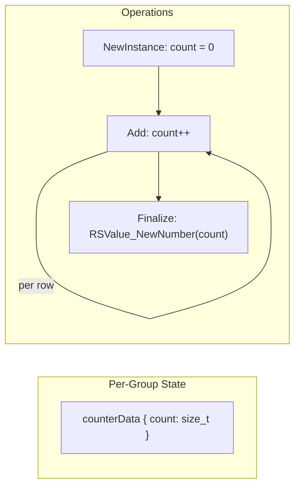

| Phase | Implementation |
|-------|---------------|
| `NewInstance` | Allocate `counterData`, set `count = 0` |
| `Add` | `count++` (ignores all row data) |
| `Finalize` | Return `RSValue_NewNumber(count)` |

---

### SUM

**File:** `src/aggregate/reducers/sum.c`  
**Syntax:** `REDUCE SUM 1 @field`

Sums numeric values of the specified field across all rows in the group.

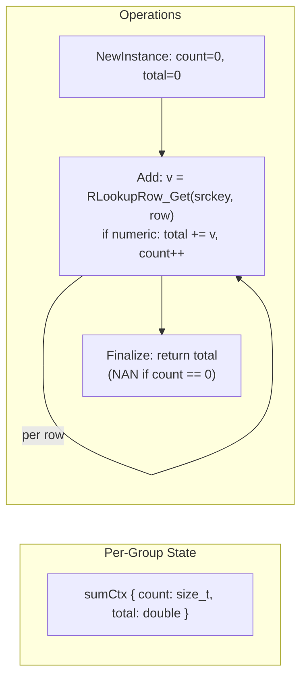

Non-numeric values are silently skipped. If no valid numeric values are seen, the result
is `NaN`.

---

### AVG

**File:** `src/aggregate/reducers/sum.c`  
**Syntax:** `REDUCE AVG 1 @field`

Computes the average of numeric values. Uses the same `sumCtx` as SUM, but divides in
the finalize step.

| Phase | Implementation |
|-------|---------------|
| `NewInstance` | Same as SUM: `count=0, total=0` |
| `Add` | Same as SUM: `total += v, count++` |
| `Finalize` | Return `total / count` (NAN if count == 0) |

---

### MIN / MAX

**File:** `src/aggregate/reducers/minmax.c`  
**Syntax:** `REDUCE MIN 1 @field` / `REDUCE MAX 1 @field`

Tracks the minimum or maximum value seen for the specified field.

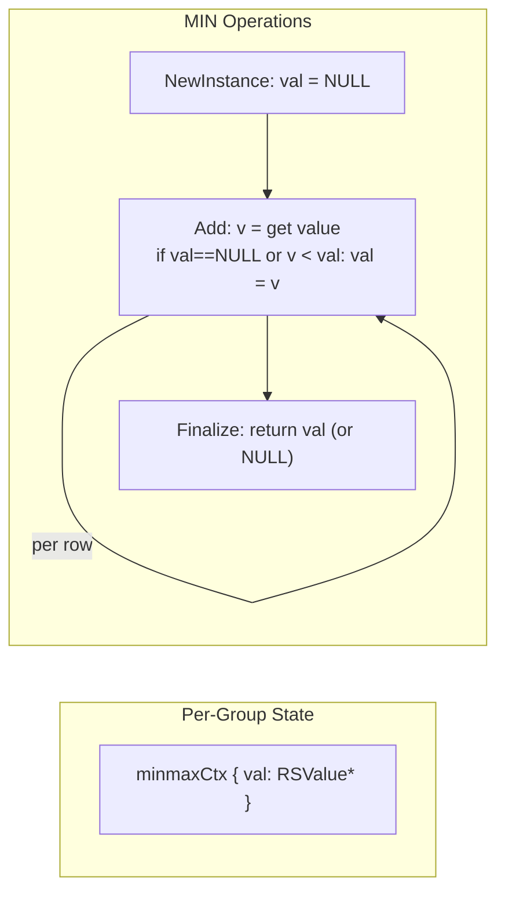

Values are compared using `RSValue_Cmp()`, which handles mixed types (strings, numbers).

---

### TOLIST

**Syntax:** `REDUCE TOLIST 1 @field`

Collects all values of the specified field into an array.

| Phase | Implementation |
|-------|---------------|
| `NewInstance` | Create empty array |
| `Add` | Append value to array |
| `Finalize` | Return array as `RSValue` |

---

### COUNT_DISTINCT

**Syntax:** `REDUCE COUNT_DISTINCT 1 @field`

Counts the number of distinct values using an exact hash set.

| Phase | Implementation |
|-------|---------------|
| `NewInstance` | Create hash set |
| `Add` | Hash the value, insert into set |
| `Finalize` | Return set size as number |

> **Note:** This reducer has no distribution function and cannot be split across shards.
> In cluster mode, all data must be sent to the coordinator for grouping.

---

### COUNT_DISTINCTISH

**Syntax:** `REDUCE COUNT_DISTINCTISH 1 @field`

Approximation of COUNT_DISTINCT using HyperLogLog. More memory-efficient and distributable.

| Phase | Implementation |
|-------|---------------|
| `NewInstance` | Create HLL structure |
| `Add` | Hash value, add to HLL |
| `Finalize` | Return HLL cardinality estimate |

---

### QUANTILE

**Syntax:** `REDUCE QUANTILE 2 @field quantile`  
(where `quantile` is 0.0–1.0)

Estimates a percentile value using a sorted sample.

| Phase | Implementation |
|-------|---------------|
| `NewInstance` | Create sorted sample buffer |
| `Add` | Insert value into sample |
| `Finalize` | Sort sample, return value at quantile position |

---

### STDDEV

**Syntax:** `REDUCE STDDEV 1 @field`

Computes the sample standard deviation of numeric values.

| Phase | Implementation |
|-------|---------------|
| `NewInstance` | Create running stats (mean, M2, count) |
| `Add` | Welford's online algorithm update |
| `Finalize` | Return `sqrt(M2 / (count - 1))` |

---

### FIRST_VALUE

**Syntax:** `REDUCE FIRST_VALUE 1 @field` or `REDUCE FIRST_VALUE 4 @field BY @sortfield ASC|DESC`

Returns the first value of a field, optionally sorted by another field.

| Phase | Implementation |
|-------|---------------|
| `NewInstance` | `{ value: NULL, sortval: NULL }` |
| `Add` | Compare sortval, keep if better (or first seen) |
| `Finalize` | Return stored value |

> **Note:** No distribution function. Cluster mode falls back to coordinator-only grouping.

---

### RANDOM_SAMPLE

**Syntax:** `REDUCE RANDOM_SAMPLE 2 @field sample_size`

Reservoir sampling of `sample_size` values (max 1000).

| Phase | Implementation |
|-------|---------------|
| `NewInstance` | Create reservoir of capacity `sample_size` |
| `Add` | Reservoir sampling algorithm (replace with decreasing probability) |
| `Finalize` | Return array of sampled values |

This reducer is used internally by the distribution layer as a building block for
`QUANTILE` and `STDDEV` in cluster mode.

---

### HLL / HLL_SUM (Internal)

These are **internal reducers** used by the distribution layer. They are not meant to be
called directly by users.

**HLL:** Serializes HyperLogLog state for a field value.  
**HLL_SUM:** Merges multiple serialized HLL states and returns the cardinality estimate.

---

## Distribution Strategies

**File:** `src/coord/dist_plan.cpp`

In cluster mode, each reducer must be decomposed into:
- A **remote reducer** that runs on each shard
- A **local reducer** (or expression) that merges partial results on the coordinator

### Distribution Registry

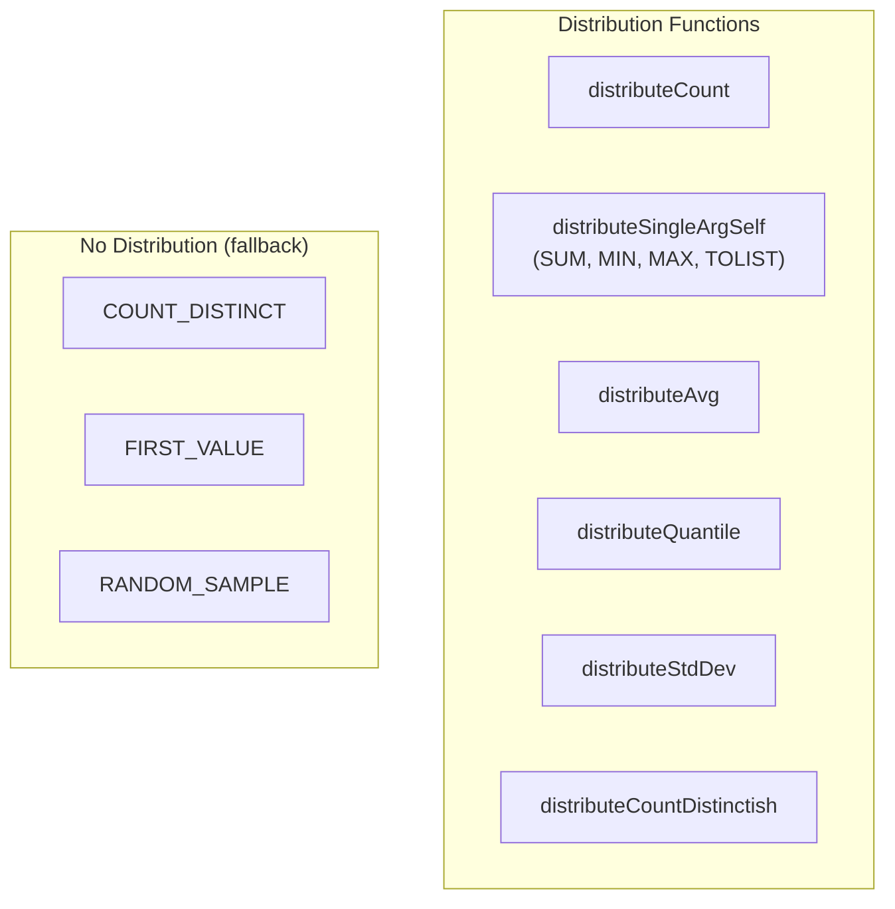

### Strategy Details

#### COUNT → SUM

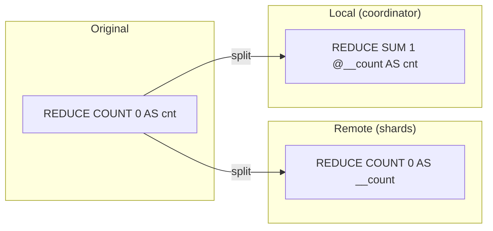

**Why SUM?** Each shard produces a count of documents in its group. The coordinator needs
the total count across all shards, which is the sum of per-shard counts.

---

#### SUM → SUM

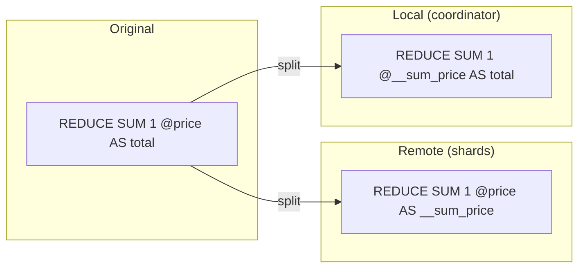

SUM is self-distributable: the sum of partial sums equals the total sum.

---

#### MIN → MIN, MAX → MAX

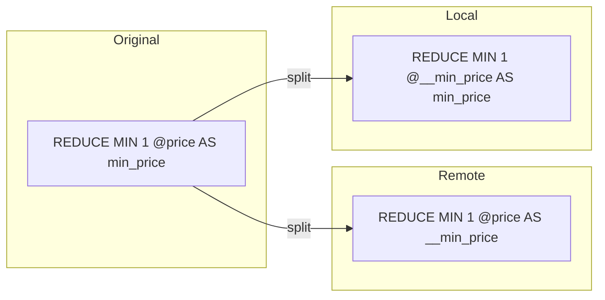

MIN and MAX are also self-distributable: the min of mins is the global min.

---

#### TOLIST → TOLIST

Self-distributable but with a caveat: the coordinator TOLIST concatenates all per-shard
lists, which is semantically correct.

---

#### AVG → COUNT + SUM + APPLY

AVG is the most complex distribution because it requires **both** count and sum to
compute the average. It cannot be merged by simply averaging the averages.

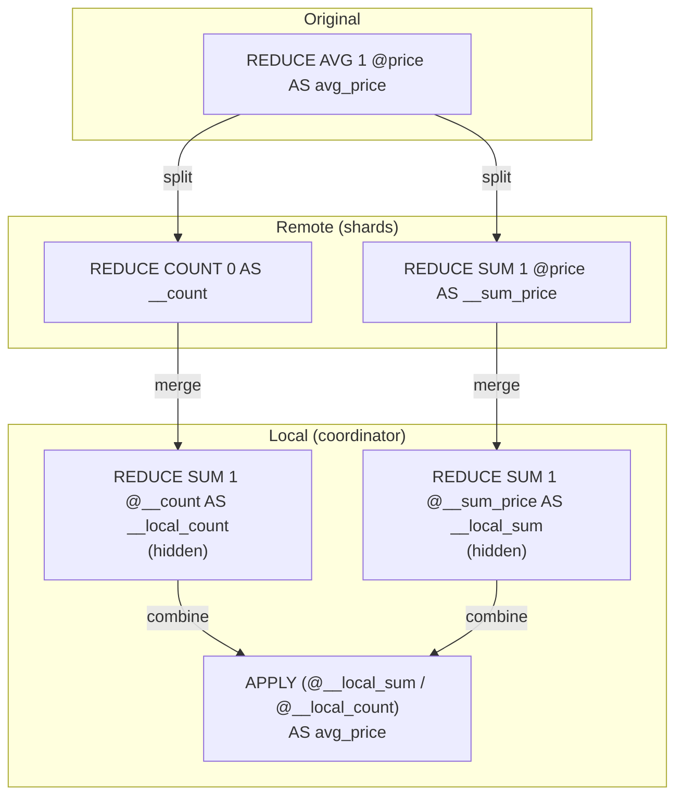

Step by step:
1. **Remote:** Two reducers — `COUNT` (how many) and `SUM` (sum of values)
2. **Local:** Two hidden `SUM` reducers to merge the partial counts and sums
3. **Local APPLY step:** Computes `@__local_sum / @__local_count` and stores as the
   final alias

The `isHidden` flag on the intermediate local reducers ensures they don't appear in the
final output.

> **Note on deduplication:** If the query also has a `COUNT` reducer, the remote `COUNT`
> added by AVG distribution reuses the same remote reducer (detected by
> `PLNGroupStep_FindReducer()`).

---

#### QUANTILE → RANDOM_SAMPLE + QUANTILE

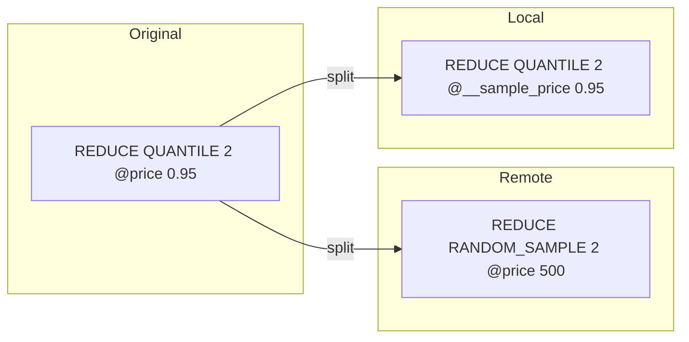

Shards collect a random sample of 500 values per group. The coordinator then computes
the quantile from the merged sample. This is an **approximation** — the accuracy depends
on sample size relative to the total number of values.

---

#### STDDEV → RANDOM_SAMPLE + STDDEV


Same strategy as QUANTILE: collect a random sample per shard, compute STDDEV on the
merged sample at the coordinator. Also an approximation.

---

#### COUNT_DISTINCTISH → HLL + HLL_SUM

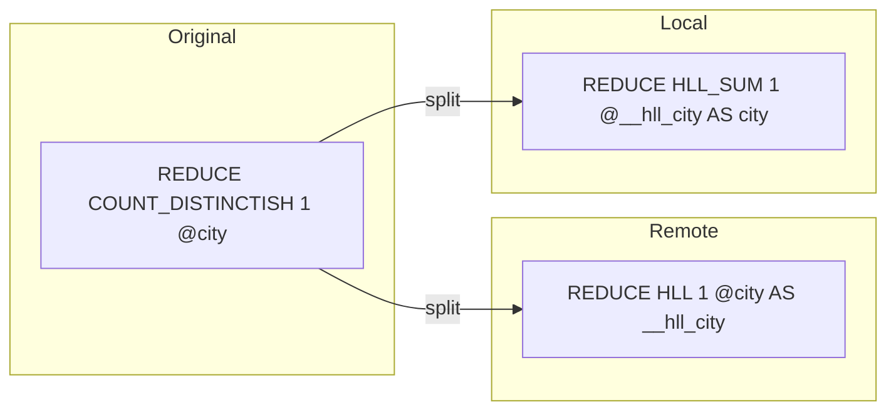

HyperLogLog is naturally distributable: each shard computes an HLL sketch, and the
coordinator merges the sketches. The final cardinality estimate comes from the merged HLL.

---

### Non-Distributable Reducers

These reducers have **no distribution function** in the registry:

| Reducer | Reason |
|---------|--------|
| `COUNT_DISTINCT` | Requires exact set merge — too expensive to serialize |
| `FIRST_VALUE` | Sort-order-dependent; partial results can't be trivially merged |
| `RANDOM_SAMPLE` | Used as a building block, not directly user-facing in distribution |
| `HLL` | Internal only, used by COUNT_DISTINCTISH distribution |
| `HLL_SUM` | Internal only, used by COUNT_DISTINCTISH distribution |

When a plan contains non-distributable reducers, `AGGPLN_Distribute()` will fail to
distribute the `GROUP` step. In this scenario:
- The GROUP step remains in the local plan only
- All raw rows are sent from shards to the coordinator (with appropriate LOAD)
- Grouping happens entirely on the coordinator, at higher network cost

---

## Complete Distribution Example

```
FT.AGGREGATE idx '*'
  GROUPBY 2 @brand @category
  REDUCE COUNT 0 AS cnt
  REDUCE AVG 1 @price AS avg_price
  REDUCE MAX 1 @price AS max_price
  SORTBY 2 @cnt DESC
  LIMIT 0 5
```

### Remote Plan (per shard)

```
GROUPBY 2 @brand @category
  REDUCE COUNT 0 AS __count
  REDUCE SUM 1 @price AS __sum_price
  REDUCE MAX 1 @price AS __max_price
SORTBY 2 @__count DESC
LIMIT 0 5
```

### Local Plan (coordinator)

```
PLN_DistributeStep (RPNet as root)
GROUPBY 2 @brand @category
  REDUCE SUM 1 @__count AS cnt
  REDUCE SUM 1 @__sum_price AS __local_sum_price (hidden)
  REDUCE SUM 1 @__count AS __local_count_price (hidden)
  REDUCE MAX 1 @__max_price AS max_price
APPLY (@__local_sum_price / @__local_count_price) AS avg_price
SORTBY 2 @cnt DESC
LIMIT 0 5
```

### Visualization

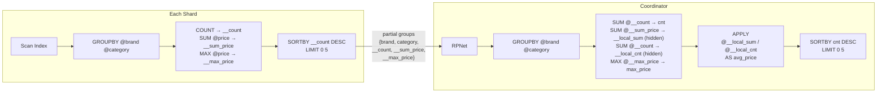

---

## Memory and Performance Considerations

### Block Allocation

Both `Group` structs and reducer instance data (per-group accumulators) use `BlkAlloc`
(block allocator) to reduce heap fragmentation. Groups are allocated in blocks of 1024.

### Hash Table Sizing

The `khash` hash table (`kh_init(khid)`) starts small and grows dynamically. For very
high-cardinality group keys, this can consume significant memory. The hash is computed
using `RSValue_Hash()` which produces a `uint64_t` from the group key values.

### Accumulation Buffering

During accumulation, the Grouper sets `resultLimit = UINT32_MAX` to prevent upstream
processors from stopping early. This means the Grouper will consume **all** matching
documents before emitting any output. For queries matching millions of documents, this
can be memory-intensive (one `Group` per unique key combination, plus per-group
accumulator data for each reducer).

### Cluster Overhead

In cluster mode, the distribution strategy adds overhead:
- **Network:** Each shard sends pre-grouped rows; for N shards with K unique keys each,
  worst case is N×K rows sent to the coordinator
- **Coordinator memory:** The local Grouper must re-accumulate all shard rows
- **Approximation:** QUANTILE, STDDEV, and COUNT_DISTINCTISH use sampling, trading
  accuracy for reducibility
