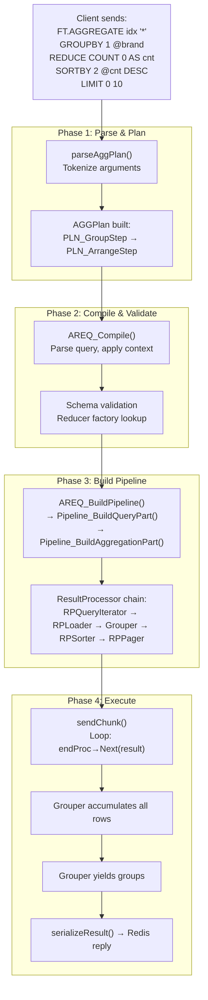
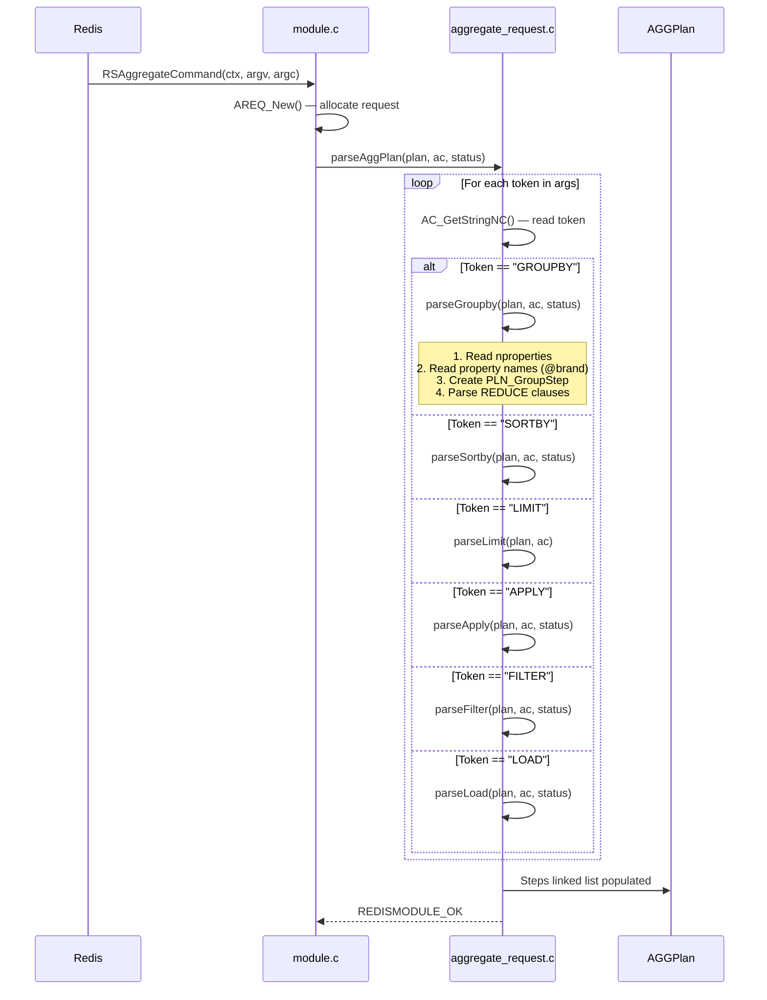
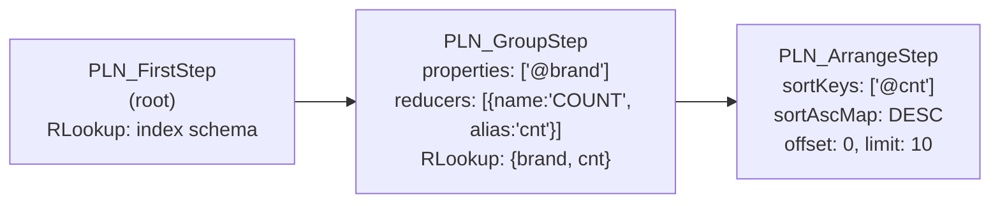
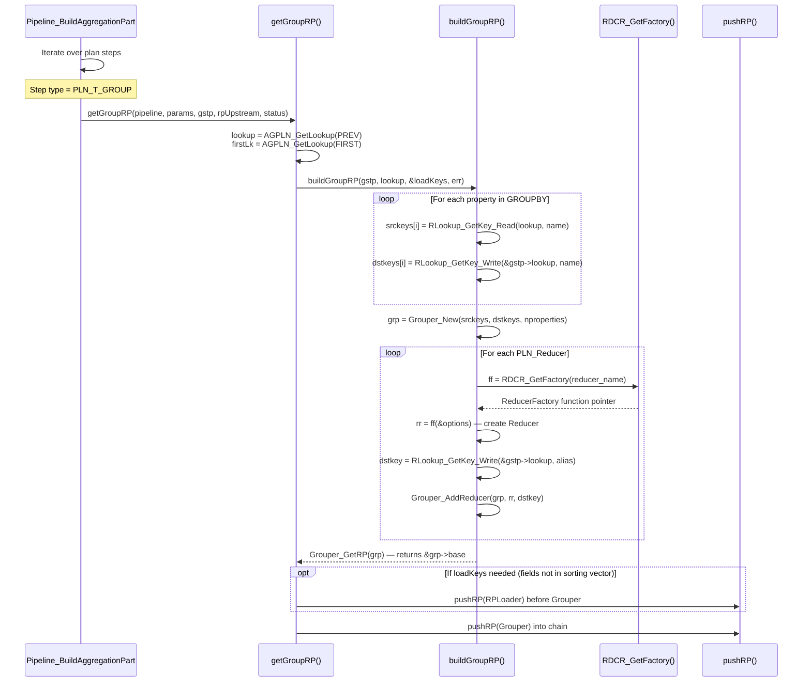
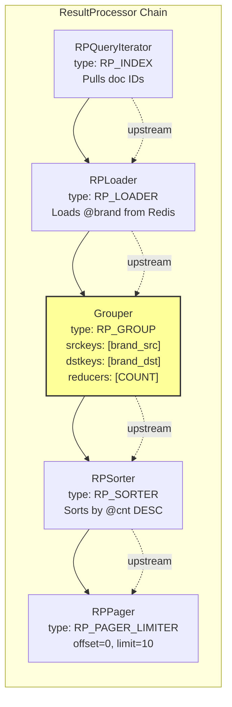
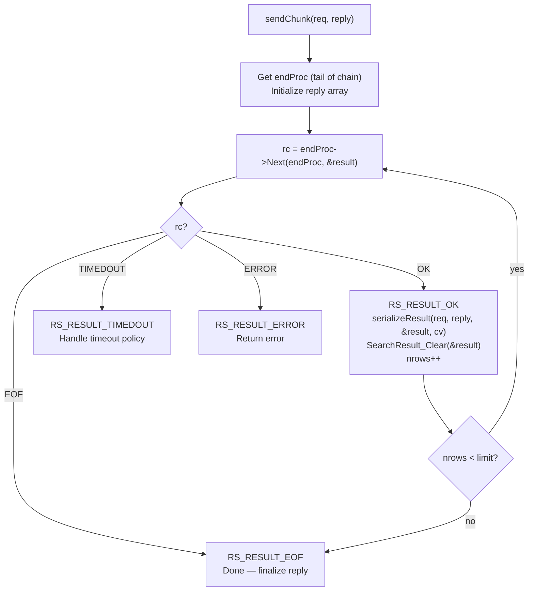
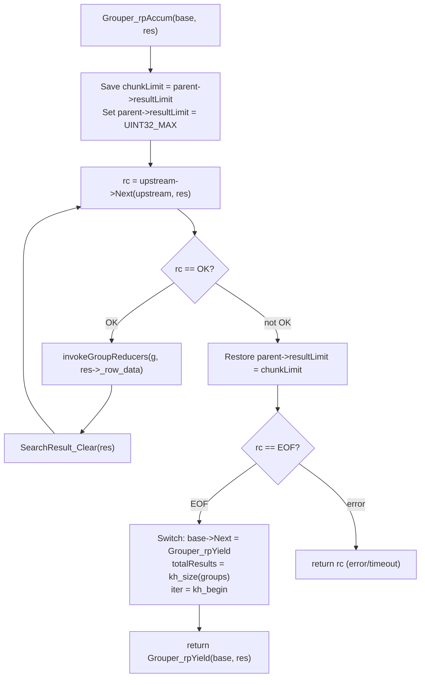
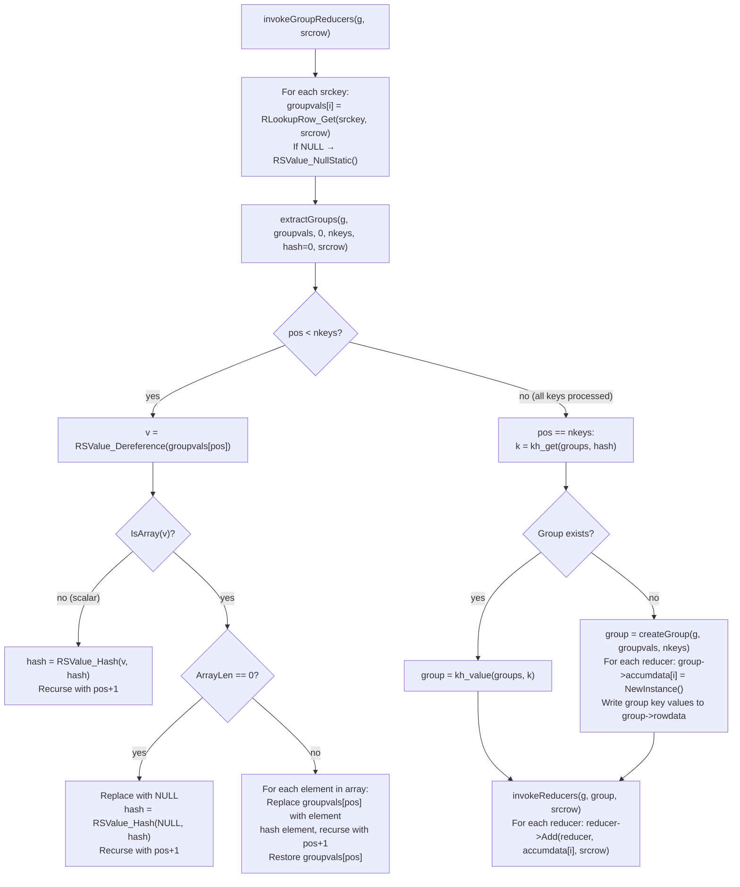
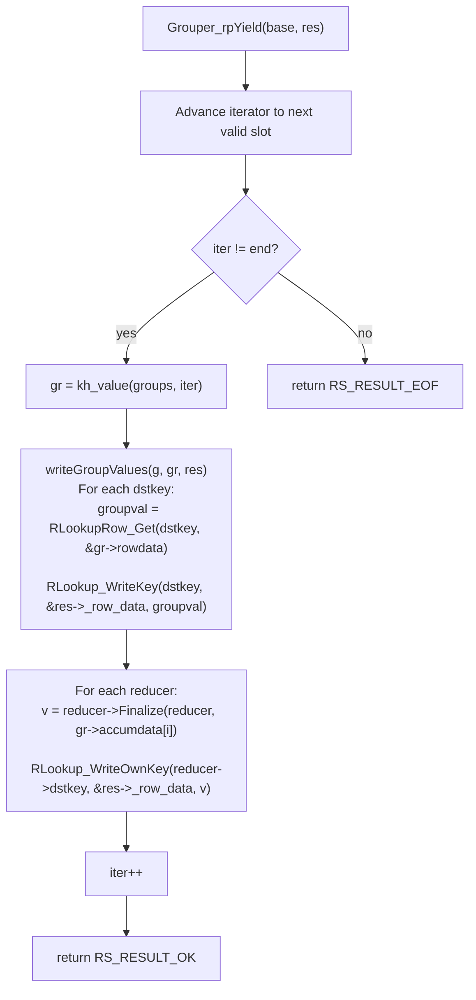
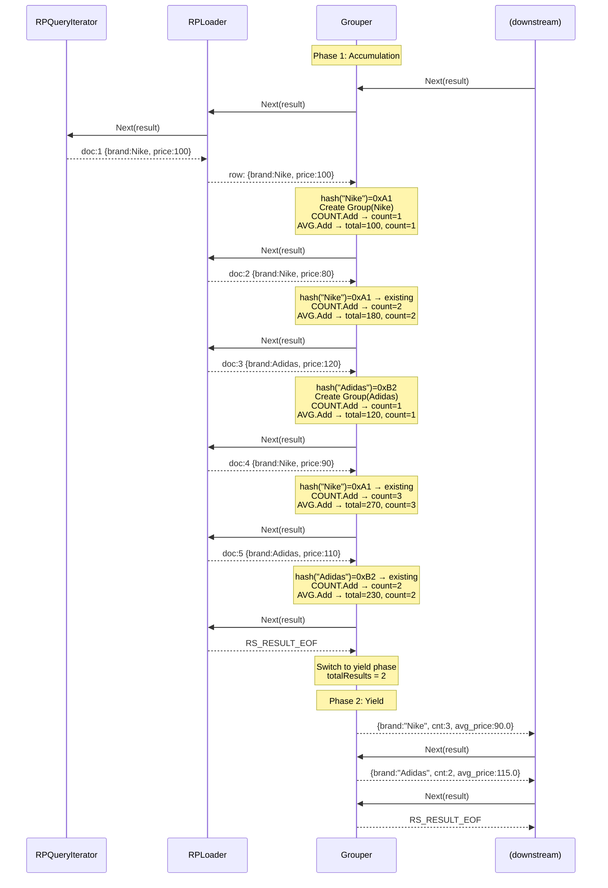

# Single-Shard GROUPBY Flow

This document provides a complete end-to-end walkthrough of how a `GROUPBY` clause in
`FT.AGGREGATE` is processed on a single shard, from command reception to reply serialization.

## End-to-End Overview



---

## Phase 1: Parsing

**Entry point:** `RSAggregateCommand()` in `src/module.c`  
**Core parser:** `parseAggPlan()` in `src/aggregate/aggregate_request.c`

### Command Parsing Flow

When Redis receives `FT.AGGREGATE`, the module command handler creates an `AREQ`
(Aggregate Request) struct and passes the arguments to `parseAggPlan()`.



### parseGroupby() Detail

The `parseGroupby()` function (lines 882–930 of `aggregate_request.c`) performs:

1. **Read property count:** `nproperties = AC_GetLongLong()`
2. **Read property names:** For each property, reads a string starting with `@` (e.g., `@brand`)
3. **Create step:** `PLNGroupStep_New(properties_ref, strictPrefix)` — allocates the
   `PLN_GroupStep` and stores the property array
4. **Parse reducers:** Loops while the next token is `REDUCE`:
   - Reads the reducer name (e.g., `COUNT`, `SUM`)
   - Reads `nargs` (number of arguments)
   - Reads the arguments
   - Optionally reads `AS alias`
   - Calls `PLNGroupStep_AddReducer(gstp, name, args, status)`
5. **Add to plan:** Sets the `QEXEC_F_HAS_GROUPBY` flag and appends the step

### Resulting Plan Structure

For the command:
```
FT.AGGREGATE idx '*' GROUPBY 1 @brand REDUCE COUNT 0 AS cnt SORTBY 2 @cnt DESC LIMIT 0 10
```



---

## Phase 2: Compilation and Validation

**Entry point:** `AREQ_Compile()` in `src/aggregate/aggregate.c`

After parsing, the request is compiled. This involves:

1. **Query parsing:** The query string (`*`) is parsed into a `QueryAST`
2. **Context application:** `AREQ_ApplyContext()` validates the plan against the index schema
3. **Reducer validation:** Each reducer name is checked against the factory registry
   (`RDCR_GetFactory()`) to ensure it exists
4. **Key resolution:** Source keys for the GROUPBY properties are resolved against the
   upstream `RLookup` to verify the fields exist (or can be loaded)

---

## Phase 3: Pipeline Construction

**Entry point:** `AREQ_BuildPipeline()` → `Pipeline_BuildAggregationPart()`  
**File:** `src/pipeline/pipeline_construction.c`

This is where the logical `AGGPlan` is converted into the physical `ResultProcessor` chain.

### Building the GROUPBY Processor



### Key Resolution: srckeys and dstkeys

The `buildGroupRP()` function resolves keys across two different `RLookup` tables:

| Key Array | Lookup Table | Purpose |
|-----------|-------------|---------|
| `srckeys[]` | Previous step's `RLookup` (upstream) | Read field values from incoming rows |
| `dstkeys[]` | `PLN_GroupStep.lookup` (this step) | Write group key values to output rows |

If a srckey cannot be found for reading (the field isn't in the sorting vector or already
loaded), and the field is in the index schema, an implicit `RPLoader` is inserted before
the Grouper to load that field from Redis.

### Resulting Pipeline



> Note: The arrows represent the `upstream` pointers — each processor points to the one
> *before* it. Execution flows **right to left**: the tail (RPPager) calls
> `upstream->Next()`, which calls the Sorter, which calls the Grouper, and so on.

---

## Phase 4: Execution

**Entry point:** `sendChunk()` in `src/aggregate/aggregate_exec.c`

### Execution Loop



### Inside the Grouper: Accumulation Phase

When `RPSorter` (or whatever is downstream) first calls `Grouper.Next()`, the Grouper
enters its accumulation phase (`Grouper_rpAccum`):



### Inside the Grouper: Per-Row Processing

For each incoming row, `invokeGroupReducers()` performs these steps:



### Inside the Grouper: Yield Phase

After EOF from upstream, the Grouper switches to `Grouper_rpYield` and iterates over
its hash map, emitting one `SearchResult` per group:



### Concrete Example: Data Flow

Consider this data and query:

```
Documents:
  doc:1 → {brand: "Nike",   price: 100}
  doc:2 → {brand: "Nike",   price: 80}
  doc:3 → {brand: "Adidas", price: 120}
  doc:4 → {brand: "Nike",   price: 90}
  doc:5 → {brand: "Adidas", price: 110}

Query:
  FT.AGGREGATE idx '*' GROUPBY 1 @brand REDUCE COUNT 0 AS cnt REDUCE AVG 1 @price AS avg_price
```



### Result Serialization

After the pipeline emits a group row, `serializeResult()` iterates over the output
`RLookup` keys and writes field-value pairs to the Redis reply:

**RESP2 format:**
```
*3                          # 3 elements: total + 2 rows
:2                          # total_results = 2
*4                          # row 1: 4 elements (2 field-value pairs)
$5 brand                    # field name
$4 Nike                     # field value
$3 cnt                      # field name
$1 3                        # field value  
*4                          # row 2
$5 brand
$6 Adidas
$3 cnt
$1 2
```

**RESP3 format:**
```
%2                          # Map with 2 keys
$7 results                  # "results" key
*2                          # Array of 2 result maps
%2                          # Result 1
$5 brand $4 Nike
$3 cnt :3
%2                          # Result 2  
$5 brand $6 Adidas
$3 cnt :2
...
```

---

## Special Cases

### Array Values in Group Keys

When a group-by field contains an array value (e.g., a multi-value TAG field), the
`extractGroups()` function performs a **cartesian product expansion**. Each element of the
array is treated as a separate group key value.

**Example:**
```
doc:1 → {tags: ["sports", "running"], brand: "Nike"}

GROUPBY 2 @tags @brand
```

This produces two group entries from a single document:
- Group key: `("sports", "Nike")`
- Group key: `("running", "Nike")`

Both groups receive the reducer `Add()` call for `doc:1`.

### Empty Results

If the upstream produces no rows (empty query result), the Grouper immediately receives
EOF, switches to yield mode with `totalResults = 0`, and returns EOF to the downstream
processor without emitting any groups.

### resultLimit Manipulation

The Grouper temporarily overrides `parent->resultLimit` to `UINT32_MAX` during
accumulation to ensure it consumes **all** upstream rows. This is critical because
`resultLimit` is used by upstream processors (like the safe loader) to decide how many
results to buffer. After accumulation, the original limit is restored.
