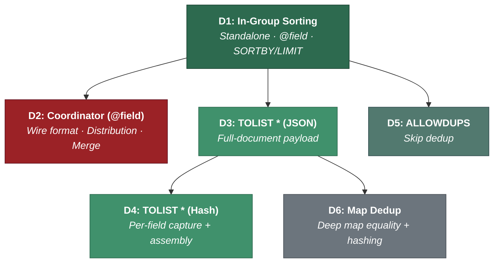

# Enhanced TOLIST: Delivery Plan

## Deliverables Overview

**Legend:** Green = standalone payload work · Red = coordinator (unique risk) · Teal = behavioral flag · Gray = deferred.

---

## Delivery Strategy: Risk-First

The coordinator has one specific risk that **no amount of standalone work resolves**: getting sort-key values from shards to the coordinator (the wire format and merge). Everything else — Hash support, `*` payload, map dedup — is standalone work that automatically propagates to the coordinator once the transport is proven.

So the plan front-loads the two highest-value, highest-risk items:

After Phase 2, the riskiest unknowns are behind us. Phase 3 deliverables are extensions that layer cleanly on top — and solving any of them on standalone automatically gives the coordinator the same capability for free.

---

## D1: In-Group Sorting (Standalone, `@field`, SORTBY/LIMIT)

> **The foundation.** Everything else builds on this.

**Delivers:** `REDUCE TOLIST 5 @title SORTBY 2 @rating DESC LIMIT 0 3 AS top_titles` on standalone — sorted, bounded, deduplicated results.

**What needs to happen:**

- Extended reducer struct (`ToListReducer`) following the `FIRST_VALUE` pattern — adds sort keys, ASC/DESC map, offset, count.
- Arg parsing within the `narg` window: `SORTBY <inner_narg> (<@field> [ASC|DESC])+`, `LIMIT <offset> <count>`.
- In-group comparator: iterate `sortvals[]` with `RSValue_Cmp`, respect ASC/DESC bitmap, nulls sort last.
- Bounded heap (`mm_heap_t`, K = offset + count) per group instance.
- `HeapEntry { payload, sortvals[] }` — flat struct, no RLookupRow clone.
- Capture in `Add()`: `IncrRef` payload + sort key values from the source row.
- Lifecycle: `DecrRef` all captured values on heap eviction and instance free.
- `Finalize()`: extract from heap, sort in-place, slice window, build output `RSValue_Array`.
- Existing scalar dedup (dict-based) gates insertion into the heap — no new dedup code.
- Backward compat: `TOLIST 1 @field` takes the existing legacy path unchanged.

**Challenges:**

- Getting the arg parsing right for all valid combinations while preserving backward compat for legacy `TOLIST 1 @field`.
- Memory lifecycle of `IncrRef`'d values in heap entries — must `DecrRef` on eviction, on instance free, and on reducer teardown. Leaks here are silent.
- Tie-breaking is arbitrary (first-seen) — acceptable, results are non-deterministic when sort keys are equal.

**Dependencies:** None.

---

## D2: Coordinator — Distribution, Wire Format, Merge (`@field`)

> **Unique risk: sort-key transport.** This is the one problem that only gets validated by building the coordinator path. Everything else (Hash, `*`, map dedup) solved on standalone propagates to the coordinator for free.

**Delivers:** Enhanced TOLIST with `@field` + SORTBY/LIMIT works in cluster mode. Shards produce sorted, bounded results; the coordinator merges across shards, re-sorts, and applies the final LIMIT window.

**What needs to happen:**

Three sub-parts:

**D2a — Arg Forwarding:**
- New distribution function for TOLIST (replaces `distributeSingleArgSelf`).
- Forward extended args (SORTBY, LIMIT) to shard commands.
- Legacy `TOLIST 1 @field` continues to use the simple distribution path.

**D2b — Sort-Key Embedding in Shard Output:**
- Shard `Finalize()` emits `[sortval_0, ..., sortval_N-1, payload]` per entry instead of bare payloads.
- When SORTBY is absent, entries remain bare payloads — fully backward compatible.
- Both sides agree on N (number of sort keys) implicitly through the forwarded SORTBY clause.

**D2c — Coordinator Unwrap + Re-Sort:**
- Coordinator `Add()` receives the shard's array, unwraps each entry (extract sortvals + payload), inserts into its own bounded heap (same infrastructure as D1).
- `Finalize()`: extract from heap, sort, slice window, output payloads only (sort keys stripped).
- Dedup across shards uses the same dict pattern as standalone.

**Challenges:**

- **New internal wire format.** The `[sortvals..., payload]` convention is an implicit protocol between shard and coordinator. Both sides must agree on N. Mismatches cause silent corruption, not errors. Needs defensive validation.
- **Dual-mode `Add()` on coordinator.** Must handle bare payloads (legacy) and wrappers (enhanced). Clean mode switch driven by presence of SORTBY in forwarded args.
- **Integration surface.** Touches `dist_plan.cpp` (distribution function), TOLIST `Finalize()` (shard output), and TOLIST `Add()` (coordinator input). Three files, two distinct behaviors, one implicit contract.

**Dependencies:** D1.

---

## D3: TOLIST * — JSON

**Delivers:** `REDUCE TOLIST 7 * SORTBY 2 @rating DESC LIMIT 0 5 AS top_docs` returns full JSON documents (as maps) within each group. Works on both standalone and cluster (coordinator support comes from D2 — the wire format handles any RSValue payload transparently).

**What needs to happen:**

- Parse `*` as the payload token (new code path in arg parser).
- Validate that `LOAD *` (or explicit field loading) precedes the GROUPBY — fail at parse time if not.
- Capture: `IncrRef` the `RSValue_Map` at the `"$"` key (same IncrRef pattern as D1, different key).
- Output: `Finalize()` produces an `RSValue_Array` of maps — a new output shape for TOLIST.
- Validate RESP serialization: maps nested inside a TOLIST array must serialize correctly for both RESP2 (flat key-value array) and RESP3 (Map type).

**Challenges:**

- **New output shape.** Today TOLIST returns arrays of scalars. Returning arrays of maps is a new contract — even though `RedisModule_Reply_RSValue` theoretically handles maps, this path has never been exercised from TOLIST output. Needs validation across RESP2/RESP3 and client libraries.
- Parse-time validation of `LOAD *` presence — requires inspecting the pipeline state during reducer construction.

**Dependencies:** D1.

---

## D4: TOLIST * — Hash

**Delivers:** `TOLIST *` works for Hash documents, not just JSON.

**What needs to happen:**

- Hash documents with `LOAD *` populate individual fields as separate entries in `RLookupRow.dyn[]` (unlike JSON which has one map at `"$"`).
- During `Add()`: iterate all visible `RLookup` keys, `IncrRef` each field value individually. Store as field-value pairs alongside the heap entry.
- Defer map assembly to `Finalize()`: only the K surviving heap entries get assembled into `RSValue_Map`s. This avoids building 1000 maps when K = 5.
- The reducer must hold the `RLookup *` pointer (from `options->srclookup` at construction) to know which keys exist and what their names are.

**Challenges:**

- **Deferred map construction.** During `Add()`, the reducer captures raw field values. During `Finalize()`, it must build a map from those captured values. The intermediate representation (how fields are stored per heap entry before map assembly) needs a clean design.
- **Memory.** Each heap entry holds N individual field references instead of one map reference. For documents with many fields, this increases per-entry overhead during accumulation.

**Dependencies:** D3 (needs `*` parsing, map output shape, LOAD validation).

---

## D5: ALLOWDUPS

**Delivers:** `ALLOWDUPS` flag disables dedup. All entries go directly to the heap.

**What needs to happen:**

- Parse `ALLOWDUPS` token in the arg window (case-insensitive match).
- When set: skip the dedup dict entirely in `Add()`. No hash, no equality check.
- Works with both `@field` and `*` payloads.

**Challenges:**

- Minimal. The main concern is ensuring the arg parser handles `ALLOWDUPS` correctly within the narg window (grammar constrains it to immediately after the payload token).

**Dependencies:** D1.

---

## D6: Map Dedup (`TOLIST *` without ALLOWDUPS)

> **Deferred.** Until this lands, `TOLIST *` requires `ALLOWDUPS` (or behaves as if ALLOWDUPS is implicit for `*`).

**Delivers:** Default distinct behavior for `TOLIST *` — deduplicate full-document maps.

**What needs to happen:**

- Implement deep map equality: two maps are equal iff they have the same key-value pairs (regardless of entry order). O(n log n) with entry sorting.
- Implement order-independent map hashing: XOR or sort-then-chain per-pair hashes.
- Decide scope: global fix to `RSValue_Equal`/`RSValue_Hash` (benefits all callers, higher risk) vs. TOLIST-local comparison functions (isolated, zero regression risk).

**Challenges:**

- **Map equality is O(n log n) per comparison** where n = number of fields. For large documents, this is expensive per-insert into the dedup dict.
- **Order-independent hashing** — current `RSValue_Hash` walks entries in storage order. Shards may serialize the same document with different entry order, breaking cross-shard dedup.
- **Global vs. local scope** — fixing globally touches shared infrastructure used by GROUPBY key hashing, other reducers, etc. Regression risk is real.
- **Rare real-world need** — true content duplicates in `TOLIST *` (same fields/values, different Redis keys) are extremely uncommon. The RJ use case has no duplicates.

**Dependencies:** D3.

---

## Delivery Sequence

```mermaid
gantt
    title Risk-First Delivery Order
    dateFormat X
    axisFormat %s

    section Phase 1 – Foundation
    D1 In-Group Sorting (@field, standalone)     :d1, 0, 3

    section Phase 2 – Coordinator Risk
    D2 Coordinator (@field, wire format + merge) :d2, after d1, 4

    section Phase 3 – Extensions (parallelizable)
    D3 TOLIST * JSON                             :d3, after d2, 2
    D4 TOLIST * Hash                             :d4, after d3, 2
    D5 ALLOWDUPS                                 :d5, after d2, 1

    section Deferred
    D6 Map Dedup                                 :d6, after d4, 3
```

> Sizes are relative effort, not calendar estimates. After Phase 2, the highest-risk unknowns are resolved. Phase 3 items are independent and can be parallelized. Solving any Phase 3 item on standalone automatically gives the coordinator the same capability.
